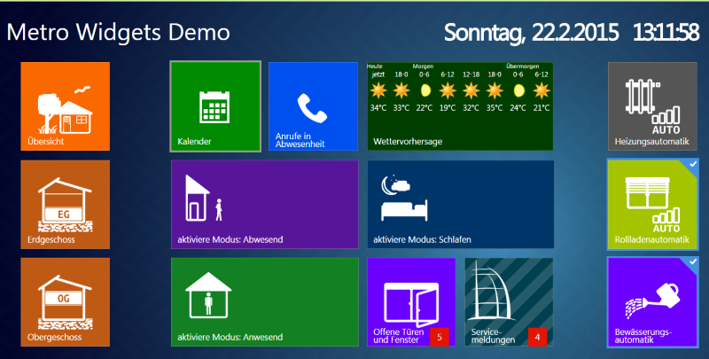

# ioBroker.vis-metro

Metro-Widget-Sets für [ioBroker.vis](https://github.com/ioBroker/ioBroker.vis) und [ioBroker.vis-2](https://github.com/ioBroker/ioBroker.vis-2) . Die Widgets sind im Stil der Windows Metro-Oberfläche gestaltet.

Erstellt mit <http://metroui.org.ua/> .

## vis und vis-2

Der Adapter liefert jedes Widget zweimal aus:

- **vis (vis-1)** verwendet das EJS/jQuery-Widget-Set in `widgets/metro.html` Die
- **vis-2** verwendet das React-Widget-Set in `widgets/vis-2-widgets-metro/`, gebaut aus `src-widgets/` Die

Beide deklarieren die gleichen Widget-IDs (`tplMetroTileBool`, `tplMetroTileDimmer`, …) und dieselben Attributnamen, und vis-2 bevorzugt ein React-Widget gegenüber einem EJS-Widget. Daher funktioniert ein mit vis erstelltes Projekt auch nach dem Wechsel zu vis-2 weiterhin – die Widgets werden einfach mit der React-Implementierung gerendert, die wie die von vis-1 aussieht und sich auch so verhält, ohne jQuery, jQuery UI oder CanJS.

Die React-Widgets benötigen vis-2 Version 2.12.8 oder neuer. Bei älteren vis-2-Versionen werden die EJS-Widgets verwendet.

## Dokumentation

Alle Widgets mit ihren Einstellungen und Bildern: [Englisch](/#/docs/adapterref/iobroker.vis-metro/docs/en/README.md) | [Deutsch](https://github.com/ioBroker/ioBroker.vis-metro/blob/master/docs/de/README.md)

## Entwicklung

- `npm run build` erstellt das Vis-2-Widget-Set in `widgets/vis-2-widgets-metro/` Die
- `npm run check-widgets` Prüft die React-Widgets anhand der vis-1-Vorlagen: IDs, Attribute, Größen, Bilder und Übersetzungen.
- `npm run preview` öffnet eine Seite, auf der jede vis-1-Vorlage neben ihrem React-Widget angezeigt wird; `npm run preview:diff` vergleicht die beiden Pixel für Pixel und Klick für Klick (benötigt einen lokalen Chrome- oder Edge-Browser), und `npm run preview:images` rendert die Bilder der Farbpalette und der Dokumentation.

<!--
    Placeholder for the next version (at the beginning of the line):
    ### __WORK IN PROGRESS__
-->

## Changelog
### __WORK IN PROGRESS__
* (bluefox) All widgets were ported to vis-2 as React widgets; vis-2 uses them instead of the vis-1 widgets, and
  projects keep working unchanged
* (bluefox) The vis-2 palette shows a picture and a short description for every widget
* (bluefox) Added documentation for every widget with pictures (English and German)
* (bluefox) Choosing the set temperature of a heating tile fills the other states of the thermostat in vis-2 as well
* (bluefox) Corrected the German labels of the widget settings and translated the missing ones
* (bluefox) The adapter no longer requires vis; it shows a message if neither vis nor vis-2 is installed
* (bluefox) The fonts Open Sans and PT Serif Caption are shipped with the adapter and no longer loaded from Google
* (bluefox) The adapter icon is an SVG now
* (bluefox) Updated the GitHub Actions to Node.js 24 and npm trusted publishing

### 1.2.0 (2022-02-12)
* (bluefox) Updated build process

### 1.1.2 (2017-12-17)
* (bluefox) Fixed metro-string widget

### 1.1.1 (2017-05-27)
* (mctom) 2 Widgets added
* (buanet) fix tplMetroTileStateNumber

### 1.1.0 (2016-11-12)
* (bluefox) Support of new concept by vis

### 1.0.4 (2016-10-11)
* (bluefox) fix Metro Widget Heating

### 1.0.3 (2016-09-21)
* (bluefox) fix Metro Widget Tile State / val Badge Number

### 1.0.1 (2016-09-13)
* (bluefox) fix Metro Widget "Tile Dialog"

### 1.0.0 (2016-03-15)
* (bluefox) remove configuration dialog

### 0.2.1 (2016-01-31)
* (vore) add tplMetroTileBoolDialog

### 0.2.0 (2015-12-14)
* (bluefox) add custom icon for badges

### 0.1.11 (2015-12-03)
* (bluefox) fix Tile ValueList 8: badge icon.

### 0.1.10 (2015-12-01)
* (bluefox) fix bool/number widget: badge icon.

### 0.1.9 (2015-09-19)
* (bluefox) fix Navigation widget: Brand Background wird nicht angezeigt, sobald Brand Background inactive und Brand Background active den selben Wert haben.
* (instalator) support of old browsers

### 0.1.8 (2015-09-06)
* (bluefox) remove prepublish script because installation is not possible

### 0.1.6 (2015-08-14)
* (bluefox) prepublish script
* (bluefox) update toggle widget

### 0.1.5 (2015-08-12)
* (bluefox) protect against double event: click and touchstart

### 0.1.3 (2015-08-05)
* (bluefox) fix metro-tile-heating window icon

### 0.1.2 (2015-07-25)
* (bluefox) add mfd icons
* (bluefox) fix widgets with sliders if "min" != 0

### 0.1.1 (2015-07-10)
* (bluefox) make content_oid of "Tile Dialog / Badge Number" as object ID

### 0.1.0 (2015-06-29)
* (siedi) Add: Service status and humidity to heating tile

### 0.0.1 (2015-06-28)
* (bluefox) initial checkin

## License
 Copyright (c) 2013-2026 hobbyquaker https://github.com/hobbyquaker, bluefox https://github.com/GermanBluefox
 MIT

### Third-party fonts
Both widget sets ship these fonts unmodified, so that nothing is loaded from Google. They are used on devices
without Segoe UI and Cambria; the license texts ship next to them in `widgets/metro/fonts/` and
`widgets/vis-2-widgets-metro/fonts/`.

- Open Sans 1.10 - Regular, Light and Bold. Digitized data copyright (c) 2010-2011 Google
  Corporation, licensed under the [Apache License, Version 2.0](http://www.apache.org/licenses/LICENSE-2.0).
- PT Serif Caption 1.000W - Copyright (c) 2010 ParaType Ltd., with Reserved Font Names "PT Sans", "PT Serif" and
  "ParaType", licensed under the [SIL Open Font License, Version 1.1](https://openfontlicense.org).