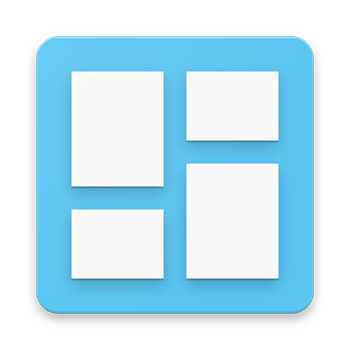
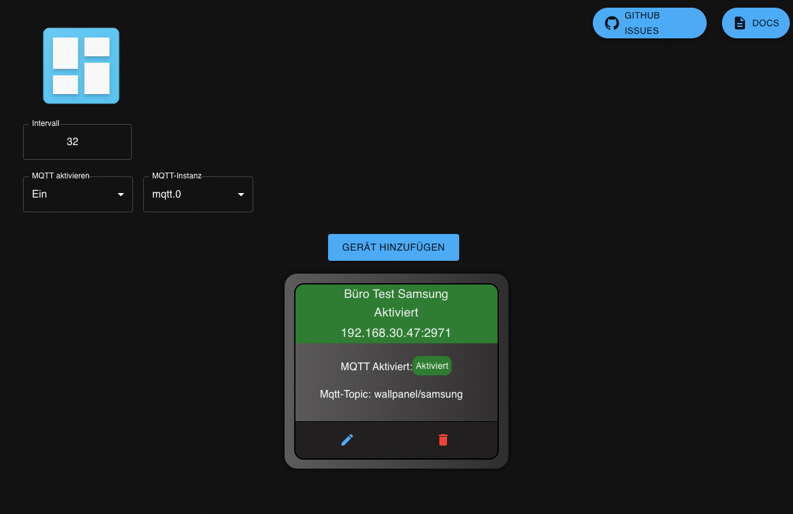

# ioBroker.wallpanel

### HAFTUNGSAUSSCHLUSS

Alle Produkt- und Firmennamen sowie Logos sind Warenzeichen™ oder eingetragene Warenzeichen® ihrer jeweiligen Inhaber. Ihre Verwendung impliziert keine Zugehörigkeit oder Unterstützung durch diese oder verbundene Unternehmen! Dieses private Projekt wird aus reinem Hobby betrieben und verfolgt keine geschäftlichen Ziele. **[WallPanel](https://github.com/TheTimeWalker/wallpanel-android)** .

### Posten

**Dieser Adapter verwendet Sentry-Bibliotheken, um Ausnahmen und Codefehler automatisch an die Entwickler zu melden.**\
&#x20;Weitere Details und Informationen zur Deaktivierung der Fehlerberichterstattung finden Sie in [der Sentry-Plugin-Dokumentation](https://github.com/ioBroker/plugin-sentry#plugin-sentry) ! Sentry-Berichte werden ab js-controller 3.0 verwendet.

## Der Adapter benötigt Node.js Version >= 16.x

## **Eine detaillierte Beschreibung finden Sie [in der Adapterdokumentation.](https://xxbjxx.github.io/wallpanel/)**

# Adapterbeschreibung

Mit dem Adapter können Sie verschiedene Werte abfragen, wie zum Beispiel Helligkeit und MQTT-Informationen, sowie zusätzlich den Akkustand und einige weitere Dinge.  Diese Werte können in Form von Zuständen abgefragt werden und sind verfügbar.  Man kann auch einige Steuerbefehle an das Tablet senden, z. B. die Helligkeit oder die aktuelle URL ändern.

Mehrere Tablets können gleichzeitig in den Adapter eingesetzt werden, die dann nacheinander abgefragt und selbstverständlich auch gesteuert werden können.

### **Achtung: Wenn Sie eine App von GitHub installieren, installieren Sie sie „aus einer unbekannten Quelle“. Dies kann unter bestimmten Umständen gefährlich sein, da die App von keiner offiziellen Stelle auf Schadsoftware überprüft wurde.**

## Changelog
 <!--
 Placeholder for the next version (at the beginning of the line):
 ### __WORK IN PROGRESS__ (- falls nicht benötigt löschen sonst klammern entfernen und nach dem - dein text schreiben)
 -->
### 0.3.11 (2023-02-06)
* (xXBJXx) Dependencies updated

### 0.3.10 (2022-12-23)
* (xXBJXx) update dependencies
* (xXBJXx) update to new React library for UI

### 0.3.9 (2022-10-02)
* (xXBJXx) dependencies updated 
* (xXBJXx) Moved global variable to constructor

### 0.3.8 (2022-07-02)
* (xXBJXx) removed the play Store Link and added the GitHub Link to the new version and add a Warning for the Installer from GitHub.
* (xXBJXx) optimized the code
* (xXBJXx) dependencies updated
* (xXBJXx) Leave the device switched off when creating Problem solved

### 0.3.7 (2022-06-06)
* (xXBJXx) Node version support set to >= v16.x because of new features of Node.js that are needed.
* (xXBJXx) fixed mqtt topic Display Direction

## License
MIT License

Copyright (c) 2020-2023 xXBJXx <issi.dev.iobroker@gmail.com>

Permission is hereby granted, free of charge, to any person obtaining a copy
of this software and associated documentation files (the "Software"), to deal
in the Software without restriction, including without limitation the rights
to use, copy, modify, merge, publish, distribute, sublicense, and/or sell
copies of the Software, and to permit persons to whom the Software is
furnished to do so, subject to the following conditions:

The above copyright notice and this permission notice shall be included in all
copies or substantial portions of the Software.

THE SOFTWARE IS PROVIDED "AS IS", WITHOUT WARRANTY OF ANY KIND, EXPRESS OR
IMPLIED, INCLUDING BUT NOT LIMITED TO THE WARRANTIES OF MERCHANTABILITY,
FITNESS FOR A PARTICULAR PURPOSE AND NONINFRINGEMENT. IN NO EVENT SHALL THE
AUTHORS OR COPYRIGHT HOLDERS BE LIABLE FOR ANY CLAIM, DAMAGES OR OTHER
LIABILITY, WHETHER IN AN ACTION OF CONTRACT, TORT OR OTHERWISE, ARISING FROM,
OUT OF OR IN CONNECTION WITH THE SOFTWARE OR THE USE OR OTHER DEALINGS IN THE
SOFTWARE.