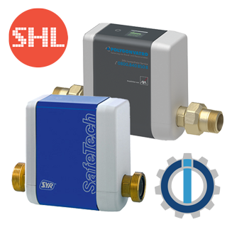

# IoBroker.wamo
**Tests:** 

# WAMO-Adapter für ioBroker
Dieser Adapter fügt Ihrer ioBroker-Installation eine „wamo“-Auslaufschutzüberwachung hinzu.

Der Adapter verbindet sich mit Ihrem Auslaufschutzgerät **SYR SafeTech Connect 2422** oder **POLYGONVATRO**, um Daten vom Gerät auszulesen und einige statistische Daten wie den Verlauf des Wasserverbrauchs zu erstellen.

Details zum SYR SaveTech Connect 2422 finden Sie [Hier.](https://www.syr.de/de/Produkte/CB9D9A72-BC51-40CE-840E-73401981A519/SafeTech-Connect)

Die POLYGONVATRO-Einheit ist unter der Haube eine SYR SaveTech Connect 2422-Einheit, jedoch ohne Druck-, Temperatur- und Leitfähigkeitssensor. Die POLYGONVATRO-Einheit ist derzeit nicht verfügbar.

## WICHTIG
Seit der **_Stauschutz-Freigabe_** wurde eine geplante Bewegung des Hauptventils hinzugefügt und kann im Bereich der Adaptereinstellungen (Registerkarte: Aufgaben) aktiviert und geplant werden.

Seien Sie mit dieser Funktion sehr vorsichtig, da sie das Hauptventil **_schließt_** und **_öffnet_**, um zu verhindern, dass es in der offenen Position stecken bleibt und daher im Falle einer Leckage nicht schließt.

Der **_Jam Protection_** kann mit einem CRON-Zeitplan geplant werden, der auch auf der Registerkarte **_Tasks_** der Adaptereinstellungen konfiguriert wird.
Seien Sie auch dort sehr vorsichtig, denn wenn Sie beispielsweise alle 1 Minute einen Stauschutz einplanen, haben Sie große Probleme, da Ihr Hauptventil jede Minute schließt und öffnet!

Während der Aktivität **_Stauschutz_** werden keine regulären Zustände (Ventil, Alarme usw.) aktualisiert, um ein falsches Auslösen zu verhindern, das Sie möglicherweise auf einen dieser Zustände eingestellt haben.

Wenn sich das Hauptventil bereits in der Position **_geschlossen_** befindet, wird die Aktivität **_Stauschutz_** nicht ausgeführt, um ein Öffnen des Hauptventils zu verhindern.
Wenn beim Start von **_Stauschutz_** Wasser verbraucht wird, wird die Aktion um 1 Minute verzögert. Nach 10 Fehlversuchen (Wasser fließt noch) wird **_Stauschutz_** abgebrochen.

### Haftungsausschluss / Warnung
Wenn während der Aktivität **_Jam Protection_** die Kommunikation zum Gerät verloren geht oder der WAMO-Adapter oder ioBroker selbst abstürzt oder gestoppt wird, bleibt das Hauptventil in der zuletzt befohlenen Position! Das bedeutet, wenn etwas schief geht, könnte das Ventil geschlossen sein und muss von Ihnen selbst mit der zugehörigen App oder dem Knopf am Gerät selbst geöffnet werden.

## Unterstütze dieses Projekt
Wenn Sie diesen Adapter nützlich finden und dieses Projekt unterstützen möchten, wird Ihre Freundlichkeit sehr geschätzt. Du kannst mich ganz einfach unterstützen [Hier.](https://www.paypal.com/paypalme/smarthausleben) Danke 😊

## Changelog
<!--
    Placeholder for the next version (at the beginning of the line):
    ### **WORK IN PROGRESS**
-->

### **WORK IN PROGRESS**
* (smarthausleben) ADD: [SafeFloor Device] New **SafeFloor Units** Tab in adapter settings to manage up to 4 **_SafeFloor Connect_** devices
* (smarthausleben) ADD: New option **_"Enable executing test loop"_** in Tab **_"Advanced Options"_** to enable/disable cron based executed [Test Loop]

### 0.3.0 (2023-04-04) - ***Jam Protection*** release
* (smarthausleben) ADD: [Main valve jam protection] New State JPR for Jam protection running 
* (smarthausleben) ADD: [Main valve jam protection] New State JPA for Jam protection aktivated
* (smarthausleben) ADD: [Main valve jam protection] New State JPT for Jam protection timing (CRON)
* (smarthausleben) ADD: [Main valve jam protection] New **Task Tab** in adapter settings to manage a scheduled regular movement of the main valve in order to prevent a stuck valve
* (smarthausleben) FIX: [interfaceBusy] flag was not reset after AXIOS interface handler error **_(Issue #21)_**
* (smarthausleben) ADD: [WatchDog] function for interfaceBusy flag. Flag will be reset after defined amount of requests **_(Issue #21)_**

### 0.2.13 (2022-10-12)
* (smarthausleben) add: new property "createOnStartup" in DeviceParameter
* (smarthausleben) add: new property "saveRawData" in DeviceParameter
* (smarthausleben) change: creating all state objects during startup to avoid calling "setObjectNotExistsAsync" later on
* (smarthausleben) add: Profile parameter raw states
* (smarthausleben) change: default value for "factor_german_water_hardnes" changed to 0.0296041666666667
* (smarthausleben) FIX update german water hardnes factor object (GHARDFACTOR) during startup 

### 0.2.12 (2022-09-20)
* (smarthausleben) Release 0.2.12

### 0.2.11 (2022-09-19)
* (smarthausleben) Release 0.2.11

### 0.2.10 (2022-09-19)
* (smarthausleben) state types changed UNI, PSD, CSD, TSD, T2
* (smarthausleben) states changable UNI, PSD, CSD, TSD, T2
* (smarthausleben) added DeviceControls RST (restart device)
* (smarthausleben) new channel DeviceControl
* (smarthausleben) added unit for GHARDNESS (°dH)
* (smarthausleben) new state GHARDFACTOR (calculation factor German water hardnes)

## License
The MIT License (MIT)

Copyright (c) 2022-2023 smarthausleben <info@smarthausleben.de>