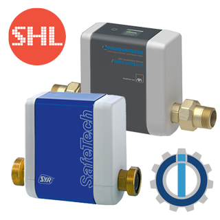

# ioBroker.wamo

# WAMO-Adapter für ioBroker

Dieser Adapter erweitert Ihre ioBroker-Installation um die Leckageüberwachung „wamo“.

Der Adapter verbindet sich mit Ihrem **SYR SafeTech Connect 2422** oder **POLYGONVATRO** Leckageschutzgerät, um Daten vom Gerät auszulesen, Statistiken wie den Wasserverbrauch zu erstellen und das Gerät zu steuern. Seit der \* _SafeFlor Connect-Version_ können Sie auch weitere Geräte an den Adapter anschließen und deren Daten auslesen.

Weitere Details zum **SYR SaveTech Connect 2422** finden Sie auf der [Detailseite des SYR SaveTech Connect 2422.](https://www.syr.de/de/Produkte/CB9D9A72-BC51-40CE-840E-73401981A519/SafeTech-Connect) Weitere Details zum **SafeFloor Connect** finden Sie auf der zugehörigen [Detailseite des SYR SafeFloor Connect](https://www.syr.de/de/Produkte/699373BB-C8BE-4992-9CFA-2CB15A5A6166/SafeFloor-Connect#FocusContent) .

Das POLYGONVATRO-Gerät ist im Grunde ein SYR SaveTech Connect 2422-Gerät, jedoch ohne Druck-, Temperatur- und Leitfähigkeitssensor. Das POLYGONVATRO-Gerät ist derzeit nicht erhältlich.

## WICHTIG

Innerhalb der`SafeFloor Connect release` Unter anderem wurde eine neue Funktion für SafeFlore Connect-Geräte implementiert. Aktuell können bis zu 4 Geräte hinzugefügt werden. Um diesen Sensor mit der aktuellen SafeFloor-Sensor-Firmware (Version 2.21) auszulesen, lesen Sie bitte den Abschnitt **„Haftungsausschluss/Warnung“** weiter unten sorgfältig durch.

Wichtige Informationen zu älteren Versionen finden Sie im zugehörigen Kapitel in`Importent release related information` im [Wiki](https://github.com/smarthausleben/ioBroker.wamo/wiki/Importent-release-related-information) .

### Haftungsausschluss / Warnung

Die Datenauslesefunktion **von SafeFloor Connect** ist in der Geräte-Firmware noch nicht optimal implementiert. Aktuell wechseln die Bodensensoren nach dem Aufwachen sofort in den Schlafmodus und senden ihre Daten an die SYR-Cloud. Daher ist es derzeit nicht möglich, das Gerät während dieser Zeit zu erfassen. Um die Sensoren mit diesem ioBroker-Adapter auszulesen, müssen Sie die Option „Online halten“ im Einstellungsmenü des Adapters unter „SAFEFLOOR UNITS“ aktivieren und das Gerät durch einmaliges Drücken des Knopfes im Gerät aufwecken. Dadurch wechselt das Gerät jedoch nicht mehr in den Schlafmodus, wodurch sich der Akku sehr schnell entlädt. Derzeit ist die Verwendung eines Akkuadapters die einzige praktikable Lösung. Diese Adapter sind problemlos bei Amazon erhältlich. Den Link zu dem von mir verwendeten Adapter finden Sie im Hardware-Bereich dieses [Projekts](https://smarthausleben.de/wasserwaechter/) auf meiner Website.

## Unterstützen Sie dieses Projekt

Wenn Ihnen dieser Adapter gefällt und Sie dieses Projekt unterstützen möchten, würde ich mich sehr darüber freuen. Sie können mich [hier ganz einfach unterstützen.](https://www.paypal.com/paypalme/smarthausleben) Danke 😊

## Changelog
<!--
    Placeholder for the next version (at the beginning of the line):
    ### **WORK IN PROGRESS**

* ======================================================================== (max broad of READMR.md page )
-->
### **WORK IN PROGRESS**
* (smarthausleben) UPDATE: dependencies (Node 18)

### 0.4.1 (2023-08-08)
* (smarthausleben) FIX: Statusupdate `ALA` and `VLV` after alarm clearing (`CLRALA` command)

### 0.4.0 (2023-07-26)
* (smarthausleben) ADD: Since there are important things to consider before you update, which can be squeezed into this section here, `please read the release related information section "0.4.0 (SafeFloor Connect pre release)"` in the [Wiki](https://github.com/smarthausleben/ioBroker.wamo/wiki/Importent-release-related-information) carefully.

### 0.3.0 (2023-04-04) - ***Jam Protection*** release
* (smarthausleben) ADD: [Main valve jam protection] New State JPR for Jam protection running 
* (smarthausleben) ADD: [Main valve jam protection] New State JPA for Jam protection aktivated
* (smarthausleben) ADD: [Main valve jam protection] New State JPT for Jam protection timing (CRON)
* (smarthausleben) ADD: [Main valve jam protection] New **Task Tab** in adapter settings to manage a scheduled regular movement of the main valve in order to prevent a stuck valve
* (smarthausleben) FIX: [interfaceBusy] flag was not reset after AXIOS interface handler error **_(Issue #21)_**
* (smarthausleben) ADD: [WatchDog] function for interfaceBusy flag. Flag will be reset after defined amount of requests **_(Issue #21)_**

### 0.2.13 (2022-10-12)
* (smarthausleben) add: new property "createOnStartup" in DeviceParameter
* (smarthausleben) add: new property "saveRawData" in DeviceParameter
* (smarthausleben) change: creating all state objects during startup to avoid calling "setObjectNotExistsAsync" later on
* (smarthausleben) add: Profile parameter raw states
* (smarthausleben) change: default value for "factor_german_water_hardnes" changed to 0.0296041666666667
* (smarthausleben) FIX update german water hardnes factor object (GHARDFACTOR) during startup 

### 0.2.12 (2022-09-20)
* (smarthausleben) Release 0.2.12

## License
The MIT License (MIT)

Copyright (c) 2024 smarthausleben <info@smarthausleben.de>