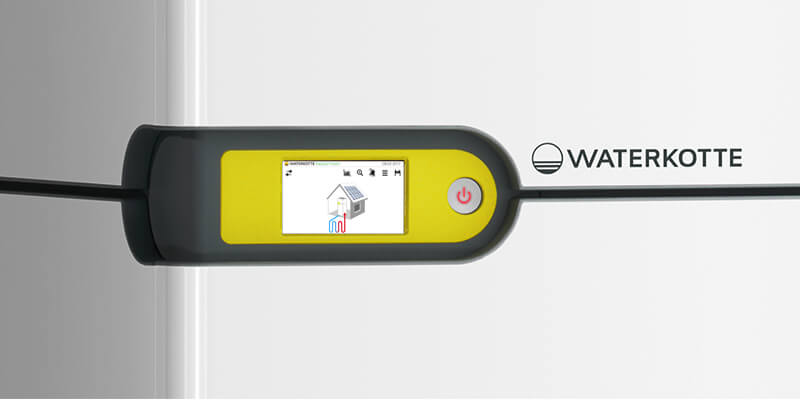

# IoBroker.waterkotte-easycon

## Waterkotte-easycon-Adapter für ioBroker
Lesen und Schreiben von Parametern von Waterkotte EasyCon Wärmepumpen über CGI-Anfragen. Getestet mit [Waterkotte EcoTouch Ai1 Geo](https://www.waterkotte.de/waermepumpen/ecotouch-ai1-geo-erdwaermepumpe-6-18kw) (Modell 2017).

## Merkmale
### Implementiert
- automatisches Auslesen der Werte der Wärmepumpe in Abhängigkeit der genutzten Funktionen (Wasser, Heizung, Kühlung, Photovoltaik, Solar, ...)

### Geplant
- Benachrichtigung bei Wärmepumpenalarmen
- Werte schreiben
- Zeitpläne lesen und verwalten
- SG-ready wie Zielwertkontrolle

## Verwendung
### Installation
Installieren Sie den Adapter `waterkotte-easycon` aus dem ioBroker-Repository.

### Anschluss an Wärmepumpe
Auf der Unterseite des Touchpanels befinden sich zwei RJ45-Anschlüsse. Diese sind zugänglich, wenn man die Frontabdeckung der Wärmepumpe mit dem mitgelieferten Werkzeug abnimmt. Von unten nach oben betrachtet, schließt man das Ethernet-Kabel an den rechten Anschluss an.

Überprüfen Sie Ihren Router, um die IP-Adresse der Wärmepumpe herauszufinden, und aktivieren Sie die statische IP-Adresse, damit sich die Adresse der Wärmepumpe nicht ändert.

### Aufbau
| Parameter | Beschreibung |
| ------------------------------- | ------------------------------------------------------------------------------------- |
| IP-Adresse | IP-Adresse der Wärmepumpe (siehe [Anschluss an Wärmepumpe](#Connection-to-heat-pump)) |
| Passwort | Standard `waterkotte` |
| Passwort | Standard „Waterkotte“ |
| Leerzeichen aus der Status-ID entfernen | Wenn `State format` `Path + Description` ist, werden alle Leerzeichen durch `_` ersetzt |
| Leerzeichen aus der Status-ID entfernen | Wenn das „Statusformat“ „Pfad + Beschreibung“ ist, werden alle Leerzeichen durch „_“ ersetzt |

#### Statusformat
| Wert | Beschreibung |
| ------------- | ----------------------------------------------------------------------------------------------------------------------------------------------------------------------------------- |
| `Path + ID` | Alle Statusnamen verwenden die Tag-ID, z. B. `Heating.A32`, wobei `A32` die interne ID des Tags `Target temperatur` der Fußbodenheizung ist |
| `Pfad + Name` | Alle Statusnamen verwenden den Namen des Tags, z. B. `Heating.Zielwert`. Aktivieren Sie `Leerzeichen aus Status-ID entfernen`, um Leerzeichen in Status-IDs zu vermeiden (z. B. `Heating.Zielwert`) |

> Durch Ändern von `State format` oder `Remove whitespace from state ID` werden alle Zustände der Instanz gelöscht und die neue Struktur erstellt.

## Changelog

<!--
    Placeholder for the next version (at the beginning of the line):
    ### **WORK IN PROGRESS**
-->
### 0.0.3 (2024-04-12)

-   (theknut) change update interval from milliseconds to seconds
-   (theknut) add axios timeout
-   (theknut) remove unused onStateChange handler
-   (theknut) logoff when adapter is unloaded

### 0.0.2 (2024-03-11)

-   (theknut) prepare for release

### 0.0.1 (2024-03-01)

-   (theknut) initial release

## License

MIT License

Copyright (c) 2024 theknut <theknutcoding@gmail.com>

Permission is hereby granted, free of charge, to any person obtaining a copy
of this software and associated documentation files (the "Software"), to deal
in the Software without restriction, including without limitation the rights
to use, copy, modify, merge, publish, distribute, sublicense, and/or sell
copies of the Software, and to permit persons to whom the Software is
furnished to do so, subject to the following conditions:

The above copyright notice and this permission notice shall be included in all
copies or substantial portions of the Software.

THE SOFTWARE IS PROVIDED "AS IS", WITHOUT WARRANTY OF ANY KIND, EXPRESS OR
IMPLIED, INCLUDING BUT NOT LIMITED TO THE WARRANTIES OF MERCHANTABILITY,
FITNESS FOR A PARTICULAR PURPOSE AND NONINFRINGEMENT. IN NO EVENT SHALL THE
AUTHORS OR COPYRIGHT HOLDERS BE LIABLE FOR ANY CLAIM, DAMAGES OR OTHER
LIABILITY, WHETHER IN AN ACTION OF CONTRACT, TORT OR OTHERWISE, ARISING FROM,
OUT OF OR IN CONNECTION WITH THE SOFTWARE OR THE USE OR OTHER DEALINGS IN THE
SOFTWARE.