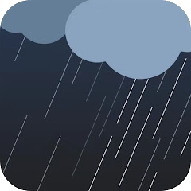

# ioBroker.weathersense

## WeatherSense-Adapter für ioBroker

WeatherSense ist eine Cloud-Plattform für Wetterstationen. Dieser Adapter liest Daten vom WeatherSense-Server.

Siehe: <https://play.google.com/store/apps/details?id=com.emax.weahter&hl=de_CH>

Einige WLAN-Wetterstationen nutzen die WeatherSense Cloud.

Zum Beispiel diese WLAN-Wetterstationen von Ideoon (Pearl):

ioBroker-Datenpunkte:

## Verwenden:

Geben Sie einfach Ihre WeatherSense-Zugangsdaten (E-Mail-Adresse und Passwort) ein. Die Wetterstationsdaten werden im WeatherSense-Datenpunkt gespeichert. Die Daten können auch per MQTT übertragen werden.

## Verwaltung mehrerer Wetterstationen (Unterstützung mehrerer Instanzen)

Der ursprüngliche WeatherSense-Cloud-Server hat eine Software-Beschränkung/einen Software-Fehler: Wenn Sie zwei oder mehr identische Wetterstationen im selben Smartphone-Konto registrieren, werden diese überschrieben und verschwinden aus Ihrer Geräteliste.

Um Daten von mehreren Stationen gleichzeitig und konfliktfrei zu lesen, können Sie die native Multi-Instanz-Architektur von ioBroker nutzen.

### Schritt-für-Schritt-Einrichtung:

1. **Erstellen Sie separate Cloud-Konten:** Registrieren Sie für **jede** Ihrer Wetterstationen ein eigenes, kostenloses Konto in der WeatherSense-Mobil-App (z. B. _E-Mail A_ für Station 1 und _E-Mail B_ für Station 2).
2. **Eine Station pro Konto verknüpfen:** Verknüpfen Sie Ihre erste Station ausschließlich mit Konto A und Ihre zweite Station ausschließlich mit Konto B.
3. **Mehrere Instanzen in ioBroker hinzufügen:**
   - Gehe zu`Instances` Öffnen Sie den Tab in ioBroker und fügen Sie eine zweite Instanz des WeatherSense-Adapters hinzu (dadurch wird erstellt`weathersense.0` Und`weathersense.1` ).
4. **Konfigurieren Sie die Instanzen:**
   - Öffnen Sie die Konfiguration fü&#x72;**`weathersense.0`** und geben Sie die Anmeldeinformationen für **Konto A** ein. Legen Sie fest, dass`Sensor ID` Zu`1` Die
   - Öffnen Sie die Konfiguration fü&#x72;**`weathersense.1`** und geben Sie die Anmeldeinformationen für **Konto B** ein. Legen Sie fest, dass`Sensor ID` Zu`2` Die

### Vorteile dieser Konfiguration:

- **Keine Datenkonflikte:** ioBroker startet zwei völlig getrennte Prozesse.
- **Getrennte Objekte:** Ihre Datenpunkte sind übersichtlich getrennt in`weathersense.0.*` Und`weathersense.1.*` Die
- **Sauberes MQTT-Routing:** Wenn Sie die integrierte MQTT-Funktion verwenden, werden Ihre Themen anhand der Sensor-ID (z. B. Sensor-ID) sauber getrennt.`weathersense/1/...` Und`weathersense/2/...` ), um zu verhindern, dass Daten auf Ihrem Broker überschrieben werden.

## Changelog
### 5.2.3 (2026-07-26)

- Div error messages moved to warn messages

### 5.2.2 (2026-07-09)

- Typo corrected

### 5.2.1 (2026-07-09)

- Typo corrected

### 5.2.0 (2026-07-09)

- Invert PowerStatus flag added

### 5.1.1 (2026-07-05)

- Bugfix: Unit windDirection km/h → °

[Older changelogs can be found there](https://github.com/ltspicer/ioBroker.weathersense/blob/main/CHANGELOG_OLD.md)

## License

MIT License

Copyright (c) 2025-2026 Daniel Luginbühl <webmaster@ltspiceusers.ch>

Permission is hereby granted, free of charge, to any person obtaining a copy
of this software and associated documentation files (the "Software"), to deal
in the Software without restriction, including without limitation the rights
to use, copy, modify, merge, publish, distribute, sublicense, and/or sell
copies of the Software, and to permit persons to whom the Software is
furnished to do so, subject to the following conditions:

The above copyright notice and this permission notice shall be included in all
copies or substantial portions of the Software.

THE SOFTWARE IS PROVIDED "AS IS", WITHOUT WARRANTY OF ANY KIND, EXPRESS OR
IMPLIED, INCLUDING BUT NOT LIMITED TO THE WARRANTIES OF MERCHANTABILITY,
FITNESS FOR A PARTICULAR PURPOSE AND NONINFRINGEMENT. IN NO EVENT SHALL THE
AUTHORS OR COPYRIGHT HOLDERS BE LIABLE FOR ANY CLAIM, DAMAGES OR OTHER
LIABILITY, WHETHER IN AN ACTION OF CONTRACT, TORT OR OTHERWISE, ARISING FROM,
OUT OF OR IN CONNECTION WITH THE SOFTWARE OR THE USE OR OTHER DEALINGS IN THE
SOFTWARE.