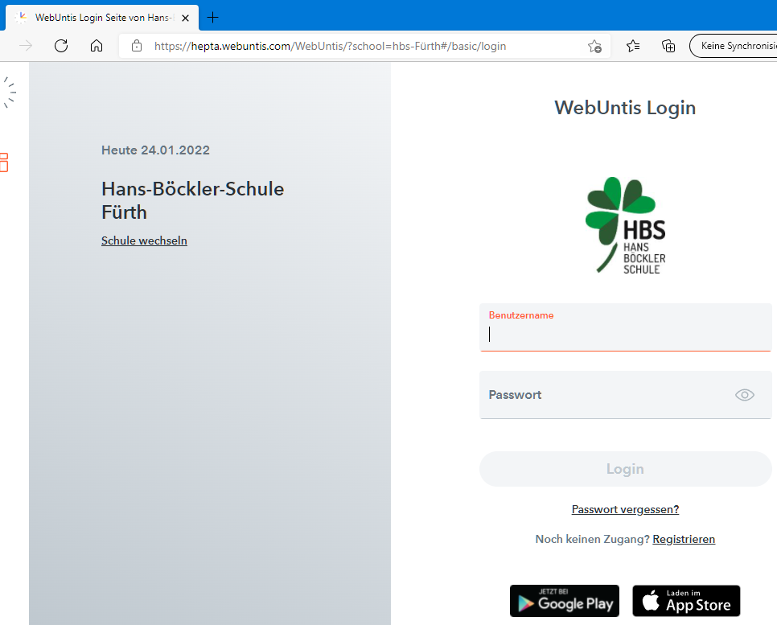
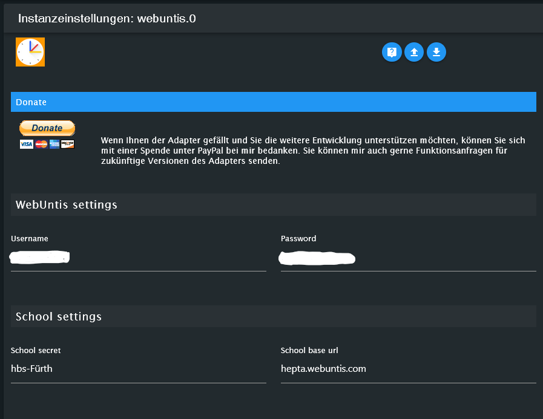

# ioBroker.webuntis

## Webuntis-Adapter für ioBroker

Adapter zum Abrufen von Daten von WebUnits

Dieser Adapter bezieht Daten von Webuntis. Für eine deutsche Anleitung [klicken Sie hier](/#/docs/adapterref/iobroker.webuntis/readme/readme.de.md)

## Spende

## Erste Schritte

Nach der Installation des Adapters in iobroker öffnet sich automatisch das Konfigurationsfenster.

Gehen Sie nun zu <https://webuntis.com> und geben Sie den Schulnamen in das Suchfeld ein.

Nun benötigen Sie zwei Zeichenketten aus der Internetadresse der Schulwebsite von Webuntis:

- die Basis-URL
- das Schulgeheimnis

Siehe das Beispiel unterhalb des vorherigen Screenshots: [hier](https://hepta.webuntis.com/WebUntis/?school=hbs-F%C3%BCrth#/basic/login)

- hepta.webuntis.com => die Schulbasis-URL
- hbs-F%C3%BCrth => das Schulgeheimnis

**Wenn in school-secret ein **+** steht, müssen Sie dieses Zeichen durch ein Leerzeichen ersetzen.**

Wechseln Sie nun zum Konfigurationsfenster in iobroker.

Nach Eingabe Ihres Benutzernamens (Kind oder Elternteil) und des Passworts für dieses Konto können Sie das Schulgeheimnis und die Schul-Basar-URL in die Konfiguration übernehmen.

Speichere und in diesem Moment wirst du selbst zu den Lektionen für den nächsten Tag.

Gerne können Sie Vorschläge für empfohlene Versionen einreichen.

## Changelog
<!--
    Placeholder for the next version (at the beginning of the line):
    ### **WORK IN PROGRESS**
-->
### 0.3.4 (2022-05-08)
* change log-level for error messages

### 0.3.3 (2022-04-03)
* Add errorhandling for timetable

### 0.3.2 (2022-03-02)
* Add errorhandling for inbox & mesage center

### 0.3.1 (2022-01-30)
* Bug fixes in timetable

### 0.3.0 (2022-01-29)
* Add Inbox peview data

### 0.2.0 (2022-01-27)
* Add anonymous login

### 0.1.0 (2022-01-25)
* Add nextDay
* Add code element

### 0.0.1 (2022-01-25)
* (Newan) initial release

## License
MIT License

Copyright (c) 2022 Newan <info@newan.de>

Permission is hereby granted, free of charge, to any person obtaining a copy
of this software and associated documentation files (the "Software"), to deal
in the Software without restriction, including without limitation the rights
to use, copy, modify, merge, publish, distribute, sublicense, and/or sell
copies of the Software, and to permit persons to whom the Software is
furnished to do so, subject to the following conditions:

The above copyright notice and this permission notice shall be included in all
copies or substantial portions of the Software.

THE SOFTWARE IS PROVIDED "AS IS", WITHOUT WARRANTY OF ANY KIND, EXPRESS OR
IMPLIED, INCLUDING BUT NOT LIMITED TO THE WARRANTIES OF MERCHANTABILITY,
FITNESS FOR A PARTICULAR PURPOSE AND NONINFRINGEMENT. IN NO EVENT SHALL THE
AUTHORS OR COPYRIGHT HOLDERS BE LIABLE FOR ANY CLAIM, DAMAGES OR OTHER
LIABILITY, WHETHER IN AN ACTION OF CONTRACT, TORT OR OTHERWISE, ARISING FROM,
OUT OF OR IN CONNECTION WITH THE SOFTWARE OR THE USE OR OTHER DEALINGS IN THE
SOFTWARE.