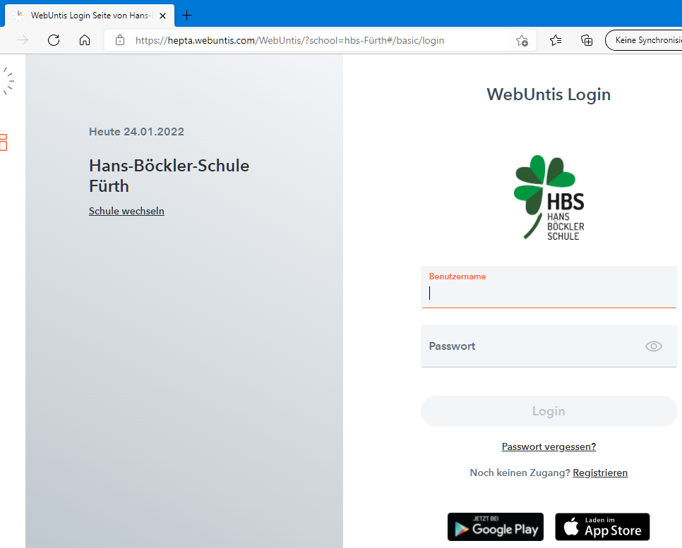

# IoBroker.webuntis
**Tests:** 

## Webuntis-Adapter für ioBroker
Adapter um Daten von WebUntis zu bekommen

Dieser Adapter bezieht sich auf Daten aus Webuntis.
Für eine deutsche Anleitung [hier klicken](readme/readme.de.md)

## Spende

## Einstieg
Nach der Installation des Adapters in iobroker öffnet sich automatisch das Konfigurations-Fenster.

Gehen Sie nun auf https://webuntis.com und geben Sie den Schulnamen in das Suchfeld ein.

Jetzt müssen Sie die Internetadresse der Schulwebsite von webuntis eingeben:

- die Basis-URL
- das Schulgeheimnis

siehe das Beispiel unter dem vorherigen Screenshot: [hier](https://hepta.webuntis.com/WebUntis/?school=hbs-F%C3%BCrth#/basic/login)

- hepta.webuntis.com => die Schoolbase-URL
- hbs-F%C3%BCrth => das Schulgeheimnis

**Wenn im Schulgeheimnis ein __+__ steht, müssen Sie dieses Zeichen durch ein Leerzeichen ersetzen**

Gehen Sie nun in das Konfigurationsfenster von iobroker

Nach der Eingabe Ihres Benutzernamens (Kind oder Elternteil) und des Passworts für dieses Konto können Sie das Schulgeheimnis und die Schulbasr-Url zur Konfiguration übernehmen.

Speichern Sie und in diesem Moment werden Sie zu den Lektionen für den nächsten Tag.

Bitte zögern Sie nicht, einen Vorschlag für empfohlene Versionen zu machen.

## Changelog
<!--
    Placeholder for the next version (at the beginning of the line):
    ### **WORK IN PROGRESS**
-->
### 0.3.4 (2022-05-08)
* change log-level for error messages

### 0.3.3 (2022-04-03)
* Add errorhandling for timetable

### 0.3.2 (2022-03-02)
* Add errorhandling for inbox & mesage center

### 0.3.1 (2022-01-30)
* Bug fixes in timetable

### 0.3.0 (2022-01-29)
* Add Inbox peview data

### 0.2.0 (2022-01-27)
* Add anonymous login

### 0.1.0 (2022-01-25)
* Add nextDay
* Add code element

### 0.0.1 (2022-01-25)
* (Newan) initial release

## License
MIT License

Copyright (c) 2022 Newan <info@newan.de>

Permission is hereby granted, free of charge, to any person obtaining a copy
of this software and associated documentation files (the "Software"), to deal
in the Software without restriction, including without limitation the rights
to use, copy, modify, merge, publish, distribute, sublicense, and/or sell
copies of the Software, and to permit persons to whom the Software is
furnished to do so, subject to the following conditions:

The above copyright notice and this permission notice shall be included in all
copies or substantial portions of the Software.

THE SOFTWARE IS PROVIDED "AS IS", WITHOUT WARRANTY OF ANY KIND, EXPRESS OR
IMPLIED, INCLUDING BUT NOT LIMITED TO THE WARRANTIES OF MERCHANTABILITY,
FITNESS FOR A PARTICULAR PURPOSE AND NONINFRINGEMENT. IN NO EVENT SHALL THE
AUTHORS OR COPYRIGHT HOLDERS BE LIABLE FOR ANY CLAIM, DAMAGES OR OTHER
LIABILITY, WHETHER IN AN ACTION OF CONTRACT, TORT OR OTHERWISE, ARISING FROM,
OUT OF OR IN CONNECTION WITH THE SOFTWARE OR THE USE OR OTHER DEALINGS IN THE
SOFTWARE.