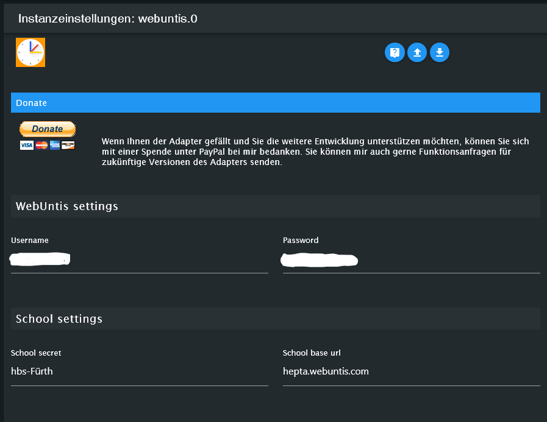

# IoBroker.webuntis
**Tests:** 

## Webuntis-Adapter für ioBroker
Dieser Adapter bezieht Daten von Webuntis. Für eine deutsche Anleitung

Dieser Adapter bezieht die Daten von WebUntis. Für das Englisch-Tutorial 

## Konfiguration
Nach der Installation des Adapters in Iobroker und dem Erstellen einer Instanz erscheint automatisch das Konfigurationsfenster.

Zur Vorbereitung geht man in einem Webbrowser auf die Seite  Im Suchfeld auf der Seite gibt man den gewünschten Schulnamen ein.
Daraufhin öffnet sich eine Webseite. In der Adresszeile des Browsers stehen nun die gewünschten Daten.

Wir benötigen folgende Strings aus der Adresszeile

- die Basis-URL
- das Schulgeheimnis

Im Beispiel-Screenshot sind dies folgende Daten als Beispiel: https://hepta.webuntis.com/WebUntis/?school=hbs-F%C3%BCrth#/basic/login

- hepta.webuntis.com => die Schoolbase-URL
- hbs-F%C3%BCrth => das Schulgeheimnis

**Sollte im Schul-Sercet ein __+__ vorhanden sein. Muss dieses im folgenden Schritt durch ein Leerzeichen ersetzt werden**

Nun wechselt man im Iobroker-Konfigurationsfenster des Adapters

- Unter Benutzername (Kind oder Elternteil) gibt man den Benutzernamen ein.
- Unter Passwort, das Passwort des Users
- Unter school-secret gibt man den Teil der Webadresse ein, der zwischen „/?school“ und „#/“ steht
- Unter schoolbase-URL gibt man den Teil der Webadresse ein, der zwischen „https://“ und „/webuntes/“ steht

Speichern und nun erhält man alle Daten, die der Adapter abrufen kann.

Wer Anregungen zur Verbesserung des Adapters hat, kann gerne einen hier oder im Iobroker-Forum an uns weiterleiten: https://forum.iobroker.net/topic/51690/tester-neuer-adapter-webuntis