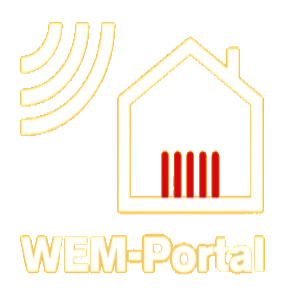

# IoBroker.weishaupt-wem
## Weishaupt-wem Adapter für ioBroker
Adapter für weishaupt WEM Portal

## Benutzerdefinierter Befehl
Für einen benutzerdefinierten Befehl benötigen Sie die URL und den gewünschten Wert. Für die URL einfach die Option im WEM Portal mit Chrome aufrufen und dann rechte Mausstate Untersuchen dann unter Elements/Elemente mit STRG+F nach iframe suchen mit dem name=&quot;RDWWriteParameter&quot; die URL nach src mit rechts Klick Link kopieren raus kopieren. Für den Wert nach <option suchen und den gewünschten Wert unter value kopieren und als state Wert eintragen.
z.B.: <https://www.wemportal.com/Web/UControls...,>208557

## App-Unterstützung
Der Adapter liest auch die Daten aus der App aus.

**weishaupt-wem.0.20999** "Name per App"

**weishaupt-wem.0.20999.1-3.parameters** Hier findest du den aktuellen Status und kann via **NumericValue** oder **StringValue** geändert werden. Du findest dort auch die Min Max Werte und unter **EnumValues** findet man die Beschreibung für NumericValue

## Changelog

### 0.0.15

* (ta2k) add app support

### 0.0.14

* (ta2k) fix command sends
### 0.0.13

* (ta2k) update dependencies

### 0.0.9

* (ta2k) fix for Status label

### 0.0.5

* (ta2k) fix remote for WWP

### 0.0.4

* (ta2k) remove spaces in ids

### 0.0.3

* (ta2k) Fix remote control

### 0.0.2

* (ta2k) Möglichkeit Parameter zu ändern
* Nummerische Werte als Zahlen in ioBroker geschrieben

### 0.0.1

* (ta2k) initial release

## License

MIT License

Copyright (c) 2019 ta2k <tombox2020@gmail.com>

Permission is hereby granted, free of charge, to any person obtaining a copy
of this software and associated documentation files (the "Software"), to deal
in the Software without restriction, including without limitation the rights
to use, copy, modify, merge, publish, distribute, sublicense, and/or sell
copies of the Software, and to permit persons to whom the Software is
furnished to do so, subject to the following conditions:

The above copyright notice and this permission notice shall be included in all
copies or substantial portions of the Software.

THE SOFTWARE IS PROVIDED "AS IS", WITHOUT WARRANTY OF ANY KIND, EXPRESS OR
IMPLIED, INCLUDING BUT NOT LIMITED TO THE WARRANTIES OF MERCHANTABILITY,
FITNESS FOR A PARTICULAR PURPOSE AND NONINFRINGEMENT. IN NO EVENT SHALL THE
AUTHORS OR COPYRIGHT HOLDERS BE LIABLE FOR ANY CLAIM, DAMAGES OR OTHER
LIABILITY, WHETHER IN AN ACTION OF CONTRACT, TORT OR OTHERWISE, ARISING FROM,
OUT OF OR IN CONNECTION WITH THE SOFTWARE OR THE USE OR OTHER DEALINGS IN THE
SOFTWARE.