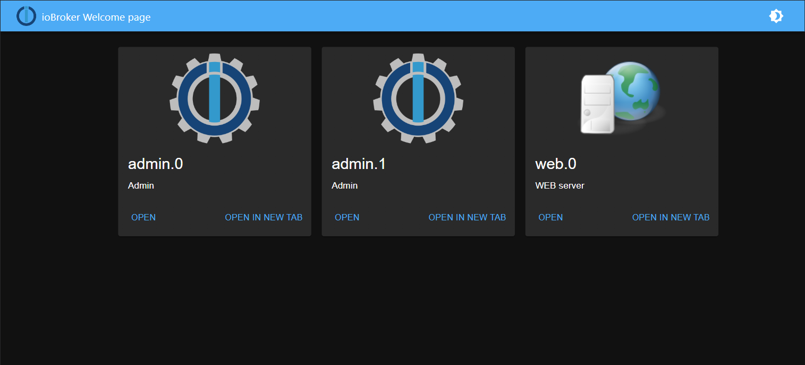

# ioBroker.welcome

Dieser Adapter zeigt alle Web- und Admin-Instanzen von ioBroker auf einer Seite auf Port 80 (konfigurierbar) an.

**Dieser Adapter nutzt die Sentry-Bibliotheken, um Ausnahmen und Codefehler automatisch an die Entwickler zu melden.** Weitere Details und Informationen zum Deaktivieren der Fehlerberichterstattung finden Sie in [der Sentry-Plugin-Dokumentation](https://github.com/ioBroker/plugin-sentry#plugin-sentry) ! Die Sentry-Berichterstattung wird ab js-controller 3.0 verwendet.

Normalerweise sollte dieser Adapter auf Port 80 oder 443 laufen und zeigt verfügbare Adapter mit Webservern an.

Optional können Sie die Instanz angeben, zu der beim Öffnen der Willkommensseite automatisch weitergeleitet wird. In diesem Fall erfolgt die Weiterleitung durch Öffnen von <http://IP> direkt zur angegebenen Webinstanz.

<!--
	Placeholder for the next version (at the beginning of the line):
	### **WORK IN PROGRESS**
-->

## Changelog
### 2.0.1 (2026-08-27)
-   (@GermanBluefox) Added the option to answer ACME HTTP-01 challenges of the acme adapter

### 2.0.0 (2026-08-04)
-   (@GermanBluefox) Migrated an admin component to React 19

### 1.1.1 (2025-11-15)
-   (@GermanBluefox) Migrated an admin component to TypeScript and vite

### 1.1.0 (2025-02-26)

-   (@GermanBluefox) Adapter was migrated to TypeScript and vite
-   (@GermanBluefox) Added support for websites with custom certificates

### 1.0.2 (2024-10-03)

-   (@GermanBluefox) Updated packages
-   (@GermanBluefox) Used new eslint-config
-   (@GermanBluefox) Added support for SVG files

### 0.3.0 (2023-11-30)

-   (@GermanBluefox) Allowed adding own logo to the welcome screen

### 0.2.0 (2023-11-28)

-   (@GermanBluefox) Added custom redirect URL

### 0.1.0 (2023-11-07)

-   (@GermanBluefox) Added custom links

### 0.0.5 (2023-10-16)

-   (@GermanBluefox) Corrected the adapter list

### 0.0.4 (2023-10-16)

-   (@GermanBluefox) First release

### 0.0.1 (2023-10-16)

-   (@GermanBluefox) Initial commit

## License

The MIT License (MIT)

Copyright (c) 2023-2026 Denis Haev <dogafox@gmail.com>

Permission is hereby granted, free of charge, to any person obtaining a copy
of this software and associated documentation files (the "Software"), to deal
in the Software without restriction, including without limitation the rights
to use, copy, modify, merge, publish, distribute, sublicense, and/or sell
copies of the Software, and to permit persons to whom the Software is
furnished to do so, subject to the following conditions:

The above copyright notice and this permission notice shall be included in
all copies or substantial portions of the Software.

THE SOFTWARE IS PROVIDED "AS IS", WITHOUT WARRANTY OF ANY KIND, EXPRESS OR
IMPLIED, INCLUDING BUT NOT LIMITED TO THE WARRANTIES OF MERCHANTABILITY,
FITNESS FOR A PARTICULAR PURPOSE AND NONINFRINGEMENT. IN NO EVENT SHALL THE
AUTHORS OR COPYRIGHT HOLDERS BE LIABLE FOR ANY CLAIM, DAMAGES OR OTHER
LIABILITY, WHETHER IN AN ACTION OF CONTRACT, TORT OR OTHERWISE, ARISING FROM,
OUT OF OR IN CONNECTION WITH THE SOFTWARE OR THE USE OR OTHER DEALINGS IN
THE SOFTWARE.