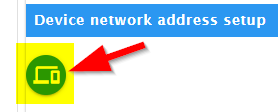
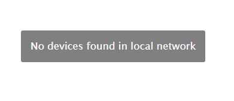
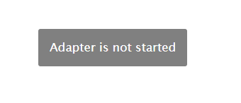
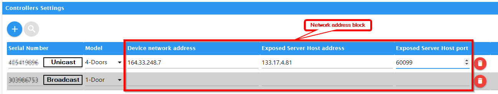

# **Aufstellen**
- [Ersteinrichtung](#initial-start-up) Erster Zugriff auf das Gerät
- [Adapter einrichten](#door-access-controllers-settings) ioBroker-Adapter einrichten
- [TCP/IP-Netzwerkeinstellungen](#tcpip-network-settings) Adapternetzwerk einrichten
- [Controller-Einstellungen](#controllers-settings) Geräteeinrichtung
- [Broadcast](#broadcast)
- [Seriennummer](#Seriennummer)
- [Einrichtung eines dedizierten Netzwerks](#dedicated-network-setup)
- [Seriennummer](#Seriennummer)
- [Gerätenetzwerkadresse](#Gerätenetzwerkadresse)
- [Offengelegte Server-Hostadresse](#exposed-server-host-address)
- [Offengelegter Server-Host-Port](#exposed-server-host-port)

## **Erstmalige Inbetriebnahme**
Bei der erstmaligen Verbindung des Geräts kann es hilfreich sein, die Netzwerkdaten einzugeben.

Diese Schritte sind optional und nur erforderlich, um das Gerät in einem anderen, entfernten Netzwerk außerhalb des lokalen Netzwerks der ioBroker-Instanz zu verwenden.

Um dies zu tun...
- Verbinden Sie das Gerät mit demselben Netzwerk, in dem sich auch ioBroker befindet. Kein Docker, VPN oder anderes Subnetz. [^1]
- Installieren und starten Sie den Adapter mit den Standardeinstellungen.
- Gehen Sie zur Konfiguration und wechseln Sie zum Tab „Gerätefernkonfiguration“.
- Führen Sie den Gerätescan durch.

 Es gibt zwei mögliche Fehlermeldungen, die dazu führen, dass keine Geräte gefunden werden[^3], [^4]

- Falls Sie mehr als ein Gerät aktiv haben, wählen Sie das gewünschte Gerät im Dropdown-Menü „Geräte-ID“ aus.
- Geben Sie die gewünschten Adressdaten in die entsprechenden Eingabefelder ein[^2]
Installieren Sie nun das Gerät im Zielnetzwerk.

## **Einstellungen für Türzugangskontrollsysteme**
### **TCP/IP-Netzwerkeinstellungen**
#### **Netzwerkschnittstelle**
Wählen Sie in der Liste den Netzwerk-Hostadapter aus, an den Ihr Gerät angeschlossen ist. [^2]

- Besondere Adressen
- `0.0.0.0` Alle verfügbaren Schnittstellen (Standard)
- `127.0.0.1` Nur lokales Host-Netzwerk (für den [Simulator](https://github.com/uhppoted/uhppote-simulator))
Alle anderen können verwendet werden, wenn Sie wissen, was Sie wollen, z. B. VPN, Docker usw.

#### **Sender-Port**
Der Standardwert ist 60000. Wenn keine Fehlermeldung vom Netzwerk kommt, besteht keine Notwendigkeit, diesen Wert zu ändern.

#### **Empfangsanschluss**
Der Standardwert ist 60099. Wenn keine Fehlermeldung vom Netzwerk kommt, besteht keine Notwendigkeit, dies zu ändern.

#### **Verbindungs-Timeout in Millisekunden**
Standardwert ist 2500 (2,5 Sekunden). Timeout für die gesamte Netzwerkkommunikation.
Ändern Sie diesen Wert nicht ohne Rücksprache.
Werte unter 1000 und über 10000 funktionieren zwar vorübergehend, führen aber im realen Betrieb immer zu Fehlern.

#### **Herzschlagintervall in Millisekunden**
Der Standardwert ist 300000 (300 Sekunden = 5 Minuten). Dies ist die Zeitspanne zwischen zwei Versuchen, eine Standardverbindung zum Gerät herzustellen, um dessen Verfügbarkeit zu prüfen. Werte unter 60000 und über 900000 können unerwünschte Nebenwirkungen verursachen, die schwer zu analysieren sind.

#### **Maximale Zeitabweichung in Millisekunden**
Standardwert: 60000 (60 Sekunden = 1 Minute). Maximale Zeitabweichung in Millisekunden.

Bei größerer Abweichung wird die Controller-Uhr neu kalibriert.

Werte unter 1200 Millisekunden werden ignoriert und die Kalibrierung deaktiviert.

#### **Debugging auf niedriger Ebene**
Standardmäßig deaktiviert. Bei Aktivierung wurde die Netzwerkkommunikation im Debug-Protokoll protokolliert. Eine Änderung ist nur auf Anfrage eines Entwicklers erforderlich.

### **Controller-Einstellungen**
Gerätekonfiguration für Vorwärts- und Rückwärtskanäle über das Netzwerk.
Verwenden Sie die Schaltflächen **+ / Hinzufügen** und **Löschen** pro verfügbarem Gerät.
Es gibt zwei Kommunikationsoptionen zwischen Host (ioBroker) und Gerät: Eingeschränkte Übertragung und dedizierte Netzwerkkonfiguration (Unicast & Direkte Übertragung). [^7]

#### **Seriennummer**
Die Seriennummer Ihres Geräts.

#### **Modelltyp**
Türmodell eingeben

#### **Begrenzte Ausstrahlung** [^7]
Fügen Sie nur die Seriennummer und den Modelltyp hinzu, keine weiteren Adress- oder Netzwerkdaten.

In diesem Fall müssen sich alle Komponenten im selben Subnetz befinden.

Dies gilt sowohl für den Sender (Controller) als auch für den Empfänger (ioBroker).

Dies erkennen Sie an der gleichen Gateway-Adresse und Netzwerkmaske beider Komponenten.

In allen anderen Fällen verwenden Sie IMMER eine "dedizierte Netzwerkkonfiguration".

#### **Dedizierte Netzwerkeinrichtung (Unicast & Direkte Übertragung)** [^7]
Bitte geben Sie alle Adressdaten ein...

#### **Gerätenetzwerkadresse** [^7]
Die öffentlich bekannte IP-Adresse (Unicast) des Geräts im entfernten Netzwerk. [^2] [^8]

#### **Offengelegte Server-Hostadresse** [^7]
Die öffentlich bekannte IP-Adresse (Unicast) der ioBroker-Instanz im Remote-Netzwerk. [^2] [^8]

#### **Offener Server-Host-Port** [^7]
Der öffentlich bekannte IP-Port der ioBroker-Instanz im Remote-Netzwerk nach NAT [^5] und Docker-Exposed [^6] .

[^1]: If you are unable to connect the device to the same local network as the ioBroker instance,

Sie müssen die IP-Adressen auf eine andere, alternative Weise festlegen.

[^2]: The device only allows IPv4 addresses.

[^3]: 

[^4]: 

[^5]: [NAT RFC#2663](https://datatracker.ietf.org/doc/html/rfc2663)

[^6]: [Docker CLI: Port](https://docs.docker.com/engine/reference/commandline/port/)

[^7]: 

[^8]: You can replace the "Unicast Address" with the "Directed Broadcast Address" in the configuration.

## Changelog
### 1.0.0 (2026-07-07)
* Node.js >= 22 required (Node.js 20 EOL)
* js-controller >= 6.0.11 required
* Migrated to NPM Trusted Publishing (no more classic NPM tokens)
* Migrated to ESLint 9 with `@iobroker/eslint-config`
* Added Dependabot configuration with auto-merge
* TypeScript 5.x, removed deprecated `common.materialize`
* `node:` prefix added to all built-in module imports
* Added UHPPOTE simulator based regression tests and release preflight scripts

### 0.4.7 (2024-11-05)
* Fix for ioBroker.BOT see issues
* Changes to new dependencies Node 22.x, Admin 5 and JS-Controler 5.0.19...

### 0.4.6 (2022-03-18)
* Documentation
* Translations
* Cosmetic improvements
* Fix for [Repository PR1720](https://github.com/ioBroker/ioBroker.repositories/pull/1720).

### 0.4.5 (2022-03-11)
* Bugfix: error in workflow

### 0.4.4 (2022-03-11)
* Structur Native uAPI-Framework
* user action for setTime
* setup docs

### 0.4.3
* setTime if device is running out
* add per Controller the Model (1-, 2- and 4-Doors)
* add info direction

### 0.4.2 (Beta)
* Remote network setup
* Broadcast device communication
* Remote device communication
* Bug ::Found uncleared intervals:: change clearInterval to adapter.clearInterval
* special remoteDoorOpen (in other contex change net-access-mode unmotivated to broadcast)
* device lowlevel debug enabled (from UHPPOTE framework connect to ioBroker log)
* add various "silly" log messages

### 0.4.1-beta
* Small blemishes fixed and translation completed

### 0.4.0-alpha
* First working package

Initial release

## License
GPL-3.0-only

Copyright (c) 2024-2026 kbrausew <kbrausew@magenta.de>