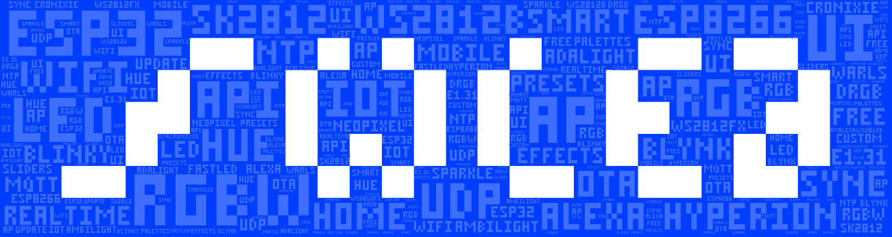

# IoBroker.wled

**Dieser Adapter nutzt den Dienst [Sentry.io](https://sentry.io), um mir als Entwickler automatisch Ausnahmen und Codefehler sowie neue Geräteschemata zu melden.** Weitere Details siehe unten!

## Wled-Adapter für ioBroker
Eine schnelle und funktionsreiche Implementierung eines ESP8266/ESP32 Webservers zur Steuerung von NeoPixel (WS2812B, WS2811, SK6812, APA102)LEDs oder auch SPI basierten Chipsätzen wie dem WS2801!

[WLED - Github-Projekt](https://github.com/Aircoookie/WLED) von @Aircoookie

## Anweisungen
Der Adapter versucht automatisch, WLED-Geräte in Ihrem Netzwerk mithilfe von Bonjour-Diensten zu finden.
Bekannte Probleme: Netzwerke mit VLAN-Trennung leiten den Broadcast-Datenverkehr meistens nicht weiter, was bedeutet, dass die automatische Erkennung fehlschlägt.

Keine Sorge, in diesem Fall können Sie das Gerät manuell per IP-Adresse hinzufügen.

1) Stellen Sie sicher, dass Ihr WLED-Gerät läuft und über das Netzwerk erreichbar ist 2) Installieren Sie den Adapter 3) Konfigurieren Sie die Intervallzeiten für die Datenabfrage und den automatischen Erkennungszyklus 4 - A) Starten Sie den Adapter, Geräte sollten automatisch erkannt werden 4 - B) Wenn A fehlschlägt , verwenden Sie die Schaltfläche Add-Device und geben Sie die IP-Adresse des Geräts ein 5) Adapter sendet Änderungen sofort und fragt alle x Sekunden Daten ab (konfigurierbar)

## Machen
* [ ] Polling auf Socket-Verbindungen umschalten, Implementierung bei WLED-Firmware ausstehend

## Unterstütze mich
Wenn Ihnen meine Arbeit gefällt, können Sie gerne eine persönliche Spende zukommen lassen (dies ist ein persönlicher Spendenlink für DutchmanNL, kein Bezug zum ioBroker-Projekt!) 

## Was ist Sentry.io und was wird an die Server dieses Unternehmens gemeldet?
Sentry.io ist ein Dienst für Entwickler, um sich einen Überblick über Fehler ihrer Anwendungen zu verschaffen. Und genau das ist in diesem Adapter implementiert.

Wenn der Adapter abstürzt oder ein anderer Codefehler auftritt, wird diese Fehlermeldung, die auch im ioBroker-Protokoll angezeigt wird, an Sentry gesendet. Wenn Sie der iobroker GmbH erlaubt haben, Diagnosedaten zu sammeln, dann ist auch Ihre Installations-ID (dies ist nur eine eindeutige ID **ohne** zusätzliche Informationen über Sie, E-Mail, Name oder dergleichen) enthalten. Auf diese Weise kann Sentry Fehler gruppieren und anzeigen, wie viele eindeutige Benutzer von einem solchen Fehler betroffen sind. All dies hilft mir, fehlerfreie Adapter bereitzustellen, die im Grunde nie abstürzen.

## Changelog
<!--
    Placeholder for the next version (at the beginning of the line):
    ### __WORK IN PROGRESS__
-->
### 0.5.9 (2021-08-11)
* (DutchmanNL) added new state attributes reported by Sentry
* (DutchmanNL) added min & max for brightness value to support iOT adapter

### 0.5.8 (2021-08-11)
* (DutchmanNL) added new state attributes reported by Sentry
* (DutchmanNL) Bugfix Live override datapoint created as read-only #252
* (DutchmanNL) excluded value "PIR" from data write due to current formatting

### 0.5.7 (2021-08-10)
* (foxriver76) we fixed some incorrect object types, fixes warnings with JS-Controller 3.3.x [#215](https://github.com/DrozmotiX/ioBroker.wled/issues/215) & [#209](https://github.com/DrozmotiX/ioBroker.wled/issues/209)
* (DutchmanNL) add support for WLED 0.13.x (added types fps, ndc, ip, of)

### 0.5.6 (2021-01-03)
* (DutchmanNL) Bugfix : State type definition for time and pmt

### 0.5.5 (2021-01-03)
* (DutchmanNL) add development option to disable sentry
* (DutchmanNL) split API calls, avoid not needed query's
* (DutchmanNL) Bugfix : issue with boolean attributes #40
* (DutchmanNL) add new state definition for WLED version 0.11
* (DutchmanNL) Bugfix : You are assigning a string to the state "wled.0.xxxx.seg.0.col.0

### 0.5.4 (2020-09-02)
* (DutchmanNL) Support WLED 0.10.2, new state definitions implemented
* (DutchmanNL) Update state definitions
* (DutchmanNL) Remove log messages for missing states (Sentry report only)
* (DutchmanNL) Bugfix : 0.5.3 decommissioned, update to 0.5.4 !

### 0.5.2 (2020-08-29)
* (DutchmanNL) Bugfix : Add missing Attributes with WLED 0.10.0

### 0.5.1 (20-04-2020) Avoid writing objects unnecessarily, Sentry implemented
* (DutchmanNL) Implement Sentry
* (DutchmanNL) Bugfix : Devicename
* (DutchmanNL) Bugfix : Warning with JS Controler 3.0.7
* (DutchmanNL) Bugfix : Avoid writing objects unnecessarily

### 0.5.0 Stable release
* (DutchmanNL) Added translations
* (DutchmanNL) Release to stable repository, beta testing finished

### 0.3.0 Bugfix : Correct handling of polling timer
* (DutchmanNL  & Jey-Cee) Bugfix : Polling timer not saved
* (DutchmanNL) Bugfix : Correct handling of "online" state
* (DutchmanNL) Bugfix : Polling timer (offline devices did not reconnect)

### 0.2.6 Bugfix : Hex state value change
* (DutchmanNL) Bugfix : Hex state value change

### 0.2.5 Stable release candidate
* (DutchmanNL) Code cleanup
* (DutchmanNL) Improved logging information
* (DutchmanNL) Make polling timer configurable
* (DutchmanNL) Correct handling of device online state
* (DutchmanNL) Show online state in instance configuration

### 0.2.0 Possibility to add devices by IP-adress
* (DutchmanNL) Bugfix io-package
* (DutchmanNL) Improved logging at adapter start
* (DutchmanNL) Possibility to add devices by IP-adress implemented. (Needed for situations were autoscan fails)
* (DutchmanNL) Ensure known devices get connected immediatly after adapter start instead of waiting for network scan

### 0.1.9 Code improvements
* (DutchmanNL) Code cleanup and optimalisation
* (DutchmanNL) FIX memory leak by proper handling of bonjour service

### 0.1.8 Bugfix
* (DutchmanNL) Solved incorrect formated API call at state changes causing warning message

### 0.1.7 Bugfix
* (DutchmanNL) Fixed error when API call fails (write warning to log and retry at intervall time)

### 0.1.6 HEX color states implemented
* (DutchmanNL) HEX color states implemented

### 0.1.5 Stable Beta release

### 0.1.2
* (DutchmanNL) Implement drop down menu for effects

### 0.1.1
* (DutchmanNL) Implemented states hidden from JSON-API : tt / psave / nn / time
* (DutchmanNL) Improve logging issue

### 0.1.0
* (DutchmanNL) initial release

## License
MIT License

Copyright (c) 2020 DutchmanNL <rdrozda86@gmail.com>

Permission is hereby granted, free of charge, to any person obtaining a copy
of this software and associated documentation files (the "Software"), to deal
in the Software without restriction, including without limitation the rights
to use, copy, modify, merge, publish, distribute, sublicense, and/or sell
copies of the Software, and to permit persons to whom the Software is
furnished to do so, subject to the following conditions:

The above copyright notice and this permission notice shall be included in all
copies or substantial portions of the Software.

THE SOFTWARE IS PROVIDED "AS IS", WITHOUT WARRANTY OF ANY KIND, EXPRESS OR
IMPLIED, INCLUDING BUT NOT LIMITED TO THE WARRANTIES OF MERCHANTABILITY,
FITNESS FOR A PARTICULAR PURPOSE AND NONINFRINGEMENT. IN NO EVENT SHALL THE
AUTHORS OR COPYRIGHT HOLDERS BE LIABLE FOR ANY CLAIM, DAMAGES OR OTHER
LIABILITY, WHETHER IN AN ACTION OF CONTRACT, TORT OR OTHERWISE, ARISING FROM,
OUT OF OR IN CONNECTION WITH THE SOFTWARE OR THE USE OR OTHER DEALINGS IN THE
SOFTWARE.