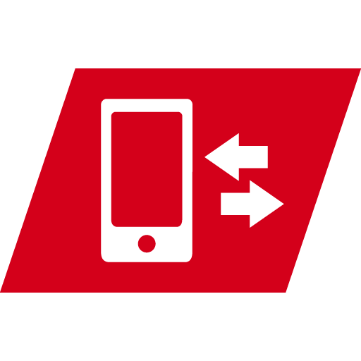

# ioBroker.wmswebcontrol

## wmswebcontrol-Adapter für ioBroker

Adapter für Warema WMS Webcontrol

## Aufstellen

Der Adapter unterstützt zwei Verbindungswege und bevorzugt den lokalen:

- **Lokal (empfohlen):** Der Adapter findet den WMS-Controller im lokalen Netzwerk automatisch ( **automatische Erkennung** , standardmäßig aktiviert). Der Scan läuft im Hintergrund und verzögert den Start nicht. Die gefundene IP-Adresse wird unter **„Lokale IP“** gespeichert, sodass spätere Starts den Scan überspringen. Sie können die IP-Adresse des Controllers auch direkt unter **„Lokale IP“** eingeben. Der lokale Status wird alle 15 Sekunden (Standard: **Abfrageintervall** ) abgefragt. Für die lokale API des Controllers ist keine Anmeldung erforderlich, und dieser Pfad funktioniert auch dann, wenn die Warema-Cloud oder der IoT-Hub nicht verfügbar sind.
- **Cloud:** Geben Sie Ihren Warema **-Benutzernamen** und **Ihr Passwort** ein. Wird als Ausweichlösung verwendet, wenn der Controller im LAN nicht erreichbar ist, und um den Controller zu finden, wenn der lokale Pfad nicht konfiguriert ist.

Beides lässt sich konfigurieren: Der Adapter steuert den Controller lokal an, sofern dieser erreichbar ist, und greift andernfalls auf die Cloud zurück. Die Cloud-Fallback-Funktion wird nur für Konten mit nur einem Controller verwendet (andernfalls kann der lokale Controller keinem bestimmten Controller zugeordnet werden).

## Verwendung

### Lokaler Modus (commonCommand)

Wenn der Controller erreichbar ist, erstellt der Adapter eine `local.*` Baumstruktur aus seiner Konfiguration. Jede steuerbare Aktion eines Geräts wird als eigener Zustand dargestellt:

- `local.<device>.position` - Zielposition 0..100 % (beschreibbar; Markisen-/Rollen-/Lamellenantriebe).
- `local.<device>.valance` - Zielposition eines separaten Valance-Laufwerks, falls vorhanden (beschreibbar).
- `local.<device>.slatAngle` - Ziel-Lamellenwinkel, Bereich pro Gerät (beschreibbar, nur Jalousien).
- `local.<device>.dimming` - Helligkeit 0..100 % für dimmbare Leuchten (beschreibbar).
- `local.<device>.light` /`.load` /`.switch` - Ein-/Ausschalter (beschreibbar).
- `local.<device>.stop` - Taste, stoppt die aktuelle Bewegung (beschreibbar).
- `local.<device>.identify` - Taste, dient zur Identifizierung des Geräts (beschreibbar).
- `local.<device>.drivingCause` /`.heartbeatError` /`.blocking` - Status (schreibgeschützt).
- `local.scenes.<scene>` - Schaltfläche, startet die Szene (beschreibbar).

Die genaue Zusammenstellung der Zustände pro Gerät hängt von den Aktionen ab, die der Controller für dieses Gerät meldet.

### Cloud-Modus (Legacy)

Wenn nur der Cloud-Pfad verfügbar ist, stellt der Adapter die Geräte, Szenen und Kanäle des Controllers bereit. Um einen Kanal zu steuern, ändern Sie die `*Convert` Werte, z.B.:

`wmswebcontrol.0.Markise+XXXX.setting0Convert`

`wmswebcontrol.0.LED+XXXXXXX.setting1Convert`

`wmswebcontrol.0.Markise.setting2Convert`

## Changelog

### 1.0.0 (2026-09-23)

- add local commonCommand control (IP or auto-discovery), preferred over the cloud with a
  cloud fallback
- expose every controllable action per device in the `local.*` tree (position, valance,
  slat angle, dimming, switch, stop, identify) plus scenes
- use axios for all HTTP calls, drop @esm2cjs/got
- resolve service endpoints from the discovery service

### 0.1.4 (2025-01-27)

- ignore certificate errors

### 0.1.3 (2024-10-26)

- fix login

### 0.1.2

- Bugfixes

### 0.0.3

- (TA2k) initial release

## License

MIT License

Copyright (c) 2021-2030 TA2k <tombox2020@gmail.com>

Permission is hereby granted, free of charge, to any person obtaining a copy
of this software and associated documentation files (the "Software"), to deal
in the Software without restriction, including without limitation the rights
to use, copy, modify, merge, publish, distribute, sublicense, and/or sell
copies of the Software, and to permit persons to whom the Software is
furnished to do so, subject to the following conditions:

The above copyright notice and this permission notice shall be included in all
copies or substantial portions of the Software.

THE SOFTWARE IS PROVIDED "AS IS", WITHOUT WARRANTY OF ANY KIND, EXPRESS OR
IMPLIED, INCLUDING BUT NOT LIMITED TO THE WARRANTIES OF MERCHANTABILITY,
FITNESS FOR A PARTICULAR PURPOSE AND NONINFRINGEMENT. IN NO EVENT SHALL THE
AUTHORS OR COPYRIGHT HOLDERS BE LIABLE FOR ANY CLAIM, DAMAGES OR OTHER
LIABILITY, WHETHER IN AN ACTION OF CONTRACT, TORT OR OTHERWISE, ARISING FROM,
OUT OF OR IN CONNECTION WITH THE SOFTWARE OR THE USE OR OTHER DEALINGS IN THE
SOFTWARE.