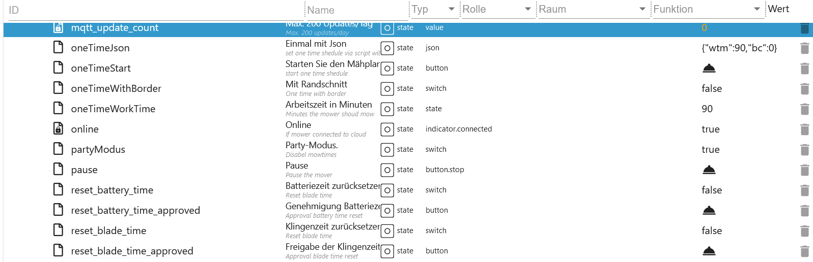
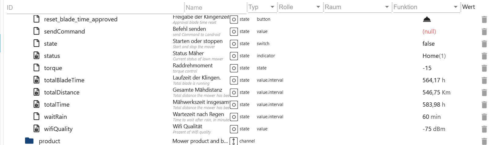

# ioBroker.worx Adapter

## Beschreibung

### Instanzeinstellungen

-   `App-Benutzername`: APP Benutzername (eMail)
-   `App-Passwort`: APP Passwort
-   `App Name`: Geräte auswählen
-   `Aktualisierungsintervall in Minuten` Intervall um alle Daten zu aktualisieren (Bereich von 10 bis 1440 möglich)
-   `Verzögerung für Kantenschnitt`: Wann soll EdgeCut nach dem Losfahren starten (Beispiel nach 5 Sekunden bis zum Rasen)
-   `Entfernung und Zeit in Minuten und Metern`: Einheit für Laufzeit und Arbeitszeit in Min./Std. und Meter/KM
-   `Aktualisieren der MQTT-Daten nach der Token-Aktualisierung.`: Nach der Erneuerung vom Token (jede Stunde) die Mqtt Daten neu laden.


### Ordner

-   `activityLog`: Aktivitätenprotokoll (Draht & Vision / Kontrolle möglich)
-   `areas`: Zonen (Draht / Kontrolle möglich)
-   `multiZones`: Multizonen (Vision / Kontrolle möglich)
-   `calendar`: Mähplan (Draht & Vision / Kontrolle möglich)
-   `Modules`: Verfügbare Module (Draht & Vision / Kontrolle möglich)
-   `mower`: Mäher (Draht & Vision / Kontrolle möglich)
-   `product`: Alle Eigenschaften vom Gerät (Draht & Vision / Nur lesen)
-   `rawMqtt`: Alle Daten von der Cloud (Draht & Vision / Nur lesen)


### activityLog (Draht und Vision)

-   `last_update`: Letzte Update als Zeitstempel (nur lesen)
-   `manuell_update`: Lädt das aktuelle Aktivitätenprotokoll (automatisch nach Statusänderungen - Draht & Vision / Kontrolle möglich)
-   `payload`: Protokoll als JSON (für VIS oder Blockly) (nur lesen)


### areas (Nur Draht)

-   `actualArea`: Aktuelle Zone (nur lesen)
-   `actualAreaIndicator`: Nächste Zonenanfahrt im Array. Bsp. 0 - [`2`,2,2,2,2,2,2,2,2,2] (nur lesen)
-   `area_0`: Start Zone 1 in Meter (array=0) (änderbar)
-   `area_1`: Start Zone 2 in Meter (array=1) (änderbar)
-   `area_2`: Start Zone 3 in Meter (array=2) (änderbar)
-   `area_3`: Start Zone 4 in Meter (array=3) (änderbar)
-   `startSequence`: Zonenstart Array (0-9 Ereignisse) Bsp.: Nur Zone 3 anfahren [2,2,2,2,2,2,2,2,2,2] (änderbar)
-   `zoneKeeper`: Verhindert Zonendurchbrüche (Zonen müssen erstellt sein) (ab Firmware 3.30) (änderbar)


### calendar (Draht)

-   Beispiel Zeiteinstellung Mittwoch

    -   `wednesday.borderCut`: Mit oder ohne Kantenschnitt (ohne Verzögerung setzen) (änderbar)
    -   `wednesday.startTime`: Startzeit als Format hh:mm (0-23/0-59) Bsp.: 09:00 (ohne Verzögerung setzen) (änderbar)
    -   `wednesday.workTime`: Arbeitszeit in Minuten (180 min = 3h) Bsp.: 30 = Endzeit 09:30 (ohne Verzögerung setzen) (änderbar)
    -   `calJson_sendto`: Sind alle Datenpunkte gesetzt dann diesen Button auf true setzen (mit einer Verzögerung von 1,1). Der Mäher mäht nun für 30 Minuten! (änderbar)
    -   `calJson_tosend`: Dieser JSON wird automatisch gefüllt und dann an Mqtt versendet. Kann natürlich auch selber erstellt werden. (änderbar)
    -   `calendar.calJson`: Array für den Wochenmähplan 1 (wird automatisch gesetzt - nur Draht) (änderbar)
    -   `calendar.calJson2`: Array für den Wochenmähplan 2 (wird automatisch gesetzt - nur Draht) (änderbar)


### calendar (Vision)

-   Beispiel Zeiteinstellung Freitag
-   Als Standard werden 2 Timeslots angelegt. Werden 3 Slots in der APP angelegt werden auch 3 in ioBroker erstellt. Wird wieder auf 2 reduziert, dann wird in ioBroker diese Slots gelöscht. Der Tag mit den meisten Slots wird als Referenz für alle Tage verwendet.

    -   `friday.time_0.borderCut`: Mit oder ohne Kantenschnitt (ohne Verzögerung setzen) (änderbar)
    -   `friday.time_0.startTime`: Startzeit als Format hh:mm (0-23/0-59) Bsp.: 09:00 (ohne Verzögerung setzen) (änderbar)
    -   `friday.time_0.workTime`: Arbeitszeit in Minuten (180 min = 3h) Bsp.: 30 = Endzeit 09:30 (ohne Verzögerung setzen) (änderbar)
    -   `friday.time_0.enabled_time`: Zeit aktivieren oder deaktivieren. (ohne Verzögerung setzen) (änderbar)
    -   `friday.time_0.zones`: Welche Zonen sollen angefahren werden z. Bsp. [1,2,3] (ohne Verzögerung setzen) (änderbar)
    -   `calJson_sendto`: Sind alle Datenpunkte gesetzt dann diesen Button auf true setzen (mit einer Verzögerung von 1,1). Der Mäher mäht nun für 30 Minuten! (änderbar)
    -   `calJson_tosend`: Dieser JSON wird automatisch gefüllt und dann an Mqtt versendet. Kann natürlich auch selber erstellt werden. (änderbar)
    -   `add_timeslot`: Es wird ein zusätzlicher Timeslot hinzugefügt. Nicht genutzte Timeslots werden nach einem Neustart entfernt. (änderbar)


### Beispiel Timeslot (Vision)

-   `calJson_tosend` Dieser JSON würde 1 Zeit am Sonntag eintragen und alle anderen Tage löschen. Es muss immer die gesamte Woche übermittelt werden.

```json
[
    {
        "e": 1, // 0=deaktiviert/1=aktiviert - Bei 0 wird der Slot deaktiviert
        "d": 0, // Tage 0=Sonntag, 1=Montag, 2=Dienstag, 3=Mittwoch, 4=Donnerstag, 5=Freitag, 6=Samstag
        "s": 360, // Startzeit in Minuten 06:00 (360/60) - (320/60 = 5 Stunden und 20 Minuten)
        "t": 180, // Laufzeit in Minuten = Endzeit 09:00 (180/60) - (200/60 = 3 Stunden und 20 Minuten)
        "cfg": {
            "cut": {
                "b": 1, // 0=ohne Kantenschnitt/1=Mit Kantenschnitt
                "z": [1] // In which zones - example 3 zones [1,2,6]
            }
        }
    }
]
```

### modules (Draht und Vision)

-   Off Limit Modul (Draht und Vision)

    -   `DF.OLMSwitch_Cutting`: Verhindert das überfahren vom Magnetband - true-an/false-aus
    -   `DF.OLMSwitch_FastHoming`: Verwendet erstellte Abkürzungen mit Magnetband - mithilfe von Abkürzungen aus Magnetstreifen - true-an/false-aus

-   ACS Modul (nur Draht)

    -   `US.ACS`: ACS aktivieren oder deaktivieren - 1-on/0-off
    -   `US.ACS_Status`: Status vom ACS Modul

-   EA Modul (nur Vision)

    -   `EA.height`: Höheneinstellung Mähwerk von 30-60 in 5mm Schritte

-   HL Modul (nur Vision)
    -   `HL.status`: Status Scheinwerfer
    -   `HL.enabled`: Scheinwerfer installiert ja = 1/nein = 0
    -   `HL.on`: Tageslicht = 0/Dunkelheit = 1


### mower (Draht und Vision)

-   `AutoLock`: automatische Verriegelung true-an/false-aus (Draht & Vision/änderbar)
-   `AutoLockTimer`: Timer für automatische Verriegelung max. 10 Minuten in 30 Sekunden Schritte (Draht & Vision/änderbar)
-   `batteryChargeCycle`: Batterieladezyklus (Draht & Vision/nur lesen)
-   `batteryCharging`: Batterieladung false->nein/true->ja (Draht & Vision/nur lesen)
-   `batteryState`: Batteriestatus in % (Draht & Vision/nur lesen)
-   `batteryTemperature`: Batterietemperatur in Celsius (Draht & Vision/nur lesen)
-   `batteryVoltage`: Batteriespannung in Volt (Draht & Vision/nur lesen)
-   `cameraStatus`: Status Camera 0=OK/1=Error (Vision/nur lesen)
-   `cameraError`: Camera error 0=OK/1=Error (Vision/nur lesen)
-   `cutOverSlabs`: Über Platten mähen an = true / aus = false (Vision/änderbar)
-   `direction`: Richtung in Grad (Draht & Vision/nur lesen)
-   `edgecut`: Start EdgeCut (Draht & Vision/änderbar)
-   `error`: Errormeldung vom Mäher (Draht & Vision/nur lesen)

```json
{
    "states": {
        "0": "No error", //(Draht & Vision & RTK)
        "1": "Trapped", //(Draht & Vision & RTK-Body)
        "2": "Lifted", //(Draht & Vision & RTK-Body)
        "3": "Wire missing", //(Draht)
        "4": "Outside boundary", //(Draht & Vision & RTK-Body)
        "5": "Raining", //(Draht & Vision & RTK-Body)
        "6": "Close door to cut grass", //(Draht)
        "7": "Close door to go home", //(Draht)
        "8": "Blade motor fault", //(Draht & Vision & RTK-Body)
        "9": "Wheel motor fault", //(Draht & Vision & RTK-Body)
        "10": "Trapped timeout fault", //(Draht & Vision & RTK-Body)
        "11": "Upside down", //(Draht & Vision & RTK-Body)
        "12": "Battery low", //(Draht & Vision & RTK)
        "13": "Wire reversed", //(Draht)
        "14": "Charge error", //(Draht & Vision & RTK-Body)
        "15": "Home search timeout", //(Draht & Vision)
        "16": "Wifi locked", //(Draht & Vision)
        "17": "Battery over temperature", //(Draht & Vision & RTK)
        "18": "Dummy model", //(Draht)
        "19": "Battery trunk open timeout", //(Draht & Vision)
        "20": "Wire signal out of sync", //(Draht)
        "100": "Charging station docking error", //(RTK-Body)
        "101": "HBI error", //(RTK-Body)
        "102": "OTA upgrade error", //(Vision & RTK)
        "103": "Map error", //(RTK)
        "104": "Excessive slope", //(RTK-Body)
        "105": "Unreachable zone", //(RTK-Body)
        "106": "Unreachable charging station", //(RTK-Body)
        "107": "Calibration needed", //(RTK-Head)
        "108": "Insufficient sensor data", //(RTK)
        "109": "Training start disallowed", //(RTK)
        "110": "Camera error", //(Vision)
        "111": "Lawn exploration required", //(Vision)
        "112": "Mapping exploration failed", //(Vision)
        "113": "RFID reader error", //(Vision)
        "114": "Headlight error", //(Vision)
        "115": "Missing charging station", //(RTK-Body)
        "116": "Blade height adjustment blocked", //(Vision & RTK-Body)
        "117": "Unsupported blade height", //(Vision & RTK-Body)
        "118": "Manual firrnware upgrade required", //(Vision & RTK-Body)
        "119": "Area limit exceeded", //(RTK-Body)
        "120": "Charging station undocking error" //(RTK-Body)
    }
}
```


-   `firmware`: Installierte Firmware (Draht & Vision/nur lesen)
-   `firmware_available`: Verfügbare Firmware (Draht & Vision/nur lesen)
-   `firmware_available_all`: Letzte verfügbare Firmware als JSON - Dieses JSON wird aktualisiert, wenn ein neues Update zur Verfügung steht (Draht & Vision/nur lesen)

```json
{
    "mandatory": false,
    "product": {
        "uuid": "1236ll8d-0000-0000-9999-07ff6690003f",
        "version": "3.30.0+1",
        "released_at": "2023-05-24",
        "changelog": "•\tSupport for new models \tWR166E and WR184E\n•\tImproved Grass cutting coverage\n•\tImproved ACS\n•\tAdded Zone Keeper function (need to be enabled by app)\n•\tImproved wheel torque algorithm\n• \tNew FML firmware\n•\tFixed \"FML\" and \"Radiolink\" Activation problem\n•\tFixed some translations error\n•\tRain delay can now be cleared pressing START / HOME button, (1 minute after countdown has started)\n•\tImproved PRO Battery management\n• \tImproved boundary wire recognition\n• \tFixed border cut when zones are active\n• \tNew wifi firmware for board HW REV > 7\n\nThe Worx Landroid team would like to thank our amazing beta testers, with hundreds of hours of their own free time to make this firmware possible."
    }
}
```

-   `firmware_available_date`: Datum verfügbaren Firmware - Dummy 1970-01-01 wenn der Adapter neu installiert wird und es kein Update zur Verfügung steht (Draht & Vision/nur lesen)
-   `firmware_body` Inhalt von dat.fw (Vision/nur lesen)
-   `firmware_head` Inhalt dat.head.fw (Vision/nur lesen)
-   `firmware_update_start`: Start Update in 2 Schritten - siehe `firmware_update_start_approved` (Draht & Vision/änderbar)
-   `firmware_update_start_approved`: Aktualisierung der Firmware starten - `firmware_update_start` muss auf true gesetzt sein (Draht & Vision/änderbar)
-   `gradient`: Gefälle oder Anstieg in Grad (Draht & Vision/nur lesen)
-   `inclination`: Neigung in Grad (Draht & Vision/nur lesen)
-   `last_command`: Letzter Befehl von iobroker oder der APP als JSON Table (Draht & Vision/nur lesen)
-   `last_update` Letzte Update (wire & Vision/nur lesen)
-   `last_update_connection` Von welcher Verbindung (Mqtt oder Cloud / wire & Vision/nur lesen)
-   `mowTimeExtend`: Mähzeitverlängerung-/Verkürzung in % Bereich: -100%->100% (Draht/änderbar)
-   `mowerActive`: Pause Mähplan (Draht/änderbar)
-   `mqtt_update`: Update Mqtt Daten vom Mäher - max. 150/Tag (Draht & Vision/änderbar)
-   `mqtt_update_count`: Counter von Update Mqtt Daten (Draht & Vision/nur lesen)


-   `oneTimeJson`: einmaliges Mähen als JSON (Draht & Vision/änderbar)

```json
{
    "wtm": 60, //Minuten
    "bc": 0 //0=ohne Kantenschnitt 1=mit Kantenschnitt - oder die nächsten Datenpunkte verwenden
}
```

-   `oneTimeStart`: einmaliges Mähen start "Erst oneTimeWithBorder, oneTimeWorkTime und beim Vision noch oneTimeZones setzen" - mit einer Verzögerung von 1,1 Sekunde (Draht & Vision/änderbar)
-   `oneTimeWithBorder`: Mit Kantenschnitt - Wert ohne Verzögerung setzen (Draht & Vision/änderbar)
-   `oneTimeWorkTime`: Mähzeit max. 8h in 30 Minuten Schritte - Wert ohne Verzögerung setzen (Draht & Vision/änderbar)
-   `oneTimeZones`: Zonen setzen [1,2,4] (Vision/änderbar)
-   `online`: Mäher Online (Draht & Vision/nur lesen)
-   `partyModus`: Party-Modus schalten an/aus (Draht & Vision/änderbar)
-   `pause`: Mähpause schalten an/aus (Draht & Vision/änderbar)
-   `reset_battery_time`: Batterieladungen in 2 Schritten zurücksetzen (Draht & Vision/änderbar)
-   `reset_battery_time_approved`: Batterieladungen zurücksetzen bestätigen - `reset_battery_time` muss auf true gesetzt sein (Draht & Vision/änderbar)
-   `reset_blade_time`: Klingenarbeitszeit in 2 Schritten zurücksetzen (Draht & Vision/änderbar)
-   `reset_blade_time_approved`: Klingenarbeitszeit zurücksetzen bestätigen - `reset_battery_time` muss auf true gesetzt sein (Draht & Vision/änderbar)



-   `rfidStatus`: Status RF Sensor 0=OK/1=Fehler (Vision/nur lesen)
-   `sendCommand`: Ein Befehl versenden (Draht & Vision/änderbar)

```json
{
    "states": {
        "1": "Start", //(Draht & Vision & RTK)
        "2": "Stop", //(Draht & Vision & RTK)
        "3": "Home", //(Draht & Vision & RTK)
        "4": "Follow border", //(Draht & Vision & RTK)
        "5": "Wi-Fi Lock", //(Draht & Vision)
        "6": "Wi-Fi Unlock", //(Draht & Vision)
        "7": "Reset Log", //(Draht & Vision & RTK)
        "8": "Pause over border", //(Draht & Vision)
        "9": "Safe go home", //(Draht & Vision & RTK)
        "10": "Start once", //(Vision)
        "100": "Pairing command", //(Vision & RTK)
        "101": "Border Cut", //(Vision & RTK)
        "102": "Resume cutting", //(RTK)
        "103": "Start driving", //(Vision & RTK)
        "104": "Stop driving" //(Vision & RTK)
    }
}
```

-   `state`: True für Mähvorgang starten und False für Mähvorgang beenden (Draht & Vision/änderbar)
-   `status`: Status vom Mäher (Draht & Vision & RTK/nur lesen)

```json
{
    "states": {
        "0": "IDLE", //(wire & Vision & RTK-Body)
        "1": "Home", //(wire & Vision & RTK-Body)
        "2": "Start sequence", //(wire)
        "3": "Leaving home", //(wire & Vision & RTK-Body)
        "4": "Following border", //(wire)
        "5": "Searching home", //(wire & Vision & RTK-Body)
        "6": "Searching border", //(wire & Vision)
        "7": "Mowing", //(wire & Vision & RTK-Body)
        "8": "Lifted", //(wire & Vision & RTK-Body)
        "9": "Trapped", //(wire & Vision & RTK-Body)
        "10": "Blade blocked", //(wire & Vision & RTK-Body)
        "11": "Debug", //(wire)
        "12": "Driving", //(wire & Vision)
        "13": "Digital fence escape", //(wire & Vision)
        "30": "Going home", //(wire & Vision)
        "31": "Zone training", //(wire & Vision)
        "32": "Border Cut", //(wire & Vision)
        "33": "Searching zone", //(wire & Vision)
        "34": "Pause", //(wire & Vision)
        "100": "Map training (completable)", //(RTK-Head)
        "101": "Map processing", //(RTK)
        "102": "Upgrading firmware", //(RTK)
        "103": "Moving to zone", //(RTK-Body)
        "104": "Going home", //(RTK-Body)
        "105": "Ready for training", //(RTK-Head)
        "106": "Map download in progress", //(RTK)
        "107": "Map upload in progress", //(RTK-Head)
        "108": "Map training paused", //(RTK-Head)
        "109": "Map training (not completable)", //(RTK-Head)
        "110": "Border crossing", //(Vision)
        "111": "Exploring lawn", //(Vision)
        "112": "Moving to recovery point", //(RTK-Body)
        "113": "Waiting for position", //(RTK-Body)
        "114": "Map training (driving)", //(Vision & RTK-Body)
        "115": "Map training (rolling back)" //(Vision)
    }
}
```

-   `torque`: Raddrehmoment Bereich -50->50 (Draht & Vision/änderbar)
-   `totalBladeTime`: Gesamte Klingen-Arbeitszeit (Draht & Vision/nur lesen)
-   `totalDistance`: Gesamte Entfernung (Draht & Vision/nur lesen)
-   `totalTime`: Gesamte Rasenmäher-Arbeitszeit (Draht & Vision/nur lesen)
-   `waitRain`: Regenverzögerung max. 12h in 30 Minuten Schritte und 0 für aus (Draht & Vision/änderbar)
-   `waitRainCountdown` Countdown wenn der Sensor wechselt von nass zu trocken (Draht & Vision/nur lesen) (derzeit deaktiviert)
-   `waitRainSensor` Status 0 für trocken und 1 für feucht (Draht & Vision/nur lesen)
-   `wifiQuality`: Wifi Qualität (Draht & Vision/nur lesen)

```json
{
    "rain": {
        "s": 0, // 0 für trocken und 1 für nass (Draht & Vision)
        "cnt": 59 // Countdown wenn Wechsel von s=1 nass zu s=0 trocken - Regen wurde erkannt (Draht & Vision)
    }
}
```



### Zusätzlich Vision Infos

-   multiZones
    -   `multiZones.zones.zone_1.borderDistance`: Beim Kantenschnitt der Abstand zur Kante in mm - erlaubt 50mm, 100mm, 150mm und 200mm - Mit Blockly ohne Verzögerung setzen - Änderung wird in `multiZones.multiZones` geschrieben (Vision/änderbar)
    -   `multiZones.zones.zone_1.chargingStation`: 1 Wenn sich die Ladestation in dieser Zone befindet. 0 für keine Ladestation - Mit Blockly ohne Verzögerung setzen - Änderung wird in `multiZones.multiZones` geschrieben (Vision/änderbar)
    -   `multiZones.zones.zone_1.cutOverBorder`: 1 zum Überfahren von Platten, wenn diese erkannt werden, ansonsten 0. Mit Blockly ohne Verzögerung setzen - Änderung wird in `multiZones.multiZones` geschrieben (Vision/änderbar)
    -   `multiZones.zones.zone_1.zone_id`: Nummerierung - Start mit 1 (Vision/nur lesen)
    -   `multiZones.passages.passage_01.tagIdFrom`: RFID id von zoneIdFrom - Mit Blockly ohne Verzögerung setzen - Änderung wird in `multiZones.multiZones` geschrieben (Vision/änderbar)
    -   `multiZones.passages.passage_01.tagIdTo`: RFID id von zoneIdTo - Mit Blockly ohne Verzögerung setzen - Änderung wird in `multiZones.multiZones` geschrieben (Vision/änderbar)
    -   `multiZones.passages.passage_01.zoneIdFrom`: Zone von (muss zoneIdFrom < zoneIdTo) - Mit Blockly ohne Verzögerung setzen - Änderung wird in `multiZones.multiZones` geschrieben (Vision/änderbar)
    -   `multiZones.passages.passage_01.zoneIdTo`: Zone zu (muss zoneIdTo > zoneIdFrom) - Mit Blockly ohne Verzögerung setzen - Änderung wird in `multiZones.multiZones` geschrieben (Vision/änderbar)
    -   `multiZones.multiZones`: multiZones JSON (Vision/änderbar) [Beispiel](#beispiel-blockly-sendMultiZonesJson-vision)
    -   `multiZones.sendMultiZonesJson`: Änderungen an Worx senden mit mit einer Verzögerung von 1,1 Sekunden (Vision/änderbar)

Beispiel:

```json
{
    "mz": {
        "p": [
            // Durchgang zwischen den Zonen
            {
                "z1": 1, // Zone von (muss z1 < z2)
                "z2": 2, // Zone zu (muss z2 > z1)
                "t1": "E000000000000000", // RFID id von z1
                "t2": "E0000000KKKKKKKK" // RFID id von z2
            }
        ],
        "s": [
            // Die Zonen selbst
            {
                "id": 1, // Nummerierung - Start mit 1
                "c": 1, // 1 Wenn sich die Ladestation in dieser Zone befindet. 0 für keine Ladestation.
                "cfg": {
                    "cut": {
                        "bd": 100, // Kantenschnitt der Abstand zur Kante in mm - erlaubt 50mm, 100mm, 150mm und 200mm
                        "ob": 0 // 1 zum Überfahren von Platten, wenn diese erkannt werden, ansonsten 0.Unterschiedliche Werte pro Zone sind nicht zulässig
                    }
                }
            },
            {
                "id": 2, // Nummerierung fortlaufend
                "c": 0, // 1 Wenn sich die Ladestation in dieser Zone befindet. 0 für keine Ladestation.
                "cfg": {
                    "cut": {
                        "bd": 100, // Kantenschnitt der Abstand zur Kante in mm - erlaubt 50mm, 100mm, 150mm und 200mm
                        "ob": 0 // 1 zum Überfahren von Platten, wenn diese erkannt werden, ansonsten 0. Unterschiedliche Werte pro Zone sind nicht zulässig
                    }
                }
            }
        ]
    }
}
```

Standard ohne Zonen:

```json
{
    "mz": {
        "p": [],
        "s": [
            {
                "id": 1,
                "c": 1,
                "cfg": {
                    "cut": {
                        "bd": 150,
                        "ob": 0
                    }
                }
            }
        ]
    }
}
```


-   Mower
    -   `log_improvement`: Protokoll zur Verbesserung an Worx senden de-/aktivieren (änderbar)
    -   `log_troubleshooting`: Fehlerbericht an Worx senden de-/aktivieren (änderbar)


-   Mower
    -   `paused`: Mähstartverzögerung (änderbar)


### info_mqtt (Draht und Vision)

-   `incompleteOperationCount`: Gesamtzahl der an die Verbindung übermittelten Vorgänge, die noch nicht abgeschlossen sind. Nicht quitierte Operationen sind eine Teilmenge davon.
-   `incompleteOperationSize`: Gesamtpaketgröße der an die Verbindung übermittelten Vorgänge, die noch nicht abgeschlossen sind. Nicht quitierte Operationen sind eine Teilmenge davon.
-   `unackedOperationCount`: Gesamtzahl der Vorgänge, die an den Server gesendet wurden und auf eine entsprechende Bestätigung warten, bevor sie abgeschlossen werden können.
-   `unackedOperationSize`: Gesamtpaketgröße der Vorgänge, die an den Server gesendet wurden und auf eine entsprechende Bestätigung warten, bevor sie abgeschlossen werden können.
-   `last_update`: Letzte Aktualisierung vom Token
-   `next_update`: Nächste Aktualisierung vom Token
-   `online`: Status MQTT Verbindung (false=offline/true=online)


### Beispiel Blockly sendMultiZonesJson Vision

```
<xml xmlns="https://developers.google.com/blockly/xml">
  <variables>
    <variable id="${]4s$w?n24Az}=7iAIY">mz</variable>
    <variable id="o.FQ]_Xa!tHn2T7Ak{Pt">value</variable>
    <variable id="/@E4iFRMr:x+u?{7yFlB">test</variable>
    <variable id="jxTInS{}mk_)WJa[:,fA">i</variable>
  </variables>
  <block type="procedures_defcustomnoreturn" id="u:w*aBH!92nydG0Mu.1-" x="-87" y="-87">
    <mutation statements="false">
      <arg name="mz" varid="${]4s$w?n24Az}=7iAIY"></arg>
      <arg name="value" varid="o.FQ]_Xa!tHn2T7Ak{Pt"></arg>
    </mutation>
    <field name="NAME">set_bd</field>
    <field name="SCRIPT">bXouY2ZnLmN1dC5iZCA9IDE1MA==</field>
    <comment pinned="false" h="80" w="160">Beschreibe diese Funktion …</comment>
  </block>
  <block type="variables_set" id="jiP0218}2,Y]B]RdKD~`" x="-87" y="-35">
    <field name="VAR" id="/@E4iFRMr:x+u?{7yFlB">test</field>
    <value name="VALUE">
      <block type="convert_json2object" id=";Ef{FHk_~heeozyHFxci">
        <value name="VALUE">
          <block type="get_value" id="LMfldD:[D4%}yWE8,N0y">
            <field name="ATTR">val</field>
            <field name="OID">worx.0.xxxxxxxxxxxxxxxxxxxx.multiZones.sendMultiZonesJson</field>
          </block>
        </value>
      </block>
    </value>
    <next>
      <block type="controls_forEach" id="D{XG==q$flbH?32eX%D(">
        <field name="VAR" id="jxTInS{}mk_)WJa[:,fA">i</field>
        <value name="LIST">
          <block type="get_attr" id="b~2/cb$WhEj*9i6,(ey5">
            <value name="PATH">
              <shadow type="text" id="+n~;GfHf{,#D!5D}H+m=">
                <field name="TEXT">s</field>
              </shadow>
            </value>
            <value name="OBJECT">
              <block type="variables_get" id="YloS$N%I=6[yk;loD*1O">
                <field name="VAR" id="/@E4iFRMr:x+u?{7yFlB">test</field>
              </block>
            </value>
          </block>
        </value>
        <statement name="DO">
          <block type="procedures_callcustomnoreturn" id="er{Pwq:Y7n_I|CQoup,|">
            <mutation name="set_bd">
              <arg name="mz"></arg>
              <arg name="value"></arg>
            </mutation>
            <value name="ARG0">
              <block type="variables_get" id="(-_i0(y:W}U_x?s(7k%4">
                <field name="VAR" id="jxTInS{}mk_)WJa[:,fA">i</field>
              </block>
            </value>
            <value name="ARG1">
              <block type="math_number" id="{2u/=v!k|yJsOesq[CU^">
                <field name="NUM">150</field>
              </block>
            </value>
            <next>
              <block type="debug" id="b1}}DmS-[_W:+Y+$|%)r">
                <field name="Severity">log</field>
                <value name="TEXT">
                  <shadow type="text" id="7wx?ca_U[S~8DA4}*RXx">
                    <field name="TEXT">test</field>
                  </shadow>
                  <block type="variables_get" id="_zz;w64g-!E$zX$]pvyI">
                    <field name="VAR" id="/@E4iFRMr:x+u?{7yFlB">test</field>
                  </block>
                </value>
              </block>
            </next>
          </block>
        </statement>
        <next>
          <block type="debug" id="o[S0+1%{oLU+r:03tz7=">
            <field name="Severity">log</field>
            <value name="TEXT">
              <shadow type="text" id="7wx?ca_U[S~8DA4}*RXx">
                <field name="TEXT">test</field>
              </shadow>
              <block type="variables_get" id="tjqxQ(MO|CR~/Xq5;Pm[">
                <field name="VAR" id="/@E4iFRMr:x+u?{7yFlB">test</field>
              </block>
            </value>
            <next>
              <block type="control" id="C^lZ^SNIQ#,vh}?hSG_O">
                <mutation xmlns="http://www.w3.org/1999/xhtml" delay_input="false"></mutation>
                <field name="OID">worx.0.xxxxxxxxxxxxxxxxxxxx.multiZones.sendMultiZonesJson</field>
                <field name="WITH_DELAY">FALSE</field>
                <value name="VALUE">
                  <block type="convert_object2json" id="z)EXA+%8lB4K#7!Hp1V%">
                    <field name="PRETTIFY">FALSE</field>
                    <value name="VALUE">
                      <block type="variables_get" id="C4np)gS@^Y*?-0I+R6+r">
                        <field name="VAR" id="/@E4iFRMr:x+u?{7yFlB">test</field>
                      </block>
                    </value>
                  </block>
                </value>
              </block>
            </next>
          </block>
        </next>
      </block>
    </next>
  </block>
</xml>

<xml xmlns="https://developers.google.com/blockly/xml">
  <variables>
    <variable id="${]4s$w?n24Az}=7iAIY">mz</variable>
    <variable id="o.FQ]_Xa!tHn2T7Ak{Pt">value</variable>
    <variable id="/@E4iFRMr:x+u?{7yFlB">test</variable>
    <variable id="jxTInS{}mk_)WJa[:,fA">i</variable>
  </variables>
  <block type="procedures_defcustomnoreturn" id="u:w*aBH!92nydG0Mu.1-" x="-87" y="-87">
    <mutation statements="false">
      <arg name="mz" varid="${]4s$w?n24Az}=7iAIY"></arg>
      <arg name="value" varid="o.FQ]_Xa!tHn2T7Ak{Pt"></arg>
    </mutation>
    <field name="NAME">set_bd</field>
    <field name="SCRIPT">bXouY2ZnLmN1dC5iZCA9IDE1MA==</field>
    <comment pinned="false" h="80" w="160">Beschreibe diese Funktion …</comment>
  </block>
  <block type="variables_set" id="jiP0218}2,Y]B]RdKD~`" x="-87" y="-35">
    <field name="VAR" id="/@E4iFRMr:x+u?{7yFlB">test</field>
    <value name="VALUE">
      <block type="convert_json2object" id=";Ef{FHk_~heeozyHFxci">
        <value name="VALUE">
          <block type="get_value" id="LMfldD:[D4%}yWE8,N0y">
            <field name="ATTR">val</field>
            <field name="OID">worx.0.xxxxxxxxxxxxxxxxxxxx.multiZones.sendMultiZonesJson</field>
          </block>
        </value>
      </block>
    </value>
    <next>
      <block type="controls_forEach" id="D{XG==q$flbH?32eX%D(">
        <field name="VAR" id="jxTInS{}mk_)WJa[:,fA">i</field>
        <value name="LIST">
          <block type="get_attr" id="b~2/cb$WhEj*9i6,(ey5">
            <value name="PATH">
              <shadow type="text" id="+n~;GfHf{,#D!5D}H+m=">
                <field name="TEXT">s</field>
              </shadow>
            </value>
            <value name="OBJECT">
              <block type="variables_get" id="YloS$N%I=6[yk;loD*1O">
                <field name="VAR" id="/@E4iFRMr:x+u?{7yFlB">test</field>
              </block>
            </value>
          </block>
        </value>
        <statement name="DO">
          <block type="procedures_callcustomnoreturn" id="er{Pwq:Y7n_I|CQoup,|">
            <mutation name="set_bd">
              <arg name="mz"></arg>
              <arg name="value"></arg>
            </mutation>
            <value name="ARG0">
              <block type="variables_get" id="(-_i0(y:W}U_x?s(7k%4">
                <field name="VAR" id="jxTInS{}mk_)WJa[:,fA">i</field>
              </block>
            </value>
            <value name="ARG1">
              <block type="math_number" id="{2u/=v!k|yJsOesq[CU^">
                <field name="NUM">150</field>
              </block>
            </value>
            <next>
              <block type="debug" id="b1}}DmS-[_W:+Y+$|%)r">
                <field name="Severity">log</field>
                <value name="TEXT">
                  <shadow type="text" id="7wx?ca_U[S~8DA4}*RXx">
                    <field name="TEXT">test</field>
                  </shadow>
                  <block type="variables_get" id="_zz;w64g-!E$zX$]pvyI">
                    <field name="VAR" id="/@E4iFRMr:x+u?{7yFlB">test</field>
                  </block>
                </value>
              </block>
            </next>
          </block>
        </statement>
        <next>
          <block type="debug" id="o[S0+1%{oLU+r:03tz7=">
            <field name="Severity">log</field>
            <value name="TEXT">
              <shadow type="text" id="7wx?ca_U[S~8DA4}*RXx">
                <field name="TEXT">test</field>
              </shadow>
              <block type="variables_get" id="tjqxQ(MO|CR~/Xq5;Pm[">
                <field name="VAR" id="/@E4iFRMr:x+u?{7yFlB">test</field>
              </block>
            </value>
            <next>
              <block type="control" id="C^lZ^SNIQ#,vh}?hSG_O">
                <mutation xmlns="http://www.w3.org/1999/xhtml" delay_input="false"></mutation>
                <field name="OID">worx.0.xxxxxxxxxxxxxxxxxxxx.multiZones.sendMultiZonesJson</field>
                <field name="WITH_DELAY">FALSE</field>
                <value name="VALUE">
                  <block type="convert_object2json" id="z)EXA+%8lB4K#7!Hp1V%">
                    <field name="PRETTIFY">FALSE</field>
                    <value name="VALUE">
                      <block type="variables_get" id="C4np)gS@^Y*?-0I+R6+r">
                        <field name="VAR" id="/@E4iFRMr:x+u?{7yFlB">test</field>
                      </block>
                    </value>
                  </block>
                </value>
              </block>
            </next>
          </block>
        </next>
      </block>
    </next>
  </block>
</xml>
```

### oder

```
<xml xmlns="https://developers.google.com/blockly/xml">
  <variables>
    <variable id="2#Mf$#JFCN9Nw2F2L[?=">x</variable>
    <variable id="fNt-C|86(glunJ:-t=dK">p</variable>
    <variable id="Rci4:iMYXzjoI2k]P^X)">s</variable>
    <variable id="[t-srB,I/UkXaWBk4*A*">list</variable>
    <variable id="]WA|%5f=H9^9uiLc;KS[">new_json</variable>
  </variables>
  <block type="procedures_defcustomreturn" id="@Y/LobsPw4k!jQb)fI!." x="88" y="13">
    <mutation statements="false">
      <arg name="x" varid="2#Mf$#JFCN9Nw2F2L[?="></arg>
      <arg name="p" varid="fNt-C|86(glunJ:-t=dK"></arg>
      <arg name="s" varid="Rci4:iMYXzjoI2k]P^X)"></arg>
    </mutation>
    <field name="NAME">json</field>
    <field name="SCRIPT">eFsicCJdID0gcDsNCnhbInMiXSA9IHM7DQpyZXR1cm4geA==</field>
    <comment pinned="false" h="80" w="160">Describe this function...</comment>
  </block>
  <block type="variables_set" id="WAsPqIMv;bh95{7~Y!D!" x="88" y="63">
    <field name="VAR" id="[t-srB,I/UkXaWBk4*A*">list</field>
    <value name="VALUE">
      <block type="convert_json2object" id="S5uRAnpcGp/7*1b,aum~">
        <value name="VALUE">
          <block type="text" id="}n3]_HIP*7y5GMEo-!c3">
            <field name="TEXT">{p:[],s:[]}</field>
          </block>
        </value>
      </block>
    </value>
    <next>
      <block type="variables_set" id="Kf#KkskB7l|uDiI!(fjq">
        <field name="VAR" id="]WA|%5f=H9^9uiLc;KS[">new_json</field>
        <value name="VALUE">
          <block type="procedures_callcustomreturn" id="K;OJHrji~09PeJ33q.gl">
            <mutation name="json">
              <arg name="x"></arg>
              <arg name="p"></arg>
              <arg name="s"></arg>
            </mutation>
            <value name="ARG0">
              <block type="variables_get" id="ipM^e+~#-hoo0(047Ybo">
                <field name="VAR" id="[t-srB,I/UkXaWBk4*A*">list</field>
              </block>
            </value>
            <value name="ARG1">
              <block type="lists_create_with" id="HJIZHLc]lL0Tgqe$E~Ul">
                <mutation items="0"></mutation>
              </block>
            </value>
            <value name="ARG2">
              <block type="lists_create_with" id="JH=jADj%lYJ(:7%v[o+3">
                <mutation items="1"></mutation>
                <value name="ADD0">
                  <block type="convert_json2object" id="@5BT0}WJ`srV89LD5h?D">
                    <value name="VALUE">
                      <block type="text" id="=.e.D[I2IQ{u!4;(-D-,">
                        <field name="TEXT">{"id":1,"c":1,"cfg":{"cut":{"bd":150,"ob":1}}}</field>
                      </block>
                    </value>
                  </block>
                </value>
              </block>
            </value>
          </block>
        </value>
        <next>
          <block type="control" id="k$;?LM/[x-TbZ^m=F4}i">
            <mutation xmlns="http://www.w3.org/1999/xhtml" delay_input="false"></mutation>
            <field name="OID">worx.0.xxxxxxxxxx.multiZones.sendMultiZonesJson</field>
            <field name="WITH_DELAY">FALSE</field>
            <value name="VALUE">
              <block type="convert_object2json" id="b~2Bz}OiNg{V]!QgN^J7">
                <field name="PRETTIFY">FALSE</field>
                <value name="VALUE">
                  <block type="variables_get" id="b|+SOSd+ZD@*XHPGu*I(">
                    <field name="VAR" id="]WA|%5f=H9^9uiLc;KS[">new_json</field>
                  </block>
                </value>
              </block>
            </value>
          </block>
        </next>
      </block>
    </next>
  </block>
</xml>
```

### oder direct

```
{"p": [],"s": [{"id": 1, "c": 1, "cfg": {"cut": {"bd": 100, "ob": 1}}}]}
```


### nicht erlaubt


## Changelog

### **WORK IN PROGRESS**

-   (Lucky-ESA) Added Landroid IP
-   (Lucky-ESA) Fixed interval

### 3.0.2 (2024-05-12)

-   (Lucky-ESA) mowTimeExtend restricted input
-   (Lucky-ESA) Fixed TypeError

### 3.0.1 (2024-05-08)

-   (Lucky-ESA) Preperation mission Kress new API
-   (Lucky-ESA) Fixed TypeError
-   (Lucky-ESA) Fixed missing activity states
-   (Lucky-ESA) Added update interval in instance setting
-   (Lucky-ESA) Added last update

### 3.0.0 (2024-04-25)

-   (Lucky-ESA) Fixed Sentry messages
-   (Lucky-ESA) Catch publish crash
-   (Lucky-ESA) Added Vision completely
-   (Lucky-ESA) Node 18 required
-   (Lucky-ESA) JS-Controller >= 5.0.19 required
-   (Lucky-ESA) Admin >=6.13.16 required
-   (Lucky-ESA) Catch aws_cer error and use old mqtt connection
-   (Lucky-ESA) Delete ping

### 2.3.4 (2023-10-19)

-   (Lucky-ESA) Fixed folder without raw
-   (Lucky-ESA) Changed Loglevel at refresh token
-   (Lucky-ESA) Fixed restriction vision bordercut
-   (Lucky-ESA) Fixed check json vision startsequence

### 2.3.3 (2023-09-25)

-   (Lucky-ESA) Added cmd wifi lock for Vision
-   (Lucky-ESA) Fixed [#761](https://github.com/iobroker-community-adapters/ioBroker.worx/issues/761)
-   (Lucky-ESA) Added sequence for Vision
-   (Lucky-ESA) Checking working hours and locktime
-   (Lucky-ESA) Fixed incorrect log message for firmware update

### 2.3.2 (2023-07-21)

-   (Lucky-ESA) Wrong folder for areas
-   (Lucky-ESA) New data points can only be read

### 2.3.1 (2023-07-20)

-   (Lucky-ESA) Added Firmware Update
-   (Lucky-ESA) Deleted board info request - Worx disabled endpoint
-   (Lucky-ESA) Added reset blade time and battery time
-   (Lucky-ESA) Added ping after refresh token
-   (Lucky-ESA) Added german description
-   (TA2k) Changed firmware request
-   (Lucky-ESA) Changed auth-endpoint
-   (Lucky-ESA) Some bug fixes
-   (Lucky-ESA) Fix unique mqtt clientid
-   (Lucky-ESA) Fix [#704](https://github.com/iobroker-community-adapters/ioBroker.worx/issues/704)
-   (Lucky-ESA) readme.md translated [#703](https://github.com/iobroker-community-adapters/ioBroker.worx/issues/703)
-   (Lucky-ESA) New Mqtt connection Fix [#590](https://github.com/iobroker-community-adapters/ioBroker.worx/issues/590)

### 2.2.0 (2023-06-27)

-   (Lucky-ESA) Removed mowerActive for Vision
-   (Lucky-ESA) Add Vision paused schedule
-   (Lucky-ESA) Add Vision partyModus
-   (Lucky-ESA) Fix ping request Vision
-   (Lucky-ESA) Fix send message inheritance
-   (Lucky-ESA) Fix [#684](https://github.com/iobroker-community-adapters/ioBroker.worx/issues/684)
-   (Lucky-ESA) Fix deviceArray inheritance
-   (Lucky-ESA) Add Vision mowers w/o Status & Error message
-   (Lucky-ESA) Add ZoneKeeper for previous mowers

### 2.1.3

-   (TA2k) Add ping option in the instance settings

### 2.1.2

-   (TA2k) Improve reconnection for multiple mower

### 2.1.1

-   (TA2k) Change reconnection times

### 2.1.0

-   (TA2k) Move Calendar setState to one Json and other fixes to prevent blocking because of too many sending requests

### 2.0.3

-   (TA2k) Add manual refresh. Fix empty status and firmware format. Reduce info logs.

### 2.0.1

-   (TA2k) Adapter rewritten. Added product info and activity log. rawMqtt values improved and compatible with Node v18.

### 1.7.0 (2022-09-28)

-   (TA2k) fix login

### 1.6.6 (2022-06-25)

-   (MeisterTR) fix edgecut

### 1.6.5 (2022-06-19)

-   (Apollon77) Remove logic to set a 0/0/0 nutrition level when deactivated again as it was in pre 1.6 versions also on second place

### 1.6.4 (2022-06-18)

-   (Apollon77) Remove logic to set a 0/0/0 nutrition level when deactivated again as it was in pre 1.6 versions
-   (Apollon77) fix error cases reported by Sentry

### 1.6.3 (2022-06-17)

-   (Apollon77) fix some error cases reported by Sentry

### 1.6.2 (2022-06-17)

-   (TA2k) fix issues introduced in 1.6.0

### 1.6.1 (2022-06-17)

-   (Apollon77) fix some error cases reported by Sentry

### 1.6.0 (2022-06-16)

-   (Apollon77) fix some error cases reported by Sentry

### 1.5.5 (2021-09-29)

-   (MeisterTR) fix error

### 1.5.0 (2021-09-26)

-   (MeisterTR) many fixes
-   (MeisterTR) add torque control
-   (MeisterTR) fixed States

### 1.4.3 (2021-07-25)

-   (MeisterTR) fix Partymode detection

### 1.4.2 (2021-07-24)

-   (MeisterTR) fix bug with OLMSwitch_Cutting
-   (MeisterTR) fix bug with PartyMode
-   (TA2k) fix error with wrong serialnumber (please delete all objects manually)
-   (MeisterTR) fix bug in autolock function

### 1.4.1 (2021-07-06)

-   (MeisterTR) fix bug in sendCommand (please remove state manually)

### 1.4.0 (2021-07-05)

-   (TA2k) update testing
-   (TA2k) add gps coordinates
-   (TA2k) add new status states
-   (TA2k) add new Autolock states
-   (TA2k) add new OffLinits states

### 1.3.7 (03.06.2021)

-   (TA2k) type fixes

### 1.3.6 (27.05.2021)

-   (MeisterTR) bugfixes
-   (MeisterTR) better errorhandling

### 1.2.9 (02.12.2020)

-   (MeisterTR) add sentry
-   (MeisterTR) Bugfix (error type of sc... again) (IOBROKER-WORX-3)

### 1.2.4 (15.11.2020)

-   (MeisterTR) Bugfix (error type of sc...)
-   (MeisterTR) change Testing to git

### 1.2.3 (29.08.2020)

-   (MeisterTR) add option to crate a Json Obj to set mowtime with scripts
-   (MeisterTR) add option to disable weather
-   (MeisterTR) add double Shedule, oneTimeShedule, PartyMode
-   (MeisterTR) fix setIntervall => setTimeout
-   (MeisterTR) fix error with Meter and Min. in Config
-   (MeisterTR) add Kress and Landxcape

### 1.0.0 (03.12.2019)

-   (MeisterTR) bump Version
-   (MeisterTR) transfer to community

### 0.4.0 (03.08.2019)

-   (MeisterTR) fix multimower
-   (MeisterTR) change loglevel
-   (MeisterTR) fix online Status

### 0.3.1 (12.06.2019)

-   (MeisterTR) add delay for edgecut in config
-   (MeisterTR) fix mowtime error

### 0.2.0 (01.06.2019)

-   (MeisterTR) add border
-   (MeisterTR) fix small errors
-   (MeisterTR) code cleanup

### 0.0.1

-   (MeisterTR) initial release

## License

MIT License

Copyright (c) 2023-2024 TA2k <tombox2020@gmail.com>

Permission is hereby granted, free of charge, to any person obtaining a copy
of this software and associated documentation files (the "Software"), to deal
in the Software without restriction, including without limitation the rights
to use, copy, modify, merge, publish, distribute, sublicense, and/or sell
copies of the Software, and to permit persons to whom the Software is
furnished to do so, subject to the following conditions:

The above copyright notice and this permission notice shall be included in all
copies or substantial portions of the Software.

THE SOFTWARE IS PROVIDED "AS IS", WITHOUT WARRANTY OF ANY KIND, EXPRESS OR
IMPLIED, INCLUDING BUT NOT LIMITED TO THE WARRANTIES OF MERCHANTABILITY,
FITNESS FOR A PARTICULAR PURPOSE AND NONINFRINGEMENT. IN NO EVENT SHALL THE
AUTHORS OR COPYRIGHT HOLDERS BE LIABLE FOR ANY CLAIM, DAMAGES OR OTHER
LIABILITY, WHETHER IN AN ACTION OF CONTRACT, TORT OR OTHERWISE, ARISING FROM,
OUT OF OR IN CONNECTION WITH THE SOFTWARE OR THE USE OR OTHER DEALINGS IN THE
SOFTWARE.