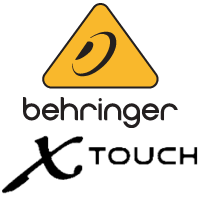

# ioBroker.x-touch

## x-touch-Adapter für ioBroker

Kommunikation mit einer Behringer X-Touch Bedienoberfläche (DAW-Controller)

## Aufgaben

- Fügen Sie die syncGlobal-Funktionalität hinzu.

## Nachrichtenfeld

Es gibt zwei akzeptierte Befehle:

- `export` Exportiert die in den Zuständen der Gerätegruppen gespeicherten Istwerte in den Benutzerdatenordner x-touch.0.
- `import` Importiert die jüngste Datei aus dem Benutzerdatenordner. Zusätzlich können Sie Folgendes angeben:`file` und/oder die`devicegroup` Nummer zum Wiederherstellen. Wenn`path` wird angegeben, dass das gesamte Dateisystem verwendet wird und ein`file` Die Angabe des Namens ist obligatorisch.

## Changelog

<!--
    Placeholder for the next version (at the beginning of the line):
    ### **WORK IN PROGRESS**
-->
### 0.9.1 (2026-08-22)
* (Bannsaenger) updated dependencies and issues from repository checker

### 0.9.0 (2026-05-15)
* (Bannsaenger) added additional path checking on importing files
* (copilot) Adapter requires node.js >= 22 now
* (Bannsaenger) updated dependencies and issues from repository checker
* (Bannsaenger) preserve names while database creation
* (Bannsaenger) restructured main.js and completed JsDoc requirements
* (Bannsaenger) fixed update the buttons from the desk when blanked/unblanked or new connected

### 0.8.3 (2025-10-24)
* (Bannsaenger) updated dependencies and issues from repository checker
* (Bannsaenger) migrate to NPM Trusted Publishing

### 0.8.2 (2025-09-05)
* (Bannsaenger) updated dependencies and issues from repository checker

### 0.8.1 (2025-05-21)
* (Bannsaenger) node 22 in deploy script
* (Bannsaenger) do not send updates when lock feature is in blank mode

[Older changelogs can be found there](https://github.com/Bannsaenger/ioBroker.x-touch/blob/master/CHANGELOG_OLD.md)

## License
MIT License

Copyright (c) 2021-2026 Bannsaenger <bannsaenger@gmx.de>

Permission is hereby granted, free of charge, to any person obtaining a copy
of this software and associated documentation files (the "Software"), to deal
in the Software without restriction, including without limitation the rights
to use, copy, modify, merge, publish, distribute, sublicense, and/or sell
copies of the Software, and to permit persons to whom the Software is
furnished to do so, subject to the following conditions:

The above copyright notice and this permission notice shall be included in all
copies or substantial portions of the Software.

THE SOFTWARE IS PROVIDED "AS IS", WITHOUT WARRANTY OF ANY KIND, EXPRESS OR
IMPLIED, INCLUDING BUT NOT LIMITED TO THE WARRANTIES OF MERCHANTABILITY,
FITNESS FOR A PARTICULAR PURPOSE AND NONINFRINGEMENT. IN NO EVENT SHALL THE
AUTHORS OR COPYRIGHT HOLDERS BE LIABLE FOR ANY CLAIM, DAMAGES OR OTHER
LIABILITY, WHETHER IN AN ACTION OF CONTRACT, TORT OR OTHERWISE, ARISING FROM,
OUT OF OR IN CONNECTION WITH THE SOFTWARE OR THE USE OR OTHER DEALINGS IN THE
SOFTWARE.