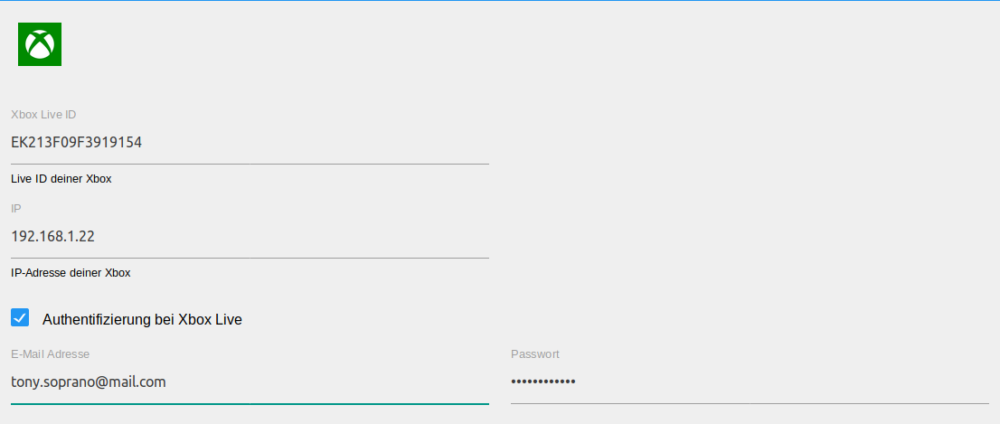
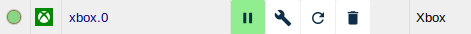
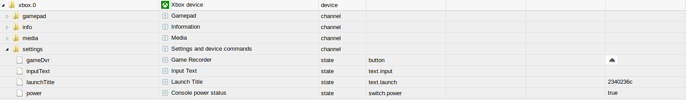

---
---


# Xbox Adapter

Der Xbox Adapter ermöglicht die Einbindung einer Xbox One bzw. Xbox One X
Spielekonsole in das ioBroker System.

## Überblick

### Xbox One Spielekonsole
Die Xbox One ist eine von Microsoft entwickelte Spielekonsole, die aktuell gängige
Videospiele wiedergeben kann. Zusätzlich ist die Xbox One fähig, diverese Komponenten
des Heimkinosystems zu steuern und ermöglicht die Nutzung von Microsoft Apps. <br/>
Weiter Ausprägungen der Xbox One sind derzeit die Xbox One X und die Xbox One S, welche
die gleichen Funktionalitäten wie die Ursprungskonsole, jedoch mit verbesserter Leistung
bieten.

### Xbox Adapter
Der Xbox Adapter kann für je eine Xbox One Konsole eingerichtet werden, was eine
Steuerung sowie das Auslesen von Informationen ermöglicht. <br/>
Der Adapter legt automatisch alle Befehle und Stati in Form von Objekten an.
Ein Großteil der Stati kann ebenfalls ausgelesen werden, wie z. B. der aktuelle Titel, der Einschaltzustand usw.
Durch geziehltes Beschreiben oder Lesen der angelegten Objekten kann deren Status geändert und
damit Aktionen ausgelöst oder auch abgefragt werden.

## Voraussetzungen vor der Installation
1. Bevor der Adapter hinzugefügt werden kann, muss mindestens Python 3.5 auf dem Hostsystem
installiert sein.
2. Wenn die Xbox über den Adapter eingeschaltet werden soll, muss der
['Schnelles Hochfahren'-Modus](https://support.xbox.com/de-DE/xbox-one/console/learn-about-power-modes)
in der Konsole konfiguriert sein.

## Danksagung
Vielen Dank an [Team Open Xbox](https://openxbox.org/) für die Entwicklung und Bereitstellung des
[xbox-rest-server](https://github.com/OpenXbox/xbox-smartglass-rest-python) sowie den zugehörigen Bilbiotheken.

## Installation
Eine Instanz des Adapters wird über die ioBroker Admin-Oberfläche installiert.
Die ausführliche Anleitung für die dazu notwendigen Installatonschritte kann hier (TODO:LINK) nachgelesen werden.
<br/><br/>
Nach Abschluss der Installation einer Adapterinstanz öffnet sich automatisch ein Konfigurationsfenster.

## Konfiguration
<br/>
<span style="color:grey">*Admin Oberfläche*</span>

| Feld         | Beschreibung |
|:-------------|:-------------|
|Xbox Live ID  |Hier soll die Live ID der Xbox eingetragen werden, welche in den Einstellungen der Konsole zu finden ist.|
|IP            |Hier soll die IP-Adresse der Konsole eingetragen werden.|
|Authentifizierung bei Xbox Live|Wenn die Checkbox angehakt wurde, wird sich mit der E-Mail Adresse und Password bei Xbox Live eingeloggt.|
|E-Mail Adresse|Hier soll die E-Mail Adresse des Xbox Live Kontos eingetragen werden.|
|Passwort      |Hier soll das zugehörige Passwort für das Xbox Live Konto eingegeben werden.|

Nach Abschluss der Konfiguration wird der Konfigurationsdialog mit `SPEICHERN UND SCHLIEßEN` verlassen.
Dadurch efolgt im Anschluß ein Neustart des Adapters.

## Instanzen
Die Installation des Adapters hat im Bereich `Instanzen` eine aktive Instanz des Xbox Adapters angelegt.
<br/><br/>
<br/>
<span style="color:grey">*Erste Instanz*</span>

Auf einem ioBroker Server können mehrere Xbox Adapter Instanzen angelegt werden. Ebenfalls kann eine mit mehreren
ioBroker Servern gleichzeitig verbunden sein. Sollen mehrere Geräte von einem ioBroker Server gesteuert werden, sollte
je Xbox eine Instanz angelegt werden.
<br/><br/>
Ob der Adapter aktiviert oder mit der Xbox verbunden ist, wird mit der Farbe des Status-Feldes der
Instanz verdeutlicht. Zeigt der Mauszeiger auf das Symbol, werden weitere Detailinformationen dargestellt.

## Objekte des Adapters
Im Bereich `Objekte` werden in einer Baumstruktur alle von der Xbox
unterstützen Informationen und Aktivitäten aufgelistet. Zusätzlich wird auch noch
darüber informiert, ob die Kommunikation mit der Xbox reibungslos erfolgt.


</br>
<span style="color:grey">*Objekte des Xbox Adapters*</span>

Nachfolgend werden die Objekte nach Channel unterteilt.
Jeder Datenpunkt ist mit seinem zugehörigen Datentyp sowie seinen Berechtigungen aufgehführt. Insofern es sich um einen Button
handelt, wird auf die Beschreibung des Typs und der Rechte verzichtet.
Berechtigungen können lesend (R) sowie schreibend (W) sein. Jeder Datenpunkt kann mindestens gelesen (R) werden, während
andere ebenfalls beschrieben werden können. Zur Suche nach einem bestimmten Datenpunkt empfiehlt sich die Suche mittels
der Tastenkombination "STRG + F".

### Channel: Info

* info.connection

    |Datentyp|Berechtigung|
    |:---:|:---:|
    |boolean|R|
   
   *Nur lesbarer Indikator, der true ist, wenn der ioBroker mit der Xbox verbunden ist.*

* info.currentTitles

    |Datentyp|Berechtigung|
    |:---:|:---:|
    |string|R|

   *Nur lesbarer JSON string, welcher aus Key-Value Paaren besteht. Der Key ist der Name eines laufenden Titels,
   und der Value die ID des Titels konvertiert ins Hexadezimalsystem. Diese ID kann genutzt werden, um mittels dem
   settings.launchTitle State den gewünschten Titel zu starten.*

* info.activeTitleName

    |Datentyp|Berechtigung|
    |:---:|:---:|
    |string|R|

    *Enthält den Namen des aktiven Titel (Titel im Vordergrund), in Form eines Strings.*

* info.activeTitleId

    |Datentyp|Berechtigung|
    |:---:|:---:|
    |string|R|

    *Enthält die ins Hexadezimalsystem konvertierte ID des Titels im Vordergrund als String.*

* info.activeTitleImage

    |Datentyp|Berechtigung|
    |:---:|:---:|
    |string|R|

    *Enthält den Link zum Coverbild des Titels im Vordergrund in Form eines Strings.*

* info.activeTitleType

    |Datentyp|Berechtigung|
    |:---:|:---:|
    |string|R|

    *Enthält die Art des Titels, welcher sich im Vordergrund befindet, in Form eines nur lesbaren Strings, z. B. 'Game'.*

* info.gamertag

    |Datentyp|Berechtigung|
    |:---:|:---:|
    |string|R|

    *String Wert, der den Gamertag des aktuell authentifizierten Accounts enthält.*

* info.gamerscore

  |Datentyp|Berechtigung|
  |:---:|:---:|
  |number|R|

  *Number-Wert, welcher den Gamerscore des aktuell authentifizierten Accounts enthält.*

* info.installedApplications

  |Datentyp|Berechtigung|
  |:---:|:---:|
  |string|R|

  *String der eine kommaseparierte Liste mit den aktuell installierten Applikationen enthält. DLCs sind ausgeschlossen.*

* info.authenticated

    |Datentyp|Berechtigung|
    |:---:|:---:|
    |boolean|R|

    *Boolscher Wert, welcher true ist, wenn die Authentifizierung mit Xbox Live erfolgreich war, ansonsten false.*
   
### Channel: Settings

* settings.power

    |Datentyp|Berechtigung|
    |:---:|:---:|
    |boolean|R/W|

   *Boolscher Wert, mit welchem die Xbox an und ausgeschaltet werden kann. Ebenfalls dient der Wert als Indikator
   ob die Xbox ein- oder ausgeschaltet ist.*

* settings.launchTitle/launchStoreTitle

    |Datentyp|Berechtigung|
    |:---:|:---:|
    |string|R/W|

   *Durch Setzen des String Wertes auf eine hexadezimale Title ID, kann ein Titel auf der Xbox gestartet werden.
   Die Title ID eines aktiven Spiels kann durch den info.currentTitles State herausgefunden werden.
   Der State wird bestätigt, sobald er an die Xbox übermittelt wurde, was nicht heißt, dass der Befehl auch ausgeführt wurde.*

   *Beispiel:*
    ```javascript
    setState('settings.launchTitle', '2340236c', false); // Starte Red Dead Redemption 2
    ```
  
   *`launchStoreTitle` erlaubt das Setzen von sprechenden Namen*

* settings.inputText

    |Datentyp|Berechtigung|
    |:---:|:---:|
    |string|R/W|

   *Durch beschreiben des String States, kann Text in ein aktives Eingabefeld eingefügt werden, z. B. um eine private
   Nachricht zu versenden oder einen Code einzugeben.
   Der State wird bestätigt, sobald er an die Xbox übermittelt wurde, was nicht heißt, dass der Befehl auch ausgeführt wurde.*

   *Beispiel:*
   ```javascript
   setState('settings.inputText', 'H1 M8 h0w d0 u do?', false); // Versendet einen nerdigen Text
   ```

* settings.gameDvr

    |Datentyp|Berechtigung|
    |:---:|:---:|
    |string|W|
    *Schreibbarer String, welcher die definierte Zeit eines Spiels aufzeichnet. Der State ist
    verfügbar, wenn die Authentifizierung in den Einstellungen vorgenommen wurde.
    Ebenfalls muss der authentifizierte Account auf der Xbox angemeldet sein und ein Spiel
    muss sich im Vordergrund befinden.
    
    *Beispiel:*
   ```javascript
   setState('settings.gameDvr', '-60,30', false); // zeichne die letzten 60 Sekunden bis zu den nächsten 30 Sekunden auf (90 Sekunden gesamt)
   ```

### Channel: Gamepad

* gamepad.a

   *Emuliert den A Button des Controllers.*

* gamepad.b

   *Emuliert den B Button des Controllers.*

* gamepad.x

   *Emuliert den X Button des Controllers.*
   
* gamepad.y

   *Emuliert den Y Button des Controllers.*
   
* gamepad.clear

   *Emuliert den 'Clear' Button des Controllers.*
   
* gamepad.dPadDown

   *Emuliert den DPAD runter Button des Controllers.*
   
* gamepad.dPadUp

   *Emuliert den DPAD hoch Button des Controllers.*
   
* gamepad.dPadRight

   *Emuliert den DPAD rechts Button des Controllers.*
   
* gamepad.dPadLeft

   *Emuliert den DPAD links Button des Controllers.*
   
* gamepad.enroll

   *Emuliert den 'Enroll' Button des Controllers.*
   
* gamepad.leftShoulder

   *Emuliert ein drücken des linken Schulter Buttons des Controllers.*
   
* gamepad.rightShoulder

   *Emuliert ein drücken des rechten Schulter Buttons des Controllers.*
   
* gamepad.leftThumbstick

   *Emuliert ein drücken des linken Sticks des Controllers.*
   
* gamepad.rightThumbstick

   *Emuliert ein drücken des rechten Sticks des Controllers.*
   
* gamepad.menu

   *Emuliert die Menü Taste des Controllers.*
   
* gamepad.nexus

   *Emuliert die Nexus (Xbox) Taste des Controllers.*
 
* gamepad.view

   *Emuliert die 'View' Taste des Controllers.*
   
### Channel: Media

* media.seek

    |Datentyp|Berechtigung|
    |:---:|:---:|
    |number|R/W|

   *Number-Wert um zu einer bestimmten Stelle von Medieninhalten zu springen. Der State
   wird bestätigt, sobald er beim Server angekommen ist, was nicht heißt, dass dieser auch
   ausgeführt wurde.*

* media.play

   *Button zur Wiedergabe von Medieninhalten.*
   
* media.pause

   *Button zum Pausieren von Medieninhalten.*
   
* media.playPause

   *Kombinierter Wiedergabe/Pause Button für Medieninhalte.*
   
* media.back

   *Zurück-Taste für Medieninhalte.*
   
* media.channelDown

   *Button der den Kanal für Medieninhalte nach unten schaltet.*
   
* media.channelUp

   *Button der den Kanal für Medieninhalte nach oben schaltet.*
   
* media.fastForward

   *Button zum vorspulen von Medieninhalten.*
   
* media.menu

   *Menü Button für Medieninhalte.*
   
* media.nextTrack

   *Button der bei Wiedergabe von Medieninhalten zum nächsten Titel springt.*
   
* media.previousTrack

   *Button der bei Wiedergabe von Medieninhalten zum vorherigen Titel springt.*
   
* media.record

   *Aufnahmeknopf für Medieninhalte.*
   
* media.rewind

   *Button zum Zurückspulen von Medieninhalten.*
   
* media.stop

   *Stop-Button für Medieninhalte.*
   
* media.view

   *View Button für Medieninhalte.*

### Folder: Friends
Für jeden Freund wird ein Channel angelegt, in diesem befinden sich mehrere nur lesbare States.