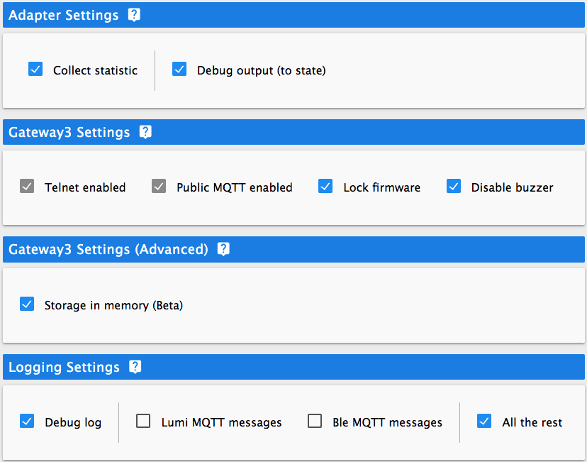
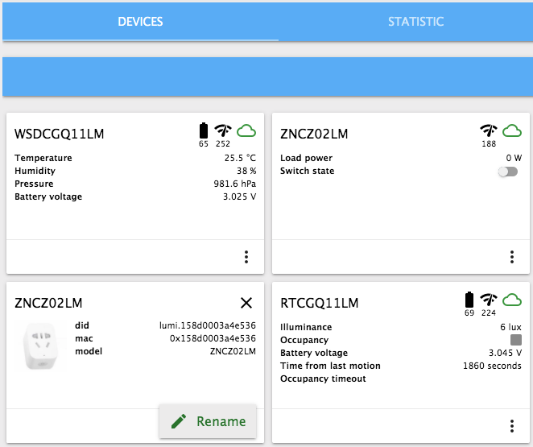
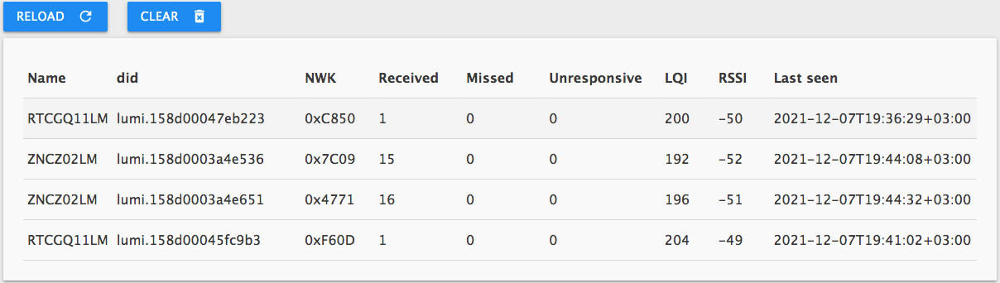

# ioBroker.xiaomi-gateway3

## Xiaomi-Gateway3 ioBroker-Adapter

Dieser Adapter ermöglicht es ioBroker, mit dem Xiaomi Gateway 3 zu kommunizieren und damit Xiaomi-Geräte zu steuern. Die Kommunikation mit dem Gateway erfolgt über das MQTT-Protokoll (der Adapter verbindet sich mit dem integrierten MQTT-Broker). Gateway und Geräte müssen jedoch über Mi Home (Cloud) gekoppelt werden.

## Frühe Version

Der Adapter befindet sich derzeit noch in der Entwicklungsphase, verfügt aber bereits über einsatzbereite Funktionen.

Für eine erfolgreiche Adapterentwicklung ist die Unterstützung der Community, insbesondere beim Testen von Adaptern und Geräten, unerlässlich.

## Danke

Ein Großteil des Codes basiert auf [dem AlexxIT](https://github.com/AlexxIT) -Projekt [XiaomiGateway3](https://github.com/AlexxIT/XiaomiGateway3) und wurde von diesem neu geschrieben.

## Wie können Sie helfen?

Zunächst können Sie den Adapter einfach installieren, ihn verwenden und etwaige Probleme melden.

Wenn Sie viele verschiedene Geräte besitzen, können Sie deren Unterstützung verbessern, indem Sie die entsprechende Option aktivieren.`Debug output (to state)` (siehe unten) und geben Sie mir nach einigen Tagen der Datenerfassung eine Debug-Ausgabe.

## Hardware und Grenzen

Der Adapter unterstützt`Xiaomi Gateway 3 (ZNDMWG03LM and ZNDMWG02LM)` Diese Versionen laufen mit der Original-Firmware:

- `v1.5.0_0026` (darauf aufgebaut)
- `v1.5.0_0102` (ähnlich`1.5.0_0026` (aber nicht getestet)

Sie können das Gateway mit benutzerdefinierter oder Standard-Firmware dieser Versionen flashen: [wiki](https://github.com/AlexxIT/XiaomiGateway3/wiki) .

**_Achtung:_** Firmware-Versionen niedriger als`1.4.7_0000` Der Adapter wird nicht unterstützt und wird es auch zukünftig nicht. Unterstützt werden Versionen unterhalb von`v1.5.0_0026` Nicht garantiert.

## Unterstützte Geräte

- [x] Getestet
- [ ] Nicht getestet

### ZigBee-Geräte

- [ ] Aqara Glühbirne (ZNLDP12LM)
- [ ] Aqara-Taste (WXKG11LM)
- [ ] Aqara Cube (MFKZQ01LM)
- [x] Aqara Vorhang (ZNCLDJ11LM)
- [ ] Aqara Vorhang B1 (ZNCLDJ12LM)
- [ ] Aqara Türschloss S1 (ZNMS11LM)
- [ ] Aqara Türschloss S2 (ZNMS12LM)
- [ ] Aqara Türschloss S2 Pro (ZNMS12LM)
- [x] Aqara Türsensor (MCCGQ11LM)
- [ ] Aqara Doppelwandknopf (WXKG02LM)
- [ ] Aqara Doppelwandknopf D1 (WXKG07LM)
- [ ] Aqara Doppelwandschalter (QBKG03LM,QBKG12LM)
- [ ] Aqara Doppelwandschalter D1 (QBKG22LM,QBKG24LM)
- [ ] Aqara Doppelwandschalter E1 (QBKG39LM,QBKG41LM)
- [ ] Aqara Doppelwandschalter H1 (WS-EUK02)
- [ ] Aqara Doppelwandschalter US (WS-USC04)
- [x] Aqara Bewegungssensor (RTCGQ11LM)
- [ ] Aqara Opple Vier-Tasten (WXCJKG12LM)
- [ ] Aqara Opple MX480 (XDD13LM)
- [ ] Aqara Opple MX650 (XDD12LM)
- [ ] Aqara Opple Sechs-Tasten (WXCJKG13LM)
- [ ] Aqara Opple Zwei-Tasten (WXCJKG11LM)
- [ ] Aqara Stecker (SP-EUC01)
- [ ] Aqara Präzisions-Bewegungssensor (RTCGQ13LM)
- [ ] Aqara Relay (LLKZMK11LM)
- [ ] Aqara Relay T1 (DLKZMK11LM,SSM-U01,SSM-U02)
- [x] Aqara Rollo (ZNGZDJ11LM)
- [ ] Aqara Rollo E1 (ZNJLBL01LM)
- [ ] Aqara Schüttelknopf (WXKG12LM)
- [ ] Aqara Wandtaster (WXKG03LM)
- [ ] Aqara Wandtaster D1 (WXKG06LM)
- [ ] Aqara Einzelwandschalter (QBKG04LM,QBKG11LM)
- [ ] Aqara Wandschalter D1 (QBKG21LM,QBKG23LM)
- [ ] Aqara Einzelwandschalter E1 (QBKG38LM,QBKG40LM)
- [ ] Aqara Einzelwandschalter H1 (WS-EUK01)
- [ ] Aqara-Steckdose (QBCZ11LM)
- [x] Aqara TH-Sensor (WSDCGQ11LM,WSDCGQ12LM)
- [ ] Aqara TVOC Luftqualitätsmonitor (VOCKQJK11LM)
- [ ] Aqara Thermostat S2 (KTWKQ03ES)
- [ ] Aqara Dreifach-Wandschalter D1 (QBKG25LM,QBKG26LM)
- [ ] Aqara Vibrationssensor (DJT11LM)
- [ ] Aqara Wasserlecksensor (SJCGQ11LM)
- [ ] Honeywell Gassensor (JTQJ-BF-01LM/BW)
- [ ] Honeywell Rauchmelder (JTYJ-GD-01LM/BW)
- [ ] IKEA Glühbirne E14 (LED1649C5)
- [ ] IKEA Glühbirne E14 400 lm (LED1536G5)
- [ ] IKEA Glühbirne E27 1000 lm (LED1623G12)
- [ ] IKEA Glühbirne E27 950 lm (LED1546G12)
- [ ] IKEA Glühbirne E27 980 lm (LED1545G12)
- [ ] IKEA Glühbirne GU10 400 lm (LED1537R6, LED1650R5)
- [x] Xiaomi Button (WXKG01LM)
- [x] Xiaomi Türsensor (MCCGQ01LM)
- [ ] Xiaomi Lichtsensor (GZCGQ01LM)
- [ ] Xiaomi Bewegungssensor (RTCGQ01LM)
- [x] Xiaomi Stecker (ZNCZ02LM)
- [ ] Xiaomi Stecker EU (ZNCZ04LM)
- [ ] Xiaomi Plug TW (ZNCZ03LM)
- [ ] Xiaomi Stecker US (ZNCZ12LM)
- [ ] Xiaomi TH-Sensor (WSDCGQ01LM)

### BLE-Geräte

- [ ] Aqara Türschloss N100 (ZNMS16LM)
- [ ] Aqara Türschloss N200 (ZNMS17LM)
- [ ] Honeywell Rauchmelder (JTYJ-GD-03MI)
- [ ] Xiaomi Wecker (CGD1)
- [ ] Xiaomi Türschloss (MJZNMS02LM,XMZNMST02YD)
- [ ] Xiaomi Türsensor 2 (MCCGQ02HL)
- [ ] Xiaomi Flower Care (HHCCJCY01)
- [ ] Xiaomi Blumentopf (HHCCPOT002)
- [ ] Xiaomi Magic Cube (XMMF01JQD)
- [ ] Xiaomi Mückenschutzmittel (WX08ZM)
- [x] Xiaomi Bewegungssensor 2 (RTCGQ02LM)
- [ ] Xiaomi Nachtlicht 2 (MJYD02YL-A)
- [ ] Xiaomi Qingping Türsensor (CGH1)
- [ ] Xiaomi Qingping-Bewegungssensor (CGPR1)
- [ ] Xiaomi Qingping TH Lite (CGDK2)
- [ ] Xiaomi Qingping TH-Sensor (CGG1)
- [ ] Xiaomi Safe (BGX-5/X1-3001)
- [x] Xiaomi TH Uhr (LYWSD02MMC)
- [ ] Xiaomi TH-Sensor (LYWSDCGQ/01ZM)
- [x] Xiaomi TH Sensor 2 (LYWSD03MMC)
- [ ] Xiaomi Zahnbürste T500 (MES601)
- [ ] Xiaomi Wasserlecksensor (SJWS01LM)
- [ ] Xiaomi ZenMeasure Uhr (MHO-C303)
- [x] Xiaomi ZenMeasure TH (MHO-C401)
- [ ] Yeelight Button S1 (YLAI003)

_**Hinweis:** BLE-Geräte verfügen nach dem ersten Koppeln möglicherweise nicht über Statusinformationen, da mir die Gerätespezifikationen noch nicht bekannt sind und ich daher noch nicht für alle Geräte Eigenschaften definiert habe. Statusinformationen werden hinzugefügt, sobald das Gerät die entsprechenden Eigenschaften aktualisiert. Ich hoffe, ich kann dies mit Ihrer Hilfe im Laufe der Zeit beheben._

## Beschreibung einiger Staaten

### `Button long press`

Bei Tastengeräten können Sie eine Kombination aus zwei Zuständen sehen (zum Beispiel):`long_press` Und`long_timeout` Wie funktioniert das? Tasten, die langes Drücken unterstützen, senden beim Drücken und Loslassen eine Nachricht. Manchmal kann es vorkommen, dass eine Taste beim Loslassen keine Nachricht sendet. In diesem Fall`timeout` sollte dazu beitragen, den Zustand "freizugeben".

Standardmäßig`timeout` Zustandswert nicht gesetzt und`long_press` Die Taste wird nach einer Sekunde losgelassen, nachdem Sie sie gedrückt gehalten haben, auch wenn Sie sie noch gedrückt halten. Wenn Sie einstellen`long_timeout` Ein Timeout von -1 wird vollständig ignoriert und der Status wird nur durch eine Nachricht vom Button "freigegeben".

In den meisten Fällen ist es sinnvoll, festzulegen`timeout` auf einen kleinen Wert wie 4 oder 5 Sekunden.

### `Occupancy` Und`Occupancy timeout`

Der RTCGQ11LM und andere Bewegungsmelder weisen nach der Bewegungserkennung eine Verzögerung (Timeout) von 5 bis 60 Sekunden auf (abhängig von Version und Modifikationen). Das bedeutet, dass während dieser Zeit keine weitere Bewegung erkannt werden kann (der Sensor sendet technisch gesehen keine Nachricht).

`occupancy`trifft _**zu**_ , wenn der Sensor eine Bewegung erkennt, und bleibt _**zutreffen**_ .

Ziel von`occupancy_timeout` ist festgelegt`occupancy` wird auf _**„false“**_ gesetzt, wenn der Sensor wieder Nachrichten senden kann. Standardmäßig`occupancy_timeout` ist nicht festgelegt und`occupancy` Nach 60 Sekunden wieder auf _**„false“**_ zurücksetzen. Falls Ihr Sensor eine andere Verzögerung aufweist, ist es besser, diese einzustellen.`occupancy_timeout` bis zu diesem Verzögerungswert.

Wenn Sie die Bewegungserkennung direkt nach dem Erkennen wieder auf _**„false“**_ zurücksetzen möchten, können Sie Folgendes einstellen:`occupancy_timeout` bis zu 1 Sekunde.

## Konfiguration

Um ein Gateway zu verbinden, benötigen Sie die IP-Adresse und das Token des Gateways. Dies können Sie manuell oder über die Cloud tun.

Außerdem müssen Sie den Befehl „telnet open“ auswählen (in den meisten Fällen Option 2). Sie können die Verbindung und Telnet über die Schaltflächen testen.

_Hierbei handelt es sich nicht um einen eigentlichen Ping, sondern eher um eine Überprüfung der Geräteverfügbarkeit._

 

Sie haben mehrere Möglichkeiten, Adapter und Gateway zu konfigurieren.

### Adaptereinstellungen

- [x] **Statistiken sammeln**  Der Adapter erfasst Statistiken über die Nachrichten der ZigBee-Geräte: wie viele empfangen wurden, wie viele verloren gingen usw. Die Statistiken werden im Status jedes Geräts gespeichert und können auf der Registerkarte (über das Seitenmenü) angezeigt werden.  _**Hinweis:** Der Adapter setzt die Statistik beim Neustart zurück._

- [x] **Debug-Ausgabe (zum Status)**  Der Adapter gibt für jedes Gerät einige Debug-Informationen im Status aus.

### Grundlegende Gateway3-Einstellungen

- [x] **Telnet aktiviert**  Standardmäßig aktiviert und muss aktiviert bleiben. Nur zur Information.

- [x] **Öffentliches MQTT aktiviert**  Standardmäßig aktiviert und muss aktiviert bleiben. Nur zur Information.

- [x] **Firmware sperren**  Setzen Sie den Wert auf „true“ (oder „false“), um die Möglichkeit zum Aktualisieren der Gateway-Firmware zu deaktivieren (bzw. zu aktivieren).

- [x] **Summer deaktivieren**  Stellen Sie „true“ ein, um störende Summersignale zu deaktivieren, oder „false“, um alle Signale zu aktivieren.

### Erweiterte Gateway3-Einstellungen

- [x] **Speicherung im Arbeitsspeicher (Beta)**  Verschieben Sie die Gerätedatenbankdateien in den Arbeitsspeicher. Dies kann die Funktion von ZigBee- und Bluetooth-Geräten verbessern. **_Es kann jedoch zu Datenverlust kommen. Die Verwendung erfolgt auf eigene Gefahr._**

### Protokollierungseinstellungen

_**Hinweis:** Um Debug-Meldungen im ioBroker-Protokoll anzuzeigen, müssen Sie Folgendes einstellen:`debug` Protokollierungsstufe für Adapter unter`Instances` Seite (Expertenmodus aktivieren)_

- [x] **Lumi MQTT-Nachrichten**  Aktivieren Sie die Debug-Protokollierung von MQTT-Nachrichten für Lumi (ZigBee)-Geräte.

- [x] **Ble MQTT-Nachrichten**  Aktivieren Sie die Debug-Protokollierung von MQTT-Nachrichten für BLE-Geräte.

- [x] **Der Rest**  Aktivieren Sie die Debug-Protokollierung aller anderen Adaptermeldungen.

- [x] **SPAM schneiden**  Aktivieren Sie die Option zum Ausblenden doppelter Meldungen. Wenn identische Fehlermeldungen mehrmals auftreten, werden sie ausgeblendet und nach einer Stunde als Gesamtzahl angezeigt.

## Registerkartenseite

### Geräte

 

Es gibt Gerätekarten auf`devices` Seite, auf der Sie Informationen über das Gerät und aktuelle Statuswerte einsehen und einige davon steuern können.

Sie können auch ändern`friendly name` des Geräts.

_**Hinweis:** Diese Seite bietet derzeit nur grundlegende Funktionen. Sie wird in Zukunft erweitert._

### Gerätekonfiguration

Sie können verschiedene Optionen zur Konfiguration des Geräts (und seiner Karte) mithilfe einer YAML-Konfiguration festlegen. Die verfügbaren Optionen sind in der folgenden Tabelle beschrieben. Sie können das Gerätekonfigurationsfenster (Fenster mit Texteingabefeld) mit folgendem Befehl aufrufen:`Config` Im Menü auswählen.

#### Gerätekonfigurationsoptionen

| Feld                      | Typ        | Beschreibung                                                                                   |
| ------------------------- | ---------- | ---------------------------------------------------------------------------------------------- |
| Kartenzustände            | Wörterbuch | Dieses Wörterbuch enthält Optionen für Zustände in der Gerätekarte                             |
| Kartenzustände ausblenden | Liste      | Liste der Bundesstaaten (Bundesstaats-IDs), die auf der Gerätekarte ausgeblendet werden müssen |

### Statistik

- Statistiken werden nicht standardmäßig geladen. Sie müssen die Schaltfläche verwenden.`RELOAD` um die Statistik auf der Seite zu aktualisieren.

- Außerdem können Sie die Statistik mit der Schaltfläche löschen.`CLEAR` Dadurch werden die Statistiken nicht wirklich gelöscht. Es werden lediglich die Zustände gelöscht, die Statistiken enthalten. Dies kann hilfreich sein, wenn der Adapter neu gestartet wird, da die ioBroker-Zustände beim Neustart nicht gelöscht werden.

_**Achtung:** Beachten Sie bitte, dass es sich hierbei nicht um eine Statistik der ZigBee-Nachrichten zwischen Gateway und Gerät (ZigBee-Protokollstatistik) handelt. Es ist eine Statistik der Nachrichten, die den Adapter erreichen. Was bedeutet das? Es macht keinen Unterschied, ob das Gateway oder der Adapter selbst (per MQTT) keine Nachrichten vom Gateway empfängt. Sollte der Adapter aus irgendeinem Grund (z. B. bei einem WLAN-Verbindungsproblem) keine Nachrichten vom Gateway empfangen, interpretiert er diese als verloren, obwohl ZigBee selbst weiterhin funktioniert._

## Changelog
<!--
    Placeholder for the next version (at the beginning of the line):
    ### **WORK IN PROGRESS**
-->
### 0.3.6 (2022-06-14)
* Fixes and improvements

### 0.3.5 (2022-05-08)
* Added configuration for devices
* Added cutting SPAM messages at log
* Remove unnecessary `Debug log` option
* Fixes and improvements

### 0.3.4 (2022-02-10)
* Fix issue getting devices from cloud and switch to RC4
* Add devices page
* Other fixes and improvements

### 0.3.3 (2022-01-30)
* Fix lumi temperature and voltage

### 0.3.2 (2022-01-30)
* Bug fixes and code improvements
* Add curtain and buttons support
* Update README

### 0.3.1 (2022-01-17)
* Bug fixes and code improvements
* Improved support firmware 1.5.1_0032 and some devices

### 0.3.0 (2021-12-10)
* Improved adapter logging

### 0.2.0 (2021-12-07)
* Added states classes and rewrote code with using them
* Added tab-page of adapter
* Added zigbee (lumi) devices statistic
* A lot of code improvements

### 0.1.0 (2021-11-09)
* (Evgenii Abramov) Added support for BLE devices (needed tests)
* (Evgenii Abramov) Improvements for zigbee and BLE support
* (Evgenii Abramov) Added output for debug purpose
* (Evgenii Abramov) A lot of code improvements

### 0.0.1-alpha.0 (2021-10-13)
* (Evgenii Abramov) Initial release

## License
MIT License

Copyright (c) 2022 Evgenii Abramov <john.abramov@gmail.com>

Permission is hereby granted, free of charge, to any person obtaining a copy
of this software and associated documentation files (the "Software"), to deal
in the Software without restriction, including without limitation the rights
to use, copy, modify, merge, publish, distribute, sublicense, and/or sell
copies of the Software, and to permit persons to whom the Software is
furnished to do so, subject to the following conditions:

The above copyright notice and this permission notice shall be included in all
copies or substantial portions of the Software.

THE SOFTWARE IS PROVIDED "AS IS", WITHOUT WARRANTY OF ANY KIND, EXPRESS OR
IMPLIED, INCLUDING BUT NOT LIMITED TO THE WARRANTIES OF MERCHANTABILITY,
FITNESS FOR A PARTICULAR PURPOSE AND NONINFRINGEMENT. IN NO EVENT SHALL THE
AUTHORS OR COPYRIGHT HOLDERS BE LIABLE FOR ANY CLAIM, DAMAGES OR OTHER
LIABILITY, WHETHER IN AN ACTION OF CONTRACT, TORT OR OTHERWISE, ARISING FROM,
OUT OF OR IN CONNECTION WITH THE SOFTWARE OR THE USE OR OTHER DEALINGS IN THE
SOFTWARE.

<!--
    npm run release -- -p iobroker --all --dry
-->