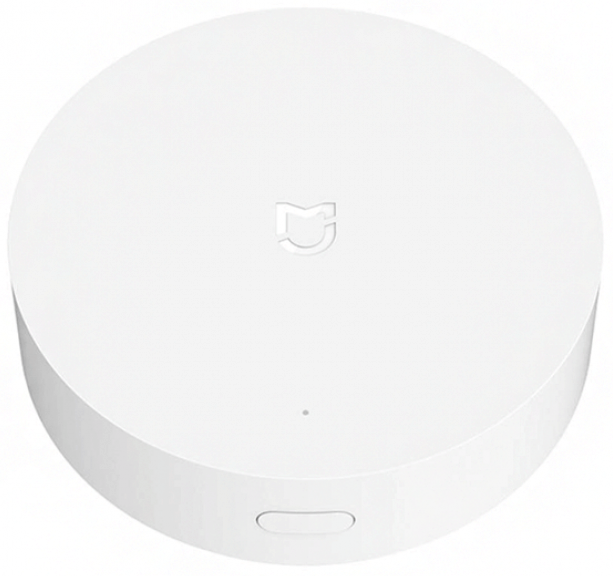

# IoBroker.xiaomi-gateway3

## Xiaomi-gateway3 ioBroker-Adapter
Dieser Adapter ermöglicht es ioBroker, mit Xiaomi Gateway 3 zu kommunizieren und es zur Steuerung von Xiaomi-Geräten zu verwenden.
Der Adapter kommuniziert mit dem Gateway über das MQTT-Protokoll (er verbindet sich mit dem integrierten MQTT-Broker). Allerdings müssen Sie Ihr Gateway und Ihre Geräte mit Mi Home (Cloud) koppeln.

## Frühe Version
Adapter befindet sich derzeit in der Entwicklungsphase. Hat aber bereits einsatzbereite Funktionalität.

Für eine erfolgreiche Adapterentwicklung braucht es Community-Hilfe, hauptsächlich beim Testen von Adaptern und Geräten.

## Danke
Ein großer Teil des Codes basiert auf und wurde neu geschrieben von [AlexxIT](https://github.com/AlexxIT) Projekt [XiaomiGateway3](https://github.com/AlexxIT/XiaomiGateway3)

## Wie kannst du helfen?
Zunächst einmal können Sie den Adapter einfach installieren, verwenden und Probleme melden.

Wenn Sie viele verschiedene Geräte haben, können Sie außerdem helfen, deren Unterstützung zu verbessern, indem Sie die Option `Debug output (to state)` (siehe unten) aktivieren und mir nach einigen Tagen, in denen Debug-Daten gesammelt werden, eine Debug-Ausgabe geben.

## Hardware und Grenzen

Adapter unterstützt `Xiaomi Gateway 3 (ZNDMWG03LM and ZNDMWG02LM)` auf Original-Firmware dieser Versionen:

- `v1.5.0_0026` (darauf entwickelt)
- `v1.5.0_0102` (ähnlich `1.5.0_0026`, aber nicht getestet)

Sie können das Gateway mit benutzerdefinierter oder vorrätiger Firmware in diesen Versionen flashen: [wiki](https://github.com/AlexxIT/XiaomiGateway3/wiki).

__*!!Achtung:*__ Firmware-Versionen niedriger als `1.4.7_0000` Adapter werden und werden nicht unterstützt. Unterstützung von Versionen niedriger als `v1.5.0_0026` nicht garantiert.

## Unterstützte Geräte
- [x] Getestet
- [ ] Nicht getestet

### Zigbee-Geräte
- [ ] Aqara-Birne (ZNLDP12LM)
- [ ] Aqara-Taste (WXKG11LM)
- [ ] Aqara-Würfel (MFKZQ01LM)
- [ ] Aqara-Vorhang (ZNCLDJ11LM)
- [ ] Aqara Vorhang B1 (ZNCLDJ12LM)
- [ ] Aqara Türschloss S1 (ZNMS11LM)
- [ ] Aqara Türschloss S2 (ZNMS12LM)
- [ ] Aqara Türschloss S2 Pro (ZNMS12LM)
- [x] Aqara Türsensor (MCCGQ11LM)
- [ ] Aqara Double Wall Button (WXKG02LM)
- [ ] Aqara Double Wall Button D1 (WXKG07LM)
- [ ] Aqara Doppelwandschalter (QBKG03LM,QBKG12LM)
- [ ] Aqara Doppelwandschalter D1 (QBKG22LM,QBKG24LM)
- [ ] Aqara Doppelwandschalter E1 (QBKG39LM,QBKG41LM)
- [ ] Aqara Doppelwandschalter H1 (WS-EUK02)
- [ ] Aqara Doppelwandschalter US (WS-USC04)
- [x] Aqara-Bewegungssensor (RTCGQ11LM)
- [ ] Aqara Opple Vierknopf (WXCJKG12LM)
- [ ] Aqara Opple MX480 (XDD13LM)
- [ ] Aqara Opple MX650 (XDD12LM)
- [ ] Aqara Opple Sechsknopf (WXCJKG13LM)
- [ ] Aqara Opple Zweiknopf (WXCJKG11LM)
- [ ] Aqara-Stecker (SP-EUC01)
- [ ] Aqara Präzisionsbewegungssensor (RTCGQ13LM)
- [ ] Aqara-Relais (LLKZMK11LM)
- [ ] Aqara Relais T1 (DLKZMK11LM,SSM-U01,SSM-U02)
- [ ] Aqara Rollo (ZNGZDJ11LM)
- [ ] Aqara Rollo E1 (ZNJLBL01LM)
- [ ] Aqara Shake-Taste (WXKG12LM)
- [ ] Aqara Single Wall Button (WXKG03LM)
- [ ] Aqara Single Wall Button D1 (WXKG06LM)
- [ ] Aqara Einzelwandschalter (QBKG04LM,QBKG11LM)
- [ ] Aqara Einzelwandschalter D1 (QBKG21LM,QBKG23LM)
- [ ] Aqara Einzelwandschalter E1 (QBKG38LM,QBKG40LM)
- [ ] Aqara Einzelwandschalter H1 (WS-EUK01)
- [ ] Aqara-Sockel (QBCZ11LM)
- [x] Aqara TH-Sensor (WSDCGQ11LM, WSDCGQ12LM)
- [ ] Aqara TVOC Luftqualitätsmonitor (VOCKQJK11LM)
- [ ] Aqara Thermostat S2 (KTWKQ03ES)
- [ ] Aqara Dreifach-Wandschalter D1 (QBKG25LM,QBKG26LM)
- [ ] Aqara Vibrationssensor (DJT11LM)
- [ ] Aqara Wasserlecksensor (SJCGQ11LM)
- [ ] Honeywell Gassensor (JTQJ-BF-01LM/BW)
- [ ] Honeywell-Rauchsensor (JTYJ-GD-01LM/BW)
- [ ] IKEA Birne E14 (LED1649C5)
- [ ] IKEA Birne E14 400 lm (LED1536G5)
- [ ] IKEA Birne E27 1000 lm (LED1623G12)
- [ ] IKEA Birne E27 950 lm (LED1546G12)
- [ ] IKEA Birne E27 980 lm (LED1545G12)
- [ ] IKEA Glühbirne GU10 400 lm (LED1537R6,LED1650R5)
- [ ] Xiaomi-Taste (WXKG01LM)
- [x] Xiaomi-Türsensor (MCCGQ01LM)
- [ ] Xiaomi Lichtsensor (GZCGQ01LM)
- [ ] Xiaomi-Bewegungssensor (RTCGQ01LM)
- [x] Xiaomi-Stecker (ZNCZ02LM)
- [ ] Xiaomi Stecker EU (ZNCZ04LM)
- [ ] Xiaomi Stecker TW (ZNCZ03LM)
- [ ] Xiaomi-Stecker US (ZNCZ12LM)
- [] Xiaomi TH-Sensor (WSDCGQ01LM)

### BLE-Geräte
- [ ] Aqara Türschloss N100 (ZNMS16LM)
- [ ] Aqara Türschloss N200 (ZNMS17LM)
- [ ] Honeywell-Rauchmelder (JTYJ-GD-03MI)
- [ ] Xiaomi-Wecker (CGD1)
- [] Xiaomi Türschloss (MJZNMS02LM, XMZNMST02YD)
- [] Xiaomi Türsensor 2 (MCCGQ02HL)
- [ ] Xiaomi Blumenpflege (HHCCJCY01)
- [] Xiaomi Blumentopf (HHCCPOT002)
- [] Xiaomi Zauberwürfel (XMMF01JQD)
- [ ] Xiaomi Mückenschutz (WX08ZM)
- [x] Xiaomi-Bewegungssensor 2 (RTCGQ02LM)
- [] Xiaomi Nachtlicht 2 (MJYD02YL-A)
- [] Xiaomi Qingping Türsensor (CGH1)
- [] Xiaomi Qingping Bewegungssensor (CGPR1)
- [] Xiaomi Qingping TH Lite (CGDK2)
- [] Xiaomi Qingping TH-Sensor (CGG1)
- [ ] Xiaomi-Safe (BGX-5/X1-3001)
- [x] Xiaomi TH Uhr (LYWSD02MMC)
- [] Xiaomi TH-Sensor (LYWSDCGQ/01ZM)
- [x] Xiaomi TH-Sensor 2 (LYWSD03MMC)
- [] Xiaomi Zahnbürste T500 (MES601)
- [] Xiaomi Wasserlecksensor (SJWS01LM)
- [ ] Xiaomi ZenMeasure Uhr (MHO-C303)
- [ ] Xiaomi ZenMeasure TH (MHO-C401)
- [ ] Yeelight-Taste S1 (YLAI003)

_**Hinweis:** BLE-Geräte haben möglicherweise beim ersten Mal nach dem Koppeln keinen Status, da ich die Spezifikationen für Geräte nicht kenne und vorerst keine Eigenschaften für alle Geräte definiert habe. Zustände werden hinzugefügt, wenn das Gerät die entsprechende Eigenschaft aktualisiert. Ich hoffe, ich werde dies mit Ihrer Hilfe im Laufe der Zeit beheben._

## Aufbau
Um ein Gateway zu verbinden, benötigen Sie IP und TOKEN des Gateways. Sie können dies manuell oder über die Cloud tun.

_**Achtung:** Es gibt ein Problem beim Abrufen von Geräten aus der Cloud. Ich verstehe noch nicht, ob es sich um ein Problem mit Code oder Cloud handelt, aber Sie sollten vorerst mehrmals versuchen, Geräte zu erhalten (Taste drücken), bis Sie es endlich bekommen._

Außerdem müssen Sie den Telnet-Öffnungsbefehl auswählen (in den meisten Fällen Option Nr. 2). Sie können Verbindung und Telnet über Schaltflächen testen.

*Ping hier nicht wirklich ping. Es ist eher eine Überprüfung der Geräteverfügbarkeit.*

 

Sie haben mehrere Möglichkeiten, Adapter und Gateway zu konfigurieren.

### Adaptereinstellungen
- [x] __Statistik sammeln__ 

Der Adapter sammelt Statistiken über Nachrichten von Zigbee-Geräten: wie viele empfangene, wie viele verpasste usw. Statistiken werden für jedes Gerät gespeichert und können auf der Registerkarte &quot;Registerkarte&quot; (aus dem Seitenleistenmenü) angezeigt werden.  _**Hinweis:** Adapter setzt Statistik beim Neustart zurück._

- [x] __Debug-Ausgabe (zum Status)__ 

Der Adapter gibt für jedes Gerät einige Debug-Informationen in den Zustand aus.

### Grundlegende Gateway3-Einstellungen
- [x] __Telnet aktiviert__ 

Standardmäßig aktiviert und muss aktiviert bleiben. Hier nur zur Info.

- [x] __Öffentliches MQTT aktiviert__ 

Standardmäßig aktiviert und muss aktiviert bleiben. Hier nur zur Info.

- [x] __Firmware sperren__ 

Stellen Sie true (oder false) ein, um die Möglichkeit zum Upgrade der Gateway-Firmware zu deaktivieren (oder zu aktivieren).

- [x] __Summer deaktivieren__ 

Setzen Sie „true“, um störende Summersignale zu deaktivieren, oder „false“, um alle Signale zu aktivieren.

### Erweiterte Gateway3-Einstellungen
- [x] __Speicherplatz (Beta)__ 

Verschieben Sie Geräte-DB-Dateien in den Speicher. Dies kann die Arbeit von Zigbee- und Bluetooth-Geräten verbessern. __*Aber es kann vorkommen, dass einige Daten verloren gehen. Verwendung auf eigene Gefahr.*__

### Protokollierungseinstellungen
- [x] __Debug-Protokoll__ 

Aktivieren Sie die Debug-Protokollierung. Wenn deaktiviert, haben andere Protokollierungsoptionen keine Auswirkung.

- [x] __Lumi MQTT-Nachrichten__ 

Aktivieren Sie die MQTT-Nachrichtenprotokollierung von Lumi (zigbee)-Geräten.

- [x] __Ble MQTT-Nachrichten__ 

Aktivieren Sie die MQTT-Nachrichtenprotokollierung von BLE-Geräten.

- [x] __Alle anderen__ 

Aktivieren Sie alle anderen Adaptermeldungen.

## Registerkarte
### Statistik

- Statistiken werden standardmäßig nicht geladen. Sie müssen die Schaltfläche „RELOAD“ verwenden, um die Statistik auf der Seite zu aktualisieren.

- Sie können die Statistik auch mit der Schaltfläche „LÖSCHEN“ löschen. Dies ist eigentlich keine saubere Statistik, wie sie ist. Sie löschen nur Zustände, die Statistiken enthalten. Dies kann nützlich sein, falls der Adapter neu gestartet wird, da ioBroker-Zustände beim Neustart nicht gelöscht werden.

_**Achtung:** Sie sollten bedenken, dass dies nicht wirklich eine Statistik der Zigbee-Nachrichten zwischen Gateway und Gerät ist (Statistik des Zigbee-Protokolls). Dies ist eine Statistik der Nachrichten, die den Adapter erhalten. Was bedeutet das? Keine Unterschiede für Adapter, Gateway erhält keine Nachricht vom Gerät oder Adapter selbst erhält keine Nachricht vom Gateway (durch MQTT). Und wenn der Adapter in irgendeinem Fall (z. B. Wi-Fi-Verbindungsproblem) keine Nachrichten vom Gateway erhält, interpretiert er diese Nachrichten als verpasst, aber eigentlich ist Zigbee in Ordnung._

## Changelog
<!--
    Placeholder for the next version (at the beginning of the line):
    ### **WORK IN PROGRESS**
-->
### 0.3.1 (2022-01-17)
* Bug fixes and code improvements
* Improved support firmware 1.5.1_0032 and some devices

### 0.3.0 (2021-12-10)
* Improved adapter logging

### 0.2.0 (2021-12-07)
* Added states classes and rewrote code with using them
* Added tab-page of adapter
* Added zigbee (lumi) devices statistic
* A lot of code improvements

### 0.1.0 (2021-11-09)
* (Evgenii Abramov) Added support for BLE devices (needed tests)
* (Evgenii Abramov) Improvements for zigbee and BLE support
* (Evgenii Abramov) Added output for debug purpose
* (Evgenii Abramov) A lot of code improvements

### 0.0.1-alpha.0 (2021-10-13)
* (Evgenii Abramov) Initial release

## License
MIT License

Copyright (c) 2022 Evgenii Abramov <john.abramov@gmail.com>

Permission is hereby granted, free of charge, to any person obtaining a copy
of this software and associated documentation files (the "Software"), to deal
in the Software without restriction, including without limitation the rights
to use, copy, modify, merge, publish, distribute, sublicense, and/or sell
copies of the Software, and to permit persons to whom the Software is
furnished to do so, subject to the following conditions:

The above copyright notice and this permission notice shall be included in all
copies or substantial portions of the Software.

THE SOFTWARE IS PROVIDED "AS IS", WITHOUT WARRANTY OF ANY KIND, EXPRESS OR
IMPLIED, INCLUDING BUT NOT LIMITED TO THE WARRANTIES OF MERCHANTABILITY,
FITNESS FOR A PARTICULAR PURPOSE AND NONINFRINGEMENT. IN NO EVENT SHALL THE
AUTHORS OR COPYRIGHT HOLDERS BE LIABLE FOR ANY CLAIM, DAMAGES OR OTHER
LIABILITY, WHETHER IN AN ACTION OF CONTRACT, TORT OR OTHERWISE, ARISING FROM,
OUT OF OR IN CONNECTION WITH THE SOFTWARE OR THE USE OR OTHER DEALINGS IN THE
SOFTWARE.