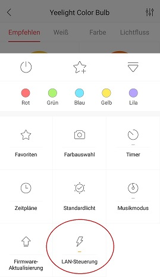

**Dieser Adapter nutzt die Sentry-Bibliotheken, um Ausnahmen und Codefehler automatisch an die Entwickler zu melden.** Weitere Details und Informationen zum Deaktivieren der Fehlerberichterstattung finden Sie in [der Sentry-Plugin-Dokumentation](https://github.com/ioBroker/plugin-sentry#plugin-sentry) ! Die Sentry-Berichterstattung wird ab js-controller 3.0 verwendet.

# ioBroker.yeelight-2

[Deutsche Beschreibung hier](/#/docs/adapterref/iobroker.yeelight-2/README_de.md)

Dieser Adapter steuert Ihre Yeelight-Geräte über Ihr lokales Netzwerk.

## Installation

Um alle Yeelights, die Sie steuern möchten, zu steuern, müssen Sie in den Einstellungen der Yeelight-App die Option „LAN-Steuerung“ aktivieren.

## Konfiguration

Sie können Geräte manuell hinzufügen oder im Netzwerk suchen. Der Standardport ist 55443. Name, IP-Adresse, Port und Smartname können bei Bedarf geändert werden.

### smartname

Wenn Sie einen Smartnamen eingeben, wird das Gerät zur iobroker.cloud hinzugefügt und kann über Alexa gesteuert werden.

### Gerät suchen

Mit dieser Schaltfläche können Sie Ihr Netzwerk nach Geräten durchsuchen. Gefundene Geräte werden der Tabelle hinzugefügt. Die Netzwerksuche dauert etwa 20 Sekunden. Werden keine Geräte gefunden, ist die „LAN-Steuerung“ nicht aktiviert oder die Geräte befinden sich in einem anderen Netzwerk.

### Gerät nicht in der Liste

Falls Ihr Gerät nicht in der Liste aufgeführt ist, z. B. YLTD003, verwenden Sie in diesem Fall eine andere Lampe mit den gleichen Funktionen (Schreibtischlampe, Color-Lampe oder etwas anderes).

## Szene setzen

Anwendung: Mit dieser Methode kann die Smart-LED direkt in einen bestimmten Zustand versetzt werden. Ist das Gerät ausgeschaltet, wird es zuerst eingeschaltet und anschließend der angegebene Befehl ausgeführt.

Parameter: 3 \~ 4.

"class" kann "color", "hsv", "ct", "cf", "auto\_dealy\_off" sein.

- „Farbe“ bedeutet, die intelligente LED auf die angegebene Farbe und Helligkeit einzustellen.
- „hsv“ bedeutet, die Smart-LED auf eine bestimmte Farbe und Helligkeit umzuschalten.
- „ct“ bedeutet, die Smart-LED auf den angegebenen ct-Wert und die angegebene Helligkeit einzustellen.
- "cf" bedeutet, einen Farbfluss auf eine bestimmte Weise zu starten.
- "auto\_delay\_off" bedeutet, die Smart-LED mit der festgelegten Helligkeit einzuschalten und einen Sleep-Timer zu starten, der das Licht nach der festgelegten Zeit wieder ausschaltet.

"val1", "val2", "val3" sind klassenspezifisch.

Anfragebeispiel:

- `["color", 65280, 70]`
- `["hsv", 300, 70, 100]`
- `["ct", 5400, 100]`
- `["cf",0,0,"500,1,255,100,1000,1,16776960,70"]`
- `["auto_delay_off", 50, 5]`

HINWEIS: Wird sowohl im eingeschalteten als auch im ausgeschalteten Zustand akzeptiert.

Für die obigen Beispiele:

- Als erstes sollte die Farbe auf „652280“ und die Helligkeit auf 70 % eingestellt werden.
- Die zweite Möglichkeit besteht darin, die Farbe auf Farbton: 300, Sättigung: 70 und maximale Helligkeit einzustellen.
- Die dritte Möglichkeit besteht darin, die Farbtemperatur auf 5400 K und die Helligkeit auf 100 % einzustellen.
- Der vierte Ansatz besteht darin, einen unendlichen Farbfluss auf zwei Flusstupeln zu starten.
- Der fünfte Tipp ist, das Licht auf 50 % Helligkeit einzustellen und es nach 5 Minuten wieder auszuschalten.

## Changelog

<!--
    Placeholder for the next version (at the beginning of the line):
    ### **WORK IN PROGRESS**
-->

### **WORK IN PROGRESS**
- (copilot) Adapter requires node.js >= 22 now
- (copilot) Adapter requires admin >= 7.7.22 now
- (copilot) Adapter requires admin >= 7.6.17 now

### 1.5.2 (2025-02-28)

-   (Black-Thunder) Incompatibilities with the dependency "joy" have been fixed and "joy" has been updated.

### 1.5.1 (2025-02-26)

-   (mcm1957) Update of joi has been reverted due to incompatibilities.

### 1.5.0 (2025-02-26)

-   (mcm1957) Adapter requires node.js >= 20, js-controller >= 6 and admin >= 6 now
-   (Black-Thunder) Online status for each device has been added (visible in admin object tree).
-   (Black-Thunder) Support for compact mode has been added.
-   (Black-Thunder) Code has been partially refeactored.
-   (mcm1957) Dependencies have been updated

### 1.4.0 (2024-04-29)

-   (mcm1957) Adapter requires node.js >= 18 and js-controller >= 5 now
-   (mcm1957) Dependencies have been updated

### 1.3.1 (2024-02-15)

-   (mcm1957) BREAKING: adapter requires node.js 18 or newer now.
-   (Black-Thunder) Crashes at startup of adapter have been fixed. [#271, #227 and #222]
-   (mcm1957) Testing has been changed to support node 18 and 20
-   (mcm1957) Dependencies have been updated
-   (Apollon77) make sure reconnects work correctly

[Older changelogs can be found there](https://github.com/iobroker-community-adapters/ioBroker.yeelight-2/blob/master/CHANGELOG_OLD.md)

## License

The MIT License (MIT)

Copyright (c) 2024-2026 iobroker-community-adapters <iobroker-community-adapters@gmx.de>  
Copyright (c) 2018-2024 MeisterTR <meistertr.smarthome@gmail.com>, cahek2202 <cahek2202@mail.ru>

Permission is hereby granted, free of charge, to any person obtaining a copy
of this software and associated documentation files (the "Software"), to deal
in the Software without restriction, including without limitation the rights
to use, copy, modify, merge, publish, distribute, sublicense, and/or sell
copies of the Software, and to permit persons to whom the Software is
furnished to do so, subject to the following conditions:

The above copyright notice and this permission notice shall be included in
all copies or substantial portions of the Software.

THE SOFTWARE IS PROVIDED "AS IS", WITHOUT WARRANTY OF ANY KIND, EXPRESS OR
IMPLIED, INCLUDING BUT NOT LIMITED TO THE WARRANTIES OF MERCHANTABILITY,
FITNESS FOR A PARTICULAR PURPOSE AND NONINFRINGEMENT. IN NO EVENT SHALL THE
AUTHORS OR COPYRIGHT HOLDERS BE LIABLE FOR ANY CLAIM, DAMAGES OR OTHER
LIABILITY, WHETHER IN AN ACTION OF CONTRACT, TORT OR OTHERWISE, ARISING FROM,
OUT OF OR IN CONNECTION WITH THE SOFTWARE OR THE USE OR OTHER DEALINGS IN
THE SOFTWARE.