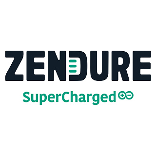

# ioBroker.zendure-solarflow

## Zendure Solarflow-Adapter für ioBroker

Ein ioBroker-Adapter zum Auslesen und Steuern von Zendure Solarflow-Geräten über die Zendure Cloud API sowie lokal über zenSDK (HTTP) oder MQTT für ältere Geräte.

## Spenden

Wenn Ihnen der Adapter gefällt und Sie meine Arbeit unterstützen möchten, freue ich mich über eine Spende via PayPal. Vielen Dank! (Persönlicher Spendenlink für Nograx, unabhängig vom ioBroker-Projekt)

## Merkmale

- Vollständige Telemetriedaten Ihrer Solarflow-Geräte, einschließlich Werte, die in der offiziellen App nicht angezeigt werden (z. B. Batteriespannung).
- Geräte wie mit der offiziellen App steuern – die meisten Einstellungen sind verfügbar.
- Legen Sie Ausgangs-/Eingangsgrenzen für Szenarien ohne Einspeisung ohne Shelly Pro EM fest oder erstellen Sie komplexere Automatisierungen per Skript/Blockly.
- Batterieschutz: Unterbricht die Eingangsleistung, wenn die Batteriespannung zu niedrig ist (erfordert eine über den Adapter einstellbare Ausgangsbegrenzung).
- Mehrere Solarflow-Geräte gleichzeitig steuern, mit präziseren Berechnungen.
- Integrierte Nulleinspeisungsautomatik (PI-gesteuerte, SOC-gewichtete Leistungsverteilung auf mehrere Geräte), gesteuert durch Ihren Netzzähler
- Funktioniert mit allen Zendure Solarflow-Geräten
- **zenSDK** : Lokale HTTP-Steuerung für kompatible Geräte, wobei die Daten weiterhin an die Zendure-Cloud weitergeleitet werden, sodass Sie die volle Kontrolle behalten, falls das Internet oder die Zendure-Server ausfallen.

## Modi

- **Authentifizierung per Cloud-Schlüssel** (empfohlen): die offizielle Zendure-Methode. Sie erhalten einen Cloud-Schlüssel über die App. Standardmäßig wird für kompatible Geräte im selben Netzwerk wie ioBroker das zenSDK verwendet. Dies ermöglicht die volle lokale Kontrolle bei gleichzeitiger Datenübertragung in die Cloud. Auch eine reine Cloud-Nutzung ist möglich. Ältere Geräte, die bereits an einen lokalen MQTT-Server angeschlossen sind, können Daten ebenfalls ohne Nachteile in die Cloud übertragen.
- **Lokal** : Nur lokaler Modus. Verbinden Sie den Adapter mit einem lokalen MQTT-Server für ältere Geräte (siehe unten); zenSDK-Geräte werden über mDNS gefunden.
- **zenSDK-only (mDNS)** : Keine Zendure-Cloud und kein MQTT-Server. Geräte werden per [mDNS-Erkennung](#mdns-discovery) gefunden und ausschließlich lokal über zenSDK abgefragt/gesteuert. Daher werden nur zenSDK-kompatible Geräte unterstützt.

### mDNS Discovery

Wenn zenSDK aktiviert ist, durchsucht der Adapter das Netzwerk über mDNS/Bonjour nach Geräten, die sich als `Zendure-<model>-<serialNumber>` Solange das Netzwerk aktiv ist, wird es nach 5, 15, 30 und 60 Sekunden sowie anschließend alle 5 Minuten erneut abgefragt. So werden auch später verbundene Geräte (oder solche, die bei einer früheren Abfrage nicht erfasst wurden) gefunden, ohne dass der Adapter neu gestartet werden muss. Dadurch werden IP-Adressen bekannter Cloud-Geräte ergänzt oder korrigiert und Zubehör (Mix-Serie, Smart Meter), das keinen Cloud-Produktschlüssel besitzt und daher nicht anderweitig erstellt werden kann, automatisch angelegt. Geräte werden anhand ihrer vollständigen Seriennummer identifiziert, nicht anhand ihrer IP-Adresse oder eines gekürzten Suffixes. Die Funktion kann über die Einstellung „Über mDNS-Erkennung gefundene Geräte hinzufügen“ deaktiviert werden.

## Unterstützte Geräte

### zenSDK-kompatible Geräte ✅ (vollständige lokale Steuerung über HTTP)

> **Zendure empfiehlt** : Verwenden Sie den oben beschriebenen Authentifizierungsmodus mit Cloud-Schlüssel. Dieser ermöglicht die volle lokale Kontrolle bei gleichzeitiger Beibehaltung der Cloud-Verbindung. Die Geräte müssen nicht von der Cloud getrennt werden.

- Solarflow 1600 AC Plus, 2400 AC, 2400 AC Plus, 2400 Pro, 800, 800 Plus, 800 Pro
- Solarflow 3000 Mix AC+, 4000 Mix AC+, 4000 Mix Pro _(noch kein Cloud-Produktschlüssel vorhanden – hinzugefügt nur über [mDNS-Erkennung](#mdns-discovery) )_

### Smart-Meter-Zubehör 📊 (nur lesbar, nur zenSDK/mDNS)

- **Intelligenter Zähler 3CT** – Scheinleistung pro Phase (A/B/C) und gesamt, über Stromwandler
- **Smart Meter D0** – Live-Zählerstände über optische IEC 62056-21-Schnittstelle

### Legacy-Geräte 🔄 (lokaler MQTT-Modus über Zendure Cloud Disconnector)

- HUB 1200, HUB 2000, Hyper 2000, AIO 2400, ACE 1500 – alle unterstützen den lokalen Modus und können weiterhin Daten an die Cloud weiterleiten.

**Vorteile des lokalen Modus:** Es werden keine Daten an Zendure-Server gesendet (die Übertragung per Relay wird empfohlen), direkte/schnellere MQTT-Kommunikation, vollständige Offline-Automatisierung und Cloud-Relay kann jederzeit wieder aktiviert werden. Firmware-Updates über die offizielle App/Bluetooth funktionieren weiterhin.

## Offline-Modus (Verbindung zur Zendure Cloud trennen) für ältere Geräte

⚠️ **Garantiehinweis:** Das direkte Ändern des MQTT-Servers auf dem Gerät (über Bluetooth-Tools oder DNS-Umleitung) wird nicht offiziell unterstützt und **führt zum Verlust der Gerätegarantie** . Die Durchführung erfolgt auf eigene Gefahr.

Um ein älteres Gerät von der Cloud zu trennen, verwenden Sie den [Solarflow Bluetooth Manager](https://github.com/reinhard-brandstaedter/solarflow-bt-manager) von Reinhard Brandstätter oder meinen [Zendure Cloud Disconnector](https://github.com/nograx/zendure-cloud-disconnector) – beide legen die MQTT-URL des Geräts per Bluetooth fest. Alternativ können Sie DNS-Anfragen für „mq.zen-iot.com“ über Ihren Router an Ihren eigenen MQTT-Server umleiten.

**Hinweis:** Diese Bluetooth-Tools funktionieren nur für **ältere Geräte** . Verwenden Sie für **zenSDK** -Geräte stattdessen die offizielle Offline-Methode von Zendure.

Beide Tools erzwingen den Standard-MQTT-Port (1883 oder 8883 mit SSL) und erfordern, dass die Authentifizierung auf Ihrem Server deaktiviert ist, da das Gerät ein fest codiertes Passwort verwendet. Sie können dies mit Ihrem Cloud-Authentifizierungsschlüssel kombinieren oder den vollständigen lokalen Modus verwenden.

## Wichtig

Um das Laden/Einspeisen per Skript oder Blockly zu steuern, verwenden Sie di&#x65;** `setDeviceAutomationInOutLimit` ** Steuerparameter – er steuert das Gerät, ohne in den Flash-Speicher zu schreiben. Negative Werte lösen das Laden über das Stromnetz aus.

## Adapterautomatisierung (Null-Einspeisungssteuerung)

Der Adapter verfügt über einen integrierten Nulleinspeiseregler. Er liest Ihren Netzzähler aus und passt die Einspeisung kontinuierlich an. `setDeviceAutomationInOutLimit` Alle beteiligten Geräte werden so gesteuert, dass die Netzleistung nahe an einem konfigurierbaren Sollwert bleibt – ein externes Skript ist nicht erforderlich. Es funktioniert sowohl mit einzelnen Geräten als auch mit mehreren Geräten gleichzeitig.

### Aufstellen

1. Öffnen Sie die Adaptereinstellungen, Abschnitt **Automatisierung** , und aktivieren Sie **die Option Adapterautomatisierung aktivieren** .
2. Wählen Sie den **Triggerzustand** : einen Zustand Ihres Stromnetzes/Smart Meters mit der aktuellen Netzleistung in Watt ( **positiv = Netzbezug, negativ = Netzeinspeisung** ). Jede Änderung dieses Zustands löst einen Regelzyklus aus, daher sollte er häufig aktualisiert werden (ideal sind 1–5 Sekunden).
3. Speichern – der Adapter startet neu und erstellt die `adapterAutomation` Staaten.
4. Aktivieren Sie die Automatisierung für jedes Gerät, das gesteuert werden soll: `<productKey>.<deviceKey>.adapterAutomation.automationEnabled = true` Die
5. Schalten Sie den globalen Schalter ein. `adapterAutomation.automationEnabled = true` Die

⚠️ Solange die Automatisierung für ein Gerät aktiv ist, schreiben Sie nicht `setDeviceAutomationInOutLimit` Ihre eigenen Skripte für dieses Gerät werden von der Automatisierung überschrieben. Geräte mit `automationEnabled = false` bleiben völlig unberührt.

### Staaten

Global (`zendure-solarflow.X.adapterAutomation.*`):

| Zustand                          | Standard | Beschreibung                                                                                                                                                                                                                                                      |
| -------------------------------- | -------- | ----------------------------------------------------------------------------------------------------------------------------------------------------------------------------------------------------------------------------------------------------------------- |
| `automationEnabled`              | `false`  | Globaler Ein-/Ausschalter für die Automatisierung.                                                                                                                                                                                                                |
| `setPoint`                       | `10`     | Ziel-Netzleistung in W. Ein kleiner positiver Wert (geringe Importmenge) vermeidet die Einspeisung ins Netz.                                                                                                                                                      |
| `setPointNearlyFull`             | `-100`   | Zielnetzleistung in W, verwendet anstelle von `setPoint` Wenn alle Batterien mindestens 90 % geladen sind und Solarstrom eingespeist wird. Negative Werte ermöglichen die Einspeisung ins Stromnetz.                                                               |
| `acOnlyPenalty`                  | `50`     | Der Vorsprung eines AC-only-Geräts wird in Prozent angegeben, um den es gegenüber anderen Geräten erreichen muss, um zum führenden Gerät zu werden, sobald der durchschnittliche Ladezustand (SOC) der anderen Geräte über 35 % liegt. `0` deaktiviert die Strafe. |
| `surplusChargeTrigger`           | `100`    | Netzexport in Watt über den Sollwert hinaus, ab dem im Leerlauf befindliche, nur netzbetriebene Geräte mit Überschussenergie zu laden beginnen. Minimum `30` Die                                                                                                   |
| `ignoreSuggestedInverseMaxPower` | `false`  | Wenn `true`, das Gerät `inverseMaxPower` wird als Maximalwert anstelle des empfohlenen Werts verwendet (siehe unten).                                                                                                                                              |
| `deviceOrder`                    |          | Schreibgeschützt. Aktuelle Gerätereihenfolge, das erste Gerät ist das führende Gerät.                                                                                                                                                                             |

Pro Gerät (`<productKey>.<deviceKey>.adapterAutomation.*`):

| Zustand                        | Beschreibung                                                                                                                                                                                                                                                             |
| ------------------------------ | ------------------------------------------------------------------------------------------------------------------------------------------------------------------------------------------------------------------------------------------------------------------------ |
| `automationEnabled`            | Dieses Gerät in die Automatisierung einbeziehen (Standardeinstellung) `false`).                                                                                                                                                                                          |
| `forceAcCharging`              | Laden Sie dieses Gerät vollständig über das Stromnetz auf. `chargeMaxLimit` bis es voll ist, unabhängig von der aktuellen Nachfrage (Standardeinstellung) `false`).                                                                                                       |
| `acChargingAllowed`            | Nur für Geräte, die über Netzstrom geladen werden können, aber nicht ausschließlich für Netzstrom ausgelegt sind (z. B. SF 800/2400 Pro, Hyper 2000): Laden Sie dieses Gerät mit überschüssigem Netzstrom wie ein reines Netzstromgerät (Standardeinstellung). `false`). |
| `suggestedInverseMaxPower`     | Nur lesbar. Die maximale Ausgangsleistung, die die Automatisierung für dieses Gerät verwendet, wird aus dem Ladezustand (SOC) und der niedrigsten Zellspannung berechnet, um die Batterie zu schützen.                                                                   |
| `suggestedInverseMaxPowerInfo` | Schreibgeschützt. Grund für den aktuell vorgeschlagenen Wert.                                                                                                                                                                                                            |
| `status`                       | Schreibgeschützt. Was die Automatisierung aktuell von diesem Gerät erwartet (z. B. Einspeisung, Standby, Laden aus Überschuss), in der Systemsprache von ioBroker (Deutsch oder Englisch).                                                                               |

### So funktioniert es

- **PI-Regler:** Die benötigte Leistung wird aus dem aktuellen Stromverbrauch (Netzstrom + aktuelle Leistung) zuzüglich einer PI-Korrektur zum Sollwert berechnet. Innerhalb eines kleinen Totbereichs (Sollwert zu Sollwert + 10 W) wird nichts verändert, um ständige Nachjustierungen zu vermeiden.
- **Leistungsverteilung:** Die benötigte Leistung wird gewichtet nach ihrem SoC-Wert auf die aktiven Geräte verteilt – Geräte mit höherem SoC-Wert erhalten einen größeren Anteil. Geräte mit einem niedrigeren SoC-Wert erhalten einen größeren Anteil. `minSoc` Sie erhalten keinen Anteil. Leistung, die ein Gerät nicht liefern kann (über seinem Maximum), wird an Geräte mit ausreichender Leistungsreserve weitergeleitet.
- **Leitgerät:** Die Geräte werden nach Ladezustand (SOC) und Solarstromaufnahme sortiert (Neusortierung stündlich). Das Leitgerät ist immer aktiv; weitere Geräte werden hinzugefügt, wenn der Bedarf steigt (über 70 % Auslastung der aktiven Geräte) oder wenn diese fast voll sind. Nach dem Hinzufügen bleiben die Geräte mindestens 5 Minuten aktiv, um ein Flattern zu vermeiden. Inaktive Geräte werden für einige Minuten im 10-W-Standby-Modus gehalten, um eine schnellere Reaktion zu ermöglichen.
- **Batterieschutz:** `suggestedInverseMaxPower` Die Leistung wird bei niedrigem Ladezustand (SOC) bzw. niedriger Zellspannung begrenzt (z. B. nur 60–500 W bei schwachen Zellen). Nachts (0–5 h) wird die Leistungsbegrenzung vom Ladezustand abgeleitet. Sie überschreitet niemals die maximale Leistung des Geräts. `inverseMaxPower` Die
- **Netzbetriebene Geräte** (z. B. SF 2400 AC, SF 1600 AC+, SF 3000/4000 Mix AC+) werden weniger bevorzugt als Hauptgerät eingesetzt, sobald die anderen Batterien über 35 % geladen sind. Wenn der Netzzähler einen Überschuss anzeigt (mindestens 35 % eingespeiste Energie), …`surplusChargeTrigger` W über dem Sollwert (Standardwert 100 W), im Leerlauf befindliche AC-Geräte (und Geräte mit `acChargingAllowed`) mit diesem Überschuss belasten, bis zu ihrem `chargeMaxLimit` (Leistung in W).
- **Ladesicherheit:** Das Gerät schaltet erst dann in den Lademodus, wenn es mindestens 5 Minuten lang mit 0 W im Leerlauf war. Es wechselt also nicht direkt zwischen Entladen und Laden.

## Anmerkungen

Dieser Adapter authentifiziert sich auf den offiziellen MQTT-Servern mithilfe des Cloud-Autorisierungscodes, den Sie in der Zendure-App generieren können.

### Sentry (Fehlerberichterstattung und Gerätestatistik)

Dieser Adapter nutzt Sentry-Bibliotheken, um Ausnahmen und Codefehler automatisch an den Entwickler zu melden. Zusätzlich sendet er 5 Minuten nach dem Start und anschließend alle 24 Stunden anonyme Gerätestatistiken: ein Ereignis pro verwendeter Geräteklasse, das lediglich Geräteklasse, Produktschlüssel, Produktname und Verbindungsmodus enthält. Es werden keine Geräteschlüssel, Seriennummern, IP-Adressen oder Anmeldeinformationen übertragen. Diese Statistiken helfen dabei, die verwendeten Geräte zu erkennen und fehlende Unterstützung aufzudecken.

Weitere Details und Informationen zur Deaktivierung der Fehlerberichterstattung finden Sie in der [Dokumentation des Sentry-Plugins](https://github.com/ioBroker/plugin-sentry#plugin-sentry) . Die Sentry-Fehlerberichterstattung wird ab js-controller 3.0 verwendet.

<!--
    Placeholder for the next version (at the beginning of the line):
    ### **WORK IN PROGRESS**
-->

### 6.0.0-alpha.4 (2026-10-01)

- Null-Einspeisung: Geräte ohne Blei-Zufuhr werden nicht mehr aus dem Leerlauf in den 30/10-W-Standby-Modus für einen geringen Anteil geschaltet, und vollständig geladene Geräte ohne Solarstromzufuhr werden aus dem Standby-Modus auf 0 W freigegeben.
- Null-Einspeisung: Geräte werden nicht mehr als zusätzliche Einspeisegeräte hinzugefügt, nur weil sie eine Solareingangsleistung von mehr als 100 W haben.

### 6.0.0-alpha.3 (2026-10-01)

- Die Reduzierung des vorgeschlagenen inverseMaxPower um 0-5 Stunden wurde entfernt, da dies mit Octopus Energy in der persönlichen Konfiguration zusammenhing.

### 6.0.0-alpha.2 (2026-10-01)

- Verbesserungen bei Nullzufuhr

### 6.0.0-alpha.1 (2026-09-30)

- Behebt das Problem, dass setDeviceAutomationInOutLimit auf Geräten ohne zenSDK bei Verwendung von Automatisierung nicht korrekt gesetzt wird.

### 6.0.0-alpha.0 (2026-09-30)

- Fügen Sie die Adapterautomatisierung (Null-Einspeisungssteuerung) hinzu, siehe Abschnitt „Adapterautomatisierung“ oben.
- Verbindungsmodus hinzufügen "zenSDK only (mDNS)": Keine Zendure-Cloud und kein MQTT-Server, Geräte werden über mDNS gefunden und über zenSDK gesteuert.
- Die mDNS-Erkennung läuft nun so lange, wie der Adapter in Betrieb ist, anstatt nur 10 Sekunden nach dem Start. Später angeschlossene Geräte werden automatisch hinzugefügt, IP-Änderungen werden erkannt und fehlgeschlagene zenSDK-Verbindungen werden wiederholt.
- Behebung des Problems, wenn Zendure Cloud beim Start nicht erreichbar ist, indem die gespeicherte Geräteliste verwendet wird.
- Über mDNS erstellte Geräte behalten ihren Status, wenn sie später in der Zendure-Cloud-Geräteliste erscheinen (Cloud-MQTT funktioniert weiterhin für sie). Geräte mit einem unbekannten Produktschlüssel in der Cloud-Geräteliste werden als Information und nicht als Fehler protokolliert.
- Die MQTT-Clients werden beim Anhalten oder Neustarten des Adapters ordnungsgemäß getrennt.
- Sentry (Standard-ioBroker) wurde für Fehlerberichte und Gerätestatistiken hinzugefügt.

Ältere Änderungen sind in der Datei CHANGELOG\_OLD.md beschrieben.

## License

MIT License

Copyright (c) 2026 Peter Frommert <peter.frommert@outlook.com>

Permission is hereby granted, free of charge, to any person obtaining a copy
of this software and associated documentation files (the "Software"), to deal
in the Software without restriction, including without limitation the rights
to use, copy, modify, merge, publish, distribute, sublicense, and/or sell
copies of the Software, and to permit persons to whom the Software is
furnished to do so, subject to the following conditions:

The above copyright notice and this permission notice shall be included in all
copies or substantial portions of the Software.

THE SOFTWARE IS PROVIDED "AS IS", WITHOUT WARRANTY OF ANY KIND, EXPRESS OR
IMPLIED, INCLUDING BUT NOT LIMITED TO THE WARRANTIES OF MERCHANTABILITY,
FITNESS FOR A PARTICULAR PURPOSE AND NONINFRINGEMENT. IN NO EVENT SHALL THE
AUTHORS OR COPYRIGHT HOLDERS BE LIABLE FOR ANY CLAIM, DAMAGES OR OTHER
LIABILITY, WHETHER IN AN ACTION OF CONTRACT, TORT OR OTHERWISE, ARISING FROM,
OUT OF OR IN CONNECTION WITH THE SOFTWARE OR THE USE OR OTHER DEALINGS IN THE
SOFTWARE.