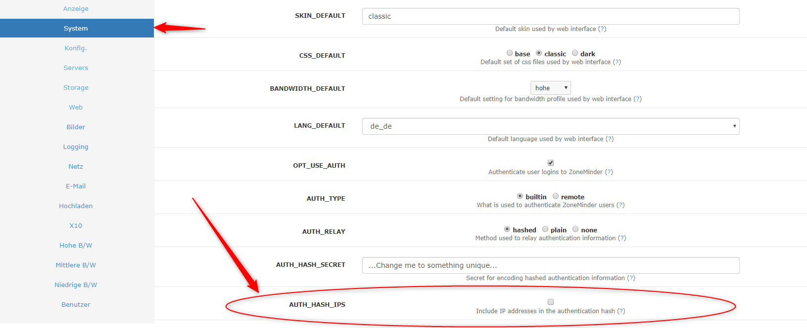

# ioBroker.zoneminder

## ZoneMinder-Adapter für ioBroker

Verbindung zu Ihrem Zoneminder.

## Erste Schritte

Geben Sie Ihren Host ein, z. B. ' <http://zoneminder/zm> '. Benutzername und Passwort bleiben unverändert 'admin'. Wenn Sie keine Authentifizierung verwenden, ändern Sie Benutzername und Passwort nicht.

Das Geräteintervall dient der Überprüfung neuer Kameras und einiger grundlegender Informationen. Der Wert wird in Sekunden angegeben. Das Überwachungsintervall dient der Überprüfung von Warnmeldungen und wird ebenfalls in Sekunden angegeben.

Wenn Sie Benachrichtigungen erhalten möchten, installieren Sie bitte zmEventNotification auf Ihrem ZoneMinder und aktivieren Sie es in den ioBroker-Einstellungen.

### Zoneminder-Einstellungen

Damit der Kamera-URL-Link mit Benutzername und Passwort funktioniert, müssen Sie AUTH\_HASH\_IPS in den Einstellungen deaktivieren.

## Changelog
<!--
    Placeholder for the next version (at the beginning of the line):
    ### **WORK IN PROGRESS**
-->
### **WORK IN PROGRESS**
- (copilot) Adapter requires admin >= 7.7.22 now
- (copilot) Adapter requires js-controller >= 6.0.11 now
- (copilot) Adapter requires admin >= 7.6.17 now
* (mcm1957) Adapter requires node.js >= 18 and js-controller >= 5 now
* (mcm1957) Dependencies have been updated

### 0.3.3 (12.11.2019)
* (MeisterTR) error fixes, fix login error, fixes for latest
* (MeisterTR) add ZmEvents
* (MeisterTR) Select moniorfunction and disable/enable monitor
### 0.2.1
* (MeisterTR) add info states
* (MeisterTR) add camera-link with auth-key
* (MeisterTR) cange video link
### 0.1.0
* (MeisterTR) First running version
### 0.0.1
* (MeisterTR) initial release

## License
MIT License

Copyright (c) 2023-2026 iobroker-community-adapters <iobroker-community-adapters@gmx.de>  
Copyright (c) 2019 MeisterTR <meistertr.smarthome@gmail.com>

Permission is hereby granted, free of charge, to any person obtaining a copy
of this software and associated documentation files (the "Software"), to deal
in the Software without restriction, including without limitation the rights
to use, copy, modify, merge, publish, distribute, sublicense, and/or sell
copies of the Software, and to permit persons to whom the Software is
furnished to do so, subject to the following conditions:

The above copyright notice and this permission notice shall be included in all
copies or substantial portions of the Software.

THE SOFTWARE IS PROVIDED "AS IS", WITHOUT WARRANTY OF ANY KIND, EXPRESS OR
IMPLIED, INCLUDING BUT NOT LIMITED TO THE WARRANTIES OF MERCHANTABILITY,
FITNESS FOR A PARTICULAR PURPOSE AND NONINFRINGEMENT. IN NO EVENT SHALL THE
AUTHORS OR COPYRIGHT HOLDERS BE LIABLE FOR ANY CLAIM, DAMAGES OR OTHER
LIABILITY, WHETHER IN AN ACTION OF CONTRACT, TORT OR OTHERWISE, ARISING FROM,
OUT OF OR IN CONNECTION WITH THE SOFTWARE OR THE USE OR OTHER DEALINGS IN THE
SOFTWARE.