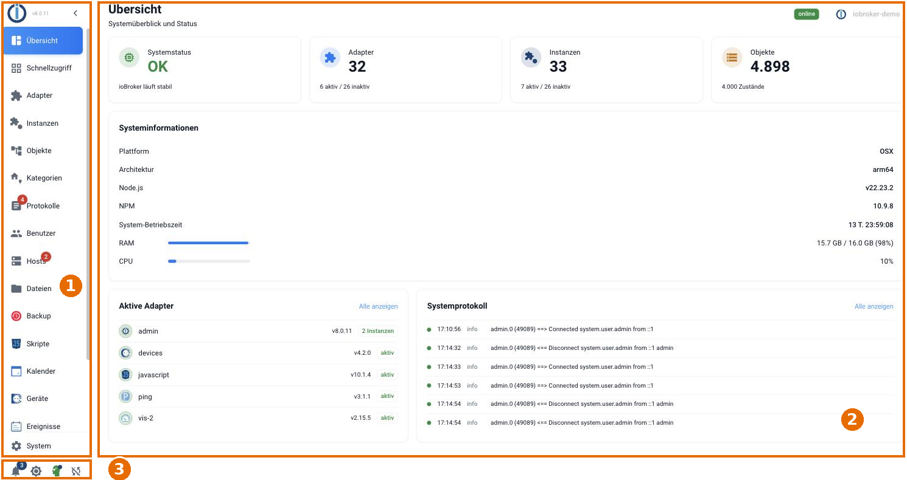
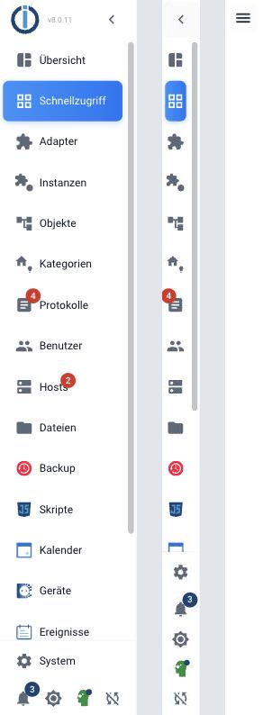
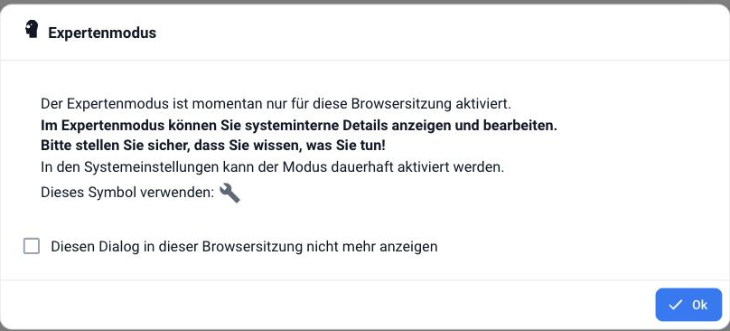

# Die Benutzer-Oberfläche

Der Adapter **admin** ist der grundlegende Adapter und dient zur Bedienung der gesamten
ioBroker-Installation. Er stellt ein Webinterface zur Verfügung, das unter
`http://<IP-Adresse des Servers>:8081` aufgerufen wird.

Dieser Adapter wird bereits bei der Installation von ioBroker angelegt, eine manuelle
Installation ist nicht notwendig.

?> Diese Seite ist eine Übersicht. Die ausführlichen Beschreibungen stehen auf den
Seiten, die in den einzelnen Abschnitten verlinkt sind.

## Aufbau

Die Oberfläche teilt sich in drei Bereiche: **1** die Menüleiste, **2** das Hauptfenster
und **3** die Symbolleiste am unteren Rand der Menüleiste.

## 1 Menüleiste

Die Menüleiste führt zu den einzelnen Seiten des Admin. In einer frischen Installation
sind das:

| Menüpunkt | Inhalt |
| --------- | ------ |
| [Übersicht](/docs/admin/overview.md) | Systemstatus, Hardware-Daten des Hosts, aktive Adapter und die letzten Protokollzeilen. |
| [Schnellzugriff](/docs/admin/overview.md) | Kacheln zu allen Adaptern mit eigener Weboberfläche sowie zu den Hosts. |
| [Adapter](/docs/admin/adapter.md) | Verfügbare und installierte Adapter, Installation und Update. |
| [Instanzen](/docs/admin/instances.md) | Die angelegten Instanzen mit ihrer Konfiguration, starten und stoppen. |
| [Objekte](/docs/admin/objects.md) | Der Objektbaum mit allen Geräten, Kanälen und Datenpunkten. |
| [Kategorien](/docs/admin/enums.md) | Räume, Gewerke und Favoriten. Früher hieß dieser Punkt "Aufzählungen". |
| [Protokolle](/docs/admin/log.md) | Das Logfile. Bei einem Fehler wird der Menüpunkt rot markiert. |
| [Benutzer](/docs/admin/users.md) | Benutzer und Gruppen samt ihrer Rechte. |
| [Hosts](/docs/admin/hosts.md) | Die Rechner, auf denen ioBroker läuft. Liegt eine neue js-controller-Version vor, erscheint hier ein Hinweis. |
| [Dateien](/docs/admin/files.md) | Der Dateimanager für die von ioBroker verwalteten Dateien. |
| [Backup](/docs/config/backup.md) | Sicherungen anlegen, ansehen und zurückspielen. |

Weitere Menüpunkte kommen mit den installierten Adaptern dazu, zum Beispiel *Skripte*
(javascript), *Kalender* (fullcalendar), *Geräte* (devices) oder *Ereignisse* (eventlist).
Ganz unten steht **System**: dort werden die
[Systemeinstellungen](/docs/admin/settings.md)
vorgenommen.

### Menü verkleinern

Über den Pfeil links oben lässt sich die Menüleiste umschalten. Sie hat drei Zustände:
mit Beschriftung, nur mit Symbolen und ganz ausgeblendet. Im ausgeblendeten Zustand
holt man sie über das Symbol mit den drei Strichen wieder hervor. Auf kleinen Bildschirmen
bleibt so mehr Platz für das Hauptfenster.

## 2 Hauptfenster

Das Hauptfenster zeigt den Inhalt des jeweils ausgewählten Menüpunkts. Was dort im
Einzelnen zu sehen ist, steht auf den in der Tabelle oben verlinkten Seiten.

?> Werte werden im Objektbaum in **roter Schrift** angezeigt, solange sie vom Empfänger
noch nicht bestätigt wurden (`ack = false`).

## 3 Symbolleiste

Am unteren Rand der Menüleiste stehen vier Schalter:

| Symbol | Funktion |
| ------ | -------- |
| Glocke | **Benachrichtigungen** des Systems. Die Zahl daneben nennt die ungelesenen Meldungen. |
| Kontrast | **Farbthema ändern**: schaltet zwischen den Farbthemen um (siehe unten). |
| Zauberhut | **Expertenmodus umschalten**. Er blendet zusätzliche Objekte, Einstellungen und Spalten ein und gilt nur in dieser Browsersitzung. |
| Verbundene Fenster | **Einstellungen zwischen allen geöffneten Browserfenstern synchronisieren**. |

?> Viele Beschreibungen in dieser Dokumentation setzen den Expertenmodus voraus. Wenn
eine beschriebene Schaltfläche fehlt, lohnt sich zuerst ein Blick auf diesen Schalter.

Der Expertenmodus gilt nur für die laufende Browsersitzung. Dauerhaft eingeschaltet
wird er in den
[Systemeinstellungen](/docs/admin/settings.md).

### Farbthemen

Der Kontrast-Schalter wechselt das Farbthema. Zur Wahl stehen **modernLight** und
**modernBlue**. Beide zeigen dieselben Inhalte, sie unterscheiden sich nur in den Farben.

?> Das Farbthema gilt pro Browser, nicht pro Benutzer. Wer den Admin von mehreren
Geräten aus benutzt, stellt es auf jedem einzeln ein.
