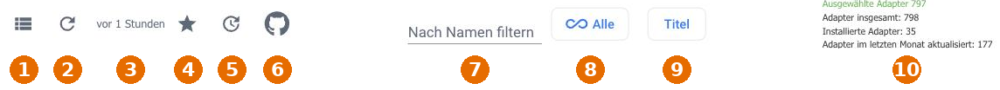
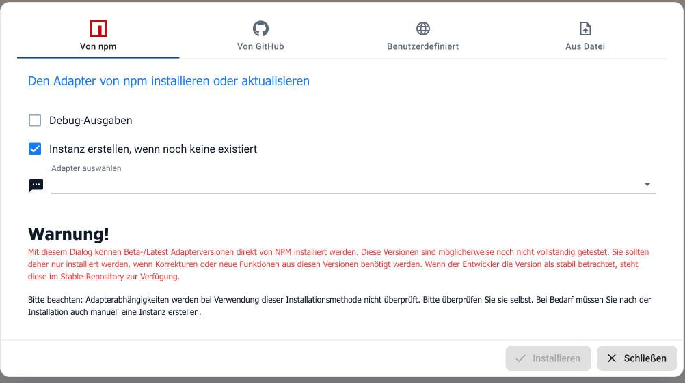

# Reiter Adapter

Hier stehen alle Adapter, die es für ioBroker gibt – die installierten und die
über 800 verfügbaren. Von hier aus werden Adapter installiert, aktualisiert und
wieder entfernt.

?> Ein Adapter ist zunächst nur das Programm. Damit er etwas tut, braucht er eine
**Instanz**. Die wird ebenfalls hier angelegt und dann im Reiter
[Instanzen](https://www.iobroker.net/#de/documentation/admin/instances.md)
konfiguriert.

## Die Werkzeugleiste

| Nr. | Funktion |
| --- | -------- |
| 1 | **Ansichtsmodus ändern** – schaltet zwischen Kachel- und Listenansicht um. |
| 2 | **Adapter auf Updates überprüfen.** Beim Start des Admin geschieht das ohnehin; hier lässt es sich von Hand anstoßen. |
| 3 | **Repository-Zeitstempel.** Wann die Adapterliste erstellt und zuletzt geladen wurde. |
| 4 | **Nur installierte Adapter anzeigen.** |
| 5 | **Nur Adapter mit Update anzeigen.** |
| 6 | **Installieren aus eigener Quelle** (siehe unten). |
| 7 | **Nach Namen filtern.** |
| 8 | **Kategorie wählen** – Beleuchtung, Energie, Kommunikation und so weiter. |
| 9 | **Sortierung** – Titel, Name, Beliebte zuerst, Kürzlich aktualisiert, Kürzlich erstellt. |
| 10 | Die Zählerspalte. Ein Klick darauf öffnet die Statistik: verfügbare, installierte und im letzten Monat aktualisierte Adapter. |

?> Steht über der Liste eine gelbe Warnung, dass das aktuelle Repository das
*Latest (Beta) Repository* ist, liefert ioBroker Vorabversionen aus. Für ein
System, das zuverlässig laufen soll, gehört dort *Stable*. Umgestellt wird das
in den [Systemeinstellungen](https://www.iobroker.net/#de/documentation/admin/settings.md).

## Die Kachelansicht

Jeder Adapter bekommt eine Kachel mit Name, Beschreibung, Zahl der Instanzen
sowie verfügbarer und installierter Version. Der Knopf mit den drei Punkten
dreht die Kachel um; auf der Rückseite stehen die Befehle:

| Nr. | Funktion |
| --- | -------- |
| 1 | **Instanz hinzufügen.** Ist der Adapter noch nicht installiert, wird er dabei installiert. |
| 2 | **Richtlinie für automatische Upgrades** für diesen Adapter. |
| 3 | **Liesmich** – öffnet die Dokumentation des Adapters. |
| 4 | **Dateiupload.** |
| 5 | **Adapter löschen.** Vorhandene Instanzen und deren Objekte gehen dabei verloren. |
| 6 | **Eine bestimmte Version installieren** – zum Beispiel um auf eine ältere zurückzugehen. |

Die kleinen Zeichen unter dem Adapternamen beschreiben, **wie** der Adapter
arbeitet – nicht seinen Installationszustand:

| Zeichen | Bedeutung |
| ------- | --------- |
| Durchgestrichene Wolke | Der Adapter kommt ohne Cloud aus, er spricht direkt mit dem Gerät. |
| Wolke | Der Adapter braucht den Cloud-Dienst des Herstellers. |
| Pfeil nach unten (*push*) | Das Gerät meldet Änderungen von sich aus. |
| Pfeil nach oben (*poll*) | ioBroker fragt das Gerät regelmäßig ab. |
| Grüne Berge | Der Adapter meldet Abstürze über Sentry an seinen Entwickler. |

?> *push* ist der angenehmere Fall: Werte kommen sofort an, ohne dass ioBroker
im Sekundentakt nachfragen muss.

## Die Listenansicht

In der Liste sind die Adapter nach Kategorien gruppiert. Jede Zeile zeigt die
installierte und die verfügbare Version sowie die Lizenz, rechts stehen
dieselben Befehle wie auf der Kachelrückseite.

Diese Ansicht eignet sich gut zum Stöbern: Die Kopfzeile jeder Gruppe nennt, wie
viele Adapter der Kategorie bereits installiert sind.

## Aus eigener Quelle installieren

Der Knopf mit dem Octocat öffnet einen Dialog mit vier Wegen:

* **Von npm** – eine Beta- oder Latest-Version direkt aus npm.
* **Von GitHub** – die neueste Vorabversion aus dem Repository des Entwicklers.
* **Benutzerdefiniert** – eine beliebige URL.
* **Aus Datei** – ein lokal vorliegendes Paket.

!> Diese Wege umgehen das geprüfte Repository. Die Versionen sind
möglicherweise nicht fertig getestet, und **Abhängigkeiten werden dabei nicht
geprüft**. Auf einem System, das laufen muss, nur benutzen, wenn eine Korrektur
dringend gebraucht wird – sonst auf die stabile Version warten.

Die Option *Instanz erstellen, wenn noch keine existiert* ist voreingestellt.
Wird sie abgewählt, muss die Instanz hinterher von Hand angelegt werden.
