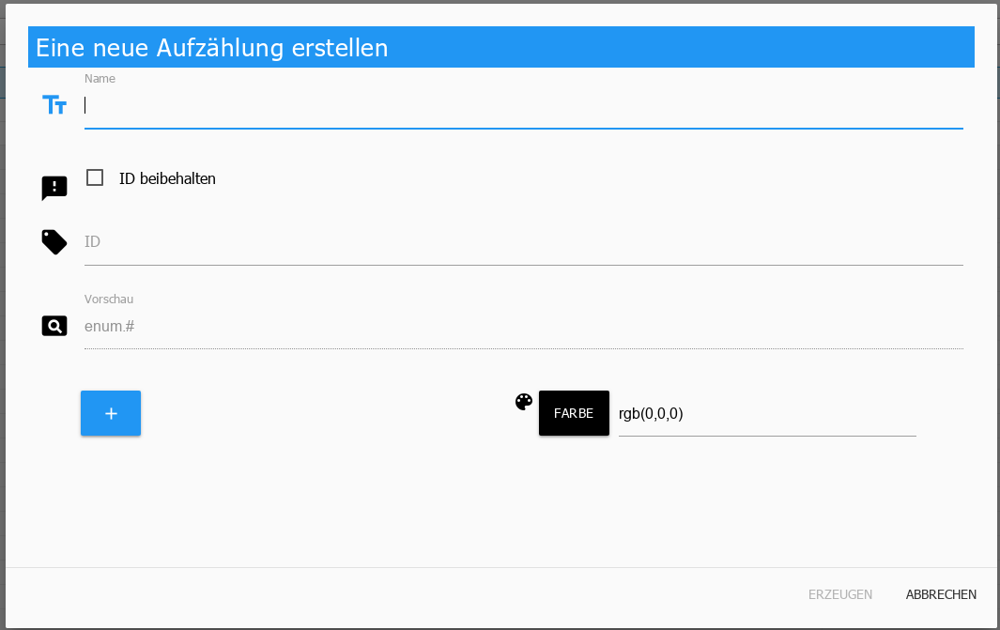
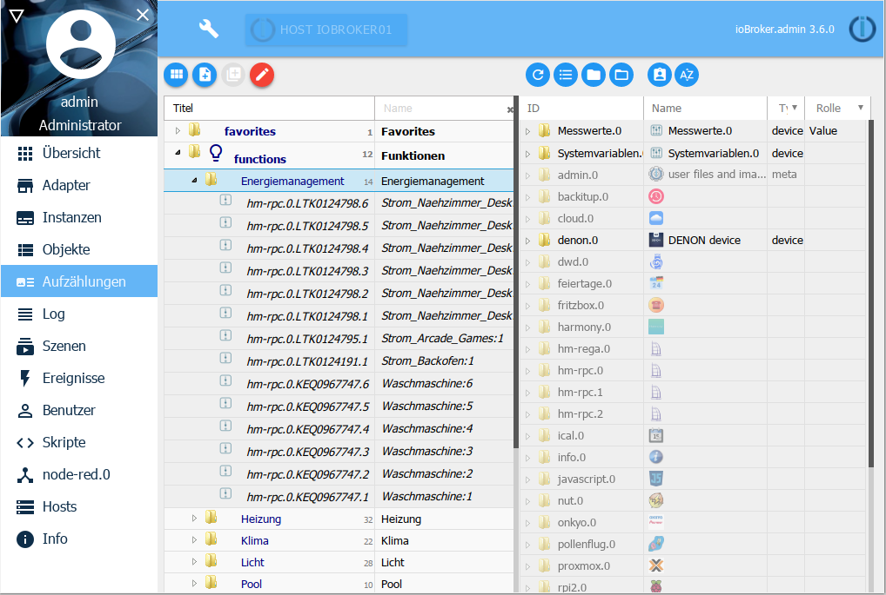

Hier werden die Favoriten, Gewerke und Räume aufgelistet. Gibt es eine 
HomeMatic Installation werden die dort enthaltenen Aufzählungen übernommen. 
Es können auch eigene Aufzählungen angelegt werden, die dann z.B. in 
Scripts verwendet werden können.

Über das erste Icon in der Titelzeile kann in die Listenansicht umgeschaltet 
werden. Diese Ansicht wird im folgenden verwendet:

 

## Die Titelzeile

in der Titelzeile befinden sich Icons für die wichtigsten Vorgänge. Zu jedem 
Icon gibt es eine Kontexthilfe. Dazu einfach mit der Maus eine Weile auf dem 
Icon bleiben.

### 1 - Umschalten der Ansicht

Mit diesem Button kann zwischen Kachelansicht und Listenansicht umgeschaltet 
werden (Toggle-Funktion)
 

### 2 - Neue Aufzählung erstellen

Mit diesem Button wird eine neue Aufzählung angelegt. Dazu öffnet sich ein 
neues Fenster

 

**Name**

Hier wird der gewünschte Name für die Aufzählung eingegeben. Optional kann 
zusätzlich hier auch ein Icon für diese Aufzählung per Drag and Drop in dieses 
Feld gezogen werden.

**ID beibehalten**

Diese Checkbox ist bei der Erstellung einer neuen Aufzählung standardmäßig 
abgewählt, da hier eine neue ID angelegt wird. 

Im Editiermodus (s.u.) einer bestehenden Aufzählung kann so der Name verändert
werden ohne die ID zu verändern.

**Vorschau**

Hier wird die komplette ID der Aufzählung angezeigt.

**Farbe**

An dieser Stelle kann eine Farbe ausgewählt werden mit der die Aufzählung 
markiert werden soll.

In der Kachelansicht wird die Kachel in dieser Farbe eingefärbt, in der 
Listenansicht wird die Zeile mit der Bezeichnung der Aufzählung in dieser 
Farbe unterstrichen.
 

### 3 - Neue Kategorie erstellen

Mit diesem Button wird analog zu einer Aufzählung eine neue Kategorie (wie 
functions/rooms usw.) angelegt.

### 4 - Editieren

Über diesen Button können die Datenpunkte einer Aufzählung verwaltet werden. 
Zuerst wird per Mausklick die gewünschte Aufzählung markiert und anschließend
der Editiermodus aktiviert.

Der Bildschirm wird jetzt zweigeteilt:

Der Aufbau der rechten Hälfte entspricht dem der [Objekte-Seite][].

Datenpunkte können von der rechten Seite durch einfaches Ziehen in die gewünschte 
Aufzählung auf der linken Seite gezogen werden.

Das Löschen eines Datenpunktes in der Aufzählung erfolgt über das Mülleimer-Icon.

[Objekte-Seite]: https://www.iobroker.net/#de/documentation/admin/objects.md
