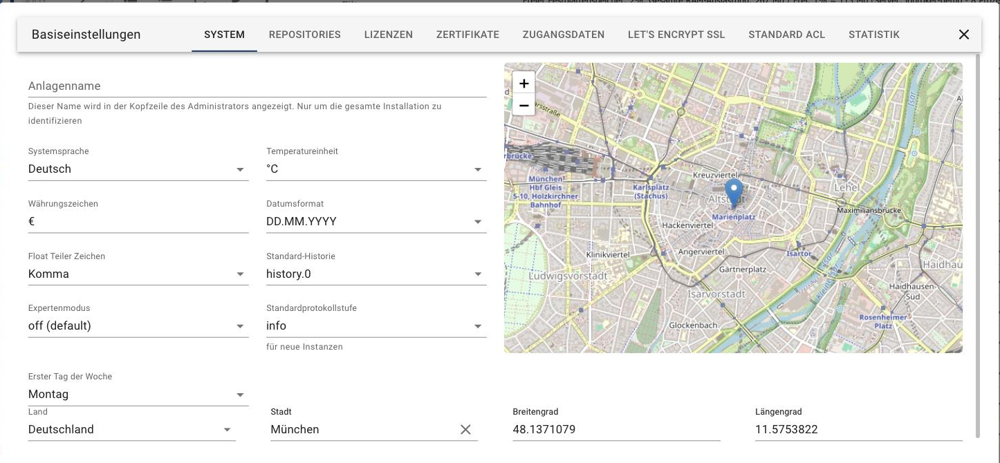
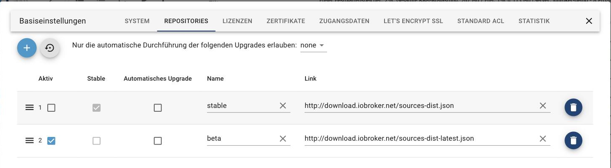
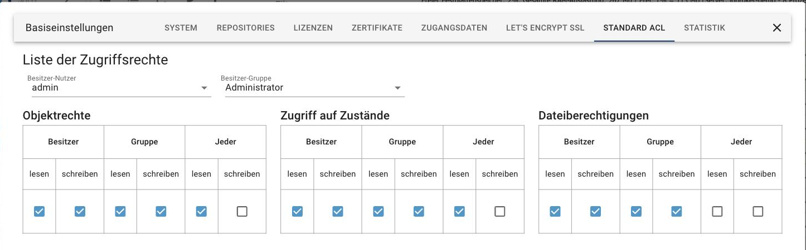

# Systemeinstellungen

Die Systemeinstellungen gelten für die ganze Installation. Sie werden über den
Punkt **System** ganz unten in der Menüleiste geöffnet und sind in mehrere
Reiter unterteilt.

## System

Hier stehen die Grundeinstellungen, auf die sich auch die Adapter beziehen.



| Einstellung | Bedeutung |
| ----------- | --------- |
| **Anlagenname** | Erscheint in der Kopfzeile des Admin. Sinnvoll, wenn mehrere ioBroker-Installationen betreut werden. |
| **Systemsprache** | Die Sprache der Oberfläche. Nicht jeder Adapter ist vollständig übersetzt. |
| **Temperatureinheit** | °C oder °F. Manche Adapter richten sich danach. |
| **Währungszeichen** | Zum Beispiel `€`. |
| **Datumsformat** | Gilt für Admin und vis. |
| **Float Teiler Zeichen** | Komma oder Punkt bei Kommazahlen. |
| **Standard-Historie** | Welche Instanz Werte aufzeichnet, wenn mehrere von history, SQL oder InfluxDB installiert sind. |
| **Expertenmodus** | Ob der Expertenmodus beim Öffnen des Admin bereits an ist. Der Schalter unten links in der Menüleiste gilt nur für die laufende Browsersitzung, diese Einstellung dauerhaft. |
| **Standardprotokollstufe** | Die Log-Stufe, die **neue** Instanzen bekommen. Bestehende bleiben unverändert. |
| **Erster Tag der Woche** | Für Kalender- und Zeitplandarstellungen. |
| **Land, Stadt, Breiten- und Längengrad** | Der Standort der Anlage. Adapter für Sonnenauf- und -untergang, Wetter oder Astro-Zeitpläne rechnen damit. Die Karte daneben dient nur der Kontrolle. |

?> Wer Zeitpläne wie „eine halbe Stunde nach Sonnenuntergang" benutzt, sollte
den Standort zuerst richtig setzen, sonst rechnet ioBroker mit dem
voreingestellten Ort.

## Repositories

ioBroker bezieht die Adapterliste aus einem Repository. Zwei sind ab Werk
eingetragen:



* **stable**: die geprüften Versionen. Das ist die richtige Wahl für ein System,
  das laufen soll.
* **beta** (auch *Latest*): die jeweils neuesten Versionen, noch nicht
  vollständig getestet.

Das Häkchen in der Spalte **Aktiv** bestimmt, welches Repository benutzt wird.
Ist *beta* aktiv, erscheint im Reiter Adapter eine entsprechende Warnung.

!> Stammen aus einer alten Installation weitere Einträge, sollten sie entfernt
werden. Sie werden nicht mehr gepflegt.

Über **Nur die automatische Durchführung der folgenden Upgrades erlauben** wird
festgelegt, ob ioBroker Adapter selbständig aktualisieren darf und bis zu
welcher Versionsstufe.

## Zertifikate

Hier liegen die Zertifikate für HTTPS. Sie werden von admin, web, simple-api und
socketio benutzt.


Ab Werk sind `defaultPrivate` und `defaultPublic` eingetragen. Diese
Standardzertifikate sind in jeder Installation gleich und deshalb **nicht
sicher**: sie ermöglichen nur eine verschlüsselte Verbindung, ohne dass sich
irgendetwas prüfen ließe. Für einen Zugriff von außen gehören eigene
Zertifikate hierher, entweder selbst erzeugt, gekauft oder über Let's Encrypt.

Ein Zertifikat kann als Datei abgelegt oder als absoluter Pfad angegeben werden,
etwa `/opt/certs/cert.pem`.

!> Neue Zertifikate zuerst mit dem **web**-Adapter ausprobieren, nicht mit dem
Admin. Sonst sperrt man sich unter Umständen selbst aus.

### Rechte auf die Zertifikatsdateien

Wird ein Pfad angegeben, muss der Benutzer `iobroker` die Datei lesen dürfen:
`644` für die Datei, `755` für die übergeordneten Verzeichnisse. Fehlen die
Rechte, meldet das Protokoll etwa:

```
web.0 (24704) Cannot create webserver: Error: error:0909006C:PEM routines:get_name:no start line
```

Prüfen lässt sich das als Benutzer `iobroker`:

```bash
su iobroker
ls -l /pfad/zum/zertifikat
```

Am Zeilenanfang muss `-rw-r--r--` stehen. Andernfalls als `root`:

```bash
chmod 644 /pfad/zum/zertifikat
chmod 755 /pfad/zum
```

Zeigt der Eintrag auf einen symbolischen Link, gelten die Rechte des Ziels.

## Let's Encrypt SSL

[Let's Encrypt](https://letsencrypt.org/) stellt kostenlose Zertifikate aus.
ioBroker kann sie automatisch anfordern und erneuern; die Option findet sich in
fast jedem Adapter, der einen Webserver mit HTTPS startet.

Der Ablauf: ioBroker legt mit der hier eingetragenen E-Mail-Adresse ein Konto an
und startet beim ersten Aufruf der Adresse einen kleinen Webserver auf **Port
80**. Let's Encrypt hinterlegt dort eine Prüfzeichenfolge, liest sie unter
`http://<adresse>/.well-known/acme-challenge/` wieder aus und schickt danach das
Zertifikat. Es gilt rund 90 Tage und wird anschließend selbständig verlängert.

!> Port 80 muss dafür frei und von außen erreichbar sein. Belegt ihn ein anderer
Dienst, schlägt die Prüfung fehl.

?> Wenn das nicht klappt oder kein Port freigegeben werden soll: Für den Zugriff
von unterwegs ist der
[iot-Adapter](https://www.iobroker.net/#de/adapters/adapterref/iobroker.iot/README.md)
der einfachere Weg, weil er ohne offene Ports auskommt.

## Standard ACL

Legt fest, welche Rechte **neu angelegte** Objekte, Zustände und Dateien
bekommen, getrennt nach Besitzer, Gruppe und allen anderen.



Die Rechte bestehender Objekte ändert diese Seite nicht. Benutzer und Gruppen
selbst werden im Reiter
[Benutzer](https://www.iobroker.net/#de/documentation/admin/users.md) verwaltet.

## Statistik

ioBroker kann anonyme Nutzungsstatistiken an das Projekt senden.


Links wird der Umfang gewählt, rechts steht im Klartext, was tatsächlich
übertragen würde: von der Installations-Kennung über Node-Version und Plattform
bis zur Liste der installierten Adapter. Personenbezogene Daten sind nicht
dabei. Die Auswertung hilft dem Projekt zu erkennen, welche Adapter und welche
Plattformen wirklich benutzt werden.

## Weitere Reiter

* **Lizenzen**: hier werden Lizenzschlüssel für kostenpflichtige Adapter
  hinterlegt.
* **Zugangsdaten**: zentrale Anmeldedaten, auf die mehrere Adapter zugreifen
  können, statt sie jeweils einzeln zu speichern.
