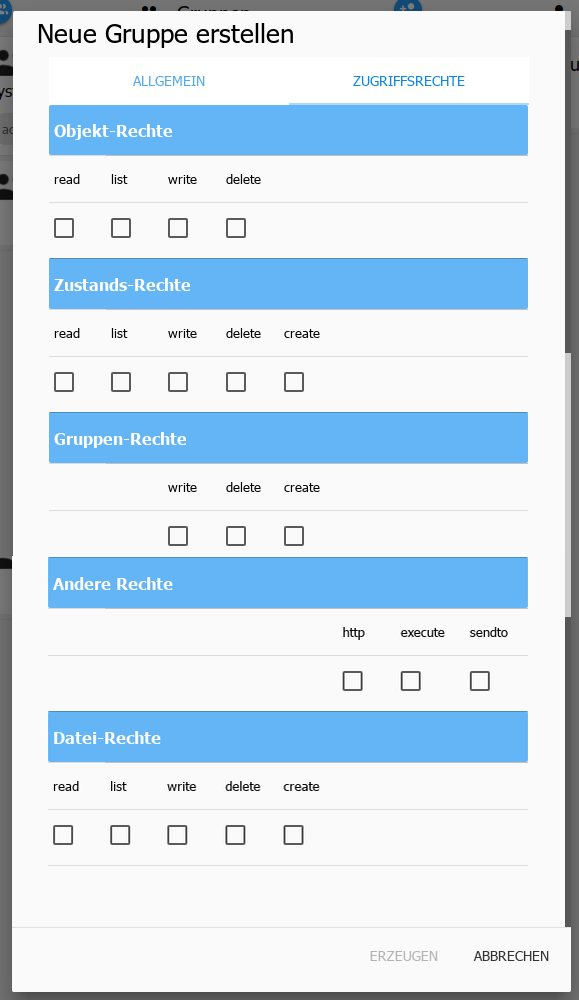

# Die Seite Benutzer
Auf dieser Seite könne Benutzer und Gruppen angelegt, sowie Rechte für die Gruppen 
vergeben werden.

Auf der linken Seite befinden sich die vorhandenen Gruppen, auf der rechten Seite die 
Benutzer.

Benutzer können durch einfaches Drag and Drop in die Gruppen gezogen werden.

## 1.) neue Gruppe
Nach Anklicken dieses Icons öffnet sich ein weiteres Fenster:

Dieses Fenster besteht aus zwei Untereinheiten. 

### Allgemein
Hier werden die grundlegenden Dinge eingetragen:

**Name** - Die Bezeichnung der Gruppe. Dieser Name ist frei wählbar, muss aber eindeutig sein.

**ID** - Die ID wird automatisch ausgefüllt

**Beschreibung** - In dieses Feld kann eine Erklärung zu den Aufgaben dieser Gruppe eingetragen werden.

**Vorschau** - Wird automatisch angezeigt und enthält die vollständige ID `system.group.groupname`.

Über den [+]-Button kann ein Icon hinzugefügt werden, dieses kann aber auch durch 
Drag and Drop auf das Fenster gezogen werden.

**Farbe** - Mit der dort eingestellten Farbe wird die Kachel der Gruppe unterlegt.

### Zugriffsrechte
Die Rechte werden für Gruppen vergeben. Damit User bestimmte Rechte haben müssen 
sie der entsprechenden Gruppe zugeordnet werden.

Hier werden die Zugriffsrechte für die verschiedenen Aufgaben vergeben.

## 2.) neuer Benutzer
Nach Anklicken dieses Icons öffnet sich ein weiteres Fenster:

**Name** - Der Name des Users. Dieser Name ist frei wählbar, muss aber eindeutig sein.

**ID** - Die ID wird automatisch ausgefüllt

**Beschreibung** - In dieses Feld kann eine Erklärung zu dem User eingetragen werden.

**Vorschau** - Wird automatisch angezeigt und enthält die vollständige ID sytem.group.Username.

**Passwort** - Das Passwort des Users

**Passwort wiederholen** - Zur Sicherheit vor Tippfehlern muss das Passwort hier ein zweites Mal eingegeben werden
