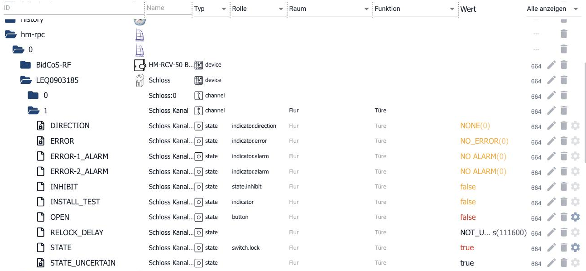

# Objekte

In ioBroker gibt es zwei Arten von Information, und der Unterschied zwischen
ihnen erklärt fast alles Weitere:

* **Objekte** beschreiben, *was* etwas ist. Sie ändern sich selten: ein Name,
  eine Einheit, die Angabe, ob etwas gelesen oder geschrieben werden darf.
* **Zustände** sind die Werte selbst - 23,5 °C, `true`, "Wohnzimmer". Sie ändern
  sich ständig. Sie stehen auf einer eigenen Seite:
  [Zustände](/docs/basics/states.md).

Ein Thermometer ist also nicht "21,3". Es ist ein Objekt, das sagt: *Hier
kommt eine Zahl, sie hat die Einheit °C, sie ist lesbar und nicht beschreibbar,
und sie heißt „Temperatur Wohnzimmer".* Der Wert 21,3 hängt daran.

## Die Adresse: die ID

Jedes Objekt hat eine ID. Sie ist hierarchisch aufgebaut und durch Punkte
getrennt - wie ein Dateipfad, nur mit Punkten statt Schrägstrichen.

```
hm-rpc.1.ABC110022.2.VALUE
```

| Teil | Bedeutung |
|---|---|
| `hm-rpc` | der Adapter |
| `1` | seine Instanz - die zweite, gezählt wird ab 0 |
| `ABC110022` | die Geräteadresse |
| `2` | der Kanal |
| `VALUE` | der Datenpunkt |

Alles, was ein Adapter anlegt, liegt unterhalb seines eigenen Namensraums
`<adapter>.<instanz>.`. Daneben gibt es einige feste Namensräume:

| Namensraum | Inhalt |
|---|---|
| `system.` | alles, was ioBroker selbst betrifft |
| `system.adapter.` | die Konfiguration der Adapter und ihrer Instanzen |
| `system.host.` | die Rechner, auf denen ioBroker läuft |
| `system.user.`, `system.group.` | Benutzer und Gruppen |
| `enum.` | Räume, Gewerke und andere Gruppierungen |
| `alias.` | [Aliase](/docs/basics/alias.md) - eigene, stabile Namen für fremde Datenpunkte |
| `0_userdata.0.` | der Platz für eigene Objekte - siehe unten |
| `scripts.js.` | die Skripte des javascript-Adapters |

?> IDs dürfen bis zu 240 Byte lang sein. Nicht erlaubt sind die Zeichen
   ``[ ] * , ; ' " ` < > \ ?``; von `^ $ ( ) /` wird abgeraten. Wer eigene
   Datenpunkte anlegt, bleibt am besten bei Buchstaben, Ziffern, Unterstrich
   und Punkt.

## Der Aufbau eines Objekts

Jedes Objekt hat vier Felder:

| Feld | Was darin steht |
|---|---|
| `_id` | die Adresse von oben |
| `type` | um welche Art Objekt es sich handelt (siehe unten) |
| `common` | die Sicht von ioBroker: Name, Typ, Einheit, Rolle, Lese- und Schreibrecht |
| `native` | die Sicht des Zielsystems: alles, was nur das angeschlossene Gerät oder der Dienst versteht |


Das Bild zeigt ein Homematic-Türschloss. In `common` steht, was ioBroker davon
wissen muss - der Name und ein Symbol. In `native` steht die Welt des Geräts:
Adresse, Firmware, Funkadresse, Gerätetyp. ioBroker liest davon nichts, der
Adapter braucht alles davon.

Die Trennung von `common` und `native` ist der Grund, warum ein Widget in der
Visualisierung mit einem Datenpunkt von Homematic genauso umgehen kann wie mit
einem von Zigbee: Was ioBroker braucht, steht immer an derselben Stelle in
`common`. Was nur das Gerät angeht, bleibt in `native` und stört niemanden.

## Die Arten von Objekten

Im Alltag begegnen einem vor allem die ersten fünf:

| Typ | Was es ist |
|---|---|
| `state` | ein Datenpunkt - der Ort, an dem ein Wert steht |
| `channel` | fasst mehrere Datenpunkte zusammen, die zusammengehören |
| `device` | fasst Kanäle zu einem Gerät zusammen |
| `folder` | ein Ordner, rein zur Ordnung |
| `enum` | eine Gruppierung: Raum, Gewerk, eigene Kategorie |
| `adapter` | die Vorlage eines installierten Adapters |
| `instance` | eine laufende Kopie davon |
| `host` | ein Rechner, auf dem ioBroker läuft |
| `user`, `group` | Benutzer und Gruppen |
| `script` | ein Skript |
| `meta` | selten wechselnde Zusatzangaben eines Adapters |
| `config` | Einstellungen, etwa `system.config` |
| `chart` | die Beschreibung eines Diagramms |

Gerät, Kanal und Datenpunkt bilden dabei keine Pflichthierarchie - manche
Adapter legen Geräte und Kanäle an, andere nur Datenpunkte in Ordnern. Beides
ist erlaubt.

## Wo man sie sieht

Im Admin unter *Objekte*. Der Baum dort ist genau diese Struktur: Jede Ebene
zwischen zwei Punkten ist eine Zeile. Über das Werkzeugsymbol am Ende einer
Zeile lässt sich das Objekt bearbeiten, über die Lupe der rohe Inhalt ansehen -
und der ist zum Verstehen oft lehrreicher als jede Beschreibung.



So liest sich das Bild von oben nach unten: `hm-rpc` ist der Adapter, `0` seine
Instanz, `LEQ0903185` ein Gerät („Schloss"), darunter zwei Kanäle, und im
Kanal `1` liegen die Datenpunkte. Die Spalte *Typ* nennt zu jeder Zeile die Art
des Objekts, die Spalte *Rolle* sagt, wofür ein Datenpunkt steht, und ganz
rechts steht der aktuelle Wert.

?> Der Namensraum `system.` ist erst im **Expertenmodus** sichtbar (der Schalter
   oben in der Werkzeugleiste). Das ist Absicht: Dort steht nichts, was im
   Alltag anzufassen wäre.

!> Objekte, die ein Adapter angelegt hat, gehören diesem Adapter. Wer sie von
   Hand ändert, muss damit rechnen, dass die Änderung beim nächsten Start der
   Instanz wieder überschrieben wird. Soll ein Datenpunkt dauerhaft einen
   eigenen Namen oder eine eigene Einheit haben, ist ein
   [Alias](/docs/basics/alias.md) der
   richtige Weg.

## Eigene Objekte: `0_userdata.0`

Für Objekte, die nicht von einem Adapter stammen - ein Merker für ein Skript,
ein selbst gepflegter Sollwert, eine Zwischenablage zwischen zwei
Automatisierungen -, gibt es einen eigenen Namensraum: **`0_userdata.0`**.

Er gehört keinem Adapter und wird von keinem überschrieben. Genau deshalb ist er
der richtige Ort. Datenpunkte, die man sich in den Namensraum eines Adapters
legt, sind beim nächsten Start der Instanz möglicherweise weg.

Angelegt werden sie im Admin unter *Objekte* über das Pluszeichen, oder aus
einem Skript heraus - dort mit der **vollständigen** ID:

```js
createState('0_userdata.0.Heizung.Sollwert', 21, { type: 'number', unit: '°C', read: true, write: true });
```

?> Ohne den vollständigen Pfad legt `createState` den Datenpunkt unterhalb der
   Skript-Instanz an (`javascript.0.…`). Das funktioniert zwar, aber die Daten
   hängen dann an einem Adapter, dem sie nicht gehören.

## Wo die Objekte liegen

Objekte und Zustände werden in **zwei getrennten Datenbanken** gehalten - das
ist der Grund, warum sie in der Oberfläche manchmal getrennt auftauchen. Beide
verwaltet der js-controller, und beide gibt es in mehreren Ausführungen:

| Ablage | Wofür |
|---|---|
| `jsonl` | die Vorgabe seit js-controller 4 - Dateien `objects.jsonl` und `states.jsonl` im Datenverzeichnis |
| `file` | die ältere Dateiform, in alten Installationen noch anzutreffen |
| `redis` | eine Datenbank im Arbeitsspeicher, für große Anlagen |

Für die allermeisten Installationen ist die Vorgabe richtig. Erst wenn der
js-controller dauerhaft viel Rechenzeit braucht und das System träge wirkt,
lohnt der Blick auf
[Redis](/docs/config/redis.md).

## Weiterlesen

* [Zustände](/docs/basics/states.md) - die Werte selbst und das ack-Flag
* [Rollen](/docs/basics/roles.md) - was `common.role` bedeutet
* [Aufzählungen](/docs/basics/enums.md) - Räume und Gewerke
* [Objektstruktur](/docs/dev/objectsschema.md) - die vollständige Referenz für Entwickler
