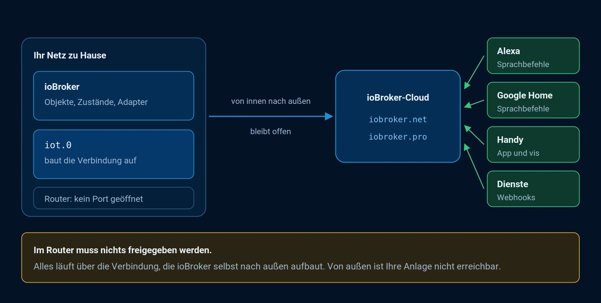

# Cloud-Dienste und Apps

ioBroker läuft im eigenen Netz, und das ist auch der Normalfall: die Daten
bleiben im Haus, und ohne Internet funktioniert alles weiter. Für drei Dinge
reicht das eigene Netz aber nicht aus:

* **Zugriff von unterwegs**, ohne einen Port im Router zu öffnen.
* **Sprachassistenten**, weil Alexa und Google Home ihre Anfragen aus dem
  Internet schicken.
* **Dienste von außen**, die etwas an ioBroker melden sollen, etwa ein Webhook.

Dafür gibt es die ioBroker-Cloud. Der entscheidende Punkt dabei: die Verbindung
wird **von innen nach außen** aufgebaut. Ihr Router bleibt zu, es muss keine
Weiterleitung eingerichtet werden, und Ihre Installation ist nicht aus dem
Internet erreichbar.

*Die Verbindung geht von innen nach außen. Alexa, Google Home und das Telefon
sprechen mit der Cloud, nicht mit Ihrem Router.*

## Die Adapter

Es sind zwei, und sie teilen sich die Aufgaben:

| Adapter | Wofür |
| --- | --- |
| **cloud** | **Fernzugriff**: die eigene Oberfläche von unterwegs erreichen. |
| **iot** | **Sprachassistenten**, **Dienste** und der **MCP-Zugang**. |

Wer beides will, betreibt beide nebeneinander. Das ist kein Übergang und keine
Doppelung, die Adapter machen verschiedene Dinge.

?> Der **MCP-Zugang** ist neu. Über ihn erreichen KI-Assistenten das eigene
System. Er läuft über den iot-Adapter und setzt ein Konto auf
[ioBroker.pro](https://iobroker.pro) voraus.

Beide brauchen ein Konto. Für den kostenfreien Fernzugriff genügt eines bei
[ioBroker.net](https://iobroker.net), für den erweiterten Fernzugriff und für
die Assistenten wird eines bei [ioBroker.pro](https://iobroker.pro) gebraucht.
Was die beiden unterscheidet, steht unter
[Zugangslizenzen](/docs/licenses/cloud.md).

## Die Seiten in diesem Kapitel

| Seite | Inhalt |
| --- | --- |
| [IoT](/docs/cloud/iot.md) | Konto anlegen, den iot-Adapter einrichten, Verbindung prüfen. Der Ausgangspunkt für Assistenten und Dienste. |
| [Visualisierungen](/docs/cloud/viz.md) | Die eigene Oberfläche von unterwegs erreichen. |
| [Redakteure](/docs/cloud/editor.md) | Weiteren Personen Zugriff auf das Konto geben. |
| [Dienste](/docs/cloud/services.md) | Über eine Adresse Werte an ioBroker schicken oder Befehle auslösen. |
| [Alexa Smarthome-Skill](/docs/cloud/alexasmart.md) | Geräte mit den üblichen Befehlen schalten. |
| [Alexa Custom-Skill](/docs/cloud/alexacustom.md) | Eigene Sprachbefehle und Statusabfragen. |
| [App](/docs/cloud/app.md) | Die offizielle App für Telefon und Tablet. |

?> Damit Sprachsteuerung und die selbst aufgebauten Oberflächen funktionieren,
müssen Räume und Funktionen gepflegt sein. Ohne diese
[Kategorien](/docs/basics/enums.md) weiß
weder Alexa noch ein Visualisierungsadapter, was gemeint ist.

!> Bevor der Zugriff von außen eingerichtet wird: dem Benutzer `admin` ein
Passwort geben und die
[Anmeldung](/docs/config/login.md)
einschalten.
