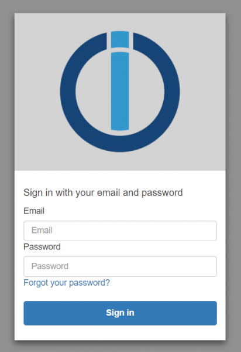

# IoT Cloud (Integration mit ioBroker und Alexa/Google Home)

Ursprung: https://forum.iobroker.net/topic/17834/ank%C3%BCndigung-weihnachtsaktion-assistenten-service-iobroker-iot-reloaded-alexa-und-services

Die Steuerung deiner Geräte über Alexa wird einfacher denn je.
Hier erfährst du, wie du den Cloud-Adapter für eine nahtlose Verbindung mit Alexa nutzen kannst,
damit dein Zuhause smarter wird. Leider hat sich gezeigt,
dass die bestehenden Lösungen nicht immer mit der wachsenden Anzahl von Nutzern Schritt halten können.
Deshalb stellen wir dir den IoT-Service vor, eine zukunftssichere Lösung,
die speziell für eine reibungslose Integration mit Alexa und anderen Assistenten entwickelt wurde.

Um sicherzustellen, dass das Setup der IoT-Instanz und die Verbindung dahin funktioniert,
ist das neue Assistenten-Lizenzpaket erst dann kaufbar, wenn eine Verbindung erfolgreich erstellt wurde,
die Verknüpfung erfolgreich ist und auch die Steuerung mindestens eines Gerätes funktioniert hat.
Also nicht wundern, dass im `Pro-Cloud-Account` nichts verfügbar ist.

Daher die aktualisierte Anleitung bitte zuerst befolgen:

1. Falls noch kein Pro-Account existiert, erst unter https://iobroker.pro/intro einen Account registrieren.
Sonst den existierenden `Pro-Account` einfach nutzen.

Neu angelegte Accounts haben eine 7 Tage "Trial Version" der Assistenten-Lizenz mit einem Limit von 20.000 Anfragen pro Monat.
Eine gekaufte Assistenten-Lizenz startet aber sofort, es werden also keine Rest-Tage berücksichtigt!
Nach Ablauf der 7 Tage ohne Kauf einer Assistenten-Lizenz werden bis zu 20 Anfragen pro Tag kostenfrei übertragen.
Dann ist es für den Tag gesperrt.

Bereits existierende Pro-Accounts ohne Lizenz können mit Start der Aktion ebenso das Assistenten-Paket 
für 7 Tage testen - diese 7 Tage starten ab Anlegen des IoT-Service Users über Eintragen der Login-Daten im IoT-Adapter.

Pro-Accounts mit existierender Assistenten- oder Fernzugriffs-Lizenz haben ebenso 20.000 Anfragen pro Monat.

2. Danach den `ioBroker.IoT`-Adapter aus dem normalen Repository installieren - einfach nach "IoT" filtern.
In der Konfiguration des Adapters bitte die Login-Daten von https://iobroker.pro eintragen (E-Mail kleingeschrieben und Passwort! Keinen App-Key oder so!).
Die Buttons "Erhalten Sie neue Verbindungszertifikate" oder "Erstellen Sie IoT-Anmeldeinformationen neu" werden nur in Fehlerfällen benötigt.

Falls der IoT-Adapter schon installiert ist, bitte prüfen ob Updates vorhanden sind und auf mindestens die 0.2.2 aktualisieren.

Weiterhin hier alle nötigen Einstellungen vornehmen und Smart-Geräte prüfen.

Ebenso ist es empfohlen Gruppen lieber im ioBroker IoT-Adapter anzulegen als bei Amazon, 
da Gruppen bei Amazon unnötigen Traffic verursachen, weil Amazon für jedes Gerät einen eigenen Steuerbefehl sendet!

Ein weiterer Vorteil besteht darin, dass die Gruppen beibehalten werden, wenn der Amazon-Account neu eingerichtet wird.

3. Der Adapter sollte sich nun mit dem IoT-Service verbinden und grün werden.
Falls das nicht klappt und der Adapter z.B. gelb ist, dann bitte das Logfile prüfen und unten in der FAQ schauen.
Auch ein Restart der Instanz kann helfen. 
Meistens sind es einfache Dinge wie falsche Login-Daten (Achtung: Auch Groß- und Kleinschreibung beachten!)!
Die Fehlermeldungen im Log wurden verbessert und sollten nun besser aussagen, was das Problem ist.

4. Nach der ersten Verbindung wird automatisch Alexa Account mit dem gleichen Passwort wie bei ioBroker.pro erstellt. 
Die iobroker.iot Instanz muss "grün" sein. 

5. Es kann passieren, dass die Passwörter, die `#` Symbol beinhalten, noch nicht gehen. 
Das Problem wird untersucht, deswegen, bitte kein `#` im Passwort benutzen.

5. Dann den neuen "ioBroker.iot" [Skill](https://www.amazon.de/ioBroker-ioBroker-iot/dp/B07L66BFF9) installieren und auf "Aktivieren" klicken. 
Dann sollte die Login-Maske des IoT-Service erscheinen.
Hier die E-Mail-Adresse und das Passwort des Pro-Cloud-Accounts verwenden.

**Bitte das Login kleinschreiben: `MyEmail@gmx.de` ist falsch; `myemail@gmx.de` ist richtig!**

Wer bereits die IoT-Services nutzt (früher oder mit dem Custom-Skill) loggt sich einfach 
direkt mit seinen IoT-Zugangsdaten bei der Skill-Aktivierung ein.

Nach einem erfolgreichen Login kommt eine Erfolgsmeldung und der Skill ist aktiviert.
Falls nicht, bitte Zugangsdaten prüfen und nochmals versuchen.

6. Jetzt sollte Euch Amazon die Geräte-Suche anbieten.
Nachdem diese gelaufen ist, sollten alle im IoT-Adapter hinterlegten Geräte auch in Amazon zu finden sein.

7. Bitte jetzt prüfen, ob Eure Geräte per Sprache oder Alexa-App schaltbar sind.
Dieser Schritt ist wichtig und es muss mindestens eine Schaltaktion erfolgreich gewesen sein bevor Ihr mit dem nächsten Schritt weitermachen könnt!

8. Jetzt am besten zu Amazon gehen und dem Skill (weil ja alles funktioniert hat) gleich schon mal 5 Sterne geben :)
Gute Bewertungen (echte natürlich, dies ist kein Aufruf um Bewertungen zu fälschen!) und damit die Skill-Platzierung 
haben auch einen gewissen Einfluss auf die Kosten der Amazon-Dienste die vom IoT-Service genutzt werden!

9. Wenn Ihr also den IoT-Adapter erfolgreich verbunden, den Skill aktiviert habt und Eure Geräte erfolgreich steuern könnt, 
müsst Ihr jetzt die Entscheidung treffen, ob Ihr das Assistenten-Paket im Rahmen der Weihnachtsaktion 
kaufen wollt oder ob Euch die 20 Anfragen pro Tag vielleicht sogar ausreichen.
Wenn Ihr das Paket kaufen wollt, geht bitte im Browser auf die https://iobroker.pro, loggt Euch dort mit Euren Pro-Cloud-Zugangsdaten ein.
Falls Ihr kein Menü sieht, klickt oben rechts auf das Avatar-Icon und wählt nun im Menü den Punkt "Remote Access".

Fernzugriff (Remote) auf Admin und die Editoren funktioniert mit dieser Lizenz nicht!

Es ist auch nicht möglich später ein Update auf Remote zu machen. Das wäre dann ein Neukauf der Remote-Lizenz.

Falls man den vollständigen Fernzugriff (inklusive Editoren) auf ioBroker braucht, 
kann man auch die Remote-Lizenz kaufen (zum Preis von 5,49€/Monat oder z.B. 44,99€/Jahr (=3,75€/Monat)), 
dort ist der Smart-Assistenten Support (Alexa, Google Home) automatisch enthalten.

Eine Übersicht der Lizenzen und Funktionen findet Ihr in folgender Tabelle:

| Funktionen / Lizenz                    |                  | ohne Lizenz      | Smart-Assistenten Lizenz | Fernzugriff Lizenz    |
|----------------------------------------|------------------|------------------|--------------------------|-----------------------|
|                                        | **iobroker.net** | **iobroker.pro** | **iobroker.pro**         | **iobroker.pro**      |
| Alexa Skills                           | -                | 20 Anfragen/Tag  | 20.000 Anfragen/Monat    | 20.000 Anfragen/Monat |
| Google Home                            | -                | 20 Anfragen/Tag  | 20.000 Anfragen/Monat    | 20.000 Anfragen/Monat |
| Fernzugriff vis(2) (nicht editierbar)  | ✓                | -                | -                        | ✓                     |
| Fernzugriff admin, vis(2) (editierbar) | -                | -                | -                        | ✓                     |
| Service (POST Aufruf)                  | -                | ✓                | ✓                        | ✓                     |
| Service (POST/GET Aufruf)              | -                | -                | ✓                        | ✓                     |

Die Anfragen werden zwischen allen Diensten aufgeteilt, die vom Anwender benutzt werden. D.h. wenn mit Assistant Lizenz 10.000 Anfragen an Alexa und 10.000 an Google Home gemacht werden, dann sind die 20.000 Anfragen aufgebraucht.

Für Fernzugriff wird `ioBroker.cloud` adapter nötig. Für alle anderen Funktionen wird `ioBroker.iot` adapter.

Die Smart-Assistenten Lizenz kostet 15,99 € für 6 Monate (2,67 € monatlich) und 23,99 € für ein Jahr (1,99 € monatlich).

Es kann sein, dass die Preise noch geändert werden, je nachdem wie sich die genaueren Betriebskosten für die nötige Infrastruktur entwickeln!

## Problemsuche
Falls das Passwort von ioBroker.pro in Alexa skill nicht passt, bitte prüfen:
- `ioBroker.iot` adapter ist installiert und die Instanz ist "grün",
- Login ist in Kleinbuchstaben eingegeben,
- das Passwort hat kein `#` Zeichen,
- Falls das alles nicht hilft, bitte diesen Knopf drücken:
  
- Die Ports für die Kommunikation (Ausgang) sind im Firewall nicht blockiert: 443, 8443 und 8883.

Danach sollte sich ioBroker.iot selbst neu starten und dann noch mal probieren ioBroker.iot Skill zu aktivieren.
