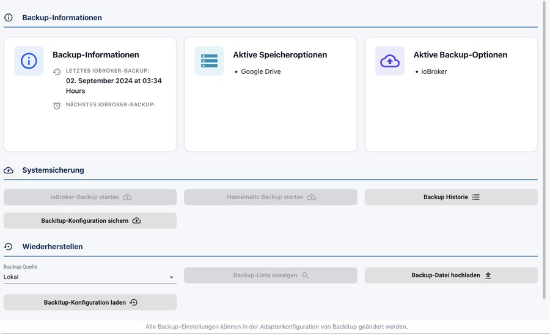

# Datensicherung

Eine ioBroker-Installation wächst über Monate: Instanzen, Objekte, Skripte,
Visualisierungen, aufgezeichnete Werte. Eine defekte SD-Karte oder ein
missglücktes Update wirft das alles weg. Die Frage ist deshalb nicht **ob**
gesichert wird, sondern **wann die erste Sicherung angelegt wird**, und die
Antwort lautet: bevor etwas passiert.

## Was in eine Sicherung gehört

Ein ioBroker-Backup enthält die beiden Datenbanken, also alle **Objekte** und
**Zustände**, die Liste der installierten Adapter mit ihrer Konfiguration sowie
den Dateispeicher mit Skripten und Visualisierungen. Es enthält **nicht** die
Adapter selbst; die werden beim Zurückspielen neu heruntergeladen.

Alles, was ein Adapter außerhalb dieser Datenbanken ablegt, ist nicht dabei und
braucht eine eigene Sicherung: die Datenbank von `influxdb` oder `sql`, die
Dateien des `history`-Adapters, die Netzkarte des Zigbee-Sticks, die
Konfiguration einer Homematic-Zentrale, ein Node-Red-Flow. Genau dafür gibt es
im Sicherungsadapter eigene Schalter, und die sind ab Werk nicht gesetzt.

!> Das betrifft besonders die **aufgezeichneten Werte**. Ein Restore stellt ein
vollständig eingerichtetes System wieder her, in dem alle Diagramme leer sind,
wenn der passende Schalter fehlte. Was wo liegt, steht unter
[Datenaufzeichnung](/docs/config/history.md).

## BackItUp

Der übliche Weg ist der Adapter
[BackItUp](/adapters/backitup).
Er bringt einen eigenen Menüpunkt **Backup** mit:



Oben stehen der Zeitpunkt der letzten und der nächsten Sicherung sowie die
aktiven Backup- und Speicheroptionen. Darunter lassen sich Sicherungen von Hand
anstoßen und die Historie einsehen, ganz unten wird zurückgespielt.

### Einrichten

In der Konfiguration der Instanz `backitup.0` steht im Reiter
**Haupteinstellungen** unter *Was soll gesichert werden?* die Liste der
möglichen Bestandteile: neben `ioBroker` unter anderem Homematic, Redis,
JavaScript, Zigbee, Zigbee2MQTT, History-Daten, InfluxDB, MySql, PostgreSQL,
SQLite3, Grafana, Node-Red und Yahka. Angehakt gehört alles, was im eigenen
System tatsächlich läuft.

Darunter stehen unter *Speicherorte* die Ziele: NAS beziehungsweise Kopieren,
FTP, Dropbox, Google Drive, WebDAV und OneDrive.

!> Mindestens ein Ziel **außerhalb** des ioBroker-Rechners auswählen. Eine
Sicherung, die nur auf derselben SD-Karte liegt, ist mit dieser Karte
zusammen weg.

Der Zeitplan steht im Reiter **ioBroker**:


| Feld | Bedeutung |
| --- | --- |
| **Backup-Zeit** | Uhrzeit der Sicherung. Eine krumme Zeit ist besser als eine volle Stunde, weil dann nicht alles gleichzeitig läuft. |
| **Tage** | Abstand in Tagen. `1` bedeutet täglich. |
| **Stück** | Wie viele Sicherungen aufgehoben werden. Ältere werden gelöscht. |
| **Namenszusatz** | Kommt in den Dateinamen. Nützlich, wenn mehrere Systeme in dasselbe Ziel sichern. |

Wer einen eigenen Rhythmus braucht, schaltet **Erstellen Sie Ihren eigenen
CRON-Job** ein.

?> Die vollständige Beschreibung aller Backup-Typen und Speicherziele steht in
der [Dokumentation des Adapters](/adapters/backitup).

## Ohne Adapter, über die Kommandozeile

ioBroker kann auch ohne Zusatzadapter sichern:

```bash
iobroker stop
iobroker backup
```

Die Datei landet als `<Datum>_backupIoBroker.tar.gz` im Verzeichnis
`/opt/iobroker/backups`. Zurückgespielt wird mit:

```bash
iobroker stop
iobroker restore <Name oder Pfad der Sicherung>
iobroker start
```

Ohne Parameter aufgerufen listet `iobroker restore` die vorhandenen Sicherungen
auf.

!> ioBroker muss für beide Befehle gestoppt sein. Eine Sicherung im laufenden
Betrieb kann unvollständig sein.

## Was eine Sicherung erst zu einer Sicherung macht

Ein Backup, das noch nie zurückgespielt wurde, ist eine Vermutung. Es lohnt
sich, den Ernstfall einmal in Ruhe zu üben, auf einem zweiten Rechner oder in
einer virtuellen Maschine. Wie das abläuft, steht Schritt für Schritt unter
[Restore](/docs/tutorial/restore.md).

Ein Backup gehört außerdem **vor** jedes größere Update, besonders vor einem
Wechsel der Node.js-Version oder des js-controllers.
