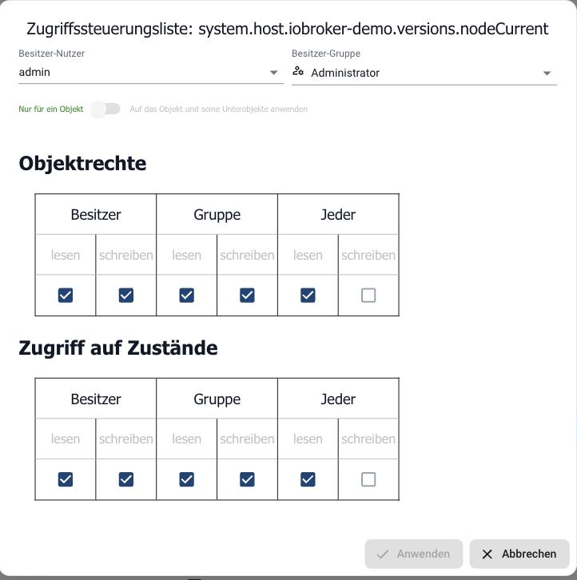

# Zugriffsverwaltung mit Benutzern und Gruppen

Wer sich an ioBroker anmeldet, tut das als **Benutzer**. Was dieser Benutzer
darf, entscheiden zwei Dinge zusammen: die **Rechte seiner Gruppen** und die
**Zugriffsrechte am einzelnen Objekt**. Beides muss erlauben, was er vorhat.
Verbietet eines von beidem, passiert nichts.

?> Diese Benutzer sind nicht die Benutzer des Betriebssystems. Sie gelten nur
innerhalb von ioBroker: für die Anmeldung am Admin, an vis und an den
Web-Adaptern. Angelegt werden sie im Reiter
[Benutzer](/docs/admin/users.md).

## Die beiden vorhandenen Gruppen

| Gruppe | Gedacht für |
| --- | --- |
| **Administrator** (`system.group.administrator`) | Vollzugriff. Hier liegt der Benutzer `admin`. |
| **Benutzer** (`system.group.user`) | Alltagsbetrieb: schalten und ablesen, aber nichts umbauen. |

Ein Benutzer kann in mehreren Gruppen sein. Seine Rechte sind dann die Summe
aller Gruppenrechte.

## Was eine Gruppe darf

Im Reiter **Benutzer** öffnet der Bleistift an einer Gruppe die Bearbeitung, der
Reiter **Berechtigungen** zeigt die Rechte:

Fünf Blöcke, jeweils mit denselben fünf Rechten:

| Block | Wofür er gilt |
| --- | --- |
| **Objektberechtigungen** | Die Beschreibung eines Datenpunkts: Name, Rolle, Einheit, Zuordnungen. |
| **Zustandsberechtigungen** | Der Wert selbst. Schalten ist ein Schreibzugriff auf den Zustand. |
| **Benutzerberechtigungen** | Benutzer und Gruppen verwalten. |
| **Andere Berechtigungen** | `http-Anfragen`, `Shell-Ausführung` und `sendTo`. |
| **Dateiberechtigungen** | Der Dateispeicher, also alles im Reiter Dateien. |

Die fünf Rechte bedeuten: **lesen** einzeln abrufen, **auflisten** überhaupt
sehen, dass es etwas gibt, **schreiben** ändern, **löschen** entfernen,
**erstellen** neu anlegen.

Die Gruppe *Benutzer* ist ab Werk so eingestellt, dass sie den Alltag abdeckt:

| Block | Erlaubt |
| --- | --- |
| Objekte | lesen, auflisten |
| Zustände | lesen, auflisten, schreiben, erstellen |
| Benutzer | lesen, auflisten |
| Andere | nur `http-Anfragen` |
| Dateien | lesen, auflisten |

Damit kann so ein Benutzer alles sehen und Geräte schalten, aber keine Objekte
umbauen, keine Skripte über `sendTo` anstoßen und keine Shell-Befehle absetzen.

!> `Shell-Ausführung` bedeutet, dass Skripte dieses Benutzers Befehle auf dem
Betriebssystem ausführen dürfen. Dieses Recht gehört nur in die
Administratorgruppe.

## Rechte am einzelnen Objekt: die ACL

Die Gruppenrechte sagen, was ein Benutzer **grundsätzlich** darf. Die Rechte am
Objekt sagen, **für welchen Datenpunkt** das gilt. Beide werden geprüft, und es
entscheidet immer das Strengere. Ein Benutzer, dessen Gruppe Zustände schreiben
darf, kann trotzdem an einem einzelnen Datenpunkt scheitern.

Diese Rechte am Objekt heißen **ACL**, von *Access Control List*, also
Zugriffssteuerungsliste. Sie sind genauso aufgebaut wie die Dateirechte unter
Linux: eine dreistellige Zahl, zum Beispiel `664`.

Die drei Ziffern stehen für drei Rollen, in dieser Reihenfolge:

| Ziffer | Gilt für |
| --- | --- |
| erste | den **Besitzer**, also den Benutzer, der oben im Dialog eingetragen ist |
| zweite | die **Besitzergruppe**, also jeden, der in dieser Gruppe ist |
| dritte | **alle übrigen** angemeldeten Benutzer |

Jede Ziffer entsteht aus zwei Rechten: **lesen zählt 4**, **schreiben zählt 2**.
Zusammen ergibt das 6, gar nichts ergibt 0.

| Zahl | Bedeutet |
| --- | --- |
| `664` | Besitzer und Gruppe lesen und schreiben, alle anderen lesen nur. Die übliche Voreinstellung. |
| `644` | Nur der Besitzer schreibt, alle anderen lesen. |
| `666` | Jeder darf schreiben. |
| `600` | Nur der Besitzer, sonst niemand. |

Ein Beispiel, das im Alltag genau so vorkommt: Ein Benutzer der Gruppe
*Benutzer* darf Zustände schreiben. Der Datenpunkt `alias.0.Licht` steht auf
`664` und gehört dem Besitzer `admin` in der Gruppe *administrator*. Der
Benutzer ist weder das eine noch das andere, für ihn gilt also die dritte
Ziffer: `4`, nur lesen. Er sieht die Lampe, schalten kann er sie nicht. Nicht
die Gruppe ist schuld, sondern die ACL des Objekts.

?> Objekt und Zustand haben **getrennte** Rechte. Das Objekt ist die
Beschreibung, der Zustand der Wert. Wer nur schalten können soll, braucht
Schreibrechte am Zustand, nicht am Objekt.

Sichtbar werden die Rechte im **Expertenmodus**: der Reiter
[Objekte](/docs/admin/objects.md) bekommt
dann eine Spalte mit dieser Zahl. Ein Klick darauf öffnet die
Zugriffssteuerungsliste:

Oben stehen **Besitzer-Nutzer** und **Besitzer-Gruppe**, darunter die Rechte,
getrennt nach Objekt und Zustand und jeweils für drei Rollen:

* **Besitzer**: der eingetragene Benutzer.
* **Gruppe**: wer in der eingetragenen Gruppe ist.
* **Jeder**: alle übrigen angemeldeten Benutzer.

Die drei Ziffern sind genau diese drei Rollen. Lesen zählt `4`, Schreiben `2`,
zusammen also `6`. `664` heißt damit: Besitzer und Gruppe dürfen lesen und
schreiben, alle anderen nur lesen.

Der Schalter **Auf das Objekt und seine Unterobjekte anwenden** überträgt die
Einstellung auf den ganzen Teilbaum. Das ist der bequeme Weg, um zum Beispiel
einen kompletten Adapter-Namensraum auf Nur-Lesen zu setzen.

?> Welche Rechte **neu angelegte** Objekte bekommen, steht in den
[Systemeinstellungen](/docs/admin/settings.md)
unter *Standard ACL*. Bestehende Objekte ändert diese Einstellung nicht.

!> Objekte, die ein Adapter selbst anlegt, gehören ihm. Legt er sie bei einem
Update neu an, stehen auch die Rechte wieder so, wie der Adapter sie vorsieht.
Wo eine Einschränkung dauerhaft halten soll, ist ein
[Alias](/docs/basics/alias.md) der
verlässlichere Weg: er gehört Ihnen, und der Adapter fasst ihn nicht an.

## Einen eingeschränkten Benutzer anlegen

Der übliche Fall: jemand soll die Visualisierung bedienen, aber nichts am System
ändern können.

1. Im Reiter **Benutzer** einen Benutzer anlegen und ein Passwort vergeben.
2. Ihn in die Gruppe **Benutzer** ziehen, nicht in **Administrator**.
3. In der [Authentifizierung](/docs/config/login.md)
   des betreffenden Web-Adapters die Anmeldung einschalten.
4. Mit diesem Benutzer anmelden und ausprobieren, ob wirklich nur das geht, was
   gehen soll.

Reicht die Gruppe *Benutzer* nicht aus, wird eine eigene Gruppe angelegt und nur
mit den nötigen Rechten versehen. Soll ein einzelner Bereich zusätzlich gesperrt
werden, geschieht das über die Zugriffsrechte am Objekt.

!> Vor dem Umstellen ein
[Backup](/docs/config/backup.md) anlegen.
Wer sich mit zu strengen Rechten selbst aussperrt, kommt sonst nur noch über die
[Kommandozeile](/docs/config/cli.md) wieder
hinein.
