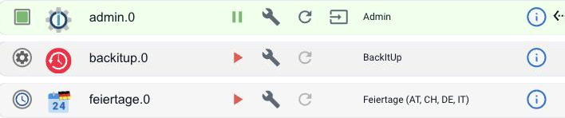

## Was bedeuten die Symbole vor einer Instanz?

| Symbol | Bedeutung |
| ------ | --------- |
| Grünes Quadrat | Die Instanz läuft. |
| Graues Zahnrad | Die Instanz ist gestoppt. Das rote Dreieck daneben startet sie. |
| Uhr | Eine zeitgesteuerte Instanz. Sie läuft nur kurz zum eingestellten Zeitpunkt und beendet sich wieder. Das ist kein Fehler. |

Genaueres verrät der Mauszeiger auf dem Symbol. Ob die Instanz auch wirklich mit
ihrem Gerät spricht, steht nicht hier, sondern in ihrem Objekt `info.connection`.

Ausführlich: [Reiter Instanzen](https://www.iobroker.net/#de/documentation/admin/instances.md)
