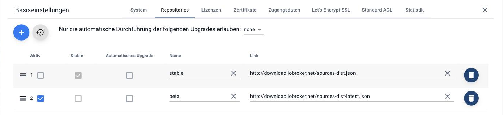

## Wie komme ich an eine Beta-Version?

Manchmal wird man gebeten, eine Version zu testen, die im Repository noch nicht
auftaucht. Meist ist damit die Beta-Version eines Adapters gemeint.

!> Für ein System, das zuverlässig laufen soll, ist das Beta-Repository nichts.
Die Versionen dort sind noch nicht fertig getestet, und ein Zurück ist Handarbeit.

### Der bessere Weg: nur einen einzelnen Adapter

Seit Admin 5 muss dafür **nicht** mehr das ganze Repository umgestellt werden:

* Den **Expertenmodus** einschalten. Das Zeichen unten links in der Menüleiste.
* Im Reiter **Adapter** auf **Installieren aus eigener Quelle** gehen (das Symbol
  mit dem Octocat).
* Im Reiter **Von npm** den gewünschten Adapter auswählen und installieren.

Alle übrigen Adapter kommen weiterhin aus *stable*.

### Das ganze Repository umstellen

Falls es doch einmal nötig ist: In den
[Systemeinstellungen](https://www.iobroker.net/#de/documentation/admin/settings.md)
im Reiter **Repositories** in der Spalte *Aktiv* auf **beta** umschalten.

Danach im Reiter Adapter die Liste neu einlesen. Ist beta aktiv, erscheint dort
eine Warnung. Die ist Absicht und erinnert daran, wieder zurückzustellen.

Ausführlich: [Was ist ein Repository?](https://www.iobroker.net/#de/documentation/basics/repositories.md)
