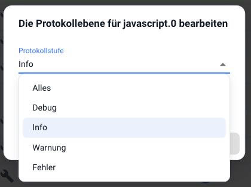

## Wie schalte ich eine Instanz auf Debug?

Im Reiter **Instanzen** die Detailzeile der Instanz aufklappen und auf die
Log-Stufe klicken. Im Dialog auf **Debug** stellen:

Die Einstellung wird dauerhaft gespeichert. Ohne das Häkchen bei *Ohne Neustart*
startet die Instanz neu. Das ist meistens gewollt, denn erst danach protokolliert
sie den vollständigen Ablauf von Anfang an.

Anschließend die Aktion auslösen, die den Fehler erzeugt, und in den
[Protokollen](/docs/admin/log.md) nachsehen.

!> Nach der Fehlersuche wieder auf *Info* zurückstellen.

?> Für eine Fehlermeldung im Forum oder auf GitHub gehört der Auszug aus der
**heruntergeladenen** Protokolldatei dazu, nicht ein Bildschirmfoto der Liste.
In der Anzeige werden lange Zeilen abgeschnitten.
