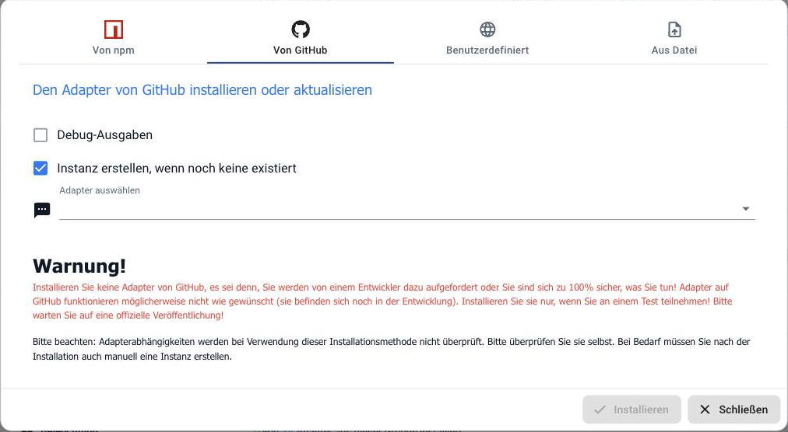

## Wie installiere ich einen Adapter von GitHub?

!> Nur, wenn ein Entwickler ausdrücklich darum bittet. Was auf GitHub liegt, ist
Arbeitsstand und kann zwischenzeitlich unbrauchbar sein. Abhängigkeiten werden bei
dieser Installationsart **nicht** geprüft.

* Den **Expertenmodus** einschalten.
* Im Reiter **Adapter** auf **Installieren aus eigener Quelle** gehen.
* In den Reiter **Von GitHub** wechseln und den Adapter auswählen.

Der Reiter **Benutzerdefiniert** nimmt eine beliebige Adresse entgegen, etwa
einen bestimmten Zweig oder das Repository eines fremden Entwicklers. **Aus Datei**
installiert ein lokal vorliegendes Paket.

### Wieder zurück

Ein Adapter, der von GitHub kam, wird durch das nächste Update aus dem Repository
nicht automatisch ersetzt. Seine Versionsnummer ist meist höher als die
offizielle. Zurück geht es über *Eine bestimmte Version installieren* auf der
Rückseite der Adapterkachel.
