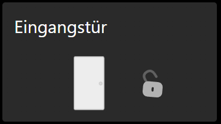
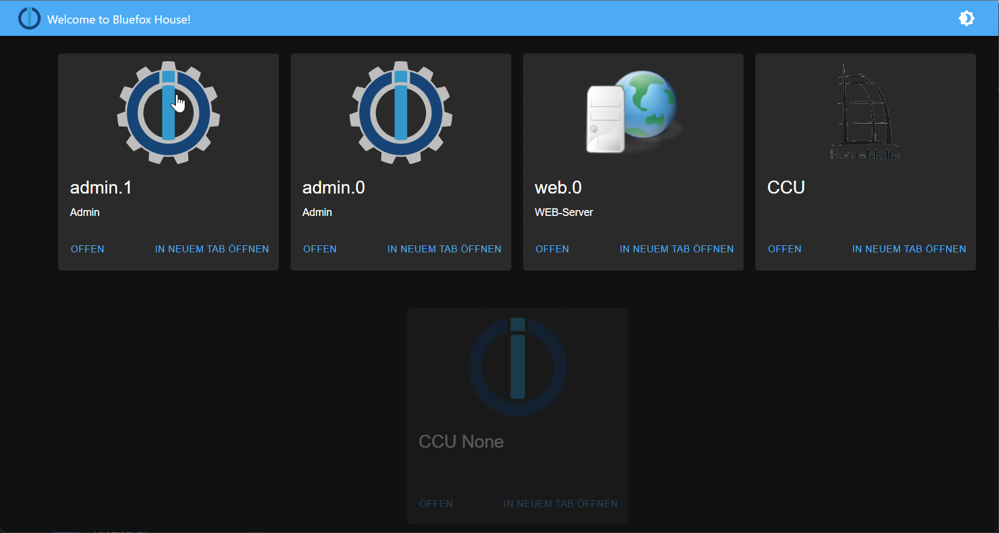
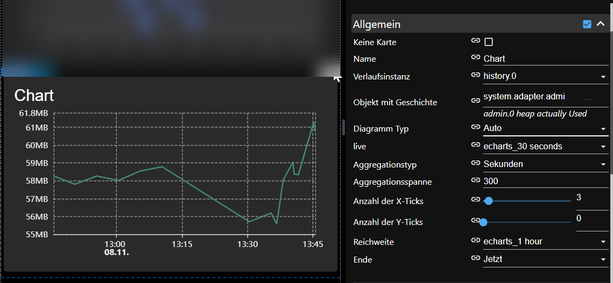
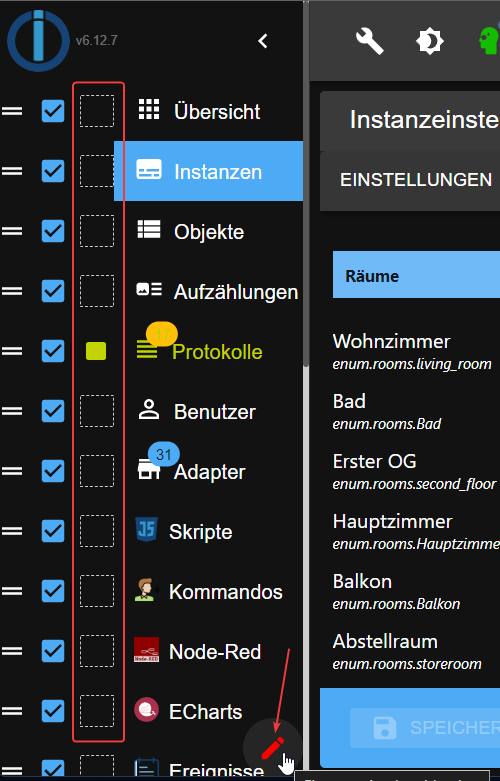
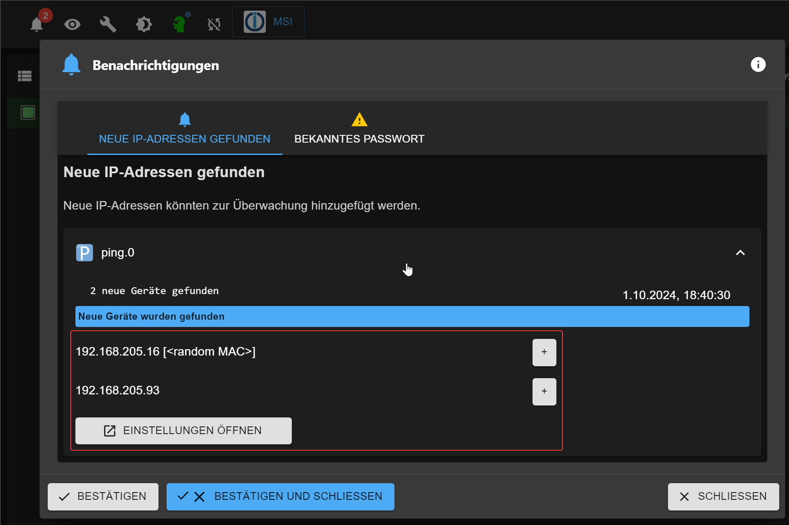
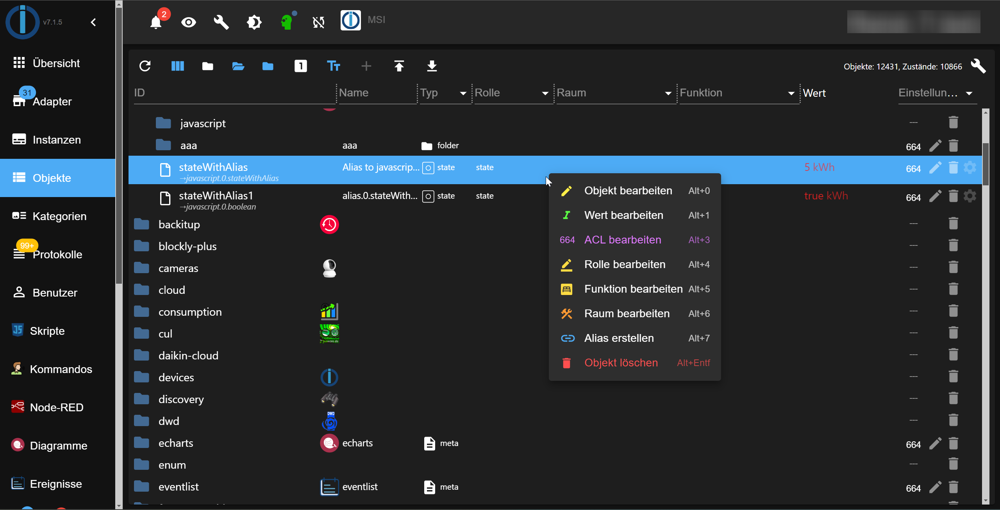
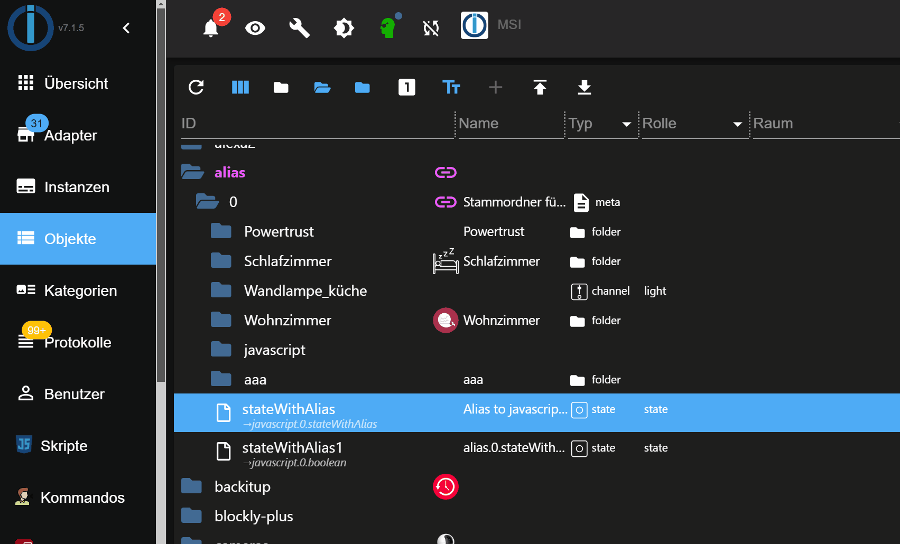
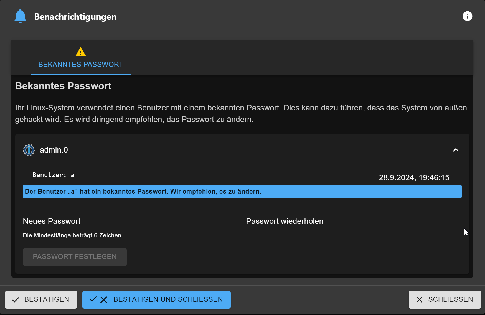
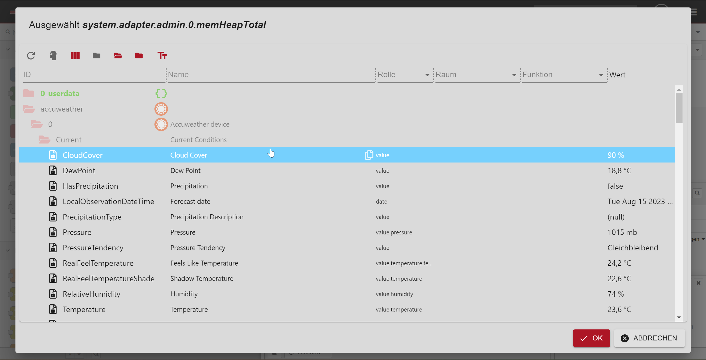

# Was ist neu
## Anweisungen für Autoren
- Bitte definieren Sie den Header als

## AdapterName (JJJJ-MM-TT) - [Kurzbeschreibung]
- Die Beschreibung der Aufnahme könnte lauten:
- neuer Adapter
- stabile Version
- neue Funktion
- neues Widget
- wenn Sie Neuigkeiten zum neuen Adapter haben, fügen Sie bitte einen GitHub-Link und ein Logo des Adapters hinzu

  Beispiel:

``` 
    ## frigate (2023-08-20) - new adapter
    https://github.com/Bettman66/ioBroker.frigate

    
```

## Fregatte (2023-08-20) - neuer Adapter
https://github.com/Bettman66/ioBroker.frigate


Frigate ist ein Open-Source-NVR, der auf der Echtzeit-KI-Objekterkennung basiert. Dieser Adapter analysiert die MQTT-Nachrichten von Frigate und erstellt daraus Datenobjekte

## Notification-manager (2023-08-21) - neuer Adapter
https://github.com/foxriver76/ioBroker.notification-manager


Verwalten Sie ioBroker-Benachrichtigungen, indem Sie sie beispielsweise als Nachrichten senden

## Procon-ip (24.08.2023)
https://github.com/ylabonte/ioBroker.procon-ip


ioBroker-Adapter zur Basisunterstützung der Schwimmbadsteuerung `ProCon.IP`.

## Deyeicd (29.08.2023)
https://github.com/raschy/ioBroker.deyeidc


Datensammler für `Deye`-kompatible Wechselrichter

## Acme (01.09.2023)
https://github.com/iobroker-community-adapters/ioBroker.acme


Dieser Adapter generiert Zertifikate mithilfe von ACME-Herausforderungen.

## Administrator (01.09.2023)
Kontextmenü:

- z. B. einfache Erstellung von Aliasnamen

  

## Javascript (01.09.2023)
Spielplatz für JavaScript-Code:

- Sie können ChatGPT (erforderlicher API-Schlüssel) verwenden, um das Skript zu generieren. Es dient nur zum Testen der Möglichkeiten von ChatGPT

  

## Cec2 (06.09.2023)
https://github.com/iobroker-community-adapters/ioBroker.cec2


Adapter für HDMI CEC - Sie können Geräte mit HDMI CEC überwachen/steuern. Die meisten modernen Fernseher und Multimediageräte unterstützen CEC bis zu einem gewissen Grad.

## Alexa2 (09.09.2023)
* (Apollon77) Aktualisieren Sie den Alexa2-Adapter, um ihn an das geänderte Push-Benachrichtigungssystem von Amazon anzupassen und wieder das Abrufen von Verlaufs- und Interaktionsinformationen zu ermöglichen

## Vis-2-widgets-material (10.09.2023)
* (Bluefox) Türschloss-Widget wurde hinzugefügt

 

## Pushbullet (10.09.2023)


* (Bluefox) API wurde auf Version 3 aktualisiert
* (Bluefox) JSON-Konfiguration wurde hinzugefügt

  

## JSON-Konfigurationsdokumentation
* (bluefox) JSON-Config-Dokumentation wurde der ioBroker-Website hinzugefügt [hinzugefügt](https://www.iobroker.net/#en/documentation/dev/adapterjsonconfig.md).

## Telegrammmenü (11.09.2023)
https://github.com/MiRo1310/ioBroker.telegram-menu


Einfaches Erstellen von Telegram-Menüs

## Vis-2 (12.09.2023)
* (bluefox) Horizontales Menü

  

## Echarts (12.09.2023)
* (Bluefox) Möglichkeit zum Exportieren der Daten in eine JSON-Datei hinzugefügt

  

* (Bluefox) Möglichkeit hinzugefügt, Zoom und Schwenken nach X Sekunden Inaktivität wiederherzustellen

  

* (bluefox) Legende als Dialog anzeigen

  

## Js-controller (14.09.2023)
* (foxriver76) js-controller 5 stabil veröffentlichen
* (foxriver76) Upgrade-Installationsprogramm, um nur Node.js 16.x+ zuzulassen

## Apg-info (16.09.2023)
https://github.com/HGlab01/ioBroker.apg-info - neuer Adapter


Dieser Adapter liefert die Spitzenzeiten für das österreichische Stromnetz, in denen der Stromverbrauch vermieden werden soll. Darüber hinaus liefert der Adapter die PHELIX-AT Day-Ahead (EPEX Spot) Preise für Österreich.

## Tinymqttbroker (2023-09-16) - neuer Adapter
https://github.com/HGlab01/ioBroker.tinymqttbroker


Dies ist ein sehr kleiner MQTT-Broker, der keine Objekte/Zustände in ioBroker verwaltet, sondern eine zentrale MQTT-Broker-Instanz zum Veröffentlichen und Abonnieren von Themen als MQTT-Client bietet.

## Awtrix-light (2.10.2023) - neuer Adapter
https://github.com/klein0r/ioBroker.awtrix-light


Integrieren Sie Ihr Awtrix Light-Gerät (z. B. Ulanzi TC001) über HTTP

## Webui (3.10.2023) - neuer Adapter
https://github.com/iobroker-community-adapters/ioBroker.webui


Dies ist ein vollständiges Visualisierungssystem für ioBroker.

* komplett auf Web-Komponenten basierend
* WYSIWYG-Editor für die Benutzeroberfläche, Sie können aber auch zur Quellansicht oder zur geteilten Ansicht wechseln
* Multi-Window-Benutzeroberfläche in der Bearbeitungsansicht, wie in Visual Studio
* Bindungen per Drag & Drop von ioBroker-Objekten auf UI-Elemente oder Eigenschaften
* komplexe Bindungen mit JavaScript und Konverter
* einfache Skriptsprache, die über die Benutzeroberfläche erstellt werden kann

## Heizungssteuerung (4.10.2023) - neuer Adapter
https://github.com/jbeenenga/ioBroker.heizungssteuerung


Mit diesem Adapter können Sie Heizungsanlagen steuern.

Sie können zwischen Kühl- und Heizbetrieb wählen und Boost oder Pause für einen Raum aktivieren.

Darüber hinaus können Sie die Zieltemperatur für einen Raum überschreiben.

## Admin und mqtt (11.10.2023) - neue Funktion
Admin- und MQTT-Adapter prüfen nun, ob sie vom öffentlichen Internet aus erreichbar sind, wenn keine Authentifizierung aktiviert ist. Wenn nicht, zeigen sie eine Warnung im Protokoll und im Admin an.

Dies ist eine nützliche Funktion, da nicht alle Benutzer wissen, wie sie ihre Adapter sichern, und es gefährlich ist, MQTT- oder Admin-Adapter ohne Authentifizierung für das Internet geöffnet zu haben.

## Iobroker (11.10.2023) - neue Funktion
Jetzt ist es möglich, Ihr node.js über die Befehlszeile zu aktualisieren: `iob nodejs-update` https://forum.iobroker.net/topic/69067/neuer-befehl-iob-nodejs-update

Sie können ohne zusätzliche Parameter auf eine vorgeschlagene Version (aktuell 18) aktualisieren oder eine Version angeben: `iob nodejs-update 20`

## Vis-2-widgets-material (13.10.2023) - neues Widget
Staubsauger-Widget wurde hinzugefügt.

Dieses Widget ist primär für Xiaomi-Staubsauger gedacht.
Es kann aber auch für jeden anderen Staubsauger verwendet werden.
Der einzige Unterschied besteht darin, dass Xiaomi die Raumreinigung unterstützt.


## Willkommen (17.10.2023) - neuer Adapter
https://github.com/ioBroker/ioBroker.welcome


Dieser Adapter zeigt alle Web- und Admin-Instanzen von ioBroker auf einer Seite auf Port 80 (konfigurierbar)


## Govee-local (20.10.2023) - neuer Adapter
https://github.com/boergegrunicke/ioBroker.govee-local


Steuern Sie Govee-Geräte über lokalen Zugriff (keine Cloud)

## Pylontech (23.10.2023) - neuer Adapter
https://github.com/PLCHome/ioBroker.pylontech


Fragen Sie die Zellspannungen und den Status von pylontech-Akkus über die Konsole ab.

## Signifylights (26.10.2023) - neuer Adapter
https://github.com/disaster123/ioBroker.signifylights


Signify Lights-Adapter für alle Arten von Signify WLAN-Leuchten wie WIZ, Philips WLAN und viele mehr ...

## Esphome (01.11.2023) - neue Funktion
In einer wichtigen Entwicklung für Heimautomatisierungs-Enthusiasten wurde in der ESPHome-Dokumentation die Integration von ioBroker mit seiner nativen API offiziell anerkannt.
Dieses Update folgt der Annahme einer kürzlichen PR, die ioBroker neben Home Assistant als eines der exklusiven Heimautomatisierungssysteme platziert, das die native API von ESPHome für die direkte Client-Kommunikation nutzt.

Die native API, die für ihr hochoptimiertes Netzwerkprotokoll bekannt ist, bietet zahlreiche Vorteile gegenüber herkömmlichen MQTT-Methoden und optimiert die Art und Weise, wie intelligente Geräte innerhalb des Ökosystems interagieren.
Mit dieser Anerkennung bekräftigt ESPHome sein Engagement, effiziente und robuste Kommunikationskanäle für die Smart-Home-Branche bereitzustellen.

## Vis (06.11.2023) - neue Funktion
Die Lizenz von vis wurde auf MIT geändert. Dies bedeutet, dass Sie vis kostenlos in kommerziellen Projekten verwenden können und keine Lizenz erforderlich ist.

## Willkommen (07.11.2023) - neue Funktion
Möglichkeit hinzugefügt, benutzerdefinierte Links zur Willkommensseite hinzuzufügen. Die Seiten werden auf ihre Funktionsfähigkeit überprüft.



## Echarts (08.11.2023) - neues Feature
Vis-2-Widget wurde hinzugefügt. Jetzt können Sie zusätzlich zu den Voreinstellungen die Objekt-ID direkt mit Verlaufsdaten verwenden.



## Renacidc (17.11.2023) - neuer Adapter
https://github.com/raschy/ioBroker.renacidc


Auslesen der Daten von Renacpower Solarwechselrichtern

## Wetterwarnungen (24.11.2023) - neuer Adapter
https://github.com/ticaki/ioBroker.weather-warnings


Dieser Adapter greift auf Wetterwarnungen verschiedener Wetterdienste zu und gibt diese als Text- oder Sprachnachricht aus. Zusätzlich werden nach Typ gruppierte Zustände erstellt, mit deren Hilfe auf aktuelle Warnungen reagiert werden kann.

## Tractive-gps (06.12.2023) - neuer Adapter
https://github.com/iobroker-community-adapters/ioBroker.tractive-gps


Mit diesem Adapter können Sie eine Verbindung zum Tractive GPS-Dienst herstellen und den Standort Ihrer Haustiere abrufen.

## Admin (06.12.2023) - neue Funktion
Es ist möglich, Menüfarben im Admin zu ändern



## Emporia (07.12.2023) - neuer Adapter
https://github.com/Chris-656/ioBroker.emporia


Dieser Adapter ruft Daten vom Emporia-Energiesystem ab.

## Reolink (27.12.2023) - neuer Adapter
https://github.com/aendue/ioBroker.reolink


Adapter für die ioBroker-Plattform zum Abrufen von Reolink-Kamerainformationen.

## Vis-2 (08.01.2024) - neuer Adapter
https://github.com/ioBroker/ioBroker.vis-2

vis-2 befindet sich nun in einem stabilen Repository. Es ist eine neue Generation von vis. Es basiert auf ReactJS und verfügt über viele neue Funktionen.

## Artnet-recorder (08.01.2024) - neuer Adapter
https://github.com/Bannsaenger/ioBroker.artnet-recorder


Aufzeichnen von Art-Net-Daten in einer Datei zur späteren Wiedergabe

##energiefluss (25.01.2024) – neuer Adapter
https://github.com/SKB-CGN/ioBroker.energiefluss


Es bietet einen animierten Energiefluss des Stromverbrauchs für Photovoltaik, Batterie, Eigenverbrauch, Netzeinspeisung (Netzverbrauch), Autoladung und bis zu 10 mögliche Elemente (Kreis oder Rechteck).

## Amtronwallbox (28.01.2024) - neuer Adapter
https://github.com/rg-engineering/ioBroker.amtronwallbox


Der Adapter dient als Schnittstelle zu verschiedenen Amtron Wallboxen. Die von der Box bereitgestellten Daten werden ausgelesen und als Stand im Adapter bereitgestellt. Die Daten werden ausschließlich lokal verarbeitet, eine Cloudanbindung ist nicht notwendig.

## Zendure-solarflow (30.01.2024) - neuer Adapter
https://github.com/nograx/ioBroker.zendure-solarflow


Dieses Projekt ist ein ioBroker-Adapter zum Lesen von Daten aus der Zendure Solarflow Cloud API. Es verwendet die offizielle API von Zendure.

## Echarts (03.02.2024) - neues Feature
Diagrammtyp „Radar“ hinzugefügt


## Soliscloud (3.2.2024) - neuer Adapter
https://github.com/Trixx34/ioBroker.soliscloud


Dieser Adapter liest mehrere verfügbare Werte aus der Soliscloud-API und speichert sie zur Verwendung in ioBroker.

## Sun2000-modbus (8.2.2024) - neuer Adapter
https://github.com/daolis/ioBroker.sun2000-modbus


Lesen Sie Daten vom Huawei SUN2000-Wechselrichter und LUNA2000-Speicher mit Modbus TCP.

## Szenen (10.2.2024) - neue Funktion
Es ist möglich, Kategorien in Szenen zu verwenden


##solaredge (15.2.2024) – neuer Adapter
https://github.com/iobroker-community-adapters/ioBroker.solaredge


Holen Sie sich Daten vom SolarEdge-Überwachungsportal. Derzeit wird nur der Datenpunkt /overview verwendet, um die aktuellen Leistungs- und Energiewerte für Tag/Monat/Jahr/Lebensdauer abzurufen.

## Elgato-key-light (18.2.2024) – neuer Adapter
https://github.com/iobroker-community-adapters/ioBroker.elgato-key-light


Mit diesem Adapter können Sie Elgato Key Lights über ioBroker steuern.

## Myuplink (18.2.2024) – neuer Adapter
https://github.com/sebilm/ioBroker.myuplink


Dieser ioBroker-Adapter empfängt Daten von myUplink.com.

## Sun2000 (19.2.2024) – neuer Adapter
https://github.com/bolliy/ioBroker.sun2000


Lesen Sie Registerdaten vom Huawei SUN2000-Wechselrichter und der LUNA2000-Batterie mithilfe von Modbus TCP.

## Opcua (21.2.2024) – neue Funktion
Der Adapter verfügt jetzt über eine kostenlose Lizenz.

## Senec (25.2.2024) – neuer Adapter
https://github.com/nobl/ioBroker.senec


Zunächst auf das Senec Home V2.1 System ausgerichtet. Im Senec.Home System können nur ausgewählte Werte durch den Adapter verändert werden. Senec bietet aktuell auch keine zuverlässige Möglichkeit mehr, Peak Shaving über die Weboberfläche zu beeinflussen. Ob auch andere Systeme (z.B. V3) damit funktionieren, hängt davon ab, ob diese ebenfalls auf lala.cgi basieren und die gleichen JSON-Informationen liefern.

## Energiefluss-erweitert (11.3.2024) – neuer Adapter
https://github.com/SKB-CGN/ioBroker.energiefluss-erweitert


Der Adapter sorgt für einen animierten Energiefluss aller Elemente, die Sie hinzufügen. Dies können sein: Photovoltaik, Batterie, Eigenverbrauch, Netzeinspeisung (Netzverbrauch), Autoladung usw.

## Nmea (17.3.2024) – neuer Adapter
https://github.com/ioBroker/ioBroker.nmea


Mit diesem Adapter können Sie ioBroker an den NMEA-2000-Yachtbus anschließen. Sie können SOG, COG, GPS-Position, Tiefe, Wind, Temperatur und viele andere Daten vom NMEA-2000-Bus lesen.
Und sogar den Raymarine-Autopiloten steuern.


## Vis-homekittiles (25.3.2024) – neuer Adapter
https://github.com/Standarduser/ioBroker.vis-homekittiles


Homekit Tiles ist ein Widget-Set, das sich am Design von Apple HomeKit orientiert. Das Besondere an den Widgets ist, dass diese keine festen Style-Elemente enthalten, sondern alles über CSS formatiert ist. Dadurch gibt es im VIS-Editor keine eigenen Einstellungen für die Position und/oder Größe der Icons, Labels etc. Das Design wird durch Veränderung des CSS-Codes angepasst. Hierzu kann der CSS-Code aus der Datei /widgets/homekittiles/css/style.css als Vorlage verwendet werden. Der Code wird im VIS-Editor in den Reiter CSS eingefügt und kann beliebig angepasst werden. Es ist auch möglich, über den VIS-Editor im Bereich „Allgemein“ der Widgets eigene CSS-Klassen hinzuzufügen.

Die Widgets sind für VIS 1.x konzipiert.

## Scheduler (05.4.2024) – neue Funktion
Der Scheduler unterstützt jetzt Feiertage und benutzerdefinierte Typen.

## Admin (6.4.2024) – neue Funktion
Der Administrator unterstützt jetzt die Includes in JSONConfig-Dateien:

```json5
{
    "tabs": {
        "tab1": {
            "type": "panel", // data will be combined with the content of "tab1.json". If the same attribute is defined in both files, the value from the included file will be used.
            "#include": "tab1.json"
        }
    }
}
```

https://github.com/ioBroker/ioBroker.admin/blob/master/packages/jsonConfig/SCHEMA.md#includes

## Geglättet (8.4.2024) – neuer Adapter
https://github.com/BenAhrdt/ioBroker.smoothed


Dieser Adapter macht es einfach, einige Icons auszuwählen, um sie entsprechend einem ausgewählten Algorithmus und der Glättungszeit (Filterzeit) zu glätten. Sie können eine ID mehrmals auswählen, um sie in verschiedenen Algorithmen und/oder Zeiten zu glätten. Das Ziel ist eine ID im Verzeichnis des Flgers, der Ihnen die geglätteten Werte liefert. Sie können die Min- oder Max-Werte begrenzen. Begrenzen Sie die Dezimalstellen. Oder ignorieren Sie Werte mit einer hohen Standardabweichung.

##heizoel24-mex (14.4.2024) – neuer Adapter
https://github.com/ltspicer/ioBroker.heizoel24-mex


Der MEX ist ein Heizöl-Niveaumessgerät. Dieser Adapter liest die MEX-Daten vom Heizoel24-Server aus.

## Hydrawise (17.4.2024) – neuer Adapter
https://github.com/SentiQ/ioBroker.hydrawise


Integrieren Sie Ihren Hydrawise-Controller in ioBroker. Sie können alle Controllerinformationen, Zeitpläne und Sensoren sehen. Es ist auch möglich, die geplante Bewässerung um x Sekunden zu unterbrechen.

## Tedee (17.4.2024) – neuer Adapter
https://github.com/TA2k/ioBroker.tedee


Adapter für Tedee-Schlösser. Dieser Adapter verwendet die lokale Bridge-API, um ein Tedee-Schloss zu steuern.
Alle Lock-Geräte von Tedee werden unterstützt.

## Pid (22.4.2024) – neuer Adapter
https://github.com/mcm4iob/ioBroker.pid


Dieser Adapter bietet die Funktionalität eines PID-Reglers.

## Unifi-protect (28.4.2024) – stabile Version
https://github.com/iobroker-community-adapters/ioBroker.unifi-protect


Verbindet sich mit dem Unifi Protect Controller und ruft alle Daten von den hinzugefügten Kameras ab.

## Air-q (1.5.2024) – neuer Adapter
https://github.com/CorantGmbH/ioBroker.air-q


Dieser ioBroker Adapter wird in Verbindung mit unserem air-Q Gerät verwendet. Er fragt die Werte unserer Sensoren ab und zeigt sie für Sie in der ioBroker Umgebung an.

##boschindego (4.5.2024) – neuer Adapter
https://github.com/iobroker-community-adapters/ioBroker.boschindego


Adapter für Bosch Indego Mower zur Anzeige des Mäherzustands und zur Steuerung des Mähers.

## Windows Installer (20.5.2024) – neue Funktion
Es ist eine neue Version des Windows-Installers verfügbar: 3.1.0 Neue Funktionen:

- Update/Upgrade des JS-Controllers implementiert
- Einige Bugfixes

## Radar-trap (29.5.2024) – neuer Adapter im Stall
https://github.com/Steiger04/ioBroker.radar-trap


Adapter zur Erkennung von Radarfallen und Hindernissen.

## Waterkotte-easycon (12.4.2024) – spätestens mit neuem Adapter
https://github.com/theknut/ioBroker.waterkotte-easycon


Adapter für Klimaanlagen von Gree und C&H.

## Vis-2-widgets-inventwo (25.4.2024) – spätestens neuer Adapter
https://github.com/inventwo/ioBroker.vis-2-widgets-inventwo


Fügt Schalter, Schaltflächen, Schieberegler und mehr als Widgets für ioBroker VIS 2.0 hinzu.

## Webui (3.10.2023) - neuer Adapter
https://github.com/iobroker-community-adapters/ioBroker.webui


Dies ist ein vollständiges Visualisierungssystem für ioBroker.

* komplett auf Web-Komponenten basierend
* WYSIWYG-Editor für die Benutzeroberfläche, Sie können aber auch zur Quellansicht oder zur geteilten Ansicht wechseln
* Multi-Window-Benutzeroberfläche in der Bearbeitungsansicht, wie in Visual Studio
* Bindungen per Drag & Drop von ioBroker-Objekten auf UI-Elemente oder Eigenschaften
* komplexe Bindungen mit JavaScript und Konverter
* einfache Skriptsprache, die über die Benutzeroberfläche erstellt werden kann

## Hiob (22.5.2024) – spätestens neuer Adapter
https://github.com/moba15/ioBroker.hiob


Mit dieser App können Sie Ihr ioBroker Smarthome-System über die hiob-App steuern. Es ist eine einfachere und schnellere Alternative zu vergleichbaren Projekten mit weniger Konfigurationsmöglichkeiten. Es ist hauptsächlich für Android-Geräte gedacht, funktioniert aber auch auf Windows- und Linux-Desktops.

## Notificationforandroidtv (22.5.2024) – spätestens neuer Adapter
https://github.com/DNAngelX/ioBroker.notificationforandroidtv


Die Benachrichtigungsintegration für ioBroker umfasst Unterstützung für Benachrichtigungen für Android TV und Benachrichtigungen für Fire TV. Mit dieser Integration können Sie Benachrichtigungen an Ihr Android TV-Gerät senden. Sie ermöglicht eine Überlagerung, die den Nachrichteninhalt für eine anpassbare Dauer anzeigt, bevor sie verschwindet. Darüber hinaus unterstützt sie das Senden von Bildern, z. B. von Überwachungskameras, und benutzerdefinierten Symbolen. Symbole funktionieren ähnlich wie Bilder und erscheinen kleiner und links von der Benachrichtigung, während Bilder größer und über der Benachrichtigung angezeigt werden.

Diese Benachrichtigungen gelten global auf Ihrem Android TV-Gerät und werden unabhängig von der aktiven Anwendung angezeigt.

## IOB Mobile App für Android und iOS (04.6.2024) - neue App


Wiki: https://github.com/peter9teufel/iobmobile-issues/wiki/IOB-Mobile-Quickstart

## Gree-hvac (10.6.2024) – neuer Adapter bei stabil
https://github.com/XHunter74/ioBroker.gree-hvac


Adapter für Klimaanlagen von Gree und C&H.

## Admin (10.6.2024) – neue Funktion
- Die Registerkarte „Protokoll“ wurde verbessert. (Vor allem Layout und GUI)
- Unterstützung für die automatische Update-Option des Adapters hinzugefügt. Neue Version des JS-Controllers erforderlich.
- Es werden nur die im Adapter-Tab installierten Adapter oder die ersten 100 Adapter angezeigt. Um weitere Adapter anzuzeigen, muss der Benutzer einen Filter eingeben.

## Opcua (13.6.2024) – neuer Adapter im stabilen
https://github.com/ioBroker/ioBroker.opcua


ioBroker OPC-UA-Adapter.

## E3oncan (25.7.2024) – neuer Adapter bei stabil
https://github.com/MyHomeMyData/ioBroker.e3oncan


Geräte der Viessmann E3-Serie (One Base) führen einen umfangreichen Datenaustausch über den CAN-Bus durch. Dieser Adapter kann diese Kommunikation abhören und viele nützliche Informationen extrahieren. Die Energiezähler E380CA und E3100CB werden ebenfalls unterstützt. Dieser Betriebsmodus wird `Collect` genannt.

Hinweis: Dieser Adapter wird nur auf Linux-Systemen unterstützt.

## Egigeozone2 (6.8.2024) – neuer Adapter im stabilen
https://github.com/obakuhl/ioBroker.egigeozone2


Dies ist ein ioBroker-Adapter für die Android-Geofencing-App „EgiGeoZone“. Er kann Geofence-Ereignisse als HTTP-Anfragen empfangen, wenn Sie mit Ihrem Mobilgerät einen definierten Bereich betreten oder verlassen.

## Hiob (17.8.2024) – neuer Adapter im Stall
https://github.com/moba15/ioBroker.hiob


Mit dieser App können Sie Ihr ioBroker Smarthome-System über die hiob-App steuern. Es ist eine einfachere und schnellere Alternative zu vergleichbaren Projekten mit weniger Konfigurationsmöglichkeiten. Es ist hauptsächlich für Android-Geräte gedacht, funktioniert aber auch auf Windows- und Linux-Desktops.

## Extron (17.8.2024) – neuer Adapter bei stabil
https://github.com/Bannsaenger/ioBroker.extron


Steuergeräte von Extron. Dieser Adapter ist für die Steuerung einiger Audio-Video-Produkte von Extron über das Simple Instruction Set Protocol konzipiert. Der Funktionsumfang der Geräte ist enorm. Nicht alle Funktionen sind sinnvollerweise mit dem Adapter und der Interaktion mit ioBroker unterstützt.

## Ping (23.08.2024) - neue Funktion
Der Ping-Adapter kann den IP-Adressbereich erkennen, wenn der Bereich weniger als 4096 Adressen umfasst.

Benutzer können die IP-Adressen direkt aus der Benachrichtigung hinzufügen.



## Admin (23.08.2024) - neue Funktion
Zustände könnten direkt aus der JSON-Konfiguration heraus gesteuert werden, um etwa eine Bereichserkennung zu starten.

## Admin (01.09.2024) - neue Funktion


Einige Benutzer sind möglicherweise bereits mit dem Kontextmenü im ioBroker Admin Object Browser vertraut. Wir möchten jedoch alle daran erinnern, dass ein einfacher Linksklick schnellen Zugriff auf das Kontextmenü bietet und es Ihnen ermöglicht, verschiedene Vorgänge an Objekten durchzuführen, z. B. einen Alias für sie zu erstellen.

## Gotify-ws (4.9.2024) – neuer Adapter im stabilen
https://github.com/simatec/ioBroker.gotify-ws


Gotify-WS ist ein Adapter, der eine WebSocket-Verbindung zu einem Gotify-Server aufbaut und somit alle Nachrichten vom Server empfangen und verarbeiten kann.

## Wifilight (05.09.2024) - neue Funktion
Der Wifilight-Adapter wurde komplett neu geschrieben und unterstützt jetzt den Kompaktmodus und die JSON-Konfiguration.

##rainbird (17.9.2024) – neuer Adapter am Stall
https://github.com/iobroker-community-adapters/ioBroker.rainbird


Ein ioBroker-Adapter für Rain Bird mit LNK-WiFi-Adapter. Dieses Projekt hat keine Verbindung zu Rain Bird.

## Vis-2-widgets-rssfeed (18.9.2024) – neuer Adapter im stabilen
https://github.com/oweitman/ioBroker.vis-2-widgets-rssfeed


Dieser Adapter enthält nur die Vis-2-Widgets für den Adapter RSS-Feed. Eine detaillierte Beschreibung der Widgets und der Funktionalität finden Sie unter Adapter RSS-Feed.

## Kisshome-research (19.9.2024) – neuer Adapter bei stabil
https://github.com/ioBroker/ioBroker.kisshome-research


Dieser Spezialadapter wurde für das Forschungsprojekt KISSHome entwickelt. Er ist nicht für den allgemeinen Gebrauch bestimmt.

## Admin (21.09.2024) - neue Funktion


Benutzer können vom Aliasziel zum Alias selbst springen.

## Admin (28.09.2024) - neue Funktion


Der Administrator prüft jetzt auf Linux-Systemen, ob ein Systembenutzer mit einem bekannten Passwort existiert, und fordert ihn auf, das Passwort zu ändern, wenn ein solcher Benutzer gefunden wurde.

Der Administrator unterstützt die GUI dynamischer Benachrichtigungen.

## Node-red (30.09.2024) - neue Funktion


Node-Red hat mindestens denselben ID-Auswahldialog wie andere Adapter.
Es erfordert die Ausführung einer Administratorinstanz auf demselben Host.

Die Node-Red-Paketversion wurde von 3 auf 4.0.3 erhöht