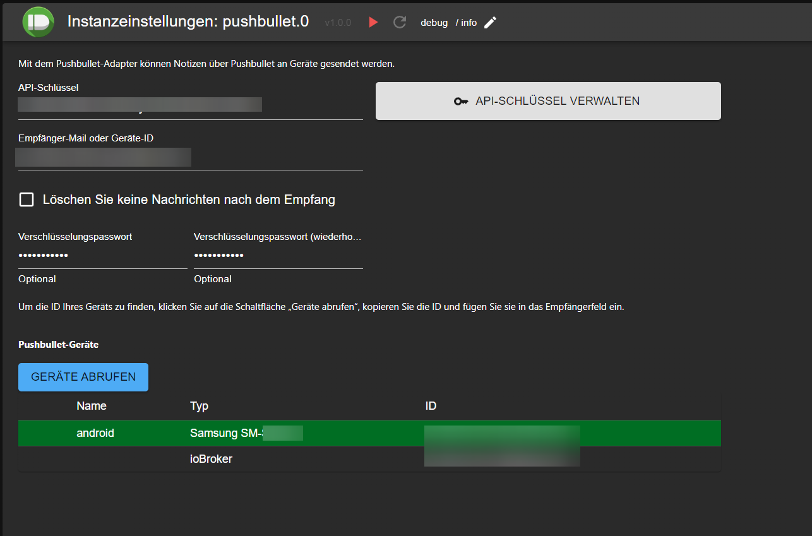
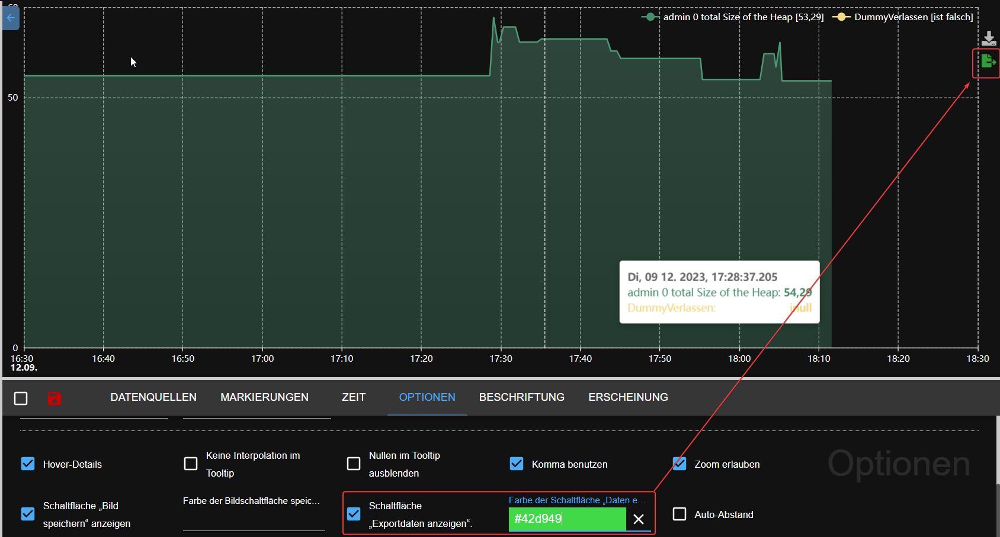

# What's new

## frigate (2023-08-20)
https://github.com/Bettman66/ioBroker.frigate

Frigate is an open source NVR built around real-time AI object detection. This adapter parses Frigate's MQTT messages and creates data objects from them

## notification-manager (2023-08-21)
https://github.com/foxriver76/ioBroker.notification-manager

Manage ioBroker notifications, e.g., by sending them as messages

## procon-ip (2023-08-24)
https://github.com/ylabonte/ioBroker.procon-ip

ioBroker adapter for basic support of the `ProCon.IP` swimming pool control unit. 

## deyeicd (2023-08-29)
https://github.com/raschy/ioBroker.deyeidc

Data Collector vor `Deye`-compatible Inverter

## acme (2023-09-01)
https://github.com/iobroker-community-adapters/ioBroker.acme

This adapter generates certificates using ACME challenges.

## cec2 (2023-09-06)
https://github.com/iobroker-community-adapters/ioBroker.cec2

Adapter for HDMI CEC - You can monitor / control devices using HDMI CEC. Most modern TVs and multimedia devices support CEC to some extent.

## alexa2 (2023-09-09)
* (Apollon77) Update Alexa2 adapter to adjust to the changed Push-Notification system from Amazon to allow getting history and interaction information again

## vis-2-widgets-material (2023-09-10)
* (bluefox) Door lock widget has been added
    
    

## pushbullet (2023-09-10)
* (bluefox) API has been updated to version 3
* (bluefox) JSON configuration was added
 

## JSON config Dokumentation
* (bluefox) JSON-Config documentation has been added to the ioBroker website [hinzugefügt](https://www.iobroker.net/#en/documentation/dev/adapterjsonconfig.md). 

## telegram-menu (2023-09-11)
https://github.com/MiRo1310/ioBroker.telegram-menu

Easily create Telegram Menus

## vis-2 (2023-09-12)
* (bluefox) Horizontaler Menü
    

## echart (2023-09-12)
* (bluefox) Added the ability to export the data to JSON file
    
* (bluefox) Added the ability to restore zoom and pan after X seconds of inactivity
    
* (bluefox) Show legend as dialog
  

## js-controller (2023-09-14)
* (foxriver76) Release js-controller 5 to stable
* (foxriver76) Upgrade installer to just allow Node.js 16.x+

## apg-info (2023-09-16)
This adapter provides the peak-times for the Austrian Power Grid, where power consumption shall be avoided. In addition the adapter provides the PHELIX-AT Day-Ahead (EPEX Spot) prices for Austria.

## tinymqttbroker (2023-09-16)
This is very tiny MQTT broker which is not managing any objects/states in iobroker but offers a central MQTT broker instance to publish an subscribe topics as MQTT client. 

## atlas-scientific-ezo-i2c (20230-09-18)
This ioBroker Adapter integrates several Atlas Scientific EZO Devices https://atlas-scientific.com/ into your own ioBroker environment.
