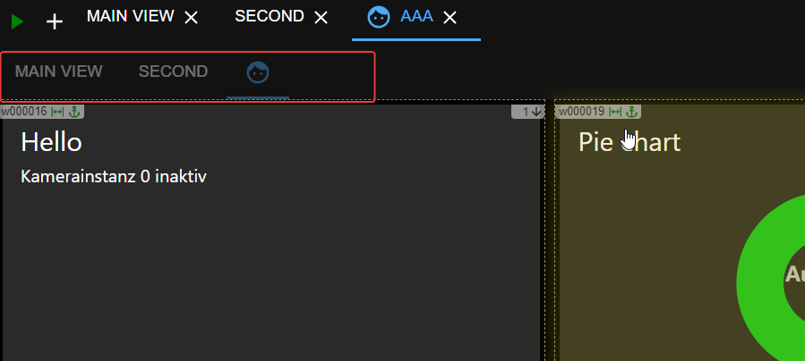
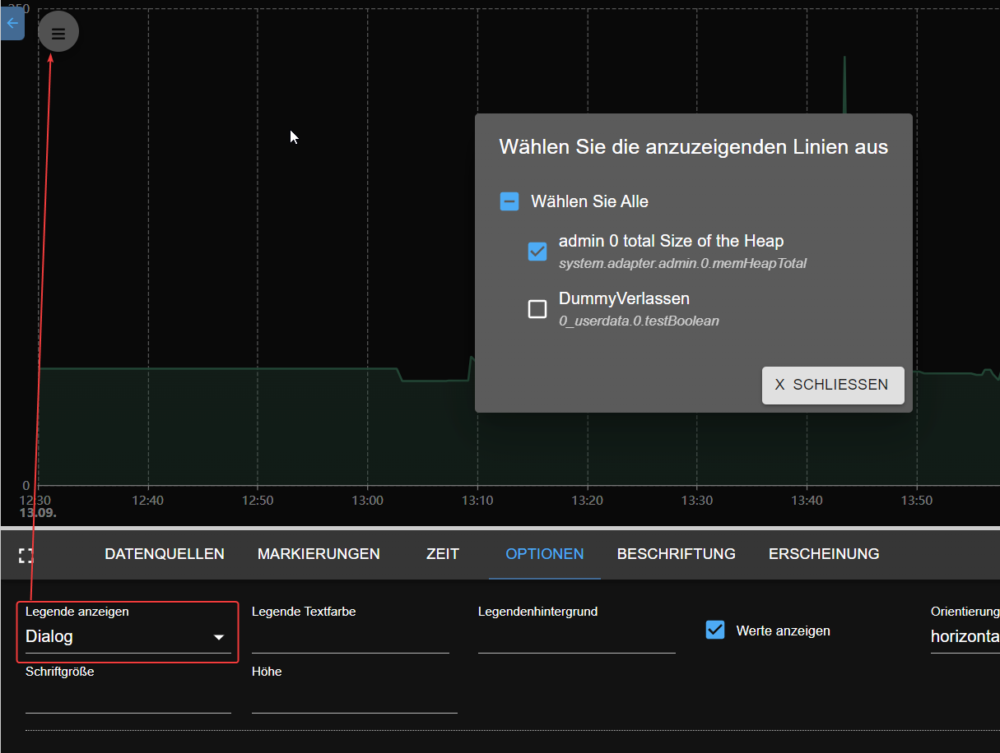

# Was ist neu
## Anleitung für Autoren
- Bitte definieren Sie den Header als

  ## AdapterName (JJJJ-MM-TT) – [Kurzbeschreibung]
- Beschreibung des Schusses könnte sein:
  - neuer Adapter
  - stabile Version
  - neue Funktion
  - neues Widget
- Wenn Sie Neuigkeiten zum neuen Adapter haben, fügen Sie bitte einen GitHub-Link und ein Logo des Adapters hinzu

  Beispiel:

``` 
    ## frigate (2023-08-20) - new adapter
    https://github.com/Bettman66/ioBroker.frigate

    
```

## Fregatte (20.08.2023) – neuer Adapter
https://github.com/Bettman66/ioBroker.frigate


Frigate ist ein Open-Source-NVR, der auf der Erkennung von KI-Objekten in Echtzeit basiert. Dieser Adapter analysiert die MQTT-Nachrichten von Frigate und erstellt daraus Datenobjekte

## Notification-manager (21.08.2023) – neuer Adapter
https://github.com/foxriver76/ioBroker.notification-manager


Verwalten Sie ioBroker-Benachrichtigungen, indem Sie sie z. B. als Nachrichten versenden

## Procon-ip (24.08.2023)
https://github.com/ylabonte/ioBroker.procon-ip


ioBroker-Adapter zur Basisunterstützung der `ProCon.IP` Schwimmbadsteuereinheit.

## Deyeicd (29.08.2023)
https://github.com/raschy/ioBroker.deyeidc


Datensammler für `Deye`-kompatible Wechselrichter

## Acme (01.09.2023)
https://github.com/iobroker-community-adapters/ioBroker.acme


Dieser Adapter generiert Zertifikate mithilfe von ACME-Herausforderungen.

## Admin (01.09.2023)
Kontextmenü:

- z. B. einfache Erstellung von Aliasen

  

## Javascript (01.09.2023)
Spielplatz für JavaScript-Code:

- Sie können ChatGPT (erforderlicher API-Schlüssel) verwenden, um das Skript zu generieren. Es dient lediglich dazu, die Möglichkeiten von ChatGPT zu testen

  

## Cec2 (06.09.2023)
https://github.com/iobroker-community-adapters/ioBroker.cec2


Adapter für HDMI CEC – Sie können Geräte mit HDMI CEC überwachen/steuern. Die meisten modernen Fernseher und Multimediageräte unterstützen CEC in gewissem Umfang.

## Alexa2 (09.09.2023)
* (Apollon77) Aktualisieren Sie den Alexa2-Adapter, um ihn an das geänderte Push-Benachrichtigungssystem von Amazon anzupassen und den Abruf von Verlaufs- und Interaktionsinformationen wieder zu ermöglichen

## Vis-2-widgets-material (10.09.2023)
* (bluefox) Türschloss-Widget wurde hinzugefügt

 

## Pushbullet (10.09.2023)


* (bluefox) API wurde auf Version 3 aktualisiert
* (bluefox) JSON-Konfiguration wurde hinzugefügt

  

## JSON-Konfigurationsdokumentation
* (bluefox) JSON-Config-Dokumentation wurde der ioBroker-Website hinzugefügt [hinzugefügt](https://www.iobroker.net/#en/documentation/dev/adapterjsonconfig.md).

## Telegram-menu (11.09.2023)
https://github.com/MiRo1310/ioBroker.telegram-menu


Erstellen Sie ganz einfach Telegram-Menüs

## Vis-2 (12.09.2023)
* (bluefox) Horizontales Menü

  

## Echarts (12.09.2023)
* (bluefox) Möglichkeit hinzugefügt, die Daten in eine JSON-Datei zu exportieren

  

* (bluefox) Es wurde die Möglichkeit hinzugefügt, Zoom und Schwenk nach X Sekunden Inaktivität wiederherzustellen

  

* (bluefox) Legende als Dialog anzeigen

  

## Js-controller (14.09.2023)
* (foxriver76) Geben Sie js-controller 5 auf stabil frei
* (foxriver76) Aktualisieren Sie das Installationsprogramm, um nur Node.js 16.x+ zuzulassen

## Apg-info (16.09.2023)
https://github.com/HGlab01/ioBroker.apg-info – neuer Adapter


Dieser Adapter stellt die Spitzenzeiten für das österreichische Stromnetz bereit, in denen Stromverbrauch vermieden werden soll. Darüber hinaus stellt der Adapter die PHELIX-AT Day-Ahead (EPEX Spot) Preise für Österreich bereit.

## Tinymqttbroker (16.09.2023) – neuer Adapter
https://github.com/HGlab01/ioBroker.tinymqttbroker


Dies ist ein sehr kleiner MQTT-Broker, der keine Objekte/Zustände in iobroker verwaltet, sondern eine zentrale MQTT-Broker-Instanz bietet, um Abonnementthemen als MQTT-Client zu veröffentlichen.

## Awtrix-light (2.10.2023) – neuer Adapter
https://github.com/klein0r/ioBroker.awtrix-light


Integrieren Sie Ihr Awtrix Light-Gerät (z. B. Ulanzi TC001) über HTTP

## Webui (3.10.2023) – neuer Adapter
https://github.com/iobroker-community-adapters/ioBroker.webui


Dies ist ein vollständiges Visualisierungssystem für ioBroker.

* vollständig auf Webkomponenten basierend
* Wysiwyg-Editor für die Benutzeroberfläche, Sie können aber auch zur Quellansicht oder geteilten Ansicht wechseln
* Benutzeroberfläche mit mehreren Fenstern in der Bearbeitungsansicht, wie in Visal Studio
* Bindungen per Drag/Drop von ioBroker-Objekten auf UI-Elementen oder Eigenschaften
* komplexe Bindungen mit Javascript und Konvertern
* einfache Skriptsprache, die über die Benutzeroberfläche erstellt werden kann

## Heizungssteuerung (4.10.2023) - neuer Adapter
https://github.com/jbeenenga/ioBroker.heizungssteuerung


Mit diesem Adapter können Heizungsanlagen verwaltet werden.
Sie können zwischen Kühl- und Heizmodus wählen und für einen Raum Boost oder Pause aktivieren.
Darüber hinaus können Sie die Solltemperatur für einen Raum überschreiben.

## Admin und mqtt (11.10.2023) – neue Funktion
Admin- und MQTT-Adapter prüfen jetzt, ob sie über das öffentliche Internet erreichbar sind, wenn keine Authentifizierung aktiviert ist. Wenn nicht, wird im Protokoll und im Admin eine Warnung angezeigt.

Dies ist eine nützliche Funktion, da nicht alle Benutzer wissen, wie sie ihre Adapter sichern können, und es gefährlich ist, MQTT- oder Admin-Adapter ohne Authentifizierung für das Internet geöffnet zu haben.

## Iobroker (11.10.2023) – neue Funktion
Jetzt ist es möglich, Ihr node.js über die Befehlszeile zu aktualisieren: `iob nodejs-update` https://forum.iobroker.net/topic/69067/neuer-befehl-iob-nodejs-update

Sie können ohne zusätzliche Parameter auf eine vorgeschlagene Version (aktuell 18) aktualisieren oder eine Version angeben: `iob nodejs-update 20`

## Vis-2-widgets-material (13.10.2023) – neues Widget
Staubsauger-Widget wurde hinzugefügt.

Dieses Widget ist primär für Xiaomi-Staubsauger.
Es kann aber auch für jeden anderen Staubsauger verwendet werden.
Der einzige Unterschied besteht darin, dass Xiaomi die Zimmerreinigung unterstützt.


## Willkommen (17.10.2023) – neuer Adapter
https://github.com/ioBroker/ioBroker.welcome


Dieser Adapter zeigt alle Web- und Admin-Instanzen von ioBroker auf einer Seite auf Port 80 (konfigurierbar)


## Govee-local (20.10.2023) – neuer Adapter
https://github.com/boergegrunicke/ioBroker.govee-local


Steuern Sie Govee-Geräte über lokalen Zugriff (keine Cloud)

## Pylontech (23.10.2023) – neuer Adapter
https://github.com/PLCHome/ioBroker.pylontech


Fragen Sie die Zellspannungen und den Status der pylontech-Batterien über die Konsole ab.

## Signifylights (26.10.2023) – neuer Adapter
https://github.com/disaster123/ioBroker.signifylights


Signify Lights-Adapter für alle Arten von Signify WLAN-Leuchten wie WIZ, Philips WLAN und viele mehr ...

## Esphome (01.11.2023) – neue Funktion
In einer bedeutenden Entwicklung für Heimautomatisierungsbegeisterte wurde in der ESPHome-Dokumentation die Integration von ioBroker mit seiner nativen API offiziell bestätigt.
Dieses Update folgt der Annahme einer aktuellen PR, die ioBroker neben Home Assistant als eines der exklusiven Hausautomationssysteme platziert, das die native API von ESPHome für die direkte Kundenkommunikation nutzt.

Die native API, die für ihr hochoptimiertes Netzwerkprotokoll bekannt ist, bietet zahlreiche Vorteile gegenüber herkömmlichen MQTT-Methoden und optimiert die Art und Weise, wie intelligente Geräte innerhalb des Ökosystems interagieren.
Mit dieser Anerkennung bekräftigt ESPHome sein Engagement für die Bereitstellung effizienter und robuster Kommunikationskanäle für die Smart-Home-Branche.

## Vis (06.11.2023) – neue Funktion
Die Lizenz von vis wurde in MIT geändert. Dies bedeutet, dass Sie vis in kommerziellen Projekten kostenlos nutzen können und keine Lizenz erforderlich ist.

## Willkommen (07.11.2023) – neues Feature
Möglichkeit hinzugefügt, benutzerdefinierte Links zur Willkommensseite hinzuzufügen. Die Seiten werden überprüft, ob sie aktiv sind.


## Echarts (08.11.2023) – neue Funktion
Vis-2-Widget wurde hinzugefügt. Zusätzlich zu den Voreinstellungen können Sie jetzt die Objekt-ID direkt mit Verlaufsdaten verwenden.


## Renacidc (17.11.2023) – neuer Adapter
https://github.com/raschy/ioBroker.renacidc


Auslesen der Daten von Renacpower-Solarwechselrichtern

##Wetterwarnungen (24.11.2023) – neuer Adapter
https://github.com/ticaki/ioBroker.weather-warnings


Dieser Adapter greift auf Wetterwarnungen verschiedener Wetterdienste zu und gibt diese als Text- oder Sprachnachrichten aus. Darüber hinaus werden nach Typ gruppierte Zustände erstellt, mit denen auf aktuelle Warnungen reagiert werden kann.

##tractive-gps (06.12.2023) – neuer Adapter
https://github.com/iobroker-community-adapters/ioBroker.tractive-gps


Mit diesem Adapter können Sie eine Verbindung zum Tractive GPS-Dienst herstellen und den Standort Ihrer Haustiere abrufen.

## Admin (06.12.2023) – neue Funktion
Es ist möglich, die Menüfarben im Admin zu ändern


## Emporia (07.12.2023) – neuer Adapter
https://github.com/Chris-656/ioBroker.emporia


Dieser Adapter ruft Daten vom Emporia-Energiesystem ab.

## Reolink (27.12.2023) – neuer Adapter
https://github.com/aendue/ioBroker.reolink


Adapter für die ioBroker-Plattform zum Abrufen von Reolink-Kamerainformationen.

## Vis-2 (02.01.2024) – neue Funktion
https://github.com/ioBroker/ioBroker.vis-2

vis-2 befindet sich jetzt im stabilen Repository. Es ist eine neue Generation von Vis. Es basiert auf ReactJS und verfügt über viele neue Funktionen.