# Proxmox 

## Proxmox - ioBroker Installation in einer VM (Virtuellen Maschine) 

?> ***Dies ist ein Platzhalter***.
     
   Hilf mit bei ioBroker und erweitere diesen Artikel.  
   Bitte beachte den [ioBroker Style Guide](https://www.iobroker.net/#de/documentation/community/styleguidedoc.md), 
   damit die Änderungen einfacher übernommen werden können.

 

## Proxmox - ioBroker Installation in einem LXC (Linux Container)

?> ***Dies ist ein Platzhalter***.
     
   Hilf mit bei ioBroker und erweitere diesen Artikel.  
   Bitte beachte den [ioBroker Style Guide](https://www.iobroker.net/#de/documentation/community/styleguidedoc.md), 
   damit die Änderungen einfacher übernommen werden können.

 

## Proxmox - LXC (Linux Containers) -> USB Geräte durchreichen

Dieser Teil der Anleitung erklärt Schritt für Schritt das durchreichen eines USB-Gerätes (USB Passthrough) in Proxmox an einen LXC (Linux Container).

Bei einer VM ist das durchreichen eines USB-Gerätes direkt über die Web Oberfläche von Proxmox möglich, bei einem Linux Container muss hierfür aktuell noch manuell die Konfigurationsdatei des lxc bearbeitet werden. 

In der Anleitung wird das Einbinden eines **Texas Instruments Inc. CC2531** Zigbee Stick beschrieben, dieselben Schritte können aber analog für andere Zigbee Sticks (ConBee, CC2652P etc.) oder für andere USB-Geräte mit der Ausnahme von USB Netzwerk Geräten (Bluetooth/Wlan) verwendet werden.

* Für diesen Teil der Anleitung wurde Proxmox in der Version 7.1 verwendet. 

### 1.) Informationen zum USB-Gerät sammeln

Aufbau einer SSH-Verbindung zu Proxmox:

~~~
ssh root@IP-Adresse
~~~

**Sollte das USB-Gerät bereits mit dem Proxmox Host verbunden sein, stecke das Gerät vorerst ab.**

Mit folgendem Befehl werden alle aktuell verbunden USB-Geräte am Proxmox Host aufgelistet: 

~~~
lsusb
~~~
 
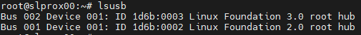

Nun wird das zu einbindende USB-Gerät am Proxmox Host eingesteckt und der Befehl lsusb erneut ausgeführt

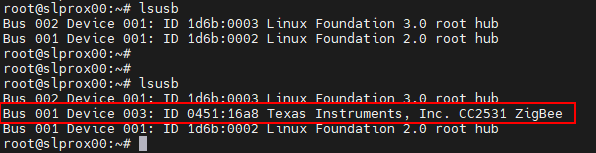 

Im Screenshot ist zusehen das ein neues Gerät mit der USB-Bus-Nummer: **001** und der Device-Nummer: **003** gelistet wird.

Diese Informationen werden benötigt um mit dem folgenden Befehl u. a. die **major device number** vom Gerät auszugeben:

~~~
ls -l /dev/bus/usb/001/003
~~~

Wichtig verwende bei dem Befehl die Ausgabe deiner USB-Bus-Nummer und Device-Nummer!

***ls -l /dev/bus/usb/USB-Bus-Nummer/Device-Nummer***

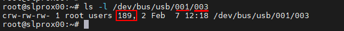

Das USB-Gerät hat in diesem Beispiel die major device number **189**, notiere dir den Wert deines Gerätes in einer Textdatei mit dem Vermerk: #1

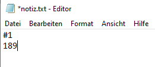
 
Als nächstes geben wir die unique id des USB-Gerätes aus und notieren den Ausgabe Wert in der Textdatei mit dem Vermerk: #2
 
~~~
ls /dev/serial/by-id/
~~~

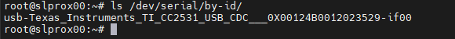

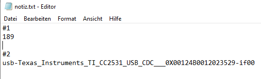
 
Als letzten Schritt wird die major device number des ttyACM ausgegeben und mit dem Vermerk: #3 notiert:

~~~
ls -l /dev/ttyACM*
~~~

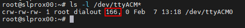
 
>*Sollte hierbei keine Ausgabe erfolgen, prüfe mit „ls -l /dev/serial/by-id/“ ob das USB-Gerät vom System als ttyUSB eingebunden wird, wenn ja ersetze alle folgenden Befehle die sich auf **ttyACM…** beziehen durch **ttyUSB…**  sollte keine Ausgabe erscheinen ist es kein USB CDC class Gerät (Serielle Kommunikation) damit können alle Punkte zum Einbinden vom ttyACM ignoriert werden.*

Somit haben wir **drei** Werte vom USB-Gerät notiert die für das Einbinden in der Konfigurationsdatei des lxc benötigt werden.
 
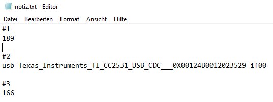

###  2.) LXC Konfigurationsdatei bearbeiten

Am Proxmox Host ins LXC Konfigurationsverzeichnis wechseln mit:

~~~
cd /etc/pve/lxc
~~~

Die Konfigurationsdatei hat die gleiche ID Nummer die bei der Erstellung des lxc vergeben wurde!
 
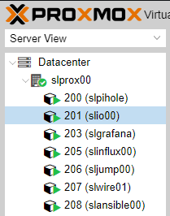

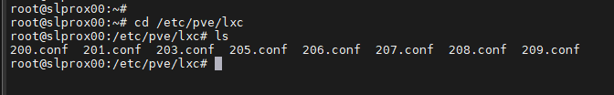
 
Bevor die Konfigurationsdatei bearbeitet wird, sollte eine Sicherheitskopie erstellt werden:

~~~
cp 201.conf 201.conf.backup
~~~

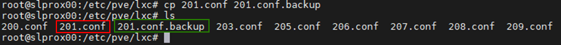
 
Nun wird die Konfigurationsdatei mit vi oder nano bearbeitet:

~~~
nano 201.conf
~~~
 
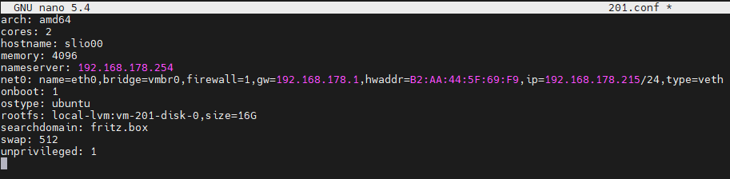

Ans Ende der Konfigurationsdatei wird folgendes hinzugefügt:

~~~
lxc.cgroup2.devices.allow: c 189:* rwm
lxc.mount.entry: usb-Texas_Instruments_TI_CC2531_USB_CDC___0X00124B0012023529-if00 dev/serial/by-id/usb-Texas_Instruments_TI_CC2531_USB_CDC___0X00124B0012023529-if00 none bind,optional,create=file

lxc.cgroup2.devices.allow: c 166:* rwm
lxc.mount.entry: /dev/ttyACM0 dev/ttyACM0 none bind,optional,create=file
~~~

Ersetze die markierten Werte mit den vermerkten Einträgen aus deiner Notiz!

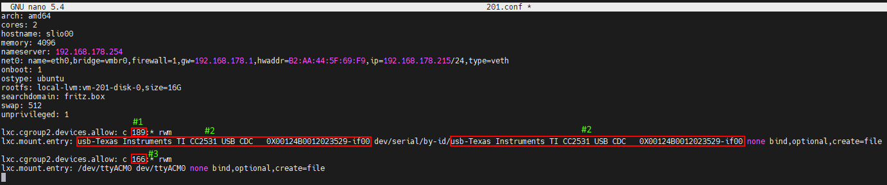

* Die erste Zeile bezieht sich auf die major device number **189** Vermerk: #1
* In der zweiten Zeile wird die unique id (usb-Texas_Instruments_TI_CC2531_USB_CDC___0X00124B0012023529-if00) aus Vermerk: #2 einzeln und mit dem absoluten Pfad angegeben, beachte das der komplette Text in einer Zeile ohne Zeilenumbruch geschrieben wird.
* In der dritten Zeile wird die major device number **166** von ttyACM aus Vermerk: #3 angegeben.

Die Konfigurationsdatei abspeichern (Im Nano Editor mit der Tastenkombination: STRG + o & STRG + x zum beenden des Editors)

   

**ACHTUNG! - Sollte dein Container aktive Snapshots besitzen:**

Dann gehört der lxc.cgroup Code nicht an das Ende der Config Datei sondern vor den ersten Eintrag eines Snaphots. 

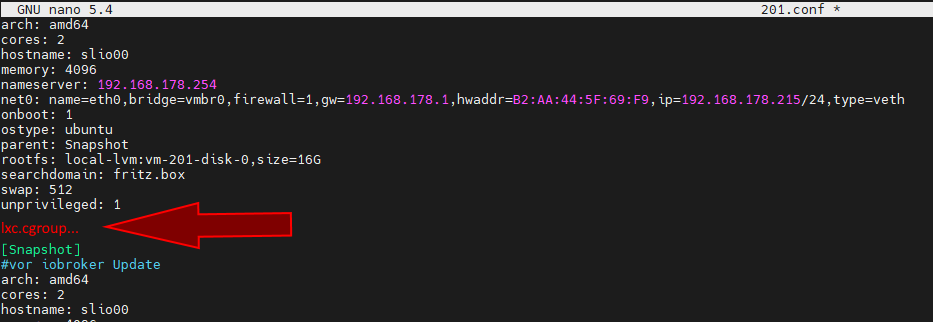

**ACHTUNG! - Proxmox Installation vor Version 7.0:**

Ersetze die Einträge mit
   
~~~
lxc.cgroup2
~~~   

durch
   
~~~
lxc.cgroup
~~~

   
Abschließend noch folgenden Befehl absetzen um die benötigten Rechte für ttyACM0 zu setzen:

~~~
chmod o+rw /dev/ttyACM*
~~~

Um die Anpassungen am lxc zu übernehmen einen cold boot vom Container mit **pct stop id / pct start id** durchführen:

~~~
pct stop 201
~~~

~~~
pct start 201
~~~

   

**Tipp lege dir eine Kopie deiner funktionierenden Config Datei am besten extern ab, da z. B. der integrierte Proxmox Backup Dienst nicht den Inhalt deiner Config mit sichert!**

   

### 3.) LXC USB Passthrough prüfen & Zigbee Instanz Konfiguration

Aufbau einer SSH-Verbindung zum LXC:

~~~
ssh Benutzer@IP-Adresse
~~~

Mit den befehlen:

~~~
lsusb
~~~

&

~~~
ls -l /dev
~~~

wird überprüft ob die Anpassungen an der Konfigurationsdatei erfolgreich waren.
 
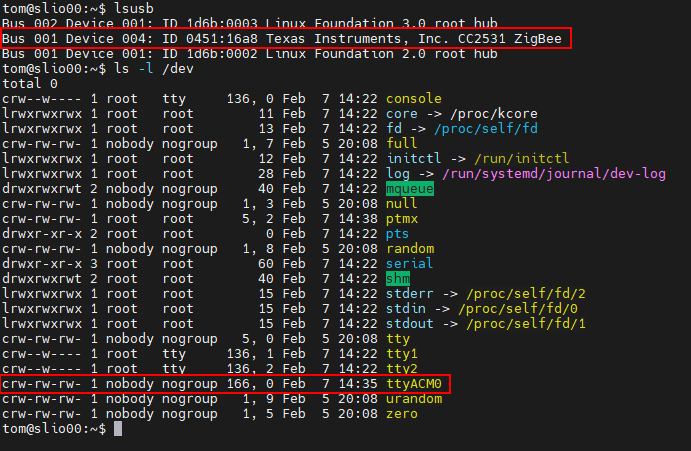
 
* Wie im Screenshot zu sehen hat nun der Container Zugriff auf das USB-Gerät.

* Wichtig hierbei ist das ttyACM0 die gleichen Rechte hat im Screenshot also **crw-rw-rw- 1 nobody nogroup**
>***Wenn nicht überprüfe ob alle Werte in der Konfigurationsdatei so gesetzt sind wie beschrieben, sollten die Rechte dann immer noch nicht übereinstimmen springe zu Punkt 5.***

* Im Screenshot ist ebenfalls zusehen das sich die Device Nummer vom cc2531 von dem Wert 3 auf 4 verändert hat, dies liegt daran das der Stick zwischenzeitlich einmal aus- und wieder angesteckt wurde. Da in der Konfigurationsdatei aber die unique id und nicht die Bus/Device Nummer angegeben ist funktioniert der USB Passthrough weiterhin.

Wird wie eingangsbeschrieben ein Zigbee Stick an den Container durchgereicht muss im iobroker in den Einstellungen des Zigbee Adapters unter dem Punkt COM-Anschlussname

~~~
/dev/ttyACM0
~~~

angegeben werden damit das korrekte Gerät vom Adapter angesprochen wird.
 
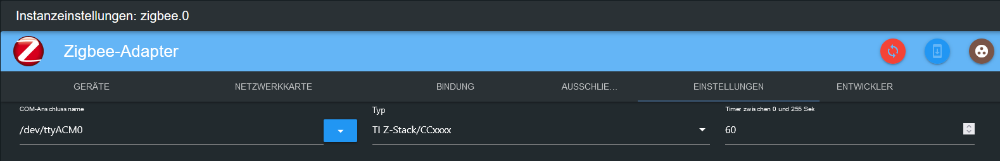

### 4.) UDEV Regel für permanente Rechte Anpassung von ttyACM0

Am Ende von Schritt 3 wurde mit dem Befehl 

~~~
chmod o+rw /dev/ttyACM*
~~~

die passenden Rechte für ttyACM0 gesetzt, diese Rechte Änderungen werden aber mit Neustart des Proxmox Host zurückgesetzt, für eine permanente Anpassung wird auf dem Proxmox Host eine udev Regel benötigt. 

Mit lsusb listen wir wieder die aktuell verbunden USB-Geräte auf:

~~~
lsusb
~~~

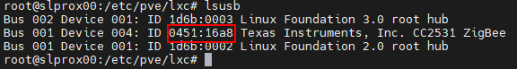
 
Diesmal notieren wir uns die Zahlenwerte Werte nach ID in diesem Fall also **0451:16a8**

* Der erste Wert: ***0451*** steht hierbei für den **idVendor** und der zweite Wert: ***16a8*** für **idProduct**.

Nun wird mit vi oder nano die udev Regel unter /etc/udev/rules.d erstellt:

~~~
nano /etc/udev/rules.d/50-myusb.rules
~~~

und folgender Inhalt eingefügt:

~~~
SUBSYSTEMS=="usb", ATTRS{idVendor}=="0451", ATTRS{idProduct}=="16a8", GROUP="users", MODE="0666"
~~~

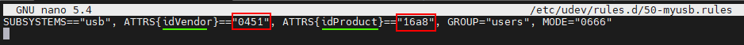
 

Abschließend noch folgenden Befehl ausführen um die udev Regel zu aktivieren:

~~~
udevadm control –reload
~~~

### 5.) Troubleshooting

**Fehler:** ttyACM0 Rechte im lxc passen nicht bzw. gehen nach kurzer Zeit verloren (ConBee II).

~~~
ls -l /dev/ttyACM0
 c--------- 0 nobody nogroup 166, 0 Feb  7 14:29 ttyACM0
~~~

 

**Lösung:** mit mknod eine dauerhafte Bindung für den Container erstellen. 

Dazu wird im Pfad **"/var/lib/lxc/CONTAINERID"** der Ordner **devices** erstellt und in diesem Ordner mit mknod die Bindung erzeugt: 

~~~
mkdir /var/lib/lxc/201/devices
~~~

~~~
cd /var/lib/lxc/201/devices
~~~

~~~
mknod -m 666 ttyACM0 c 166 0
~~~

+ *mknod erstellt in dem Pfad eine Datei namens ttyACM0 (solange die Datei existiert ist das Gerät an den lxc gebunden)*

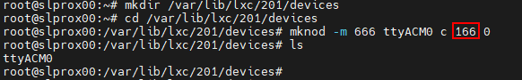

***major device number und ttyACM.. ggbfs. anpassen***

Anschließend muss noch der Eintrag der lxc Konfigurationsdatei angepasst werden:

~~~
lxc.mount.entry: /dev/ttyACM0 dev/ttyACM0 none bind,optional,create=file
~~~

wird ersetzt durch:

~~~
lxc.mount.entry: /var/lib/lxc/CONTAINERID/devices/ttyACM0 dev/ttyACM0 none bind,optional,create=file
~~~

