# Proxmox


## Proxmox Installation

Proxmox Virtual Environment (kurz Proxmox VE) ist eine auf Debian basierende
Virtualisierungsplattform. Die Virtualisierung basiert auf QEMU/KVM.

Proxmox „verpackt“ QEMU/KVM in einer eigenen Web-Oberfläche, vereinfacht die
Administration und unterstützt zusätzlich Linux-Containers (LXC). Dadurch ist
Proxmox einsteigerfreundlich, aber stark genug für den professionellen Einsatz.

Dieser Abschnitt zeigt an einem Beispiel die Installation und Grundkonfiguration
von Proxmox in der kostenlosen Variante (non-subscription).

Aufgrund der Übersichtlichkeit sind Bildbeschreibungen und Zusatzinfos zum Aufklappen.

_Hinweis:_ Einige Abbildungen in dieser Anleitung stammen aus älteren
Versionen von Proxmox oder Debian. Der Ablauf und die Klickpfade sind jedoch
inhaltlich stimmig und direkt auf aktuelle Versionen (wie Proxmox VE 9 und
Debian 13) übertragbar.

### Voraussetzungen

<details>
<summary>Voraussetzungen</summary>
   
- 64 Bit CPU
- CPU und Mainboard unterstützen Intel VT/AMD-V für die Virtualisierung (im
  BIOS zu aktivieren).
- 1 GB RAM (nur für Proxmox) – abhängig von der Anzahl der zu betreibenden virtuellen Maschinen wird hier natürlich mehr RAM benötigt. Daher sind hier minimal 8 GB, besser noch 16 GB RAM empfehlenswert.
   
</details>

### ISO Image/bootfähigen USB-Stick erstellen

Zunächst benöigt man ein ISO-Image, welches auf der [Proxmox-Download-Seite](https://www.proxmox.com/de/downloads/category/iso-images-pve) heruntergeladen werden kann.

<details>
<summary>Proxmox Iso</summary>
   
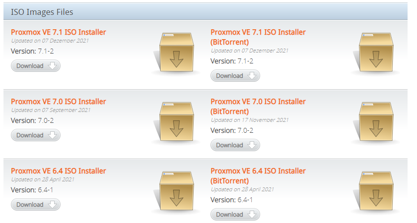
   
</details>

Zur Installation wird mit diesem ISO-Image ein bootfähiger USB-Stick erstellt.
Dieser sollte mindestens 2 GB Speicher haben. Zur Erstellung eines bootfähigen
Sticks gibt es mehrere Möglichkeiten, siehe [Installationsmedien vorbereiten][].

### Installation

Das System wird im UEFI/BIOS so konfiguriert, dass der Start von einem
USB-Device erfolgt. Nach dem Einstecken des USB-Sticks erscheint nach kurzer
Zeit das Installations-Menü von Proxmox. Alternativ lässt sich der USB-Stick
manuell als Startmedium angeben (bei den meisten Mainboards über F8 oder
F11).

Im Installations-Menü wird nun einfach **Install Proxmox VE** ausgewählt.

<details>
<summary>Installations Menü</summary>
   
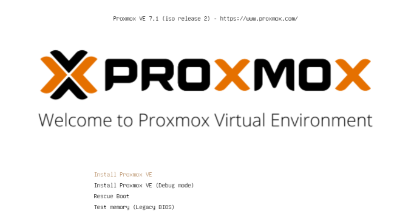
   
</details>

Im nächsten Schritt wird den Nutzungsbedingungen (EULA) zugestimmt.

<details>
<summary>Eula</summary>
   

   
</details>

Es folgt die Wahl der Festplatte, auf der Proxmox installiert werden soll. Falls mehrere Platten am Server installiert sind, sollte man hier darauf achten, auch die richtige Festplatte zu wählen!

<details>
<summary>Auswahl der Festplatte</summary>
   
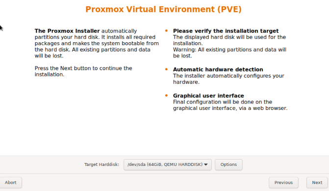
   
</details>

Mit dem **Button Options** kann man auch noch weitere Parameter zur Installations-Festplatte angeben:

<details>
<summary>Erweiterte Optionen Festplatte</summary>
   
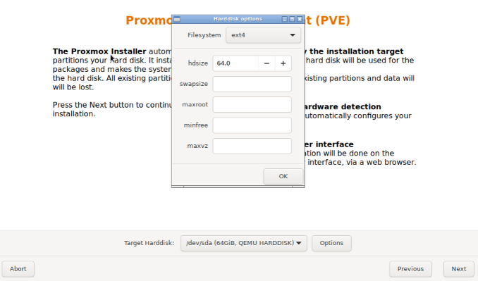
   
</details>

Proxmox nutzt den [Logical Volume Manager](https://de.wikipedia.org/wiki/Logical_Volume_Manager) (LVM). Mit den erweiterten Optionen an dieser Stelle kann u.a. das LVM in Detail konfiguriert werden.
Der Installer erstellt eine Volume Group (VG) mit dem Namen pve und zusätzliche Logical Volumes (LVs) mit den Namen root (hier wird Proxmox selbst installiert), data (Speicher, auf dem die virtuellen Platten der VMs gespeichert werden) und swap (hier wird das Swapfile gelagert).

<details>
<summary>Mit den erweiterten Einstellungen können hier gewisse Parameter angegeben werden:</summary>

- Filesystem: Hier kann man das Dateisystem wählen. Standard ist hier ext4 und in den meisten Fällen ist dies eine gute Wahl. Wenn mehrere Festplatten auf dem Host-System zur Verfügung stehen (und viel RAM), macht hier die Option zfs mit dem entsprechenden RAID-Level durchaus Sinn. In diesem Fall sollte man sich aber grundlegend mit ZFS beschäftigt haben.
- hdsize: Gibt Festplatten-Größe an, die für Proxmox insgesamt genutzt werden soll. Hier wählt man normalerweise die komplette Festplatten-Größe, es sei denn, man möchte später noch weitere Partitionen hinzufügen.
- swapsize: Bestimmt die Größe des Swap-Volumes. Standard ist hier die gleiche Größe wie der verbaute Speicher, jedoch minimal 4 GB und maximal 8 GB.
- maxroot: Gibt die maximal Größe des root-Volumes an(Proxmox selbst). **Hier ist zu erwähnen, das in der Grundinstallation, spätere benötigte Template's und Iso-Image's ebenfalls hier abgelegt werden.**
- minfree: Speicherplatz, der auf der LVM Volume Group pve freigelassen wird. Wenn die Festplatte größer als 128 GB ist, werden hier standardmäßig 16 GB frei gelassen (LVM benötigt immer etwas freien Speicher für die Erzeugung von Snapshots).
- maxvz: Legt die maximale Größe des data-Volumes fest.

</details>

Im Normalfall kann man hier alle Optionen auf der Standard-Einstellung belassen (d.h. hier wird nichts angegeben). Diese sind für die meisten Installationen bereits optimal eingestellt.

Nach der Wahl der Festplatte für Proxmox werden die Optionen zur Lokalisierung abgefragt (Land, Zeit und das dazugehörige Keyboard-Layout):

<details>
<summary>Lokalisierung</summary>
   
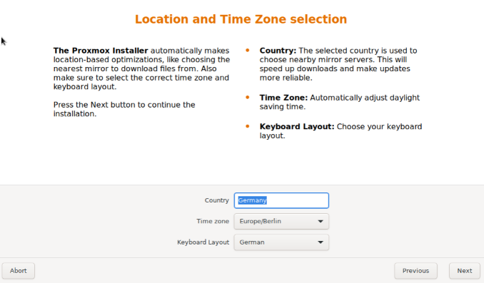
   
</details>

Im Anschluss wird das Passwort des root-Users eingegeben. Ebenso wird eine
E-Mail-Adresse angefragt, um wichtige Systemmeldungen dorthin zu senden. Eine
echte Adresse ist nicht zwingend erforderlich (dann erfolgt jedoch kein Hinweis
auf Systemereignisse per Mail).

<details>
<summary>Passwort und Email</summary>
   
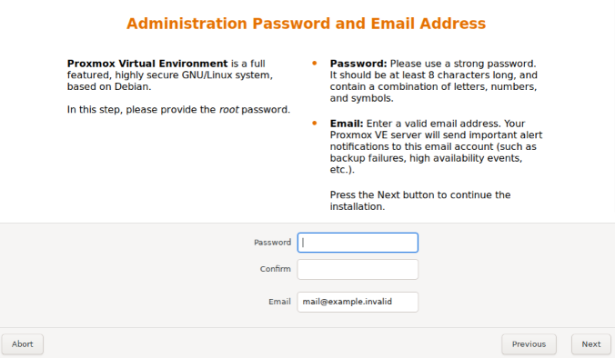
   
</details>

Der nächste Schritt des Installers beschäftigt sich mit den Netzwerk-
Einstellungen. Zur Auswahl steht die jeweilige Schnittstelle. Der Hostname
ist frei wählbar, erfordert jedoch die Angabe der DNS-Domäne.
Als Beispiel für Fritzbox User, wäre es `hostname.fritz.box`.
Bei IP Adress ist vorzugsweise eine statische IP-Adresse anzugeben (kein DHCP). Dazu zählt die IP-Adresse selbst (als CIDR-Notation), die Gateway-IP (normalerweise die IP-Adresse des Routers) und der zu verwendende DNS-Server (im privaten Umfeld meist auch die IP-Adresse des Routers). Proxmox erkennt meist das Netzwerk automatisch.

<details>
<summary>Netzwerk</summary>
   
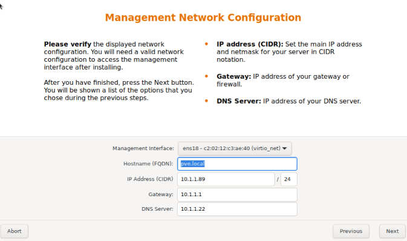
   
</details>

Am Ende wird noch eine Zusammenfassung der Installation angezeigt:

<details>
<summary>Zusammenfassung</summary>
   
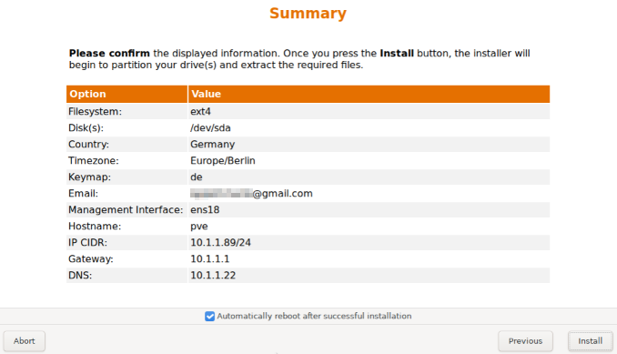
   
</details>

Durch eine Kontrolle der Einstellungen und einem Klick auf Install wird das System installiert.

<details>
<summary>Installation</summary>
   
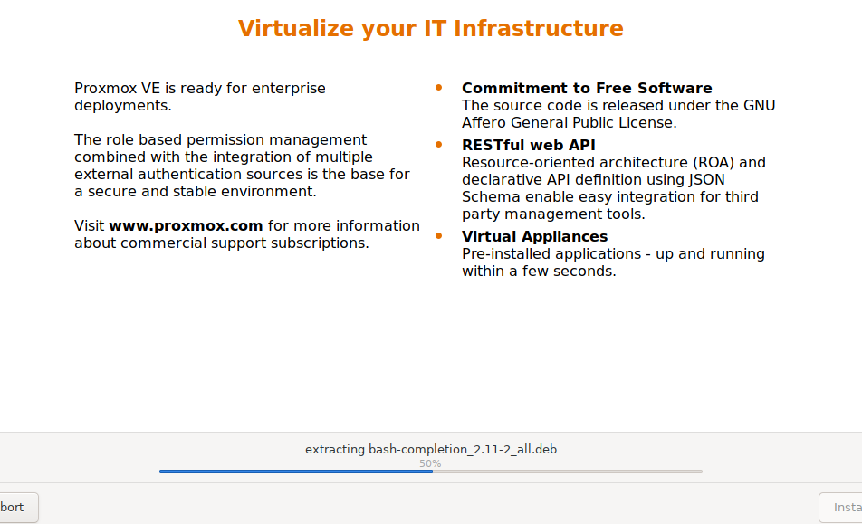
   
</details>

Nach einer kurzen Wartezeit ist die Installation abgeschlossen und das System
wird neu gestartet (zuvor den USB-Stick mit dem ISO-Image entfernen).

Anschließend sieht man das Terminal. Hier wird schon die Anweisung angezeigt, wie nun auf das System zugegriffen werden kann:

<details>
<summary>Konsole</summary>
   
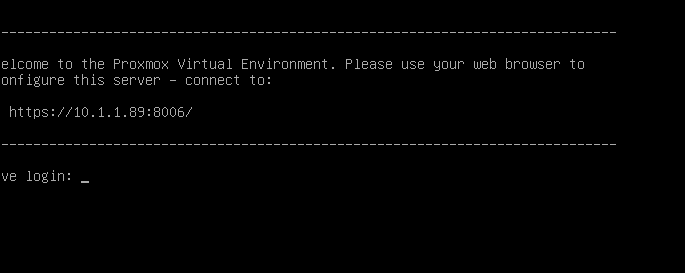
   
</details>

Nun geht es im Browser weiter (beispielhaft https://10.1.1.89:8006). Als erstes wird allerdings eine Warnung angezeigt. Dies liegt daran, dass während der Installation ein selbst signiertes Zertifikat erzeugt wurde, welches dem Browser natürlich nicht bekannt ist. Diese Meldung kann man an dieser Stelle getrost ignorieren – die Verbindung ist auf jeden Fall über HTTPS verschlüsselt. Die Meldung ansich, ist Browserabhängig. In diesem Beispiel, ein Klick auf **Erweitert** und anschließend auf **Weiter zu 10.1.1.89(unsicher)**

<details>
<summary>Datenschutzfehler</summary>
   
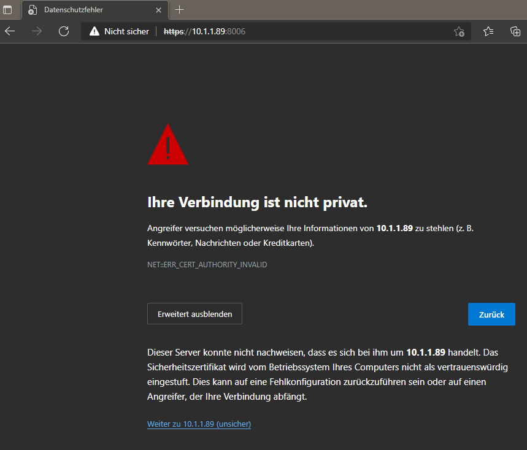
   
</details>

Die Anmeldung erfolgt mit dem User root und dem während der Installation
gewählten Passwort. Die Sprache lässt sich hier **zuerst** auf Deutsch
umstellen, wodurch eine erneute Eingabe von Benutzername und Kennwort entfällt.

<details>
<summary>Anmeldung</summary>
   
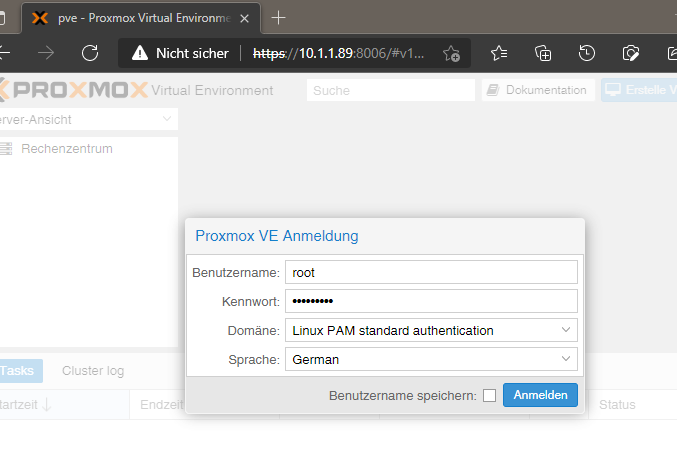
   
</details>

Direkt nach dieser Anmeldung wird man von einer Meldung begrüßt, dass man keine gültige Subscription für diesen Server hat. Diese Meldung wird erst einmal mit einem Klick auf OK bestätigt.

<details>
<summary>Subscription</summary>
   
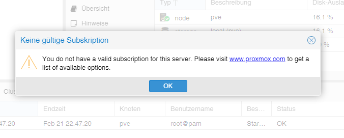
   
</details>

Nun werden die Proxmox-Paketquellen angepasst, um Updates erhalten zu können.

<details>
<summary>Paketquellen</summary>
   
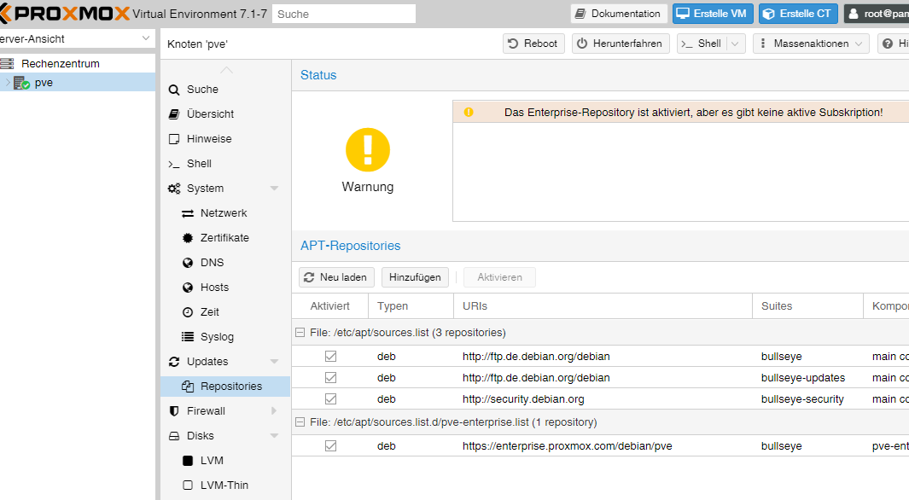
   
</details>

Dazu wird das **Non-Subscription-Repository** zu den Paketquellen hinzugefügt. Dies kann im Menü der Proxmox-Instanz unter `Updates > Repositories` erledigt werden. Über den Button Hinzufügen kann das Non-Subscription-Repository hinzugefügt werden:

<details>
<summary>Non-Subscription</summary>
   
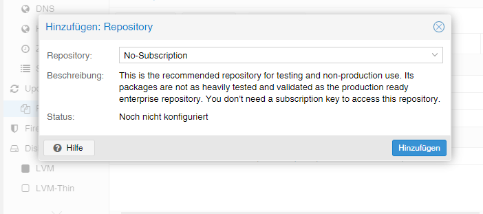
   
</details>

Nun sollte noch das **Enterprise-Repository** deaktiviert werden. Dazu einfach in der Repository-Ansicht das Repo pve-enterprise anwählen und auf den Button **Deaktivieren** klicken.

Die Konfiguration der Repositories sieht danach dann so aus:

<details>
<summary>Enterprise-Repository</summary>
   
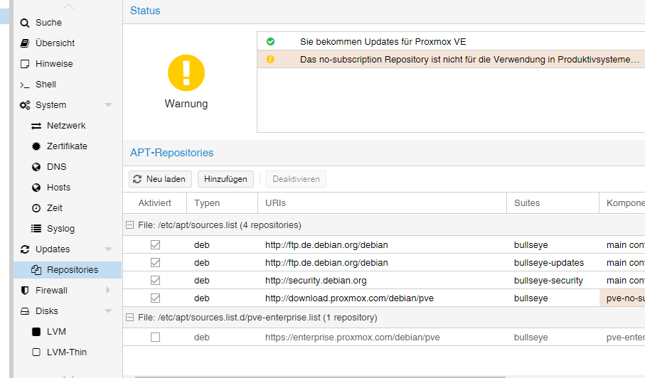
   
</details>

### Updates

Nachdem die Paketquellen umgestellt wurden, sollte im Anschluß ein erstes System Update durchgeführt werden. Hier geht man am besten über die Web-Oberfläche:

<details>
<summary>Updates</summary>
   
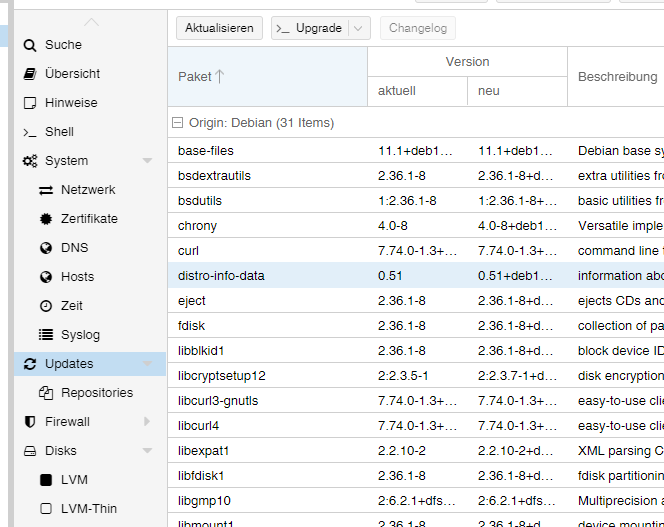
   
</details>

Einfach den gewünschten Proxmox-Knoten aussuchen (z.B. „pve“) und dann unter
Updates auf **Aktualisieren** klicken. Hier öffnet sich der sogenannte Task
Viewer, der bei Systemaktivitäten erscheint. Dieser Dialog kann direkt wieder
geschlossen werden, da der Task im Hintergrund weiterläuft. Ein Warten auf den
Abschluss („TASK OK“) ist nicht erforderlich.
Falls nun Updates verfügbar sind, können diese mit einem Klick auf **Upgrade** eingespielt werden.

Hier öffnet sich dann die Web-Konsole und man kann den Fortschritt beobachten.

<details>
<summary>Web-Konsole</summary>
   
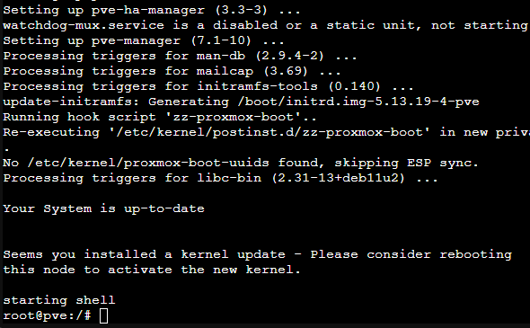
   
</details>

Es ist natürlich auch möglich, den Proxmox-Server über die Kommandozeile (z.B. per SSH) upzudaten:

```bash
apt-get update && apt-get dist-upgrade
```

oder seit kurzem auch:

```bash
apt update && apt full-upgrade
```

Wichtig ist hier nur, dass man ein **apt-get dist-upgrade** oder **apt full-upgrade** verwendet (auf „normalen“ Debian/Ubuntu-Maschinen nutzt man ja eher apt upgrade). Das „dist-upgrade“ bzw. "full-upgrade" ist bei Proxmox allerdings wichtig, da hier Abhängigkeiten besser aufgelöst werden, die zum Betrieb von Proxmox benötigt werden.

Insofern ist Proxmox nun in seiner Grundkonfiguration abgeschlossen. Wenn man sich ausgiebiger mit Proxmox beschäftigen möchte, lohnt ein Blick ins [Proxmox Wiki](https://pve.proxmox.com/wiki/Main_Page) bzw. ins [offizielle Forum](https://forum.proxmox.com/).

---

## Proxmox - Erstellen einer Virtuellen Qemu/KVM-Maschine (VM) + ioBroker Installation im Anschluß

Diese Anleitung zeigt, wie eine [VM][] (Debian stable, Stand 2026 = Debian 13
'Trixie') erstellt und anschließend ioBroker darin installiert wird.

Alternativ zu Debian kann ein Ubuntu verwendet werden, wobei auf die Verwendung
einer **LTS-Version** zu achten ist.

Zur besseren Übersichtlichkeit sind Bildbeschreibungen und Zusatzinfos in
aufklappbaren Bereichen enthalten.

### 1 - ISO-Image herunterladen

Zuerst wird ein ISO-Image ([64-Bit-PC Netinst-ISO][ISO-Image]) benötigt, welches in der Grundinstallation in das root-Verzeichnis (local) geladen wird.

Hierzu wird der Bereich local > ISO-Images aufgerufen. Es gibt zwei Möglichkeiten:

- Über den Button **Hochladen** lässt sich die ISO, die zuvor auf dem Rechner abgelegt wurde, auf den Proxmox-Host laden.
- Über **Von URL herunterladen** lässt sich die ISO direkt per URL auf den Host laden. Dazu wird die Link-Adresse der 64-Bit-PC Netinst-ISO kopiert (rechte Maustaste), die URL eingefügt und mit einem Klick auf **URL abfragen** abgerufen. Ein abschließender Klick auf **Herunterladen** startet den Download direkt auf den Host.

<details>
<summary>ISO herunterladen</summary>

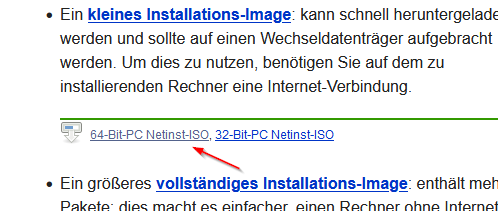

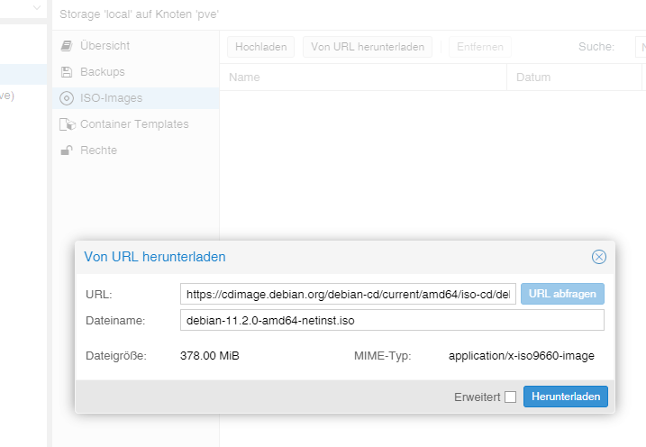

</details>

### 2 - VM erstellen

Mit einem Klick auf den blauen Button **Erstelle VM** öffnet sich ein Fenster
für die folgenden Einstellungen:

- Allgemein: Vergabe des Hostname und Passwort, ID wird vorgegeben (beginnt mit 100), kann geändert werden, jedoch nicht nachträglich.
- OS: Storage Auswahl(local) und ISO-Image(debian-13-netinst.iso)
- System: bleibt alles in der Standardeinstellung, **Qemu Agent Haken setzen**
- Disks: Storage local-lvm, Disk-Größe 10GB (10-20GB sollten ausreichend sein, ein nachträgliches Ändern ist möglich, wird jedoch hier nicht weiter beschrieben).
- CPU: Ist abhängig wie Leistungsstark der Rechner ist (kann ebenfalls jederzeit angepasst werden, VM muss dazu neu gestartet werden)
- Speicher: Ramgröße im MiB (kann ebenfalls jederzeit angepasst werden, VM muss dazu neu gestartet werden)
- Netzwerk: vmbr0, alles andere bleibt wie vorgegeben
- Bestätigen: Hier sieht man noch einmal eine Zusammenfassung, (Haken setzen bei **Nach Erstellen starten**) anschließend wird mit einem Klick auf **Abschließen** die VM erstellt.

<details>
<summary>Bilderserie Erstelle VM</summary>

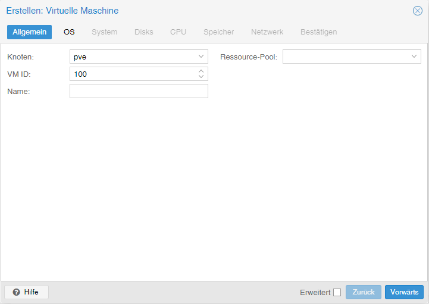

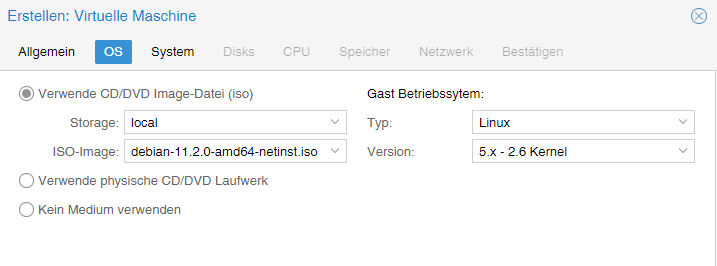

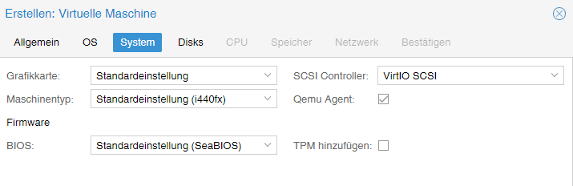

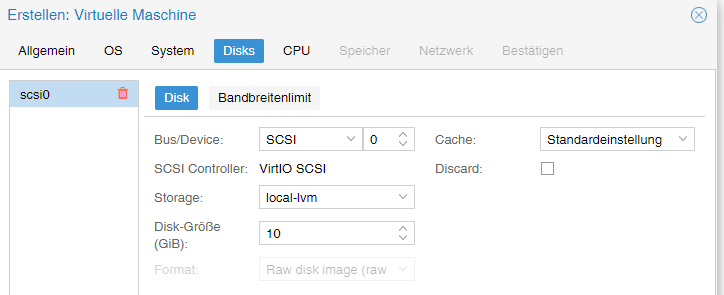

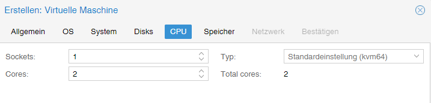

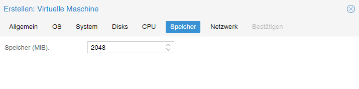

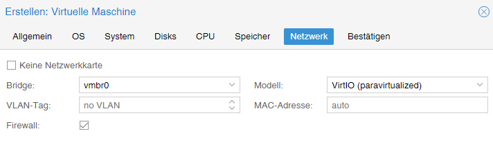

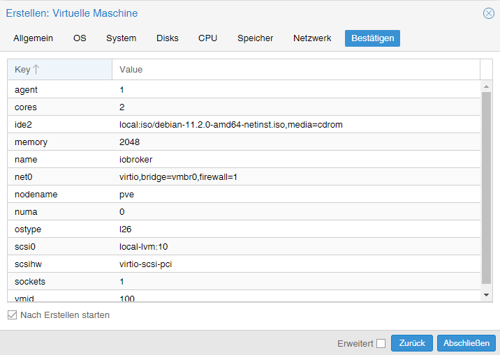

</details>

### 3 - Debian Install

Nachdem die VM gestartet wurde, begibt man sich nun auf die Konsole der VM und startet den **Install**.

<details>
<summary>Konsole</summary>

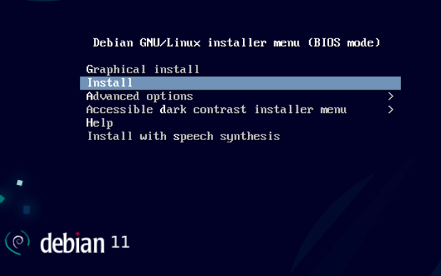

</details>

Hierbei wird man durch die Installation geführt und muss währenddessen einige Einstellungen tätigen. Zur Bedienung benötigt man die Tab-, Leer- und Pfeiltasten. Aufgrund des Umfangs sind diverse Einstellungen der Bilderserie zu entnehmen.

<span style="color:red">**ACHTUNG! - Es darf kein root Passwort vergeben werden.**</span>

<span style="color:red">**ACHTUNG! - ioBroker darf nicht als Benutzername gewählt werden, da dieser schon Systemintern verwendet wird.**</span>

Der Benutzername sollte lediglich aus Kleinbuchstaben und den Ziffern 0-9 bestehen und mit einem Buchstaben beginnen. Ebenfalls zulässig ist der Bindestrich, allerdings nicht als erstes Zeichen.

<details>
<summary>Bilderserie Debian Install</summary>

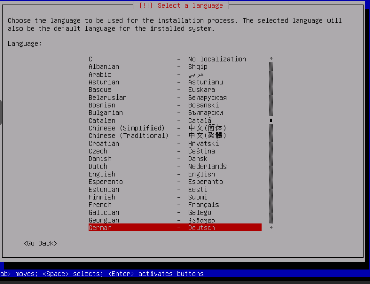

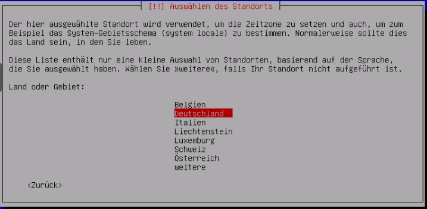

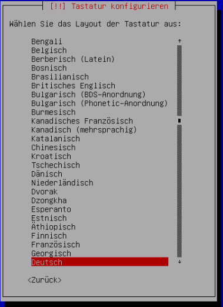

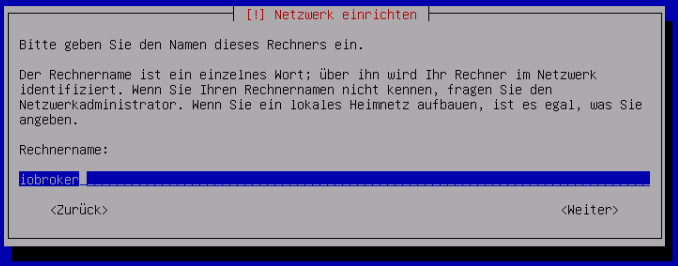

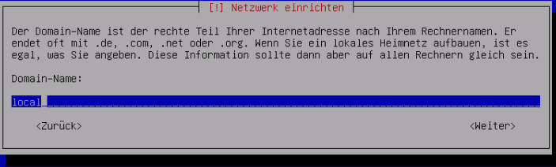

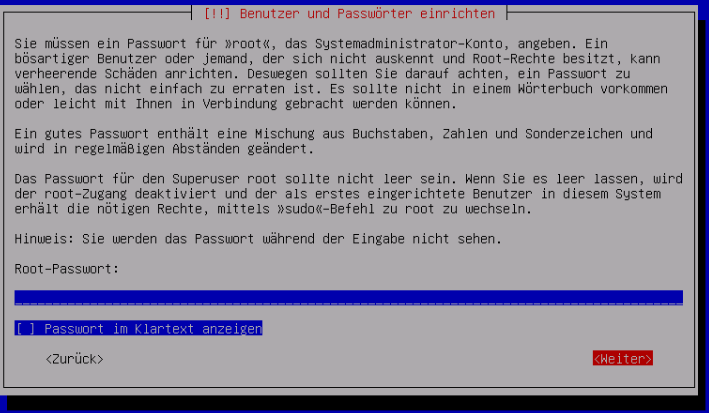

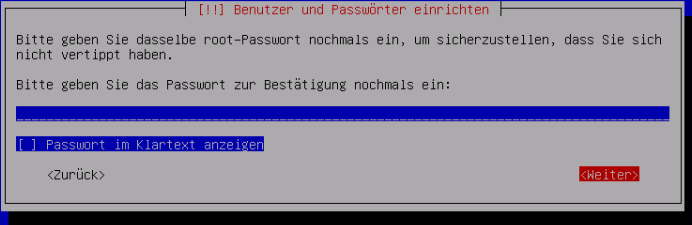

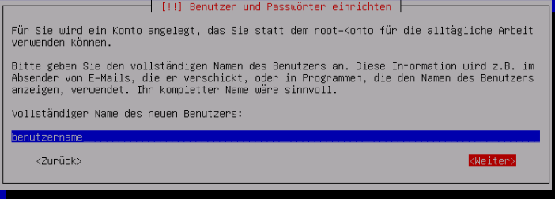

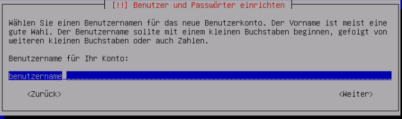

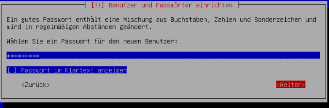

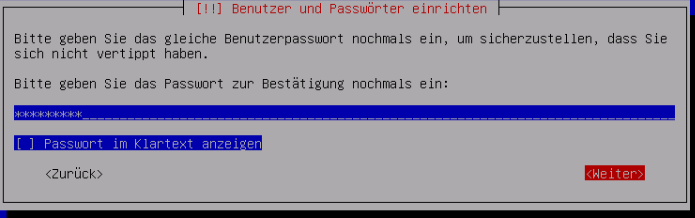

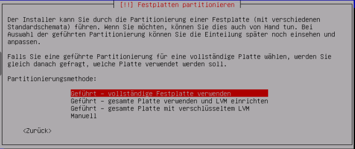

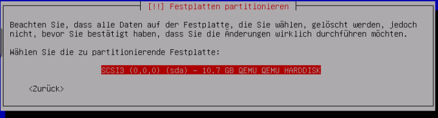

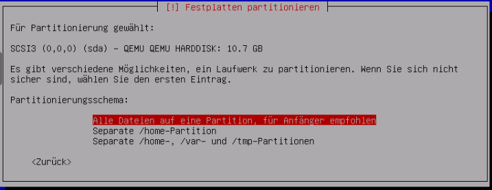

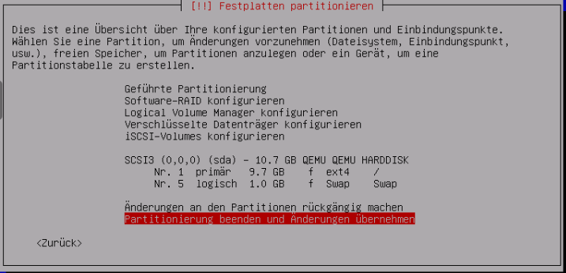

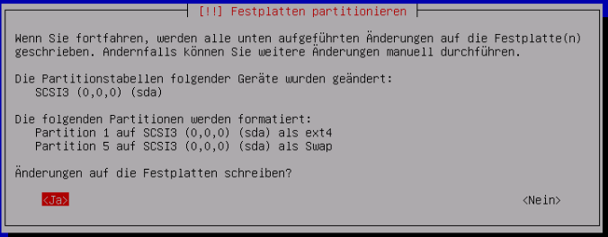

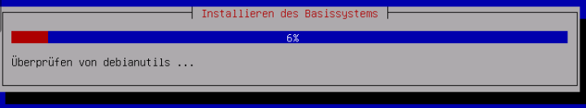

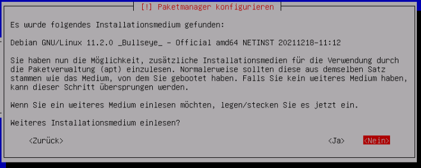

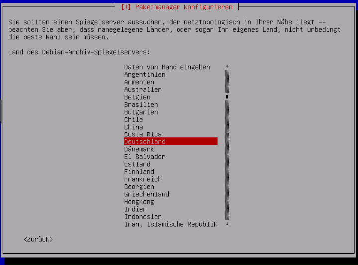

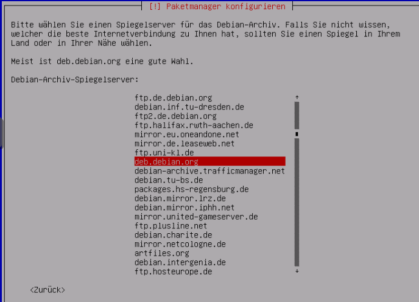

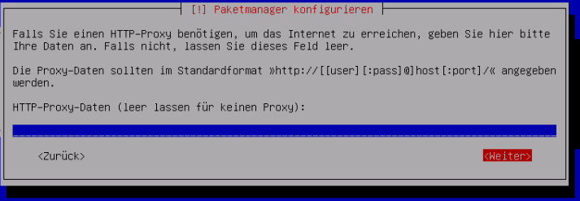

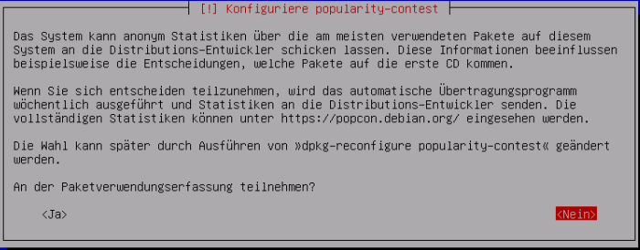

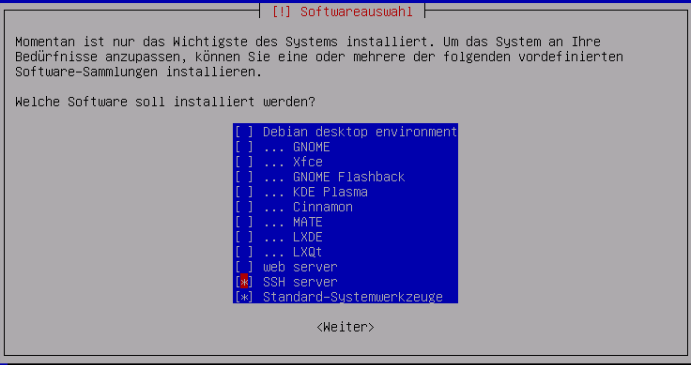

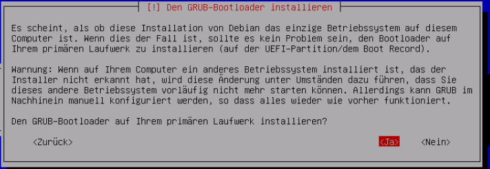

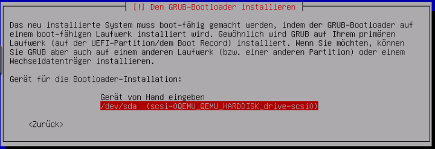

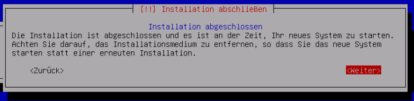

</details>

### 4 - VM einrichten

VM neu starten, danach loggt man sich mit dem aus der Installation vergebenen "Benutzername" und "Passwort" ein. Anschliessend wird mit dem Befehl

```bash
ip addr
```

die IP-Adresse ausfindig gemacht. Diese wird benötigt, um wie im nächsten Schritt, sich remote per ssh mit der VM zu verbinden.

<details>
<summary>ip addr</summary>

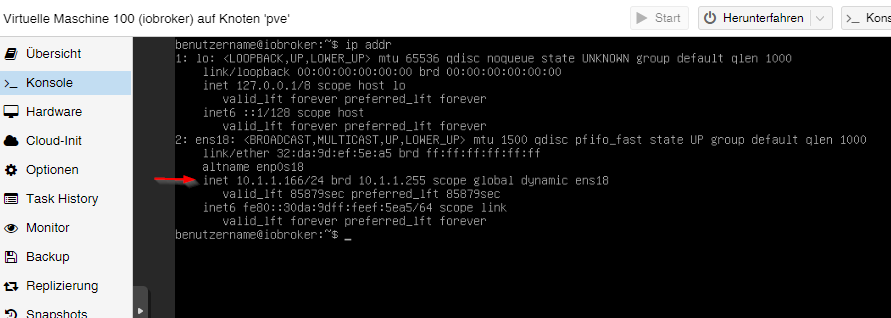

</details>

Nun kann per ssh (z.b. PuTTY) auf die VM zugegriffen werden. Hier loggt man sich ebenfalls wieder mit "Benutzername" und "Passwort" ein.
Anschließend kann die Netzwerkadresse von **dhcp** auf **statisch** geändert werden. (was bei Serverbetrieb zu empfehlen ist)

```bash
sudo nano /etc/network/interfaces
```

<details>
<summary>network/interfaces</summary>

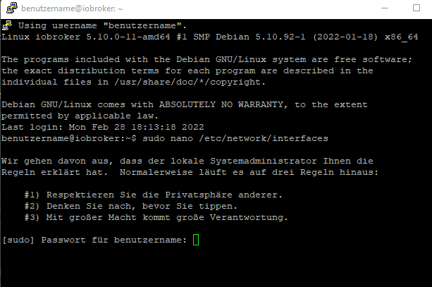

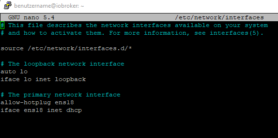

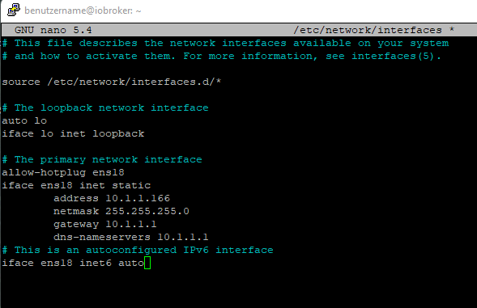

</details>

Änderungen im Editor werden mit der Tastenkombination STRG + o , danach ENTER, gespeichert, STRG + x beendet den Editor.

Änderungen der IP werden erst nach einem Neustart der VM wirksam. Zuvor wird jedoch noch geprüft, ob der Qemu-Guest-Agent aktiv ist, mittels

```bash
sudo systemctl status qemu-guest-agent
```

<details>
<summary>Guest-Agent</summary>

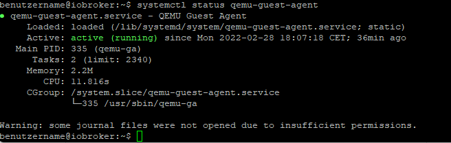

</details>

<span style="color:orange">**ACHTUNG! - Bei Ubuntu-Installationen ist der
Qemu-Guest-Agent nachzuinstallieren und zu starten.**</span>

Befehle dazu:

```bash
sudo apt-get install qemu-guest-agent
sudo systemctl start qemu-guest-agent
```

Des Weiteren ist für die Installation von ioBroker das Tool **curl**
nachzuinstallieren.

```bash
sudo apt install curl
```

<details>
<summary>curl nachinstallieren</summary>

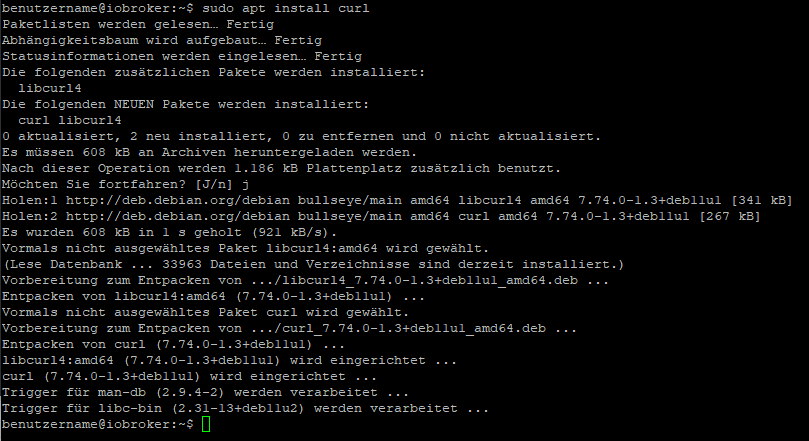

</details>

Um Geräte(USB) in einer VM durchzureichen, wählt man die VM > Hardware > Hinzufügen > USB-Geräte > Hersteller/Geräte ID. Hier werden alle angeschlossenen Geräte gelistet.

<details>
<summary>USB-Geräte</summary>

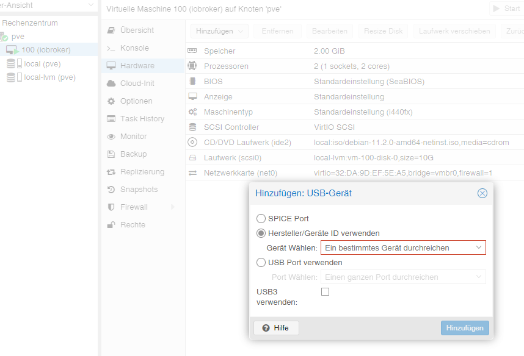

</details>

Damit die VM nach einem Neustart des Proxmox-Hosts automatisch startet,
wird diese Funktion in den Optionen der VM aktiviert.

<details>
<summary>Option booten</summary>

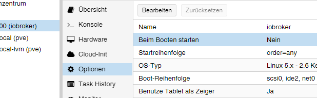

</details>

Somit ist die Installation und Einrichtung der VM abgeschlossen. Nun kann die VM neu gestartet und im Anschluß ioBroker installiert werden.

---

## Proxmox - Erstellen eines Linux Containers (LXC) + ioBroker Installation im Anschluß

Diese Beispiel-Anleitung zeigt, wie ein [LXC Container][] (Debian 13) erstellt
und anschließend ioBroker darin installiert wird.

Aufgrund der Übersichtlichkeit sind Bildbeschreibungen und Zusatzinfos zum Aufklappen.

### Alternative: Automatische Installation über Helper-Skripte

Für Proxmox existieren populäre Helper-Skripte. Diese wurden ursprünglich
von tteck erstellt und werden nach dessen Tod von der Community unter
[helper-scripts.com][] aktiv weitergepflegt. Sie ermöglichen es, einen
ioBroker-Container mit einem einzigen Befehl vollautomatisch aufzusetzen.

> [!WARNING]
> **WICHTIGER SICHERHEITSHINWEIS:**
> Das blinde Kopieren und Ausführen von Skripten aus dem Internet direkt in der
> Proxmox-Konsole (z. B. via `curl | bash`) stellt ein erhebliches
> Sicherheitsrisiko dar!
>
> Man sollte vor der Ausführung immer den Quellcode des Skripts genau lesen und
> verstehen, um zu wissen, was das Skript im System anrichtet. Wer die Syntax
> nicht versteht oder dem Projekt nicht vertraut, sollte von dieser Methode
> absehen und die manuelle Installation bevorzugen, um die Integrität und
> Sicherheit des eigenen Proxmox-Servers nicht zu gefährden.

Wer sich des Risikos bewusst ist und die Skripte geprüft hat, findet die
Befehle und Dokumentation direkt unter [helper-scripts.com][].

### 1 - Container Template herunterladen

Zuerst wird ein Template benötigt, das in der Grundinstallation (sofern keine
weiteren Laufwerke angelegt wurden) in das root-Verzeichnis (local) geladen wird.

Hierzu geht man auf local > Container Templates. Mit einem Klick auf
**Templates** öffnet sich eine Auswahlliste. Hier wählt man
`debian-13-standard` (Trixie) und klickt auf herunterladen.

<details>
<summary>Template herunterladen</summary>

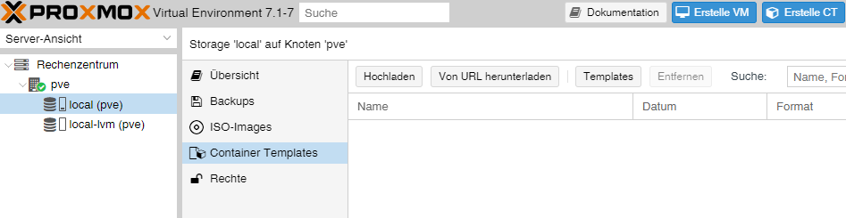

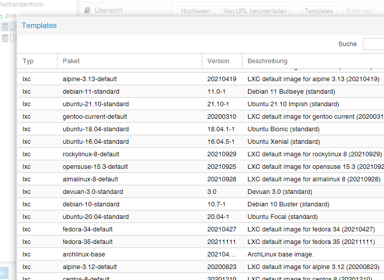

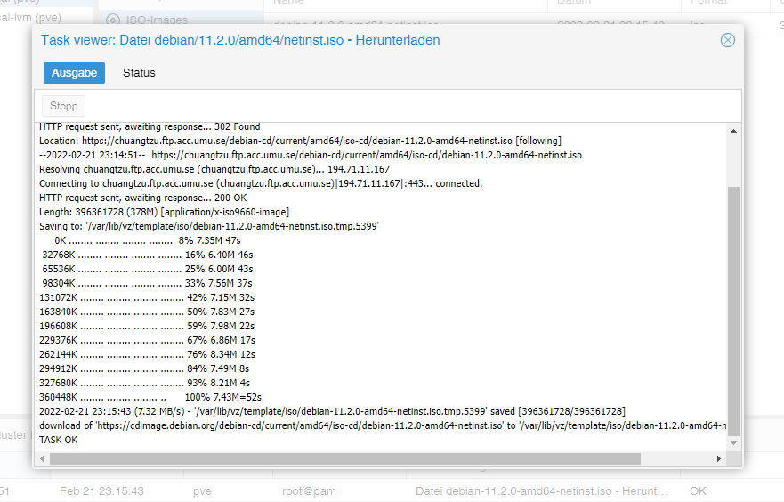

</details>

### 2 - LXC erstellen

Mit einem Klick auf den blauen Button **Erstelle CT** öffnet sich ein Fenster
für die folgenden Einstellungen:

- Allgemein: Vergabe des Hostname und Passwort, ID wird vorgegeben (beginnt mit 100), kann jedoch geändert werden.
- Template: Storage Auswahl(local) und Template(debian-13-standard)
- Disks: Vergabe der Diskgröße(nicht zu großzügig sein, vergrößern kann man jederzeit)
- CPU: Ist abhängig wie Leistungsstark der Rechner ist (kann ebenfalls jederzeit angepasst werden)
- Speicher: Ram/Swap-Vergabe (kann jederzeit, auch im laufendem Betrieb angepasst werden)
- Netzwerk: statische IP/CIDR Vergabe, Gateway, sofern kein Ipv6 eingerichtet, wird dies auf SLAAC gestellt
- DNS: wird in der Regel nichts verändert(verwende Werte vom Host)
- Bestätigen: Zusammenfassung, (Haken setzen bei **Nach Erstellen starten**) anschließend wird mit einem Klick auf **Abschließen** der Container erstellt.

<details>
<summary>Bilderserie Erstelle CT</summary>

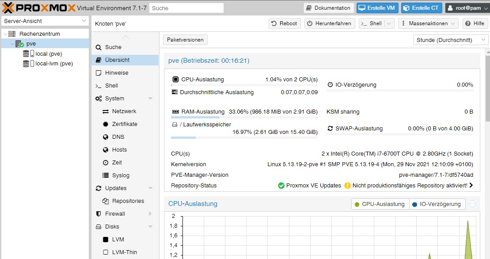

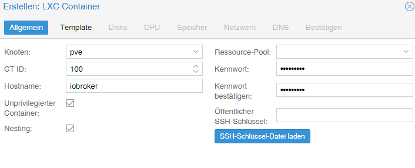

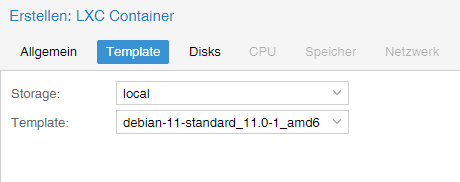

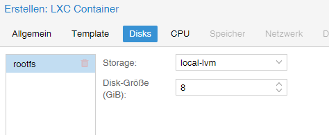

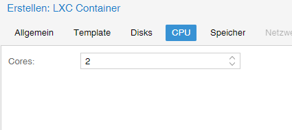

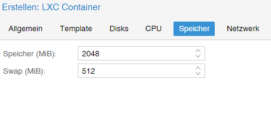

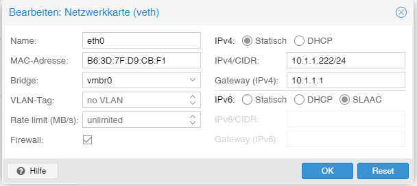

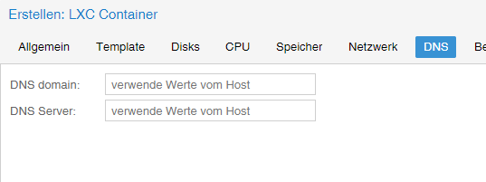

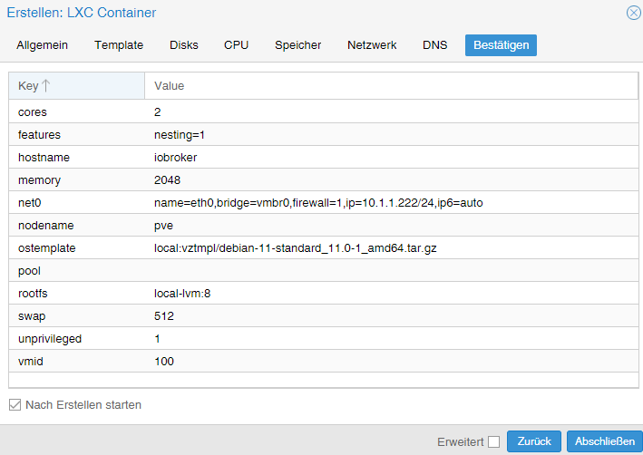

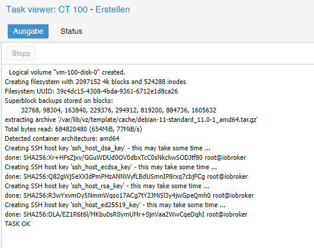

</details>

### 3 - LXC einrichten

Nachdem der Container nun gestartet wurde, begibt man sich auf die Konsole des LXC

<details>
<summary>Konsole</summary>

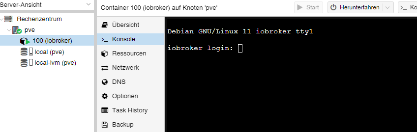

</details>

Hier loggt man sich zunächst als root mit dem zuvor vergebenen Passwort, welches beim LXC erstellen vergeben wurde, ein und bringt diesen erst einmal auf einen aktuellen Stand.

```bash
apt update && apt upgrade
```

<details>
<summary>Upgrade</summary>

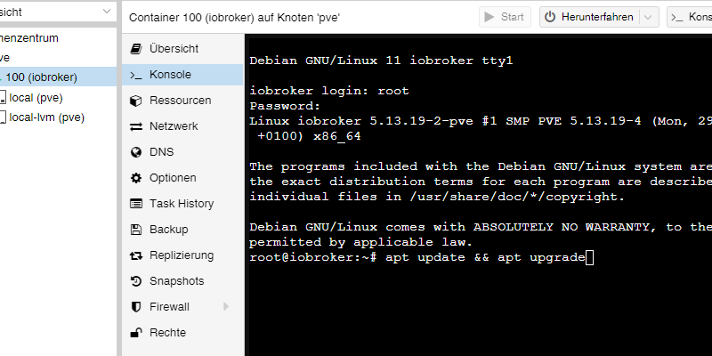

</details>

Hierbei erfolgt direkt ein Hinweis darauf, die Zeitzone einzustellen.

```bash
dpkg-reconfigure tzdata
```

<details>
<summary>Zeitzone</summary>

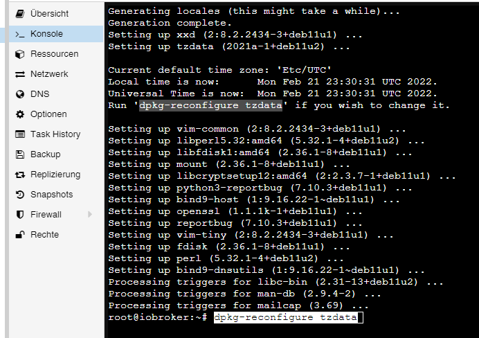

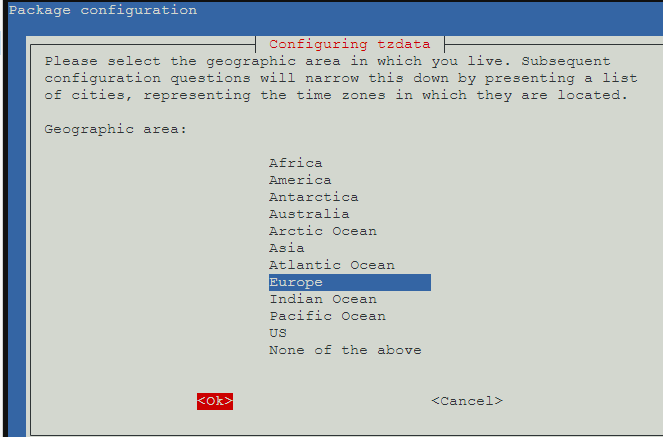

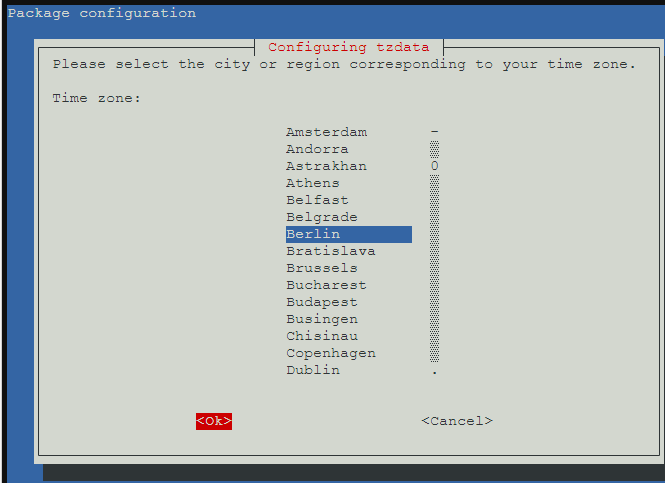

</details>

Nun wird **sudo** und **curl** nachinstalliert. Sudo wird benötigt, um wie im nächsten Schritt, einen Benutzer korrekt anzulegen, mit dem zukünftig auf der Konsole gearbeitet wird. Curl ist nötig, um im letzten Schritt das IoBroker Installationsscript abzurufen.

```bash
apt install sudo curl
```

<details>
<summary>Nachinstallieren</summary>

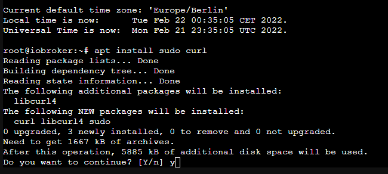

</details>

Jetzt legt man den zukünftigen Benutzer an. "Benutzername" in dem Fall ersetzen. Passwortvergabe für den User. Der Rest kann mit ENTER bestätigt werden.

Hinweis:

**iobroker** nicht als Benutzernamen wählen, da dieser schon Systemintern verwendet wird.

```bash
adduser benutzername
```

Anschließend wird der Benutzer der sudo-Gruppe zugeordnet.

```bash
usermod -aG sudo benutzername
```

Wird ein Benutzer nachträglich angelegt, erfolgt die Zuordnung zu den
relevanten Gruppen über:

```bash
usermod -aG adm,dialout,sudo,audio,video,plugdev,users,iobroker benutzername
```

<details>
<summary>User anlegen</summary>

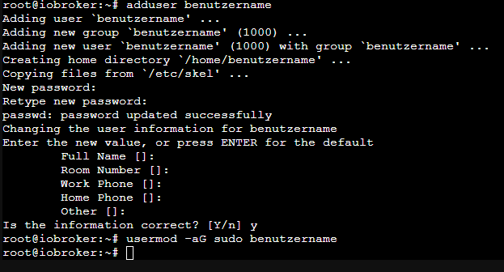

</details>

Im letzten Schritt, bevor ioBroker installiert wird, einmal ausloggen

```bash
exit
```

und anschließend mit den neuen Benutzer einloggen. Im Anschluß kann iobroker jetzt installiert werden.

<details>
<summary>ausloggen und mit Benutzer anmelden</summary>

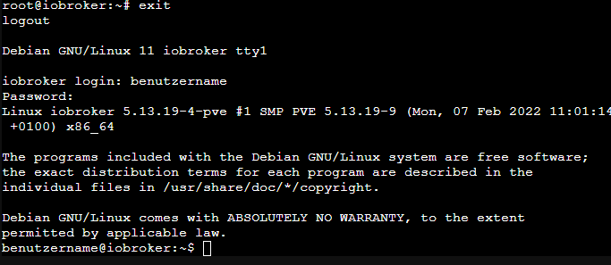

</details>

Damit der LXC nach einem Neustart des Proxmox-Hosts automatisch startet,
wird diese Funktion in den Optionen des Containers aktiviert.

<details>
<summary>Option booten</summary>

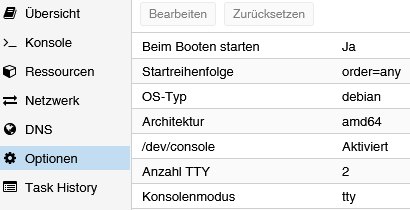

</details>

### Optional: Warnungen / Fehlermeldungen bzgl. nicht gestarteter Services beheben

Beim Aufruf iob diag können beispielsweise untenstehende Fehlermeldungen in der Ausgabe zu finden sein.
Teilweise treten sie nur bei nicht privilegierten Containern aus, teilweise auch bei privilegierten Containern.

```
....
*** FAILED SERVICES ***

  UNIT                                 LOAD   ACTIVE SUB    DESCRIPTION
* run-rpc_pipefs.mount                 loaded failed failed RPC Pipe File System
* sys-kernel-config.mount              loaded failed failed Kernel Configuration File System
* systemd-networkd-wait-online.service loaded failed failed Wait for Network to be Configured
...
```

Wenn man den Container schon vor dem Installieren von iobroker aufräumen will, kriegt man die "FAILED SERVICES" folgendermaßen:

```bash
systemctl list-units --failed
```

Hier eine Sammlung von Vorgehensweisen zur Behebung:

#### failed service run-rpc_pipefs.mount

```bash
sudo systemctl mask run-rpc_pipefs.mount
sudo systemctl mask var-lib-nfs-rpc_pipefs.mount
```

#### failed service sys-kernel-config.mount

An die Container Konfigurationsdatei im Verzeichnis `/etc/pve/lxc` folgende Zeile anhängen:

```
lxc.cap.drop: "sys_rawio audit_read"
```

#### failed service systemd-networkd-wait-online.service

Ersetzen des `ifupdown` Service durch `ifupdown2`:

```bash
sudo systemctl disable --now systemd-networkd-wait-online.service
sudo systemctl disable --now systemd-networkd.service
sudo systemctl disable --now ifupdown-wait-online
sudo apt-get update
sudo apt-get upgrade
sudo apt-get install ifupdown2
```

---

## ioBroker installieren

Für die Installation von ioBroker benötigt man lediglich einen einzigen Befehl.

```bash
curl -sLf https://iobroker.net/install.sh | bash -
```

Die Installationschritte dabei, sind in 4 Schritten unterteilt, welche vollautomatisch durchlaufen.

- Installing prerequisites (1/4)
- Creating ioBroker user and directory (2/4)
- Installing ioBroker (3/4)
- Finalizing installation (4/4)

<details>
<summary>Installer</summary>

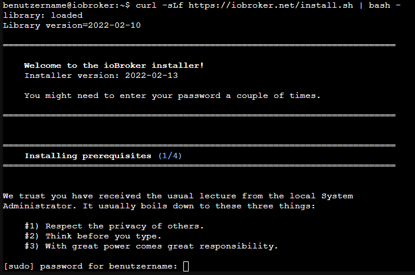

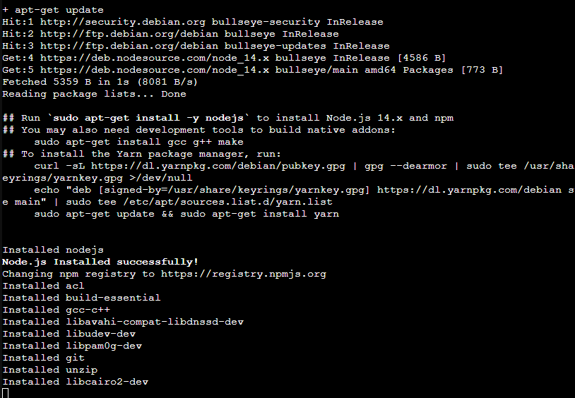

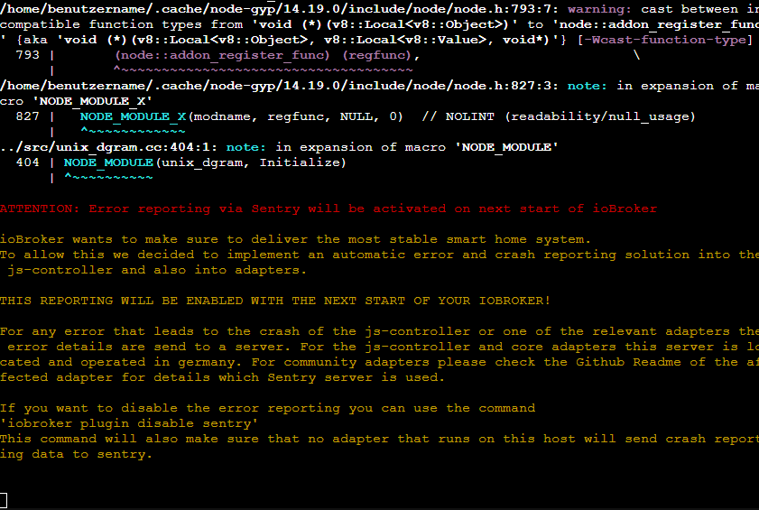

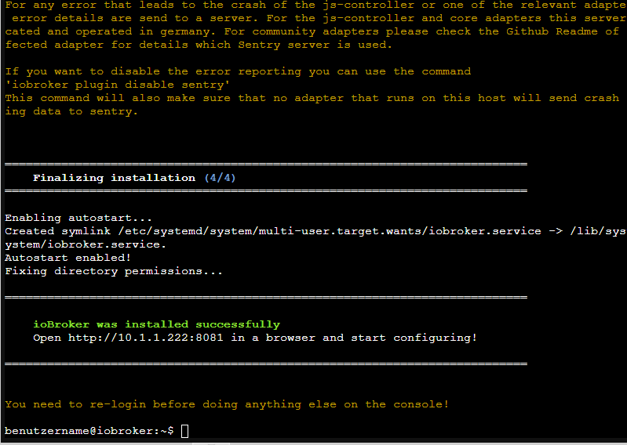

</details>

Die Installation ist erfolgreich abgeschlossen, wenn am Ende folgendes erscheint.

```
ioBroker was installed successfully
Open http://10.1.1.222:8081 in a browser and start configuring!
```

Dies bedeutet auch zugleich, das über die Adresse, ioBroker nun im Browser aufgerufen werden kann. Wenn alles problemlos funktioniert hat, wird man mit dem ioBroker-Setup berüßt. Nun sind es nur noch ein paar Schritte, durch die man mit dem Assistenten geleitet wird.

<details>
<summary>Bilderserie ioBroker Assistent</summary>

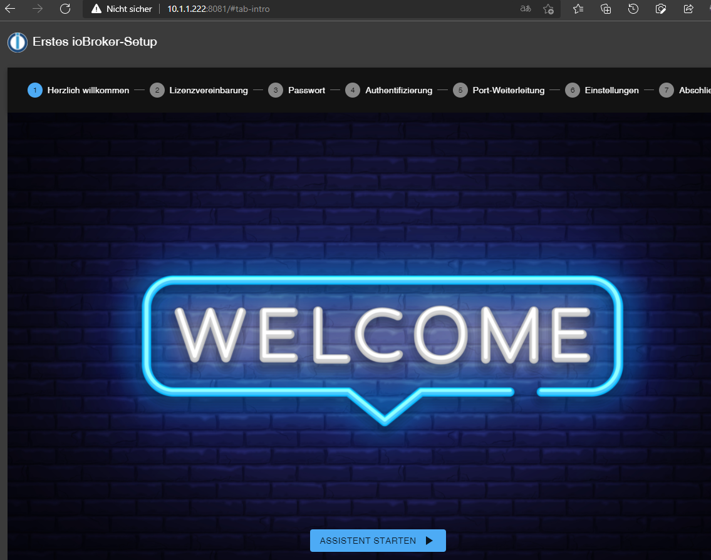

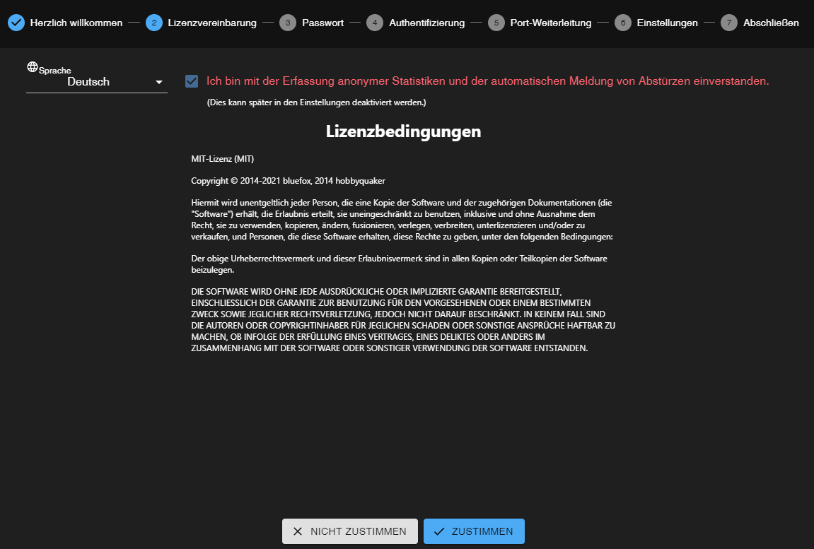

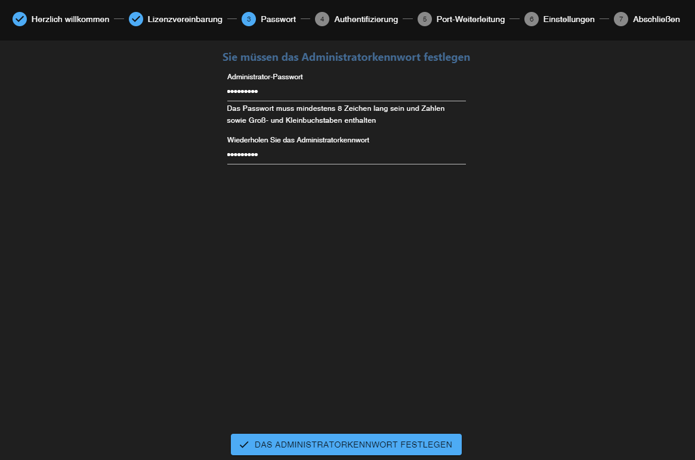

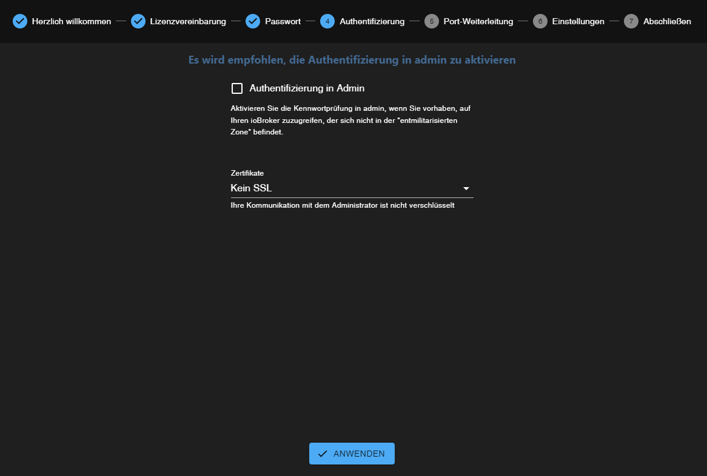

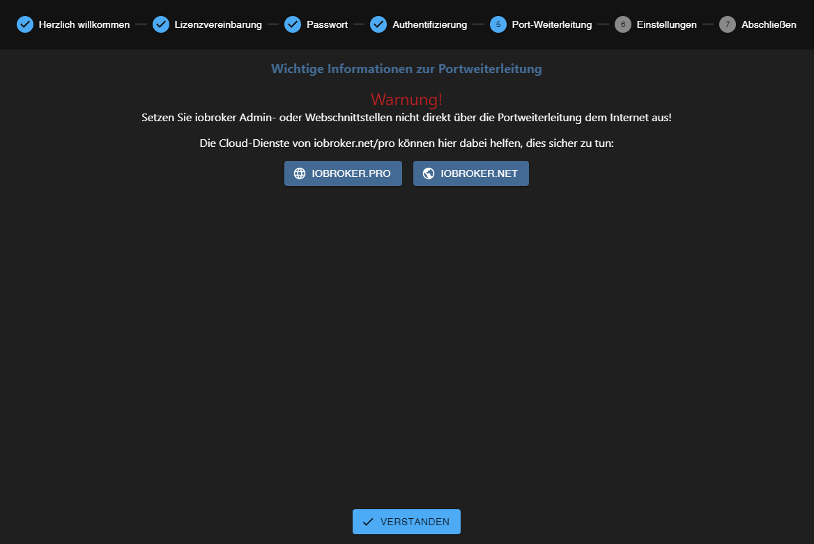

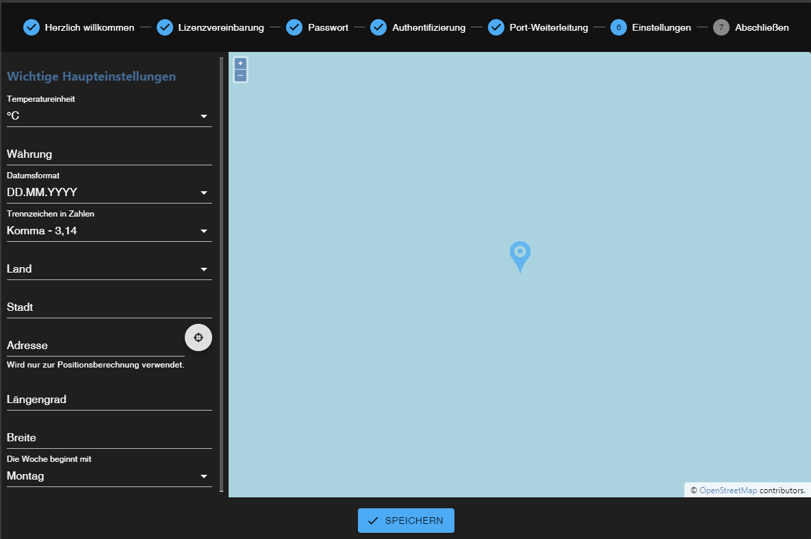


</details>

Im Anschluss hat man noch die Möglichkeit, nach Geräten und Diensten suchen zu lassen. Benötigte Adapter/Instanzen können dadurch automatisch angelegt werden.

<details>
<summary>Bilderserie Geräte/Dienst Suche</summary>

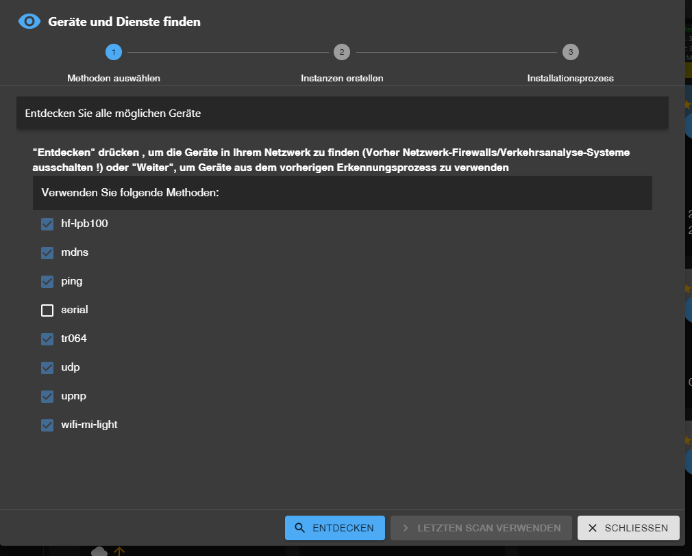

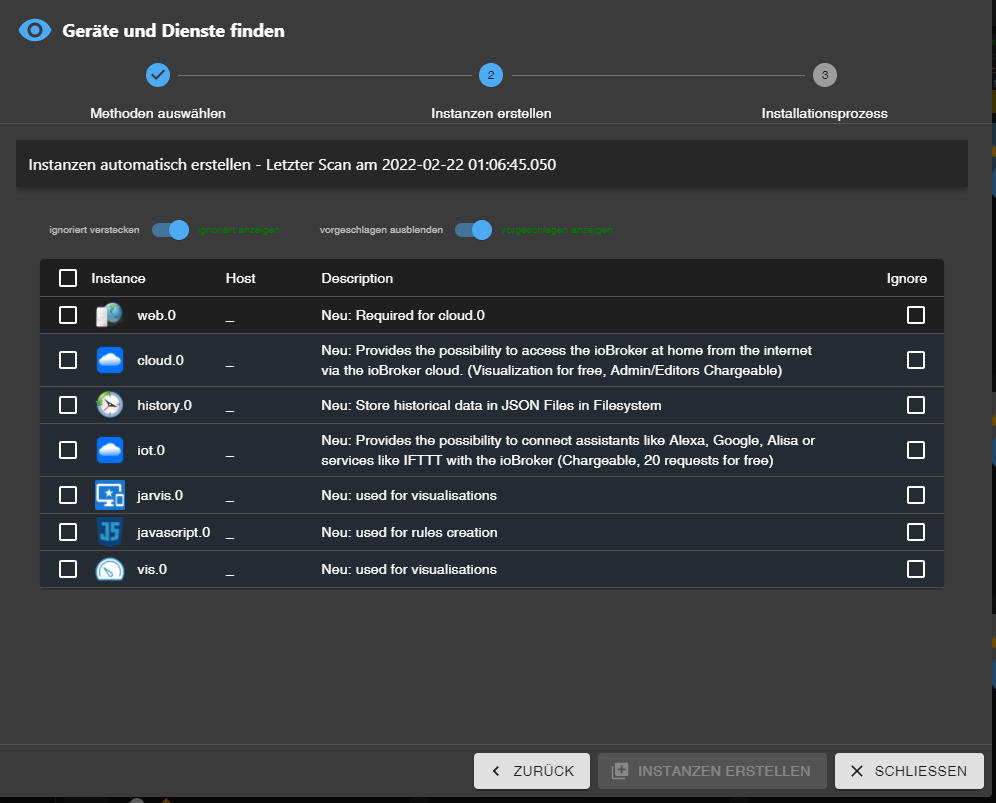

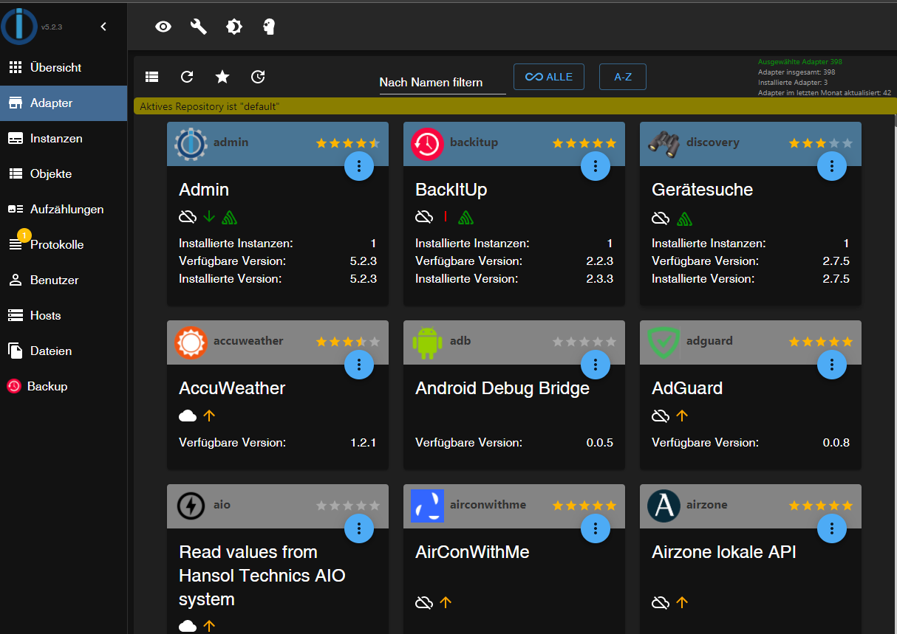

</details>

Somit ist die ioBroker Installation beendet. Weitere Adapter können je nach Anwendungsfall und Wunsch, jederzeit zusätzlich installiert werden.

---

## Proxmox - LXC (Linux Containers) -> USB-Geräte durchreichen

Dieser Teil der Anleitung erklärt Schritt für Schritt das Durchreichen eines
USB-Gerätes (USB Passthrough) in Proxmox an einen LXC (Linux Container).

Bei einer VM ist das Durchreichen eines USB-Gerätes direkt über die
Web-Oberfläche von Proxmox möglich. Bei einem Linux-Container ist hierfür
aktuell die Konfigurationsdatei des LXC manuell zu bearbeiten.

In der Anleitung wird beispielhaft das Einbinden eines **Texas Instruments Inc.
CC2531** Zigbee-Sticks beschrieben.

_Hinweis:_ Der CC2531 ist mittlerweile technisch komplett veraltet, besitzt
sehr wenig Speicher und wird für neue Setups in der ioBroker-Community nicht
mehr empfohlen. Es sollten stattdessen moderne Sticks (z. B. der _Sonoff Zigbee
3.0 USB Dongle Plus_ auf CC2652P-Basis oder ein _ConBee 3_) verwendet werden.
Die in dieser Anleitung gezeigten Schritte zum Durchreichen sind jedoch für
fast alle USB-Seriell-Geräte (z. B. Smart-Meter-Leseköpfe, andere Zigbee-Sticks)
identisch. Ausgenommen sind USB-Netzwerkgeräte (wie Bluetooth oder WLAN).

- Für diesen Teil der Anleitung wurde Proxmox in der Version 9.x verwendet.

### 1.) Informationen zum USB-Gerät sammeln

<details>

Aufbau einer SSH-Verbindung zu Proxmox:

```bash
ssh root@IP-Adresse
```

<span style="color:red">**Sollte das USB-Gerät bereits mit dem Proxmox Host verbunden sein, stecke das Gerät vorerst ab.**</span>

Mit folgendem Befehl werden alle aktuell verbunden USB-Geräte am Proxmox Host aufgelistet:

```bash
lsusb
```

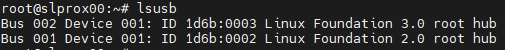

Nun wird das zu einbindende USB-Gerät am Proxmox Host eingesteckt und der Befehl lsusb erneut ausgeführt

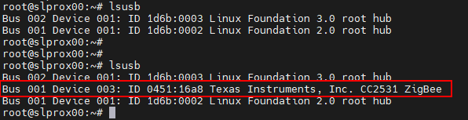

Im Screenshot ist zusehen das ein neues Gerät mit der USB-Bus-Nummer: **001** und der Device-Nummer: **003** gelistet wird.

Diese Informationen werden benötigt um mit dem folgenden Befehl u. a. die **major device number** vom Gerät auszugeben:

```bash
ls -l /dev/bus/usb/001/003
```

Wichtig verwende bei dem Befehl die Ausgabe deiner USB-Bus-Nummer und Device-Nummer!

**_ls -l /dev/bus/usb/USB-Bus-Nummer/Device-Nummer_**

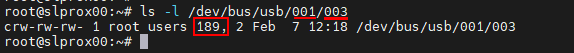

Das USB-Gerät hat in diesem Beispiel die major device number **189**, notiere dir den Wert deines Gerätes in einer Textdatei mit dem Vermerk: #1

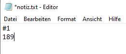

Als Nächstes wird die Unique-ID des USB-Geräts ausgegeben und der Wert
in der Textdatei mit dem Vermerk: #2 notiert:

```bash
ls /dev/serial/by-id/
```

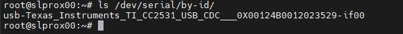

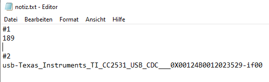

Als letzten Schritt wird die major device number des ttyACM ausgegeben und mit dem Vermerk: #3 notiert:

```bash
ls -l /dev/ttyACM*
```

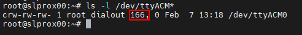

> _Sollte hierbei keine Ausgabe erfolgen, prüfe mit „ls -l /dev/serial/by-id/“ ob das USB-Gerät vom System als ttyUSB eingebunden wird, wenn ja ersetze alle folgenden Befehle die sich auf **ttyACM…** beziehen durch **ttyUSB…** sollte keine Ausgabe erscheinen ist es kein USB CDC class Gerät (Serielle Kommunikation) damit können alle Punkte zum Einbinden vom ttyACM ignoriert werden._

Somit liegen die **drei** Werte des USB-Geräts vor, die für das Einbinden in die
Konfigurationsdatei des LXC benötigt werden.

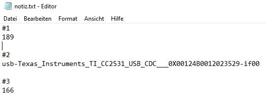

</details>

### 2.) LXC Konfigurationsdatei bearbeiten

<details>

Am Proxmox Host ins LXC Konfigurationsverzeichnis wechseln mit:

```bash
cd /etc/pve/lxc
```

Die Konfigurationsdatei hat die gleiche ID Nummer die bei der Erstellung des lxc vergeben wurde!

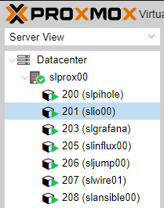

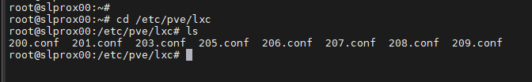

Bevor die Konfigurationsdatei bearbeitet wird, sollte eine Sicherheitskopie erstellt werden:

```bash
cp 201.conf 201.conf.backup
```

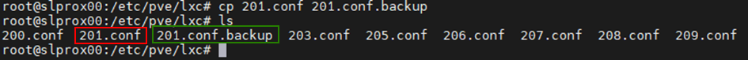

Nun wird die Konfigurationsdatei mit vi oder nano bearbeitet:

```bash
nano 201.conf
```

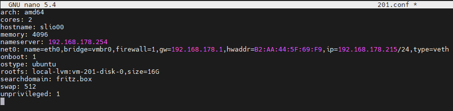

Ans Ende der Konfigurationsdatei wird folgendes hinzugefügt:

```
lxc.cgroup2.devices.allow: c 189:* rwm
lxc.mount.entry: usb-Texas_Instruments_TI_CC2531_USB_CDC___0X00124B0012023529-if00 dev/serial/by-id/usb-Texas_Instruments_TI_CC2531_USB_CDC___0X00124B0012023529-if00 none bind,optional,create=file

lxc.cgroup2.devices.allow: c 166:* rwm
lxc.mount.entry: /dev/ttyACM0 dev/ttyACM0 none bind,optional,create=file
```

Ersetze die markierten Werte mit den vermerkten Einträgen aus deiner Notiz!

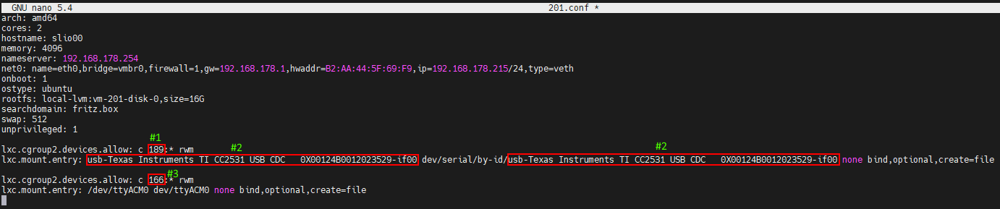

- Die erste Zeile bezieht sich auf die major device number **189** Vermerk: #1
- In der zweiten Zeile wird die unique id (usb-Texas_Instruments_TI_CC2531_USB_CDC\_\_\_0X00124B0012023529-if00) aus Vermerk: #2 einzeln und mit dem absoluten Pfad angegeben (ohne Zeilenumbruch).
- In der dritten Zeile wird die major device number **166** von ttyACM aus Vermerk: #3 angegeben.

Die Konfigurationsdatei abspeichern (Im Nano Editor mit der Tastenkombination: STRG + o & STRG + x zum beenden des Editors)

</br>

<span style="color:orange">**ACHTUNG! - Sollte dein Container aktive Snapshots besitzen:**</span>

<details>

Dann gehört der lxc.cgroup Code nicht an das Ende der Config-Datei sondern vor den ersten Eintrag eines Snapshots.

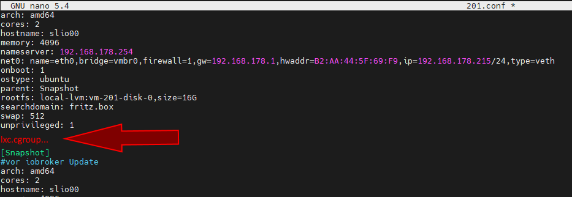

</details>

<span style="color:orange">**ACHTUNG! - Proxmox Installation vor Version 7.0:**</span>

<details>

Ersetze die Einträge mit

```
lxc.cgroup2
```

durch

```
lxc.cgroup
```

</details>

</br>  
Abschließend wird der folgende Befehl ausgeführt, um die benötigten Rechte
für `ttyACM0` zu setzen:

```bash
chmod o+rw /dev/ttyACM*
```

Um die Anpassungen am LXC zu übernehmen, wird ein Kaltstart (Cold Boot) des
Containers mittels **pct stop id / pct start id** durchgeführt:

```bash
pct stop 201
```

```bash
pct start 201
```

</br>

<span style="color:green">**Tipp lege dir eine Kopie deiner funktionierenden Config Datei am besten extern ab, da z. B. der integrierte Proxmox Backup Dienst nicht den Inhalt deiner Config mit sichert!**</span>

</br>

</details>

### 3.) LXC USB Passthrough prüfen & Zigbee Instanz Konfiguration

<details>

Aufbau einer SSH-Verbindung zum LXC:

```bash
ssh Benutzer@IP-Adresse
```

Mit den befehlen:

```bash
lsusb
```

&

```bash
ls -l /dev
```

wird überprüft ob die Anpassungen an der Konfigurationsdatei erfolgreich waren.

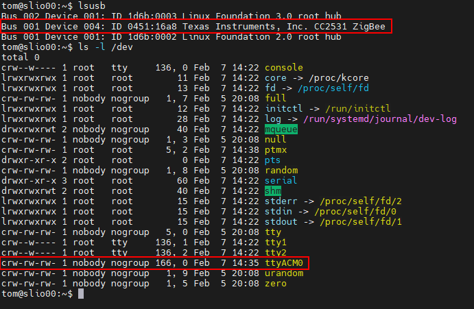

- Wie im Screenshot zu sehen, hat nun der Container Zugriff auf das USB-Gerät.

- Wichtig hierbei ist das ttyACM0 die gleichen Rechte hat im Screenshot also **crw-rw-rw- 1 nobody nogroup**

  > **_Wenn nicht überprüfe ob alle Werte in der Konfigurationsdatei so gesetzt sind wie beschrieben, sollten die Rechte dann immer noch nicht übereinstimmen springe zu Punkt 5._**

- Im Screenshot ist ebenfalls zusehen das sich die Device-Nummer vom cc2531 von dem Wert 3 auf 4 verändert hat, dies liegt daran das der Stick zwischenzeitlich einmal aus- und wieder angesteckt wurde. Da in der Konfigurationsdatei aber die unique id und nicht die Bus/Device Nummer angegeben ist funktioniert der USB Passthrough weiterhin.

Wird wie eingangs beschrieben ein Zigbee-Stick an den Container durchgereicht,
ist im ioBroker in den Einstellungen des Zigbee-Adapters unter dem Punkt
_COM-Anschlussname_

```
/dev/ttyACM0
```

einzutragen, damit das Gerät korrekt angesprochen wird.

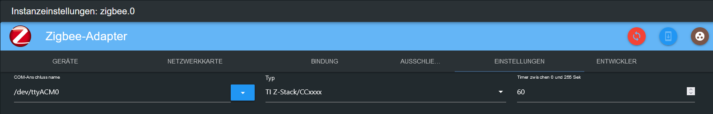

</details>

### 4.) UDEV Regel für permanente Rechte Anpassung von ttyACM0

<details>

Am Ende von Schritt 3 wurde mit dem Befehl

```bash
chmod o+rw /dev/ttyACM*
```

die passenden Rechte für ttyACM0 gesetzt, diese Rechte Änderungen werden aber mit Neustart des Proxmox Host zurückgesetzt, für eine permanente Anpassung wird auf dem Proxmox Host eine udev Regel benötigt.

Mit lsusb listen wir wieder die aktuell verbunden USB-Geräte auf:

```bash
lsusb
```

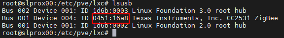

Diesmal notieren wir uns die Zahlenwerte Werte nach ID in diesem Fall also **0451:16a8**

- Der erste Wert: **_0451_** steht hierbei für den **idVendor** und der zweite Wert: **_16a8_** für **idProduct**.

Nun wird mit vi oder nano die udev Regel unter /etc/udev/rules.d erstellt:

```bash
nano /etc/udev/rules.d/50-myusb.rules
```

und folgender Inhalt eingefügt:

```
SUBSYSTEMS=="usb", ATTRS{idVendor}=="0451", ATTRS{idProduct}=="16a8", GROUP="users", MODE="0666"
```

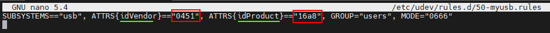

Abschließend noch folgenden Befehl ausführen um die udev Regel zu aktivieren:

```bash
udevadm control –-reload
```

</details>

### 5.) Troubleshooting

<details>

**Fehler:** ttyACM0 Rechte im lxc passen nicht bzw. gehen nach kurzer Zeit verloren (ConBee II).

```bash
ls -l /dev/ttyACM0
 c--------- 0 nobody nogroup 166, 0 Feb  7 14:29 ttyACM0
```

</br>

**Lösung:** mit mknod eine dauerhafte Bindung für den Container erstellen.

Dazu wird im Pfad **"/var/lib/lxc/CONTAINERID"** der Ordner **devices** erstellt und in diesem Ordner mit mknod die Bindung erzeugt:

```bash
mkdir /var/lib/lxc/201/devices
```

```bash
cd /var/lib/lxc/201/devices
```

```bash
mknod -m 666 ttyACM0 c 166 0
```

- _mknod erstellt in dem Pfad eine Datei namens ttyACM0 (solange die Datei existiert ist das Gerät an den lxc gebunden)_

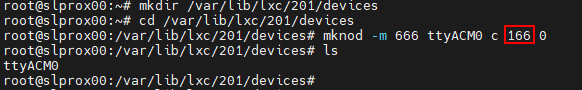

**_major device number und ttyACM.. ggbfs. anpassen_**

Anschließend muss noch der Eintrag der lxc Konfigurationsdatei angepasst werden:

```
lxc.mount.entry: /dev/ttyACM0 dev/ttyACM0 none bind,optional,create=file
```

wird ersetzt durch:

```
lxc.mount.entry: /var/lib/lxc/CONTAINERID/devices/ttyACM0 dev/ttyACM0 none bind,optional,create=file
```

</details>

---

## USB-Stick/Platte für Backups einrichten

Damit zukünftige Backups separat gespeichert werden können, gibt es die
Möglichkeit, ein USB-Device in Form eines Sticks oder einer Platte auf dem
Proxmox-Host einzubinden.

_Hinweis:_ In früheren Versionen dieser Anleitung wurde oft das Dateisystem
**vFAT (FAT32)** empfohlen, da dieses sowohl unter Linux als auch unter Windows
problemlos gelesen werden kann. Davon wird heute dringend abgeraten! FAT32
besitzt ein technisches Limit von maximal **4 GB pro Datei**. Da moderne
Proxmox-Backups (z. B. `.vma.zst`-Dateien ganzer VMs oder Container) diese
Größe meist weit überschreiten, bricht das Backup bei FAT32 mit Fehlern wie
"File too large" ab.

Gängige, geeignete [Filesysteme][] sind daher:

- **EXT4** (Standard für reines Linux, dringend empfohlen für Proxmox-Backups)
- **NTFS** oder **exFAT** (falls die Backup-Platte zwingend auch nativ unter
  Windows ausgelesen werden muss)

Ist der Datenträger noch unpartitioniert bzw. möchte man neu formatieren,
besteht die Möglichkeit, dies an einem Windows-PC oder direkt am
Proxmox-Server zu tun.

Wenn der Datenträger vorbereitet ist, kann er danach ins System gemountet
und im Anschluss direkt über die Proxmox-GUI als Storage (Verzeichnis)
hinzugefügt werden.

<span style="color:orange">**ACHTUNG! - Bei einer Neuformatierung werden alle
bisherigen Daten auf dem Datenträger gelöscht.**</span>

Folgende Beispiel-Anleitung bezieht sich auf das Einrichten von **EXT4** direkt
auf dem Proxmox-Host.

**Zu beachten:** Die folgenden Befehle setzen `root` voraus. Sollte ein eigener
User auf dem Host verwendet werden, müssen die Befehle mit `sudo` ausgeführt
werden.

### Device vorbereiten

### 1 - Gerät identifizieren

Zuerst macht man das Device mittels [lsblk][] ausfindig. Dabei ist es ratsam,
den Befehl einmal vor und einmal nach dem Einstecken auszuführen. Dadurch
lässt sich das Device leichter identifizieren.

```bash
lsblk
```

sieht dann in etwa so aus (Buchstaben variieren, je nachdem wie viele Geräte
eingebunden sind):

```
sdd                    8:48   0 119.2G  0 disk
├─sdd1                 8:49   0 119.2G  0 part
└─sdd9                 8:57   0     8M  0 part
sde                    8:64   0 931.5G  0 disk                    <-- Das ist die Disk /dev/sde
└─sde1                 8:65   0 931.5G  0 part                    <-- Das ist die erste Partition /dev/sde1
sr0                   11:0    1  1024M  0 rom
sr1                   11:1    1  1024M  0 rom
```

### 2 - Partitionieren

Mit dem menügesteuerten [cfdisk][] wird das Laufwerk partitioniert:

```bash
cfdisk /dev/sde
```

### 3 - Filesystem erstellen

Nun muss die zuvor erstellte Partition noch formatiert werden. Wie oben bereits
erwähnt, verwenden wir hierfür das Dateisystem **EXT4**.
Mit dem Befehl [mkfs][] und den passenden Parametern wird die Partition
formatiert:

```bash
mkfs.ext4 /dev/sde1
```

### 4 - Laufwerk mounten

Um den fertiggestellten Datenträger verwenden zu können, muss dieser
[gemountet][] werden.

Dazu wird ein passender Mountpoint erstellt. Damit der Datenträger nach
einem Reboot automatisch wieder eingebunden wird, ist ein passender Eintrag in
der [/etc/fstab][] erforderlich.

Hierzu muss die eindeutige **UUID** des Laufwerks ausgelesen werden.

Mountpoint erstellen:

```bash
mkdir /media/ext_usb
```

Datenträger mounten:

```bash
mount /dev/sde1 /media/ext_usb
```

UUID ermitteln:

```bash
blkid | grep -i sde
```

ergibt beispielsweise:

```
/dev/sde1: LABEL="Backup" UUID="136b058d-f0c8-406d-a82b-2adcc00b72bf" BLOCK_SIZE="4096" TYPE="ext4" PARTUUID="00011a10-01"
```

Eintrag in der [/etc/fstab][] mit nano bearbeiten:

```bash
nano /etc/fstab
```

Nun wird dieser Eintrag hinzugefügt und anschließend gespeichert:

```
UUID="136b058d-f0c8-406d-a82b-2adcc00b72bf" /media/ext_usb ext4 defaults 0 2
```

_(Hinweis: Bei EXT4-Partitionen wird am Zeilenende der fstab meist `0 2` für
den Dateisystem-Check eingetragen.)_

### 5 - Storage in Proxmox hinzufügen

Unter Rechenzentrum > Storage kann jetzt ein Verzeichnis hinzugefügt werden. Die
ID-Bezeichnung ist frei wählbar, z. B. _usb-backup_.

In der Spalte _Verzeichnis_ wird der Pfad angegeben, in dem Fall
`/media/ext\_usb`.

Bei _Inhalt_ muss nur noch das gewünschte Anliegen ausgewählt werden (z. B.
VZDump-Backup-Datei).

[VM]: https://pve.proxmox.com/wiki/Qemu/KVM_Virtual_Machines
[LXC Container]: https://pve.proxmox.com/wiki/Linux_Container
[Filesysteme]: https://wiki.ubuntuusers.de/Dateisystem/
[lsblk]: https://wiki.ubuntuusers.de/lsblk/
[cfdisk]: https://wiki.ubuntuusers.de/fdisk/
[mkfs]: https://wiki.ubuntuusers.de/Formatieren/
[gemountet]: https://wiki.ubuntuusers.de/mount/
[/etc/fstab]: https://wiki.ubuntuusers.de/fstab/
[helper-scripts.com]: https://helper-scripts.com
[Installationsmedien vorbereiten]: https://pve.proxmox.com/wiki/Prepare_Installation_Media#_instructions_for_windows
[ISO-Image]: https://www.debian.org/distrib/
