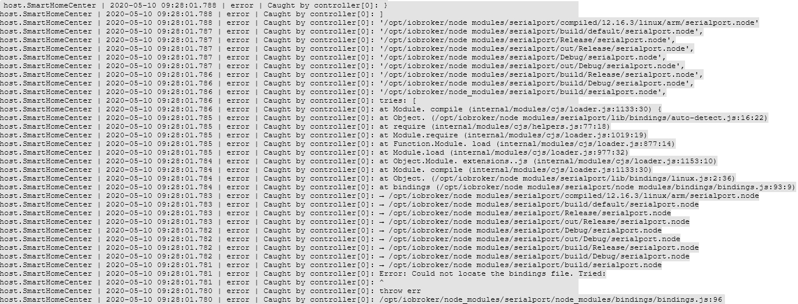

# Node.js Update


| js-controller | Node.js | npm |
| ------ | ----------- | ------------- |
| < 4.x | 12.x, 14.x, 16.x | 6.x |
| 4.x | 12.x, 14.x, 16.x | 6.x, 7.x, 8.x |
| 5.x | 16.x, 18.x, 20.x | 8.x, 9.x |

## Warum muss man das updaten?
Wie bei vielen Open-Source-Technologien üblich, entwickelt sich Node.js schnell weiter.  
Updates, die die **Stabilität** und **Sicherheit** steigern, oder gar **neue Funktionen** hinzufügen, erscheinen regelmäßig.  

Ohne Node.js funktioniert ioBroker nicht, Details dazu unter [Architektur](https://www.iobroker.net/#de/documentation/basics/architecture.md).  
Wer mehr über Node.js erfahren möchte, [Wikipedia Node.js](https://de.wikipedia.org/wiki/Node.js).
  
  
?> **Bei einem Node.js Versionswechsel sind bestimmte Vorraussetzungen zu prüfen und müssen gegebenenfalls im Vorfeld korrigiert werden.
Dabei ist darauf zu achten, in welchen Pfaden die Installation liegt.**

### Vorgehensweise

#### 1 - Gegebenheiten prüfen
- Version und Pfad
- Betriebsystem
- js-controller
- Adapter
	
<details>
<summary>Warum muss geprüft werden</summary>

- welche Version und vor allem, in welchem Verzeichnis liegt die Installation

- Im Raspi Umfeld sind gerne noch älterer Systeme auf Basis von "Debian jessie" oder "Debian wheezy" im Einsatz. Für die gibt es nichts höheres als Nodejs 10, gegebenenfalls wäre ein Betriebssystemupdate möglich.

- Prüfen, welche js-controller Version installiert ist (ebenfalls auf dem Host-Tab im Admin einsehbar).
Bei Versionen **vor** js-controller 3.x, wenn möglich bitte zuerst den js-controller aktualisieren. Am besten auf mindestens die 3.2!  
Hierzu gibt es im Forum z.B. diesen [Beitrag](https://forum.iobroker.net/topic/42385/js-controller-3-2-jetzt-im-stable).

- Damit es nach dem Update zu keinen Inkompatibilitäten bzw. Probleme kommt, sollte man alle auf dem System befindlichen Adapter prüfen und gegebenenfalls aktualisieren.  
Am besten die Adapter-Readme's per Admin, im Changelog, oder im GitHub des jeweiligen Adapters prüfen, ob die installierten Adapter Versionen die geplante Node.js Version explizit unterstützen.

</details>

#### 2 - Backup erstellen
Bevor nun Änderungen am System gemacht werden, muss ein Backup erstellt werden. Je nach System gibt es verschiedene Möglichkeiten. Empfohlen wird der BackitUp Adapter oder per Kommandozeilenbefehl.  
Das Backup sollte aktuell sein, damit möglichst keine Daten verloren gehen.

#### 3 - Adapter aktualisieren
Die im System verwendeten Adapter sollten mit der neuen Node.js Version kompatibel sein, gegebenenfalls müssen diese aktualisiert werden.

#### 4 - ioBroker stoppen
Gestoppt wird ioBroker mittels eigenem Konsolenkommando oder per Systemdienstverwaltung

#### 5 - Überprüfen ob noch Prozesse laufen
In der Regel werden alle Prozesse dadurch beendet. Sicherheitshalber sollte nocheinmal kontrolliert werden, das auch wirklich keine Prozesse (Adapter, Backups) mehr laufen. Man kann auch mit einem Tool wie "top" prüfen, ob noch Prozesse existieren, die mit "io." beginnen.

#### 6 - Node.js Update
Im nächsten Schritt aktualisiert man Node.js auf die gewünschte neue Version.  
Das Update unterscheidet sich jedoch je nach installiertem Betriebssystem, siehe Anleitung  

?> Der Node Package Manager, kurz `npm`, wird ebenfalls mit aktualisiert, dieser muss gegebenenfalls, bis js-controller Version 3, je nach verwendeter Node.js Version auf npm v6.x zurückgesetzt werden. Ab js-controller Version 4 wird auch npm v8.x/9.x unterstützt.

#### 7 - Version und Pfade kontrollieren
Nach abgeschlossenem Update werden die Pfade und installierten Versionen noch einmal gegengeprüft.

#### 8 - ioBroker fixer ausführen
Da die Installation von Node.js, wie Eingangs erwähnt, einige Änderungen am System vornimmt, ist es notwendig im Anschluss den ioBroker fixer auszuführen.  
Dieser stellt unter anderem die für den Betrieb von ioBroker notwendigen Sicherheitseinstellungen wieder her und prüft und korrigiert alle Berechtigungen.

#### 9 - ioBroker starten
Einige verwendete JavaScript Module beinhalten Teile die kompiliert werden müssen. Dieser Prozess findet bei der Installation statt.  
Durch das kompilieren sind diese Module an die Node.js Version gebunden. Nach einem Update müssen diese Teile daher neu kompiliert werden.
Seit js-controller Version 3.0 wird versucht, Adapter die solche Teile beinhalten, zu erkennen und automatisch einen Rebuild durch zu führen.
Dieser Prozess kann einige Zeit in Anspruch nehmen und die betroffenen Adapter können mehrfach neu starten. Dies kann im LogFile beobachtet werden. Dies geht am einfachsten in einem Terminal mittels ``iob logs --watch | uniq ``

<details>
<summary>Automatische Rebuilds</summary>

ioBroker versucht automatisch die Adapter zu erkennen die nicht starten, weil Sie aktualisiert werden müssen. Dies funktioniert so, das die typischen Fehlermeldungen erkannt werden und ioBroker eine entsprechende  Aktualisierung versucht. Zuerst wird ein "rebuild" des betroffenen Adapters ausgeführt, falls das nicht hilft, werden die Adapter-Abhängigkeiten aktualisiert. Daher kann es sein das der Adapter mehrfach neu startet. Hier bitte UNBEDINGT Geduld haben! Erst wenn der Adapter dauerhaft rot bleibt und auch im Log steht, das der Rebuild nicht geklappt hat, aktiv werden!

</details>

<details>
<summary>Manuelle Rebuilds</summary>

Sollte ein automatischer Rebuild nicht funktioniert haben, so kann dieser manuell ausgeführt werden, siehe Problemlösung.

</details>

<details>
<summary>Sonderfälle (z.B. Serialport)</summary>

Leider gibt es Sonderfälle, wo auch die obigen Optionen das Rebuild nicht erledigen, einer davon ist Serialport.

Dort kann ein Log zB (auch nach allen Rebuild Versuchen) wie folgt aussehen

<details>
<summary>LOG</summary>


 
</details>

Es gibt auch andere Fehlermeldungen die jedoch alle auf das gleiche hinauslaufen.
Die einfachste Option ist es dann manuell im **richtigen** Verzeichnis neu zu bauen.
In dem Fall das Verzeichnis mit "bindings" suchen - oben ist das */opt/iobroker/node_modules/serialport/node_modules/bindings ...* bei neueren Versionen kann es auch etwas wie */opt/iobroker/node_modules/serialport/node_modules/@serialport/bindings* sein.

Anschließend in dieses Verzeichnis wechseln und `npm install --omit=dev` ausführen. Danach den Adapter nochmal neu starten.

Ein weiterer Fall sind Adapter mit canvas Modul (ggf echarts oder Mihome-vacuum) wo es Probleme gebe kann.

</details>


## Anleitung für Debian/Ubuntu

#### 1 - Version und Pfad prüfen
```
sudo ln -s /usr/bin/node /usr/bin/nodejs &> /dev/null
type -p nodejs node npm npx corepack && nodejs -v && node -v && npm -v && npx -v && corepack -v 

```
- Ausgabe

```
/usr/bin/nodejs
/usr/bin/node
/usr/bin/npm
/usr/bin/npx
/usr/bin/corepack
v18.15.0
v18.15.0
9.6.0
9.6.0
0.19.0
```
Wichtig ist:
nodejs liegt in /usr/bin
node liegt in /usr/bin
npm liegt in /usr/bin
npx liegt in /usr/bin
corepack liegt in /usr/bin
und die Versionsnummern von nodejs und node sowie von npm und npx stimmen jeweils überein.

#### 2 - Backup

```
iobroker backup
```
- alternative [Möglichkeiten](https://www.iobroker.net/#de/documentation/config/backup.md)

#### 3 - Adapter aktualisieren
- Anleitung dazu findet man unter [Adapter verwalten](https://www.iobroker.net/#de/documentation/tutorial/adapter.md)

#### 4 - ioBroker stoppen

```
iobroker stop
```

#### 5 - ioBroker Prozesse prüfen

```
ps aux | grep 'io\|PID'
```
- und

```
ps aux | grep 'backup\|PID'

```
- falls noch Prozesse laufen

```
sudo kill -9 <ProzessID>
```

#### 6 - Node.JS Update
- Details zu [Node.Js](https://github.com/nodesource/distributions#installation-instructions)

```
curl -sL https://deb.nodesource.com/setup_18.x | sudo -E bash -
sudo apt install -y nodejs
```
- Für andere Node.js Versionen einfach in der URL die 18 durch die andere Versionsnummer ersetzen.

!> Stand März 2023 ist die Version 18 von Node.js für ioBroker empfohlen! 

!> Ungerade Node.js Versionen dürfen nicht verwendet werden.

#### 7 - Version/Pfad kontrollieren

```
type -p nodejs node npm npx corepack && nodejs -v && node -v && npm -v && npx -v && corepack -v
```

#### 8 - iobroker fixer ausführen

```
iobroker fix
```

#### 9 - ioBroker starten

```
 iobroker start
 ```
 
## Anleitung für Windows

#### 1 - Version prüfen (Windowstaste + R)

```
cmd.exe /C node -v & pause
```

#### 2 - Backup

```
iobroker backup
```
- alternative [Möglichkeiten](https://www.iobroker.net/#de/documentation/config/backup.md)

#### 3 - Adapter aktualisieren
- Anleitung dazu findet man unter [Adapter verwalten](https://www.iobroker.net/#de/documentation/tutorial/adapter.md)

#### 4- Sicherung des Ordners:

```
C:\Program Files\iobroker\deinhostname\nodejs
```

#### 5 - iobroker stoppen

```
iobroker stop
```

#### 6 - Node.js update

- [Node.js](https://nodejs.org) als Archiv herunterladen, nicht als msi Datei
- Entpacke den Download und kopiere den gesamten Ordner über den vorhandenen Ordner:

```
C:\Program Files\iobroker\deinhostname\nodejs
```
-  Kopiere aus der Sicherungskopie die Datei **nodevars.bat** zurück in den Ordner:

```
C:\Program Files\iobroker\deinhostname\nodejs
```

#### 7 - Version kontrollieren

```
cmd.exe /C node -v & pause
```

#### 8 - iobroker fixer ausführen

```
iobroker fix
```

#### 9 - ioBroker starten

```
iobroker start
```

## Anleitung für Docker
- Node.js wird in der Regel durch ein Update des Containers auf eine neue Version des [Docker Image](https://hub.docker.com/r/buanet/iobroker/tags) durchgeführt.  
- Eine detaillierte Vorgehensweise, sowie weitere Details zum iobroker container ist bei [buanet](https://smarthome.buanet.de/2020/10/iobroker-docker-container-updates-upgrades/) zu finden.

## Problemlösung
### manueller Rebuild
- Hierzu gibt es

```
iobroker rebuild <adaptername>
```
- falls das nicht reicht

```
iobroker rebuild <adaptername> --install
```
- einfach manuell an der Shell ausführen. Damit dürfte idealerweise alles automatisiert erledigt sein.

?> Solange js-Controller kleiner Version 4, muss auch bei einem Node.js Update innerhalb einer Major Version, der [ioBroker fixer](https://www.iobroker.net/#de/documentation/install/linux.md) ausgeführt werden.  
Mit dem zukünftigen js-Controller in Version 4 werden Rebuild's vollautomatisch gehändelt.  
Ein manueller Rebuild wird dann nicht mehr unterstützt.
