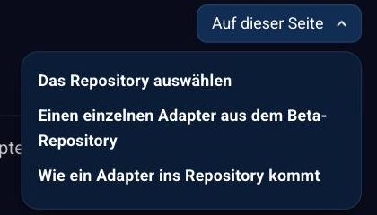

# Aufbau der Dokumentation

Diese Dokumentation ist die zentrale Anlaufstelle für alle ioBroker-Anwender.
Diese Seite erklärt, wie man sich darin zurechtfindet.

?> Die Website ist **responsiv** gestaltet: Je nach Bildschirmbreite werden
Bedienelemente zusammengefasst oder ausgeblendet, um Platz für den Text zu
schaffen. Auf einem Telefon sieht die Seite deshalb anders aus als auf den
Bildern hier.

## Die Bereiche einer Seite

| Nr. | Bereich |
| --- | ------- |
| 1 | **Hauptmenü** – führt zu den anderen Teilen der Website. |
| 2 | **Doku-Menü** – der Baum aller Kapitel. |
| 3 | **Themenmenü** – die Überschriften der gerade geöffneten Seite. |
| 4 | **Sprachauswahl**. |
| 5 | **Suche** – oben für die ganze Website, im Doku-Bereich zusätzlich als Filter für den Kapitelbaum. |

Über den Bereichen steht die **Brotkrumenspur**: sie zeigt, wo im Baum die
aktuelle Seite liegt, und jeder Teil davon ist anklickbar.

## 1 Hauptmenü

Die wichtigsten Punkte stehen am oberen Rand. Das Symbol mit den drei Strichen
ganz rechts öffnet das vollständige Menü:

Dort stehen neben den Hauptbereichen **Doku**, **Adapter**, **Lizenzen** und
**Installation** auch Blog, Forum und Statistik sowie Impressum und Datenschutz.
Rechts unten führen die Symbole zu GitHub, Facebook, Discord und Instagram.

Über das Sonnensymbol oben rechts wird zwischen hellem und dunklem Erscheinungsbild
umgeschaltet.

## 2 Doku-Menü

Der Baum links führt durch alle Kapitel. Ein Klick auf einen Ordner klappt ihn
auf, die beiden Pfeile darüber klappen den ganzen Baum auf oder zu.

Das Suchfeld über dem Text filtert den Baum: Nach der Eingabe bleiben nur die
Kapitel stehen, die zum Suchbegriff passen.

Mit dem Doppelpfeil links oben lässt sich der Baum ganz ausblenden, wenn mehr
Platz für den Text gebraucht wird.

## 3 Themenmenü

Rechts oben führt **Auf dieser Seite** zu den Überschriften des gerade
geöffneten Artikels:

Bei längeren Seiten ist das der schnellste Weg zum gesuchten Abschnitt.

## 4 Sprachauswahl

Die Dokumentation ist mehrsprachig. Die deutschen Texte sind die Vorlage, die
übrigen Sprachen werden daraus erzeugt und nach und nach von Muttersprachlern
verbessert.

## Wo anfangen?

* Wer ioBroker noch nicht kennt, beginnt bei den
  [Grundlagen](https://www.iobroker.net/#de/documentation/basics/README.md).
* Die [Installation](https://www.iobroker.net/#de/documentation/install/README.md)
  beschreibt die Wege auf Linux, Docker, Proxmox, Windows und macOS.
* Die [Admin-Oberfläche](https://www.iobroker.net/#de/documentation/admin/README.md)
  erklärt die Bedienung.
* Wie aus Datenpunkten Abläufe werden, steht unter
  [Logik & Automatisierung](https://www.iobroker.net/#de/documentation/logic/README.md).
* Alle Adapter im Einzelnen führt die
  [Adapter-Referenz](https://www.iobroker.net/#de/adapters/adapters.md) auf.
* Wer selbst einen Adapter schreiben möchte, findet den Einstieg im
  [Entwicklerbereich](https://www.iobroker.net/#de/documentation/dev/adapterdev.md).

Diese Dokumentation wächst ständig. Wenn etwas fehlt oder besser erklärt werden
sollte: [Wir freuen uns über jede helfende Hand](https://forum.iobroker.net/).
