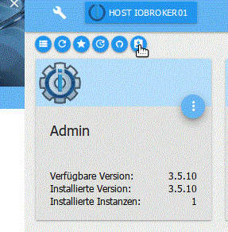

# Grundlagen zur Verwendung von Adaptern
Die Installation von Adaptern und Instanzen bei ioBroker erfolgt mehrstufig.

Diese Begriffe werden immer wieder durcheinandergebracht. Diese Seite soll ein wenig Licht ins 
Dunkel bringen, indem hier erläutert wird, wie die wichtigsten administrativen Aufgaben bei 
ioBroker durchgeführt werden sollen und was dahinter steht.

## Administrative Aufgaben
### Installation eines neuen Adapters
Die eigentliche Installation lädt die für die Adapternutzung benötigten Daten vom Server auf den lokalen Host. Diese Daten behalten so lange die “Aktualität” zum Zeitpunkt des Installs bis sie upgedatet werden.
 
**Über den Admin**

Diese Funktion steht über den Admin nicht zur Verfügung, sie wird bei der Erstellung einer Instanz (Instantiierung) automatisch vorangestellt.

**Über die Konsole**

``iobroker install AdapterName``

### Erzeugung einer Instanz eines Adapters
Um einen Adapter in ioBroker nutzen zu können benötigt man eine (oder mehrere) Instanzen dieses Adapters. Diese Instanzen werden im Admin über den Reiter Instanzen konfiguriert.

**Über den Admin**

Will man eine Instanz eines Adapters anlegen, erreicht man dies, indem im Reiter Admin in der Kachel des entsprechenden Adapters das (+) unten links angeklickt wird.

**Über die Konsole**

``iobroker add AdapterName``

Sollten sich die notwendigen Dateien für den Adapter noch nicht auf dem Host befinden, 
wird zuerst automatisch ein iobroker install AdapterName ausgeführt. Erst danach wird die 
Instanz erzeugt.

 

***Über die Konsole per npm (nur für Experten!)***

``cd /opt/iobroker``

``npm install iobroker.AdapterName``

 **Diese Version sollte nur verwendet werden, wenn alle anderen Methoden aus 
welchem Grund auch immer nicht funktionieren.**

 Achtung! Auf neueren Installationen verursacht die direkte Verwendung von npm install Rechteprobleme nach der Installation oder schlägt fehl. Es wird empfohlen, auf die iobroker-Kommandos zurückzugreifen.!! 

### Upgrade eines Adapters
Liegt eine neue Version eines Adapters vor, kann diese aktualisiert werden. Es kommt auch vor, 
dass Adapter eine bestimmte Version eines anderen Adapters benötigen. Daher ist es sinnvoll 
immer alle Adapter auf dem aktuellen Stand zu halten

 

**Über den Admin**

Liegt ein Upgrade eines Adapters vor, ändert sich die Titelzeile der entsprechenden Kachel in grün. Auf der Kachel erscheint dann unter “verfügbare Version” die neue Versionsnummer in grün und links davon das Upgrade-Icon. Will man diesen Adapter nun upgraden, klickt man dieses Icon an.

Im Hintergrund laufen dann zwei Vorgänge ab, das eigentliche Upgrade der Adapterdateien und anschließend der Upload der Dateien zu den Instanzen.

**Über die Konsole**

``iobroker upgrade AdapterName``

### Upload von Adapterdateien
Diese Funktion wird nur in Sonderfällen benötigt. Wird die oben genannte Vorgehensweise verwendet ist diese Funktion nicht notwendig.

nur wenn erfahrene Anwender, die wissen was sie tun, selber Dateien ändern, oder wenn eine Beta-Version aus Github geladen wird ist diese Funktion notwendig

 

Über den Admin
Dazu muss im Reiter Admin der Expertenmodus aktiviert werden. Danach erscheinen weitere Icons in der Kachel. Der nach oben gerichtete Pfeil (3. Icon von rechts) führt diesen Upload aus.

 

 

**Über die Konsole**

``iobroker upload AdapterName``

### Downgrade eines Adapters
Sollte es mit einer neuen Version Probleme geben kann man einen Adapter auch wieder downgraden.

**Über den Admin**

Zum Downgrade muss man erst in den Expertenmodus wechseln und anschließend die Liste mit den verfügbaren Versionen aufrufen:

in dieser Liste werden alle für diese Funktion vom Entwickler freigegebenen Versionen angezeigt.

Dort bitte die gewünschte Version anklicken.

**Über die Konsole**

``iobroker install AdapterName@ver.si.on``

Wobei ***AdapterName*** der Name des gewünschten Adapters laut Liste in iobroker update ist, 
und ***ver.si.on*** die entsprechend formatierte Versionsnummer.

***Über die Konsole per npm (nur für Experten!)***

``cd /opt/iobroker``

``npm install iobroker.AdapterName@ver.si.on``

**Diese Version sollte nur verwendet werden, wenn alle anderen Methoden aus welchem Grund 
auch immer nicht funktionieren.**

 Achtung! Auf neueren Installationen verursacht die direkte Verwendung 
von npm install Rechteprobleme nach der Installation oder schlägt fehl. Es wird empfohlen, auf die 
iobroker-Kommandos zurückzugreifen.!! 

## zusätzliche wichtige Informationen
### Die Adapterliste im Admin
Hier befindet sich tatsächlich nur eine Liste der im ausgewählten Repository (Haupteinstellungen) 
vorhandenen Adapter. Was hier angezeigt wird befindet sich noch nicht auf dem Host.

Diese Liste wird auf dem Server täglich gegen 02:00 upgedatet und beim Aufruf des Admin 
online aktualisiert. Sollte keine Verbindung zum Server bestehen, aus welchem Grund auch 
immer, enthält diese Liste nur die bereits installierten Adapter oder kann gar nicht geladen 
werden.

 

### Die verschiedenen Installationsquellen
Es taucht immer wieder die Frage auf, warum von einer bestimmten Version gesprochen wird, 
diese jedoch nicht zum Update angeboten wird. Deswegen soll hier nochmals der Hintergrund 
dazu erklärt werden:

**Es gibt drei Stufen der Veröffentlichung von Adaptern**

* Repository stable, alles stabil und getestet
* Repository latest, noch nicht komplett getestet
* Github, Entwickler-, teilweise  Betaversionen oder gar unfertige 
Versionen 

Diese Stufen können alle die gleiche Version haben, wenn nicht viel verändert wird, es kann 
aber auch größere Sprünge in den verschiedenen Repositories bzw. Github geben.

**Das Repository** aus dem man seine Adapterversionen angeboten bekommen 
möchte wird in den Systemeinstellungen in der Unterseite 
[Haupteinstellungen](../admin/settings.md#Haupteinstellungen) festgelegt.

Die dazu verfügbaren Repositories sind in der Unterseite 
[Verwahrungsorte](../admin/settings.md#Verwahrungsorte) aufgelistet.

**Die Entwickler- oder Betaversionen** von Github werden über das 
[Octocat Symbol](../admin/adapter.md#die-icons-im-einzelnen) #5 installiert.

Entweder einfach im pulldownmenü ***Github***, oder über Eingabe der Adresse des Github 
Repositories unter dem Reiter ***beliebig*** Dieses kommt besonders bei “externen” 
Adapterentwicklern vor.

 **Eine Installation von GitHub sollte nur nach Rücksprache mit dem Entwickler durchgeführt werden.** 

### Die Installation von Github
(nur für Experten!)

Die Installation von Github sollte nur von Experten durchgeführt werden. Hier befinden sich nur 
Beta-Versionen, oder was noch schlimmer ist, unfertige Versionen.  
Deren Installation kann die gesamte ioBroker Installation zerstören! 

Wird trotzdem (oder zur Fehlersuche über das Forum von dem Maintainer des Repositories empfohlen) 
ein Update über GitHub (Octocat-Icon) ausgeführt, werden die neuen Dateien nur lokal gespeichert,
 nicht aber den Instanzen zugeführt. Daher muss bei Versionen des js-controllers unter 1.5 
anschließend noch ein Upload manuell durchgeführt werden.

Dazu muss im Reiter Admin der Expertenmodus aktiviert werden. Danach erscheinen weitere 
Icons in der Kachel. Der nach oben gerichtete Pfeil (3. Icon von rechts) führt diesen Upload aus.

