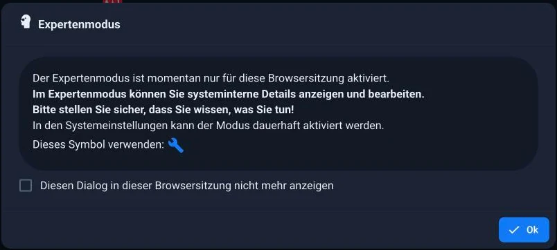

# Rundgang durch die Oberfläche

Der Admin hat viele Reiter, und beim ersten Öffnen sieht das nach mehr aus, als
es ist. Tatsächlich brauchen Sie im Alltag vier davon. Dieser Rundgang sagt,
welche das sind und wofür die übrigen da sind. Die ausführliche Beschreibung
jedes einzelnen Reiters steht im Kapitel
[Admin-Oberfläche](/docs/admin/README.md).

## Der Aufbau

Die Seite besteht aus drei Bereichen: links die **Menüleiste** mit den Reitern,
rechts daneben das **Hauptfenster** und darüber eine **Symbolleiste**, deren
Inhalt vom gerade geöffneten Reiter abhängt.

Ganz unten links sitzt **System**. Dort werden die
[Systemeinstellungen](/docs/admin/settings.md)
vorgenommen, und daneben liegt der Schalter für den Expertenmodus.

*Die drei Bereiche: links die Reiter, oben die Symbolleiste des geöffneten
Reiters, in der Mitte das Hauptfenster, hier die Liste der Instanzen.*

## Die vier, die Sie täglich brauchen

| Reiter | Wofür |
| --- | --- |
| [Adapter](/docs/admin/adapter.md) | Neue Anbindungen dazunehmen und vorhandene aktualisieren. |
| [Instanzen](/docs/admin/instances.md) | Die laufenden Anbindungen: konfigurieren, starten, stoppen, und sehen, ob sie laufen. |
| [Objekte](/docs/admin/objects.md) | Der Baum aller Datenpunkte. Hier sehen Sie nach, ob ein Wert ankommt. |
| [Protokolle](/docs/admin/log.md) | Was das System zu sagen hat. Der Menüpunkt wird rot, wenn ein Fehler aufgetreten ist. |

?> Wenn etwas nicht funktioniert, ist die Reihenfolge fast immer dieselbe:
Instanzen (läuft sie?), Objekte (kommt ein Wert an?), Protokolle (was sagt das
System?).

## Die übrigen

| Reiter | Wofür |
| --- | --- |
| [Übersicht und Schnellzugriff](/docs/admin/overview.md) | Systemstatus auf einen Blick und Kacheln zu allen Oberflächen. |
| [Kategorien](/docs/admin/enums.md) | Räume und Funktionen. Sieht nach Kleinkram aus, ist aber die Grundlage für Visualisierung und Sprachsteuerung. |
| [Benutzer](/docs/admin/users.md) | Wer sich anmelden darf und was er darf. |
| [Hosts](/docs/admin/hosts.md) | Der Rechner selbst, Updates des js-controllers, Meldungen des Systems. |
| [Dateien](/docs/admin/files.md) | Der Dateispeicher, etwa für Bilder in einer Visualisierung. |
| Backup | Kommt vom Adapter BackItUp, siehe [Datensicherung](/docs/config/backup.md). |

Weitere Reiter kommen mit den installierten Adaptern dazu, etwa *Skripte*,
*Kalender* oder *Geräte*.

## Der Expertenmodus

Unten links in der Menüleiste sitzt ein Kopfsymbol. Es schaltet den
**Expertenmodus** ein und aus, und es zeigt zugleich an, woran man ist: weiß
bedeutet aus, grün bedeutet an.

Wichtig zum Verständnis: Er ändert nichts an Ihrer Anlage und erlaubt Ihnen
nichts, was vorher verboten war. Er ist eine Brille, keine Tür. Ausgeschaltet
zeigt der Admin das, was im Alltag gebraucht wird; eingeschaltet zeigt er
zusätzlich alles, was sonst nur im Weg stünde.

*Ohne Expertenmodus: die Adapter mit ihren Daten, sonst nichts.*

*Derselbe Baum mit Expertenmodus. Dazugekommen sind der Namensraum `enum`, die
Spalte mit den Zugriffsrechten (`664`) und der Bleistift, der den Objekteditor
öffnet. Weiter unten steht dann auch `system.`*

Was dazukommt, je nach Reiter:

| Reiter | Was der Expertenmodus zusätzlich zeigt |
| --- | --- |
| Objekte | den Namensraum `system.` mit den internen Objekten, die Spalte mit den Zugriffsrechten und das Anlegen eigener Objekte außerhalb von `0_userdata.0` und `alias.0` |
| Instanzen | weitere Spalten und Einstellungen: Speicherverbrauch, Protokollstufe, geplanter Neustart, Startreihenfolge |
| Adapter | Installation aus GitHub, aus einer Datei oder in einer bestimmten Version, dazu das Löschen eines Adapters |
| Protokolle, Hosts, Dialoge | zusätzliche Spalten, Filter und Felder |

Es gibt den Schalter zweimal, und das verwirrt regelmäßig:

* Das **Kopfsymbol** unten links gilt nur für die geöffnete Browsersitzung. Nach
  dem Schließen des Fensters ist er wieder in dem Zustand, den die
  Systemeinstellungen vorgeben.
* In den [Systemeinstellungen](/docs/admin/settings.md)
  legt *Expertenmodus* fest, wie der Admin beim Öffnen startet.

Beim ersten Einschalten sagt der Admin genau das noch einmal:

?> Faustregel für die Fehlersuche: Wenn eine Anleitung eine Einstellung nennt,
die Sie nirgends finden, schalten Sie zuerst den Expertenmodus ein. In neun von
zehn Fällen war sie nur ausgeblendet.

!> Ausgeblendet heißt nicht geschützt. Im Expertenmodus lassen sich Objekte
löschen, die ein Adapter zum Arbeiten braucht. Der Admin fragt einmal nach,
rückgängig macht das aber nur eine
[Sicherung](/docs/config/backup.md).

Für den Anfang bleibt er aus. Was er zeigt, brauchen Sie erst, wenn Sie einem
Problem nachgehen oder eine Einstellung suchen, die es im Alltag nicht gibt.

## Wenn Ihnen der Platz fehlt

Der Pfeil oben in der Menüleiste verkleinert sie auf die Symbole. Auf einem
Tablet ist das der Unterschied zwischen bedienbar und nicht bedienbar.

## Wie es weitergeht

Als nächstes kommt der Reiter, in dem Sie am Anfang am meisten unterwegs sind:
[Adapter verwalten](/docs/tutorial/adapter.md).
