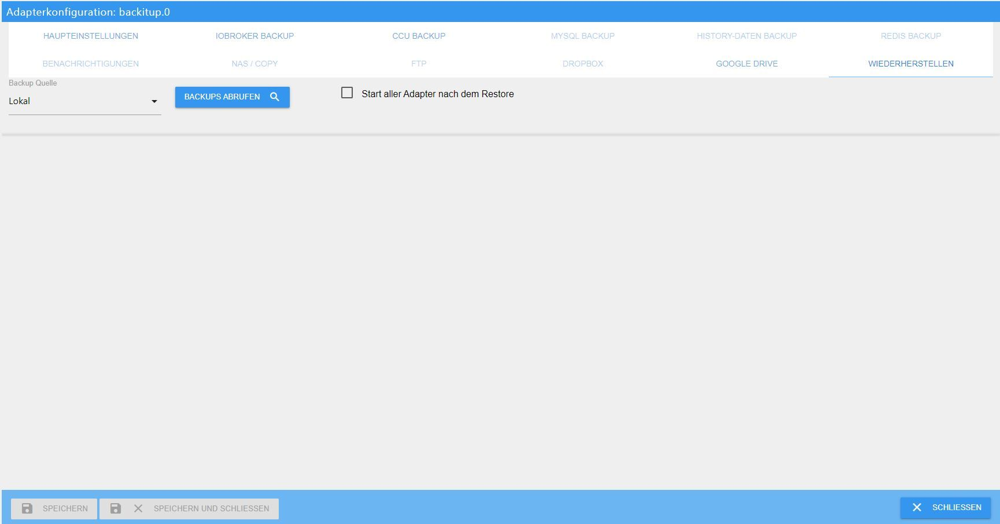
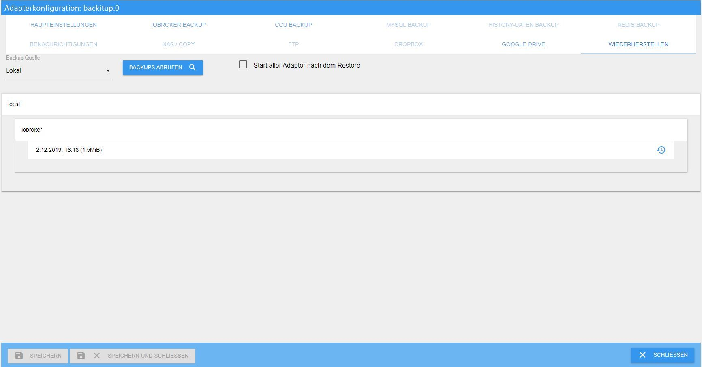
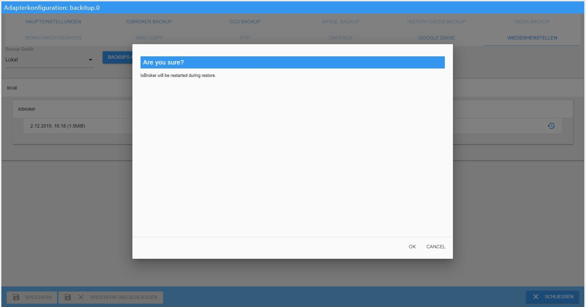
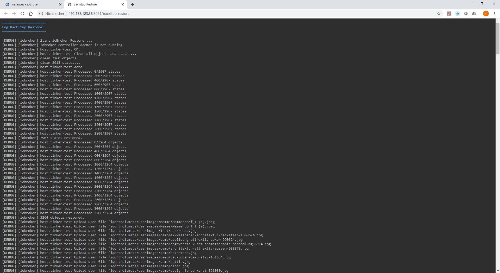
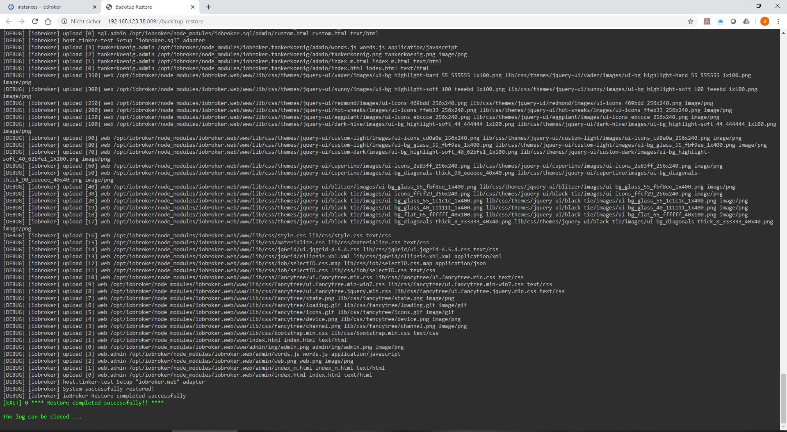
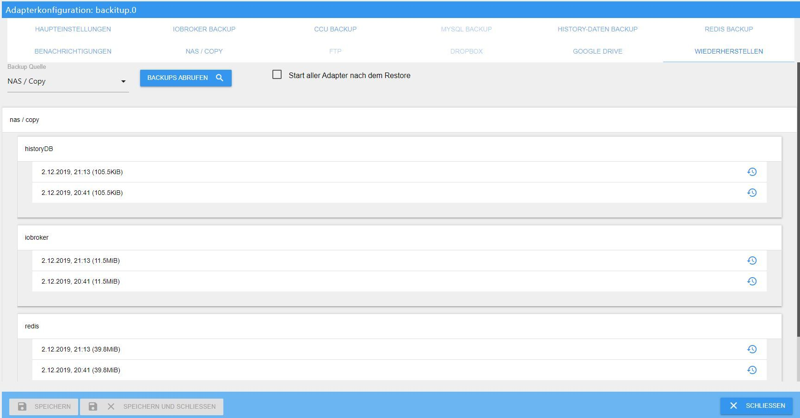

# Eine Installation wiederherstellen

Nach einem Hardwarewechsel, einer defekten Speicherkarte oder einem misslungenen
Update wird die Installation aus einer Sicherung zurückgespielt. Das klingt
größer, als es ist: bei richtiger Reihenfolge ist die Sache in einer knappen
Stunde erledigt, und am Ende steht das System wieder da, wo es war.

?> Diese Seite beschreibt den vollständigen Weg auf ein **neu aufgesetztes**
System. Für kleinere Schäden, etwa ein versehentlich gelöschtes Objekt, gibt es
schnellere Wege: [Konfiguration wiederherstellen](/docs/trouble/restore.md).

## Was in der Sicherung steckt und was nicht

!> **Ein ioBroker-Backup enthält die aufgezeichneten Messwerte nicht.** Es
sichert Objekte, Zustände, Konfigurationen, Skripte und Visualisierungen. Die
Daten von `history`, InfluxDB oder SQL sind **eigene** Sicherungstypen in
BackItUp und müssen dort getrennt eingeschaltet worden sein. Dasselbe gilt für
die Zigbee-Datenbank und für Redis. Einzelheiten unter
[Datensicherung](/docs/config/backup.md).

Wer das erst beim Wiederherstellen merkt, merkt es zu spät.

## Vorbereitung

**1. Ein lauffähiges System aufsetzen.** Betriebssystem installieren, dann
ioBroker nach der [Anleitung für Linux](/docs/install/linux.md). Der Restore
setzt eine funktionierende, leere Installation voraus.

**2. Herausfinden, ob Redis gebraucht wird.** Besteht noch Zugriff auf das alte
System, gibt

```bash
iobroker status
```

die Auskunft:

```
Objects type: redis
States  type: redis
```

Steht dort bei einem der beiden `redis`, muss auf dem neuen System **vorher**
ein Redis-Server laufen. Steht bei beiden `file` oder `jsonl`, wird er nicht
gebraucht. Im Zweifel, also ohne Zugriff auf das alte System, Redis lieber
installieren.

**3. Redis installieren**, falls nötig:

```bash
sudo apt update
sudo apt install redis-server
sudo usermod -a -G redis iobroker
sudo reboot
```

**4. Die Sicherung auf das neue System bringen.** Mit einem SFTP-Programm wie
FileZilla oder WinSCP in den Ordner `/opt/iobroker/backups`. Den legt die
Installation bereits an.

?> BackItUp kann auch direkt von NAS, Dropbox oder Google Drive
wiederherstellen. Die lokale Datei ist der Weg mit den wenigsten
Fehlerquellen und deshalb der, den diese Anleitung beschreibt.

## Weg 1: mit BackItUp

Der bequemere Weg, ohne einen einzigen Konsolenbefehl.

**1. BackItUp installieren.** Im Reiter *Adapter* nach `backitup` suchen und
über das Pluszeichen eine Instanz anlegen.

**2. Den Reiter Wiederherstellen öffnen** und die Backup-Quelle auf **Lokal**
stellen, dann speichern.



!> Die Einstellung **Start aller Adapter nach dem Restore** bleibt aus, wenn die
Sicherung auf einen **anderen** Host geht. Vor dem Start müssen dort meist erst
IP-Adressen angepasst werden. Auf demselben Gerät darf sie an sein.

**3. Backups abrufen.** Die gerade hochgeladene Datei erscheint in der Liste
unter *iobroker*. Auswählen.



**4. Bestätigen.** Der Hinweis sagt, dass ioBroker für die Wiederherstellung
gestoppt und danach wieder gestartet wird.



**5. Zusehen.** Im Browser öffnet sich ein weiterer Reiter, in dem der Ablauf
wie auf der Konsole mitläuft.



Am Ende steht die Erfolgsmeldung.



Je nach Gerät und Größe der Installation dauert das etwa 10 bis 15 Minuten,
danach startet ioBroker von selbst wieder.

**6. Die übrigen Sicherungen.** Wurden Redis, Zigbee, SQL oder die
History-Daten mitgesichert, werden sie jetzt auf demselben Weg einzeln
zurückgespielt. In der Liste stehen sie als eigene Einträge:



## Weg 2: über die Konsole

Wer sehen will, was gerade passiert, nimmt den direkten Weg.

```bash
iobroker stop
iobroker status
```

Erst wenn `iobroker status` bestätigt, dass nichts mehr läuft:

```bash
cd /opt/iobroker
iobroker restore <Name der Sicherung>
iobroker start
```

Ohne Namen listet `iobroker restore` die vorhandenen Sicherungen auf, aus denen
sich per Nummer wählen lässt.

!> Auf diesem Weg lässt sich **nur das ioBroker-Backup** einspielen. Ein
Redis-, Zigbee-, MySQL- oder History-Backup kommt aus BackItUp und wird auch
nur dort wieder eingespielt.

## Nach der Wiederherstellung

Im Reiter *Log* ist zu sehen, wie ioBroker alle Adapter der alten Installation
nacheinander über npm neu installiert. Das ist der langwierige Teil: je nach
Umfang der Installation, Leistung des Geräts und Internetverbindung können
daraus zwei bis drei Stunden werden.

?> **In dieser Zeit nichts anfassen.** Nicht neu starten, nicht eingreifen. In
den Instanzen lässt sich mitverfolgen, was schon fertig ist: Adapter ohne
Symbol sind noch in der Warteschlange. Ab und zu die Ansicht aktualisieren
genügt.

Startet ioBroker nach der Wiederherstellung ausnahmsweise nicht von selbst:

```bash
iobroker start
```

Wenn alle Instanzen ihr Symbol haben, ist das System wieder vollständig: mit
allen Einstellungen, Skripten, Visualisierungen und Zuordnungen.

## Welcher Weg

Beide führen zum selben Ergebnis. Wer sich auf der Konsole unwohl fühlt, nimmt
BackItUp und macht dabei weniger falsch. Wer genau sehen will, was auf dem
System geschieht, nimmt den zweiten Weg.

Und danach, noch bevor die erste eigene Änderung kommt: eine frische Sicherung
anlegen und prüfen, dass sie an einem anderen Ort landet als auf dem Gerät
selbst.
