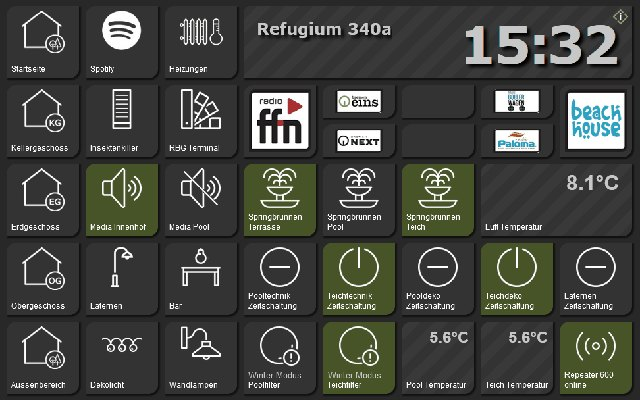
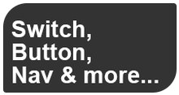
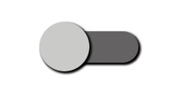
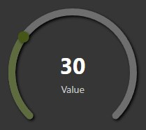
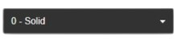
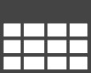

# inventwo-Widgets

**inventwo Design** ist ein durchgestalteter Satz mit eigener Bildsprache:
dunkle Kacheln, kräftige Symbole, klare Kanten. Er ist einer der wenigen
Sätze, aus denen sich eine ganze Oberfläche bauen lässt, ohne etwas
dazuzumischen, und er wird seit 2020 laufend weiterentwickelt.

## Zwei Adapter

| Adapter | Für | Stand |
| --- | --- | --- |
| [`vis-2-widgets-inventwo`](/adapters/vis-2-widgets-inventwo) | vis-2, direkt eingebaut | 09/2026 |
| [`vis-inventwo`](/adapters/vis-inventwo) | vis 1; läuft auch in vis-2 | 06/2026 |

Beide stammen von jkvarel und werden gepflegt. Für **neue Projekte in vis-2**
ist `vis-2-widgets-inventwo` die richtige Wahl; `vis-inventwo` ist der ältere,
deutlich umfangreichere Satz und weiterhin sinnvoll für bestehende Seiten.

## Die Widgets für vis-2

| | Widget | Wofür |
| --- | --- | --- |
|  | **Universal** | Das Herzstück: Schalter, Taster, Navigation, Bild und Anzeige in einem Baustein. Was er tut, wird eingestellt, nicht durch die Wahl des Widgets festgelegt. |
|  | **Schalten** | Ein Kippschalter im inventwo-Stil. |
|  | **Checkbox** | Ankreuzfeld für einen Ja/Nein-Wert. |
|  | **Schieberegler** | Zahlenwert mit Überschrift, Einheit und eigener Farbgebung für Schiene und Griff. |
|  | **Radialer Schieberegler** | Derselbe Wert als Ring, für Helligkeit oder Temperatur. |
|  | **Dropdown** | Klappfeld für eine Werteliste. |
|  | **Werteliste** | Macht aus einem Text eine Aufzählung: Trennzeichen wählen, Aufzählungszeichen wählen, leere Einträge überspringen. |
|  | **Tabelle** | Sortierbare Tabelle aus einem JSON-Datenpunkt. |
| | **Lauftext** | Ein durchlaufender Text für Meldungen. |
|  | **Kalender** | Monatsübersicht. |
|  | **Terminkalender** | Termine als Liste, etwa aus dem Adapter `ical`. |

## Der Satz für vis 1

`vis-inventwo` hat rund 27 Bausteine. Er ist in zwei Generationen gewachsen,
und das sieht man in der Palette: Bei den älteren steht ausdrücklich dabei,
dass sie **keine neuen Funktionen mehr bekommen** und man die neuen benutzen
soll. Betroffen sind `Switch`, `Switch Small`, `Button`, `Button Small`,
`Navigation`, `Navigation Small`, `Background`, `Background Small` und das alte
`Image`.

Ihr Nachfolger ist **`Universal`**: er kann alles, was die neun zusammen
konnten, und wird gepflegt. Dazu kommen `Multi`, `Grid`, `Colorpicker`, die
Farbschieberegler, `Simple Slider` waagerecht und senkrecht, `JSON Table`,
`Value List`, `Radiobutton List`, `Checkbox/Radiobutton` und `Marquee`.

!> Beim `Marquee` des vis-1-Satzes steht in der Palette eine Warnung, dass er
nicht in allen Browsern funktioniert. In vis-2 gibt es dafür den neuen
**Lauftext**.

## Worauf zu achten ist

**Farben.** Der Satz lebt von seinem dunklen Grund. Auf einer hellen Seite
wirken die Kacheln fremd. Wer inventwo einsetzt, stellt die Ansicht am besten
gleich dunkel ein.

**Beide Sätze zugleich** zu installieren, ist möglich, aber selten nötig, und
jeder installierte Satz wird beim Öffnen einer Seite mitgeladen.
