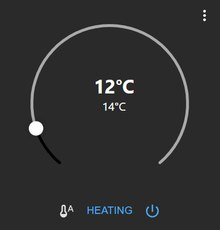

# Material-Widgets für vis-2

Der Satz **Material** ist der Allzweckbaukasten für vis-2. Er deckt die
üblichen Aufgaben einer Wohnungssteuerung ab: schalten, heizen, verschatten,
messen. Alle Bausteine sind aufeinander abgestimmt und haben dieselbe
Kartenform, dieselben Abstände und dieselben Farben. Sie übernehmen das Thema von vis-2 und sehen
deshalb im hellen wie im dunklen Modus richtig aus.

Installiert wird der Adapter
[`vis-2-widgets-material`](/adapters/vis-2-widgets-material) im Reiter
[Adapter](/docs/admin/adapter.md). Eine Instanz ist nicht nötig, danach den
Editor neu laden. Die Bausteine stehen dann in der Palette unter **Material**.

?> Die Bilder auf dieser Seite sind die Vorschaubilder aus dem Adapter, also
genau das, was in der Palette des Editors zu sehen ist.

## Was alle Widgets gemeinsam haben

Fast jedes Material-Widget sitzt in einer **Karte** mit Titel. Drei
Einstellungen tauchen deshalb immer wieder auf:

| Einstellung | Bedeutung |
| --- | --- |
| **Ohne Karte** | Zeichnet nur den Inhalt, ohne Hintergrund und Rahmen. Sinnvoll, wenn mehrere Widgets in einer gemeinsamen Karte liegen sollen. |
| **Name** | Die Überschrift der Karte. Bleibt das Feld leer, wird keine Überschrift gezeichnet. |
| **Als Dialog verwenden** | Das Widget liegt nicht auf der Seite, sondern öffnet sich als Fenster, wenn ein anderes Widget darauf verweist. So lassen sich Details unterbringen, ohne die Seite zu füllen. |

Alle Widgets fragen ihre Datenpunkte über Auswahlfelder ab. Bei mehreren
zusammengehörenden Punkten (Thermostat, Rollladen, RGB-Lampe) genügt meist
die Angabe des ersten; die übrigen werden anhand der Rollen im selben Kanal
selbst gefunden und eingetragen.

## Die Widgets

| | Widget | Wofür | Braucht |
| --- | --- | --- | --- |
|  | **Schalter** | Eine oder mehrere Zeilen mit Schaltern oder Knöpfen, wahlweise mit einem gemeinsamen Hauptschalter. Das meistbenutzte Widget des Satzes. | je Zeile einen schaltbaren Datenpunkt |
|  | **Thermostat** | Runder Temperaturregler mit Ist- und Solltemperatur, Betriebsart, Boost und Party. | Soll- und Isttemperatur, optional Modus |
|  | **Jalousie** | Gezeichnetes Fenster mit Rollladen, Lamellen und Griffstellung. Mehrere Flügel möglich. | Position, optional Stopp und Lamellen |
|  | **Istwert mit Diagramm** | Zwei Messwerte groß, darunter der Verlauf als Fläche. | einen Verlaufsadapter (`history`, `sql`, `influxdb`) |
|  | **Einfacher Zustand** | Ein Wert mit Symbol und Einheit, wahlweise nur anzeigend oder schaltend. Der schlichteste Baustein. | einen Datenpunkt |
|  | **Statische Informationen** | Mehrere Werte untereinander in einer Karte, ohne Bedienung. | beliebig viele Datenpunkte |
|  | **RGB-Licht** | Farbrad, Helligkeit, Weißanteil und Farbtemperatur. Kennt RGB, RGBW und getrennte Kanäle. | je nach Lampe Farbe oder rot/grün/blau |
|  | **Türschloss** | Schließen, öffnen, Türsensor anzeigen; optional erst nach Eingabe eines PIN-Codes. | Schloss, optional Sensor und Öffner |
|  | **Sicherheit** | Scharfschalten mit PIN und Ablaufzeit, mehrere Betriebsarten nebeneinander. | einen Datenpunkt je Betriebsart |
|  | **Kamera** | Standbild oder Datenstrom einer Kamera, mit Zeitstempel und automatischer Auffrischung. | den Adapter `cameras` oder eine URL |
|  | **Player** | Titel, Interpret, Bild, Fortschritt und die Tasten eines Abspielers. | Titel, Zustand und die Tastendatenpunkte |
|  | **Staubsauger** | Zustand, Batterie, Saugstufe und die Restlaufzeiten von Bürsten und Filter. | einen Saugroboter-Adapter |
|  | **Waschmaschine und Trockner** | Programmzustand mit Start- und Endzeit. | Zustand, Start- und Endzeit |
|  | **Uhr** | Analog in mehreren Zifferblättern oder digital, wahlweise mit Sekunden. | nichts |
|  | **Karte** | Standorte als Marker, optional mit Radius. | Datenpunkte mit Koordinaten, etwa aus `radar` |
|  | **Navigation** | Wechselt auf eine andere Ansicht, optional erst nach PIN-Eingabe. | den Namen der Zielansicht |
|  | **Im Widget anzeigen** | Bettet eine ganze Ansicht in eine Karte ein. Damit lassen sich Seiten aus Bausteinen zusammensetzen. | eine zweite Ansicht |
|  | **HTML-Vorlage** | Freier HTML-Inhalt, ein Bild oder ein eingebetteter Rahmen in der Material-Karte. | nichts |
|  | **Themenwechsler** | Ein Knopf, der zwischen hellem und dunklem Thema umschaltet. | nichts |

Dazu kommt der **Assistent** (*Wizard*): kein Anzeigebaustein, sondern eine
Hilfe im Editor. Er sieht sich die erkannten Geräte der Anlage an und legt
daraus fertig verdrahtete Material-Widgets an. Für den ersten Entwurf einer
Seite spart das viel Klickarbeit; anschließend lässt sich alles von Hand
nacharbeiten.

## Worauf zu achten ist

**Verlaufsdaten.** Das Widget *Istwert mit Diagramm* bleibt leer, solange für
den Datenpunkt keine Aufzeichnung läuft. Die Aufzeichnung wird beim Datenpunkt
selbst eingeschaltet, siehe [Werte aufzeichnen](/docs/tutorial/history.md).

**Erkannte Geräte.** Damit der Assistent etwas findet, müssen die Geräte einem
Raum oder einer Funktion zugeordnet sein. Das geschieht unter
[Kategorien](/docs/admin/enums.md) und ist dieselbe Zuordnung, die auch der
[Devices-Adapter](/docs/viz/devices.md) benutzt.

**Größe.** Die Karten richten sich nach der Größe, die im Editor gezogen wird.
Wird eine Karte zu klein, blendet das Widget von selbst Teile aus, zuerst den
Titel, dann Beschriftungen. Wer alle Angaben sehen möchte, gibt der Karte mehr
Platz.

**Anordnung.** Setzt man die Position eines Widgets auf `relativ`, ordnen sich
die Karten von selbst in Spalten an und laufen bei schmalen Bildschirmen
untereinander. Für Wandtablet und Telefon zugleich ist das der einfachere Weg
als feste Koordinaten.
