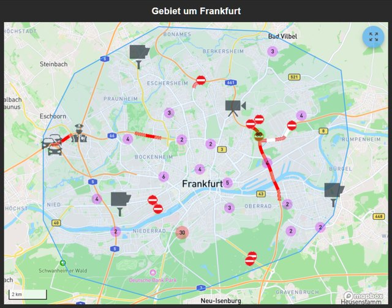

# Widgetsätze

Ein Widget ist ein Baustein auf einer vis-Seite: ein Schalter, ein Diagramm,
eine Uhr, eine Kachel. Welche Bausteine zur Auswahl stehen, hängt davon ab,
welche **Widgetsätze** installiert sind. Jeder Satz ist ein eigener Adapter.
Nach der Installation erscheinen seine Bausteine von selbst in der Palette des
Editors, sortiert nach dem Namen des Satzes.

Widgets gibt es **nur für vis und vis-2**. Die anderen Oberflächen bauen sich
aus den Geräten und Kategorien selbst auf und haben nichts zum Auswählen:
[Devices-Adapter](/docs/viz/devices.md) und [Lovelace](/docs/viz/lovelace.md).
Wer eine davon benutzt, braucht diese Seite nicht. **webui** hat eigene
Bausteine, aber keine Widgetsätze in diesem Sinn.

**Wo alle Widgetsätze stehen.** Diese Seite beschreibt sie. Die vollständige
und immer aktuelle Liste steht in der [Adapterübersicht](/adapters) unter der
Gruppe **Visualisierung Widgets**; daneben gibt es dort die Gruppen
**Visualisierung** für die Oberflächen selbst und **Visualisierungs-Icons** für
die Symbolsammlungen. Jeder Eintrag führt auf die Seite des Adapters mit
Version, Autor und Anleitung.

?> Widgetsätze legen keine Datenpunkte an und laufen nicht dauerhaft. Sie
liefern nur Dateien aus, die vis beim Öffnen einer Seite lädt. Eine Instanz
muss deshalb nicht angelegt werden: installieren, Editor neu laden, fertig.

Die Bilder auf dieser Seite stammen aus den Adaptern selbst. Es sind dieselben
Vorschaubilder, die auch in der Palette des Editors zu sehen sind.

!> Sparsam bleiben. Jeder installierte Satz wird beim Öffnen einer Seite
mitgeladen. Ein Dutzend Sätze für drei benutzte Bausteine macht die
Visualisierung spürbar langsamer, besonders auf einem Wandtablet.

## Was vis-2 schon mitbringt

vis-2 liefert fünf Sätze mit, die nicht gesondert installiert werden müssen:

| Satz | Wofür |
| --- | --- |
| `basic` | Text, Zahl, Bild, Rahmen, Schalter, Navigation: die Grundbausteine. Rund 40 Widgets. |
| `jqui` | Knöpfe, Schieberegler, Eingabefelder und Dialoge im jQuery-UI-Stil. |
| `jqplot` | Einfache Diagramme aus aufgezeichneten Werten. |
| `swipe` | Seiten, die sich mit dem Finger wechseln lassen. |
| `tabs` | Reiter innerhalb einer Ansicht. |

Damit lässt sich eine vollständige Seite bereits ohne jeden weiteren Adapter
bauen. Die einzelnen Bausteine sind unter
[Mitgelieferte Widgets](/docs/viz/basic.md) beschrieben.

## Sätze für vis-2

### Material

Der große Allzwecksatz für vis-2: Schalter, Thermostat, Jalousie, Kamera,
Türschloss, Messwerte mit Verlauf, Musikspieler, Staubsauger. Die Bausteine
sind aufeinander abgestimmt und passen sich dem hellen wie dem dunklen Thema
an. Wer mit vis-2 anfängt, fängt hiermit an.

19 Widgets · bluefox · zuletzt 05/2026 · [ausführliche Beschreibung](/docs/viz/widgets-material.md) · [`vis-2-widgets-material`](/adapters/vis-2-widgets-material)

### Collection

Eine gemischte Sammlung aus der Gemeinschaft, die laufend wächst: Knopfgruppen,
Auswahlfelder, Schieberegler, Tabellen aus JSON, Farbrad, Zeigerinstrumente,
Dialoge. Die sinnvolle Ergänzung zu Material, wenn ein Bedienelement fehlt.

13 Widgets · Steiger04 · zuletzt 07/2026 · [ausführliche Beschreibung](/docs/viz/widgets-collection.md) · [`vis-2-widgets-collection`](/adapters/vis-2-widgets-collection)

### Material Design für vis-2

Die Neufassung der bekannten Material-Design-Widgets, diesmal direkt für vis-2
gebaut und nicht mehr über den Umweg der alten vis-Bausteine. Sie beruht auf
der Arbeit von Scrounger und deckt dessen Satz weitgehend ab: Kacheln, Listen,
Tabellen, Diagramme, Schieberegler, Symbolauswahl.

49 Widgets · typhosj · seit 09/2026 · [Material Design](/docs/viz/widgets-materialdesign.md) · [`vis2-materialdesign`](/adapters/vis2-materialdesign)

### JägerDesign

Fertig gestaltete Bausteine für Licht, Heizung, Rollladen, Kameras und
Nachrichten, dazu ein Layout-Widget, das daraus eine vollständige Seite mit
Seitenleiste macht. Ein durchgestalteter Gesamtentwurf statt einzelner
Elemente.

**Der einzige kostenpflichtige Widgetsatz im Verzeichnis.** Er ist kein
gewachsener Baukasten, sondern ein von einem Designstudio gezeichneter Entwurf;
die Lizenz bezahlt diese Arbeit. Sie gilt lebenslang und ist an die UUID der
Installation gebunden. Ausprobieren geht ohne Lizenz: im Editor werden die
Widgets angezeigt, erst in der laufenden Visualisierung nicht mehr. Preis und
Bedingungen stehen in der [Produktübersicht](/productoverview).

9 Widgets · bluefox · zuletzt 04/2026 · [ausführliche Beschreibung](/docs/viz/widgets-jaeger.md) · [`vis-2-widgets-jaeger-design`](/adapters/vis-2-widgets-jaeger-design)

### inventwo für vis-2

Kalender, Terminliste, Wertelisten, Universalkachel, Radialregler und weitere
Bausteine im inventwo-Entwurf. Das Gegenstück zum älteren
[inventwo Design](#inventwo-design) für vis 1.

11 Widgets · jkvarel · zuletzt 09/2026 · [ausführliche Beschreibung](/docs/viz/widgets-inventwo.md) · [`vis-2-widgets-inventwo`](/adapters/vis-2-widgets-inventwo)

### Technik

Fenster, Rollladen, Schalter und Dimmer: wenige Bausteine, dafür sauber
gezeichnet und mit vielen Zwischenzuständen.

3 Widgets · Sefina-DS · seit 06/2026 · [`vis-2-widgets-technic`](/adapters/vis-2-widgets-technic)

### Gauges

Zeigerinstrumente: Batteriestand, Füllstand, Farbskala.

3 Widgets · bluefox · zuletzt 08/2025 · [`vis-2-widgets-gauges`](/adapters/vis-2-widgets-gauges)

### Energie

Energiefluss zwischen Netz, Photovoltaik, Speicher, Wärmepumpe und Auto, dazu
Verbrauchsvergleiche über einen wählbaren Zeitraum. Braucht aufgezeichnete
Werte aus einem Verlaufsadapter.

4 Widgets · bluefox · zuletzt 08/2026 · [`vis-2-widgets-energy`](/adapters/vis-2-widgets-energy)

### Wetter und Heizung

Wettervorhersage und eine vollständige Heizungssteuerung: Raumübersicht,
Zeitprofile, Fensterstatus, Auswertung der letzten Wochen.

11 Widgets · rg-engineering · zuletzt 07/2026 · [`vis-2-widgets-weather-and-heating`](/adapters/vis-2-widgets-weather-and-heating)

### RSS-Feed

Nachrichten und Feeds auf der Bedienseite, wahlweise als Liste, Laufband oder
Einzelmeldung.

5 Widgets · oweitman · zuletzt 07/2026 · [`vis-2-widgets-rssfeed`](/adapters/vis-2-widgets-rssfeed)

### ovarious

Ein einzelnes Widget, das den Inhalt eines Datenpunkts frei formatiert
darstellt, gedacht als Werkzeug für eigene Lösungen.

1 Widget · oweitman · zuletzt 10/2025 · [`vis-2-widgets-ovarious`](/adapters/vis-2-widgets-ovarious)

### SweetHome 3D

Zeigt einen mit SweetHome 3D gezeichneten Grundriss als räumliches Modell und
schaltet darin Licht und Geräte.

1 Widget · bluefox · zuletzt 07/2024 · [`vis-2-widgets-sweethome3d`](/adapters/vis-2-widgets-sweethome3d)

### Sätze zu einem bestimmten Adapter

Diese Sätze sind nur zusammen mit dem gleichnamigen Adapter sinnvoll; sie
stellen dessen Daten dar und haben darüber hinaus keinen Zweck.

| Satz | Gehört zu | Stand |
| --- | --- | --- |
|  [`vis-2-widgets-sigenergy`](/adapters/vis-2-widgets-sigenergy) | Sigenergy-Wechselrichter und -Speicher | 09/2026 |
|  [`vis-2-widgets-radar-trap`](/adapters/vis-2-widgets-radar-trap) | Blitzer- und Streckenwarnungen aus `radar-trap` | 12/2024 |
|  [`vis-2-widgets-automatic-feeder`](/adapters/vis-2-widgets-automatic-feeder) | Futterautomat aus `automatic-feeder` | 09/2026 |
| [`vis-2-widgets-tibberlink`](/adapters/vis-2-widgets-tibberlink) | Strompreise aus `tibberlink` | 07/2026 |

## Sätze aus vis 1

Diese Sätze stammen aus der Zeit von vis 1. Die meisten lassen sich auch in
vis-2 verwenden, weil vis-2 die alten Bausteine weiterhin darstellen kann. Sie
sehen dort allerdings aus wie in vis 1 und folgen nicht dem Thema von vis-2.

?> Für eine neue Seite in vis-2 lohnt sich zuerst der Blick auf die Sätze
oben. Die alten Sätze sind vor allem für bestehende Projekte interessant.

### Material Design

Der verbreitetste Satz für vis 1, nach Googles Material Design: Kacheln,
Listen, Tabellen, Diagramme, Schieberegler, ein eigener Symbolvorrat und ein
durchgängiges Farbschema. Die letzte Fassung stammt von 2021.

Die Weiterentwicklung ist als eigener Adapter für vis-2 erschienen, siehe
[Material Design für vis-2](#material-design-für-vis-2).

46 Widgets · Scrounger · zuletzt 06/2021 · [ausführliche Beschreibung](/docs/viz/widgets-materialdesign.md) · [`vis-materialdesign`](/adapters/vis-materialdesign)

### Material Advanced

Vereinheitlichte Bausteine für Fenster, Türen, Licht, Heizung und Rollladen,
alle nach demselben Muster aufgebaut und über eine gemeinsame Eigenschaftsliste
eingestellt.

26 Widgets · EdgarM73 · zuletzt 09/2023 · [`vis-material-advanced`](/adapters/vis-material-advanced)

### HQ-Widgets

Kacheln im Stil einer Schaltzentrale: Lampen, Rollläden, Türen, Temperaturen,
jeweils mit Zustandsfarbe. Einer der ältesten Sätze und bis heute gepflegt.

20 Widgets · bluefox · zuletzt 04/2026 · [`vis-hqwidgets`](/adapters/vis-hqwidgets)

### inventwo Design

Ein durchgestaltetes Gesamtpaket mit eigener Bildsprache, aus dem sich eine
komplette dunkle Oberfläche bauen lässt. Wird weiterhin gepflegt und bringt
inzwischen auch Bausteine für vis-2 mit.

jkvarel · zuletzt 06/2026 · [ausführliche Beschreibung](/docs/viz/widgets-inventwo.md) · [`vis-inventwo`](/adapters/vis-inventwo)

### HomeKit-Kacheln

Kacheln im Stil von Apple HomeKit, mit den dort üblichen Farben und Symbolen.

19 Widgets · Standarduser · zuletzt 01/2026 · [`vis-homekittiles`](/adapters/vis-homekittiles)

### Metro

Große farbige Kacheln im Metro-Stil, wie ihn Windows 8 eingeführt hat.

28 Widgets · hobbyquaker · zuletzt 02/2022 · [`vis-metro`](/adapters/vis-metro)

### JQui MFD

Schalter, Anzeigen und Symbole nach den Zeichnungen des OpenAutomationProject.
Der klassische Satz für nüchterne, technisch wirkende Seiten.

29 Widgets · hobbyquaker · zuletzt 01/2026 · [`vis-jqui-mfd`](/adapters/vis-jqui-mfd)

### LCARS

Die Oberfläche aus Star Trek, für alle, die es mögen: Balken, Knöpfe und ein
Warpkern als Fortschrittsanzeige.

21 Widgets · hobbyquaker · zuletzt 06/2023 · [`vis-lcars`](/adapters/vis-lcars)

### material

Sieben Kacheln für Licht, Fenster, Rollladen und Temperatur mit eigenen
Zeichnungen. Nicht zu verwechseln mit **Material Design** oder **Material** für
vis-2.

7 Widgets · nisiode · zuletzt 01/2025 · [`vis-material`](/adapters/vis-material)

### Plumb

Rohre, Pumpen, Ventile und Verbindungslinien. Gedacht für Schemazeichnungen
einer Heizung, einer Zisterne oder einer Gartenbewässerung.

19 Widgets · smiling_Jack · zuletzt 03/2019 · [`vis-plumb`](/adapters/vis-plumb)

### Zeit und Wetter

Analoge und digitale Uhren, Datum, Sonnenauf- und -untergang sowie eine
mehrtägige Wettervorhersage mit wechselndem Hintergrundbild. Braucht einen
Wetteradapter, etwa `daswetter` oder `weatherunderground`.

8 Widgets · bluefox · zuletzt 07/2022 · [`vis-timeandweather`](/adapters/vis-timeandweather)

### Wetter

Eine ausführlichere Wetterdarstellung mit Verlaufskurven, ebenfalls auf Basis
von `daswetter` oder `weatherunderground`.

1 Widget · René G. · zuletzt 10/2025 · [`vis-weather`](/adapters/vis-weather)

### Colorpicker

Farbauswahl für RGB-Lampen in mehreren Bauformen: Farbrad, Farbfeld,
Farbtonregler, Weißabgleich.

9 Widgets · bluefox · zuletzt 11/2025 · [`vis-colorpicker`](/adapters/vis-colorpicker)

### Zeigerinstrumente

Drei Sätze mit ähnlichem Zweck. Welcher passt, ist vor allem Geschmackssache.

| Satz | | Stand |
| --- | --- | --- |
| [`vis-justgage`](/adapters/vis-justgage) |  | 03/2024 |
| [`vis-canvas-gauges`](/adapters/vis-canvas-gauges) |  | 09/2022 |
| [`vis-rgraph`](/adapters/vis-rgraph) |  | 10/2015 |

### Diagramme und Verläufe

| Satz | | Stand |
| --- | --- | --- |
| [`vis-history`](/adapters/vis-history): Tabelle und Balken aus aufgezeichneten Werten |  | 10/2019 |
| [`vis-bars`](/adapters/vis-bars): schlichte Balkenanzeigen |  | 05/2017 |

Für richtige Diagramme sind die Adapter `echarts` oder `flot` die bessere Wahl;
beide bringen eigene Bausteine für vis mit.

### Karten

| Satz | | Stand |
| --- | --- | --- |
| [`vis-map`](/adapters/vis-map): Standorte auf einer Karte, etwa aus dem Adapter `radar` |  | 07/2024 |
| [`vis-mapwidgets`](/adapters/vis-mapwidgets): neuere Kartenbausteine, auch für vis-2 | | 08/2026 |

### Weitere

| Satz | Wofür | | Stand |
| --- | --- | --- | --- |
| [`vis-players`](/adapters/vis-players) | Bedienelemente für Sonos, Winamp und andere Abspieler |  | 05/2020 |
| [`vis-keyboard`](/adapters/vis-keyboard) | Bildschirmtastatur und Zahlenfeld für Wandtablets |  | 10/2025 |
| [`vis-fancyswitch`](/adapters/vis-fancyswitch) | Kippschalter und Wippen mit Animation |  | 10/2017 |
| [`vis-jsontemplate`](/adapters/vis-jsontemplate) | Tabellen und Listen aus JSON-Daten, auch für vis-2 | | 07/2026 |
| [`vis-3dmodel`](/adapters/vis-3dmodel) | zeigt ein 3D-Modell aus Blender | | 04/2021 |

## Schriften

Zwei Adapter liefern keine Bausteine, sondern nur Schriftarten, die danach in
jedem Widget ausgewählt werden können.

[`vis-google-fonts`](/adapters/vis-google-fonts) bringt die Google-Schriften
mit, [`vis-material-webfont`](/adapters/vis-material-webfont) die Symbolschrift
des Material Design.

## Symbolsammlungen

Symbole sind keine Bausteine, sondern Bilder, die in vielen Widgets ausgewählt
werden können. Installiert man eine Sammlung, steht sie im
Symbolauswahldialog zur Verfügung.

[MFD als PNG](/adapters/icons-mfd-png) und
[als SVG](/adapters/icons-mfd-svg) ·
[Material als PNG](/adapters/icons-material-png) und
[als SVG](/adapters/icons-material-svg) ·
[Ultimate](/adapters/icons-ultimate-png) ·
[Smarthome](/adapters/icons-smarthome) ·
[Eclipse SmartHome Classic](/adapters/icons-eclipse-smarthome-classic) ·
[Open Icon Library](/adapters/icons-open-icon-library-png) ·
[FatCow](/adapters/icons-fatcow-hosting) ·
[Freepic](/adapters/icons-freepic) ·
[icons8](/adapters/icons-icons8) ·
[Addictive Flavour](/adapters/icons-addictive-flavour-png) ·
[Icontwo](/adapters/vis-icontwo)

## Auswählen und installieren

Alle Sätze stehen im Reiter [Adapter](/docs/admin/adapter.md) in der Gruppe
**Visualisierungswidgets**, die Symbolsammlungen unter
**Visualisierungssymbole**. Nach der Installation den Editor neu laden, dann
steht der neue Satz in der Palette.

Die Angabe **Stand** nennt den Monat der letzten Veröffentlichung im
Adapter-Verzeichnis. Sie sagt nichts darüber, ob ein Satz funktioniert; viele
alte Sätze tun das seit Jahren zuverlässig. Sie sagt nur, wie wahrscheinlich
Hilfe bei einem Problem ist.
