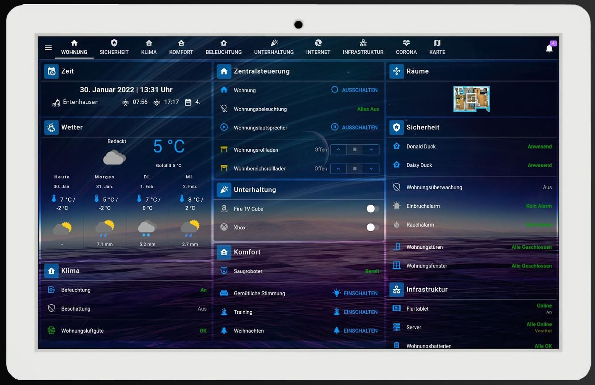
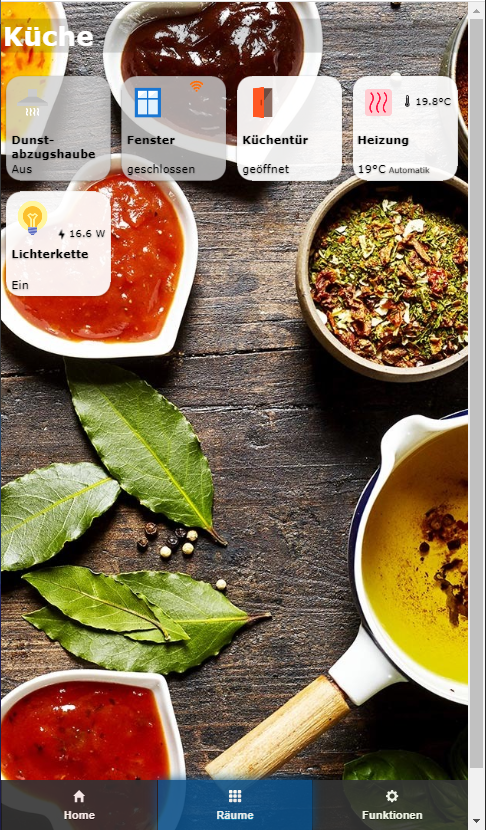

# What is ioBroker?

ioBroker is software that connects devices and services from different manufacturers into a single system. Read values, control devices, automate processes: all in one place, regardless of the manufacturer of the individual device.

## Make your life easier: Smart Home

Wouldn't it be practical to read temperatures, consumption values, or switching states of devices from various manufacturers in one central location? Wouldn't it be necessary to remember to switch devices on or off when certain conditions or states are reached?

This convenience is what a smart home can offer. And it offers even more, if desired: automation and the ability to access all these things remotely.

### The solution: ioBroker - Automate your life

**ioBroker** is a software solution for automating your home. It enables the integration of a wide variety of smart home systems that would otherwise remain isolated, thus allowing for comprehensive control.

**ioBroker** is therefore **the** integration platform for the Internet of Things (IoT) and enables the integration of free and commercial products from almost all areas of life as well as the integration of self-created solutions.

The **ioBroker system** is modular and can be extended according to individual requirements by installing individual plugins, which we call adapters.

With well over 600 adapters, ioBroker enables the integration of various platforms, systems and devices from A as in Alexa to Z as in Zigbee and offers many other possibilities for automation.

#### What are adapters?

**Adapters** are **plugins** (software modules, small programs) written in JavaScript for Node.js that are specifically designed for certain devices, device types, devices from specific manufacturers, or other services, such as querying websites.

These adapters enable the connection between physical devices (for example, smart plugs, relays, remote thermometers, and similar devices) and the central ioBroker system. They are able to read the values measured by the devices and control them, often via Wi-Fi within the home network.

Other adapters are designed to graphically display measured values such as temperature, power, consumption, or switching states in diagrams. Visualization adapters also offer additional features, such as the integration of images (e.g., from surveillance cameras), weather data, and much more.

Additionally, there are adapters that offer functions for mathematical calculations or logical operations (such as comparisons). They can also be used to create small programs and to define the rules necessary for automation.

Since JavaScript is one of the most widely used programming languages, many ready-made modules already exist, and new ones can often be developed with relatively little effort. Therefore, if an adapter is missing, a suitable one can usually be developed quickly. The active **ioBroker developer community** is always happy to support new developers.

**Tip:** [Overview of available adapters](/adapters)

### ioBroker connects a wide variety of smart home systems.

This graphic illustrates how ioBroker, as a central system, coordinates and connects a wide variety of smart home systems and other services, such as calendars. The adapters available in ioBroker enable communication with centrally managed calendars or manufacturer-specific smart home systems connected via LAN or WLAN. This allows the ioBroker software to retrieve status information or execute control actions.

### Application example: Presence simulation

This application example demonstrates how the two independent smart home systems Philips Hue and Homematic IP are combined using ioBroker to create a presence simulation.

By connecting the two smart home systems to the ioBroker software, ioBroker is able to change the states of the Hue lights (on/off) and the blinds (up/down). Vacation time is detected by connecting to the calendar in ioBroker.

By using the logic modules (logic programming adapter) in ioBroker, the user can now implement the following process in just a few steps:

- If the calendar shows "Vacation", all HUE lights will be switched on at 6 pm.
- At 10:00 PM all the roller shutters are closed and all the Hue lights are switched off.
- At 8:00 a.m., all the roller shutters are raised again.

Using the available visualization adapters, the user can create individual status and control pages for their Hue lamps and roller shutters, which can be accessed with mobile devices from home or while on vacation (e.g. via ioBroker Cloud Services or VPN).

## Strengths of ioBroker

### Platform independent

ioBroker can be installed on almost all hardware platforms running **Linux, OSX, Windows, or Docker as the operating system** . This includes single-board computers (such as the Raspberry Pi), servers, NAS devices, servers with virtualization environments (such as Proxmox), desktop computers, etc.

A simple, single-line installation routine (one-line installer) enables user-friendly installation under Linux and OSX, thus allowing for a quick start with ioBroker.

### Scalable

If additional smart home systems need to be integrated over time, users can implement them at any time via additional adapters while the system is running. ioBroker itself is also scalable: multiple ioBroker servers can be connected to form a multi-host system. This even allows for the mixing of operating system platforms and the coupling of single-board computers with large multi-core servers.

### Individual programming of processes

With its logic adapters, ioBroker offers the possibility to create custom workflows and scripts. For example, a script can monitor a value from an adapter (e.g., "Vacation is entered in the calendar today") and trigger an action (e.g., "Turn on all Hue lights at 6 PM").

In ioBroker, these individual processes can be implemented by dragging and dropping building blocks (graphical programming) in "Rules" or "Blockly", or in classic form with "JavaScript" or "TypeScript" in the form of written source code.

Further explanations of the logic blocks, as well as a further introduction to other logic blocks such as Node-RED or the scene adapter, are explained in the "Logic and Automation" section of this documentation.

## Visualization

Several visualization adapters allow users to graphically represent control options and status information. These customized visualizations can then be displayed and operated on a tablet, smartphone, or computer.

The following is a brief introduction to some visualization adapters and their main features.

### VIS

[Adapter side vis](/adapters/vis)

With its VIS (Visualization) adapter, ioBroker provides a powerful tool for creating custom visualizations. Current sensor readings, as well as historical trends, can be displayed graphically. Live images from surveillance cameras, alarm system implementation, heating and air conditioning systems – almost anything imaginable can be implemented.

Using VIS gives users maximum design freedom. Pre-built building blocks for easy use help users assemble the UI. But it's not just about displaying information. Controlling devices is also quickly implemented via the visualization interface. The interface can be adapted to a wide variety of devices – from smartphones and wall-mounted touchscreens to PCs – everything can be implemented using simple drag-and-drop.

\

### Material UI

React and Material UI interface.

[Adapter side material](/adapters/material)

### Jarvis

[Jarvis adapter side](/adapters/jarvis)

Jarvis is a Material Design visualization based on Material UI. Jarvis provides a structure and modules that can be used for visualization, but these can be configured very flexibly.

Jarvis is responsive and adapts to the size of the screen, and offers a standardized design, so that a visualization can be put together in a short time.

The layout is flexibly configurable. It can be divided into any number of tabs. Each tab can then be displayed either in full-screen mode or divided into individual columns.

### iQ control

Getting to your destination quickly – yet still flexible – that's what makes iQontrol stand out:

- Create the visualization once and use it everywhere: From PC to tablet to mobile phone, iQontrol runs on all devices - either in the browser or as a web app (can be saved to the home screen and then feels like an app).
- iQontrol dynamically adapts to all resolutions (responsive design).
- Super-fast charging time
- The standard settings will get you to your goal quickly.
- However, the extended settings and widgets offer high flexibility and customization options (in some installations you can't even tell that it's actually iQontrol).

video[iQontrol Demo Video][]

 

### Lovelace

[Adapter side Lovelace](/adapters/lovelace)

The Lovelace adapter allows you to use the Lovelace Home Assistant UI for ioBroker. Lovelace has a responsive design and therefore automatically adapts to the layout of the PC, tablet, or smartphone screen.

In Lovelace, the devices and their properties, which are stored in ioBroker (e.g., on/off, brightness, color temperature for a lamp), are directly available for viewing/control.

The Lovelace Editor (WYSIWYG principle - What You See Is What You Get) allows for the easy creation of modern UIs in just a few steps. For more complex requirements and wishes, custom cards and the YAML editor are available. Inspiration for a Lovelace UI can be gathered from the Home Assistant world and then implemented in ioBroker.

## Who is behind ioBroker?

ioBroker is an open-source project developed by the ioBroker community and administered by [Bluefox](https://github.com/GermanBluefox) as the project owner.

Many developers and many other helpers volunteer their free time to develop the central ioBroker system components, the many adapters, the social media support, the documentation and much more.\
&#x20;Thanks to the large and helpful community, a solution has been found for every problem so far.

ioBroker follows a decentralized approach, where each adapter is maintained in its own GitHub repository. This allows the respective adapter developer to make largely independent decisions regarding their adapter. Functionality extension requests and external feature extensions submitted as "pull requests" are, of course, taken into account.

Furthermore, some developers have joined forces in the ioBroker adapter community to ensure that even if individual developers no longer have time for their adapters, they can continue to be maintained.

There is no contractually agreed support from the open-source community, but together we have managed to solve every problem so far!

Directional decisions for the central components and the overall project are discussed within the core team and then implemented.

The ioBroker Core development team consists of:

- [Bluefox](https://github.com/GermanBluefox)
- [Apollon77](https://github.com/Apollon77)
- [foxriver76](https://github.com/foxriver76)
- [AlCalzone](https://github.com/AlCalzone)

A list of [ioBroker developers](https://forum.iobroker.net/groups/developer) can be found in the ioBroker forum.

## ioBroker.net and ioBroker.pro - Platforms compared

ioBroker provides two independent platforms (servers), each covering different functions:

### 1. ioBroker.net

- **Management of adapter licenses** _(e.g. vis-2, KNX, JägerDesign widgets)_
- **Free remote access** via the **cloud adapter** with limited functionality: _only display of visualizations in the browser, no editing option, limited data transfer volume._

### 2. ioBroker.pro

- **Using smart assistants** _(e.g., Amazon Alexa, Google Assistant)_ via the **IoT adapter**
- **Enhanced remote access** via the **cloud adapter** with full functionality: _display in the browser and in the app and editing of visualizations including admin and vis-editor._
- Ability to send data to your own ioBroker instance **via HTTPS using GET or POST requests** .

#### Technical notes

- The **cloud adapter** is required for **remote access** (e.g., viewing and editing vis or accessing the admin).\
  &#x20;This is used on both ioBroker.net and ioBroker.pro, with different functionalities depending on the platform and license.

- **Voice control** (e.g., Amazon Alexa or Google Assistant) requires the **IoT adapter** . **The ioBroker.assistant skill** or **custom skills** can only be used with an active IoT adapter.

## How is ioBroker financed?

All central components and almost all other adapters are available free of charge, and the source code of the vast majority of adapters is openly available on GitHub.

Since an open-source project cannot generate revenue to, for example, purchase servers, a formal legal structure is required for these purposes: ioBroker GmbH. Among other things, ioBroker GmbH also offers commercial support for the ioBroker software and sells ioBroker servers.

ioBroker GmbH provides the infrastructure (e.g., the forum server) free of charge for the community project and has also purchased development services in the past, which have been used in the development of the open source projects (e.g., Admin).

The ioBroker Free Cloud is also a free service provided to the community by ioBroker GmbH. The Pro Cloud and the IoT service are commercial offerings from ioBroker GmbH, with costs that barely cover operating expenses.

## Licenses

Almost everything about ioBroker is free. The source code is openly available on [GitHub](https://github.com/ioBroker) , in most cases under the MIT license. The only things that cost money are those that incur ongoing costs: three adapters that require an **adapter license** (vis-2, KNX, JägerDesign widgets), and the cloud services for which **access licenses** are available.

The details of how this works, what a license entails, and why there are two servers are explained in the [Licenses](/docs/licenses/README.md) chapter. Prices and packages are listed in the [License Overview](/productoverview) .

## Support our project!

The further development and maintenance of ioBroker is largely carried out by volunteers. If you like ioBroker and would like to support our work, we appreciate any help:

- By purchasing a license, you directly support development and infrastructure.
- If you don't need a license, we would also appreciate a voluntary donation: [Donate now via PayPal](https://www.paypal.com/donate?campaign_id=MJBDJ9TGBQ7GN)

Thank you for your contribution!

## Community

Since 2014, ioBroker has secured widespread support from thousands of users and developers thanks to its many advantages. Users and developers meet in the dedicated [forum](https://forum.iobroker.net) to exchange experiences and suggestions. On the ioBroker [Discord](https://discord.gg/sGWE65zF) server, experiences can be shared in live chat, and live debug sessions can be conducted at short notice to get to the bottom of current problems.

Collection of links to the official ioBroker communities:

- ioBroker Forum: [Forum](https://forum.iobroker.net)
- Discord ioBroker Server: [Discord](https://discord.gg/sGWE65zF)
- Facebook group "IoBroker SmartHome and IoT": [FacebookIoBrokerSmartHomeIoT](https://www.facebook.com/groups/440499112958264)
- Facebook group "ioBroker and smart home international": [FacebookIoBrokerSmartHomeIoTInternational](https://www.facebook.com/groups/iobrokerinternational)

## ioBroker statistics

On [ioBrokerStatistics](/statistics) you will find an overview page with some interesting ioBroker statistics.

[Grundlagen]: /docs/basics/README.md
[Adaptern]: /adapters
[hier zu finden]: /docs
[im Forum]: https://forum.iobroker.net/category/186/dokumentations-support
[GitHub]: https://github.com/ioBroker
[Forum]: https://forum.iobroker.net
[Telegram]: https://t.me/iobrokergermany
[Discord]: https://discord.gg/sGWE65zF
[FacebookIoBrokerSmartHomeIoT]: https://www.facebook.com/groups/440499112958264
[FacebookIoBrokerSmartHomeIoTInternational]: https://www.facebook.com/groups/iobrokerinternational
[iobrokerPreise]: https://iobroker.net/www/pricing
[Bluefox]: https://github.com/GermanBluefox
[Apollon77]: https://github.com/Apollon77
[foxriver76]: https://github.com/foxriver76
[AlCalzone]: https://github.com/AlCalzone
[ioBrokerStatistics]: /statistics
[Adapterseite Material]: /adapters/material
[Adapterseite Jarvis]: /adapters/jarvis
[Adapterseite vis]: /adapters/vis
[Adapterseite lovelace]: /adapters/lovelace
[iQontrol Demo Video]: https://www.youtube.com/watch?v=QHgmrzMmcX4&list=PL8epyNz8pGEv6-R8dnfXm-m5aBlZFKOBG&index=1
[ioBroker Developer]: https://forum.iobroker.net/groups/developer